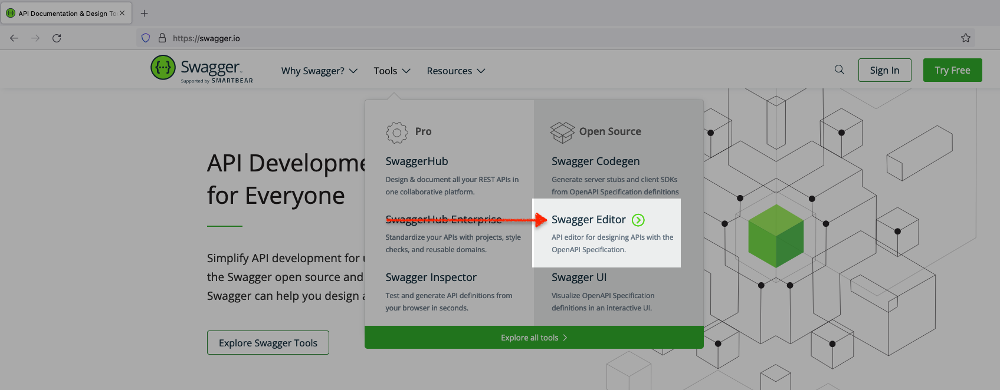

# Title of the Lab

## Introduction

In this lab we will explore the technologies and frameworks that comprise our sample web application.

Estimated Time: 20 minutes

### About Oracle REST Data Services (ORDS) and developer tools 
This lab will discuss a variety of Enterpruise and open source technologies, including: 
- Oracle REST Data Services (ORDS)
- Oracle Clould Infrastructure (OCI) <i>Always Free</i> Tier Tenancy
- Datbase Actions
<!-- I'm actually not sure about cURL, but I don't want to forget it -->
<!-- Make sure any changes here are also included in the Learn More section - we'll want to include those resources as well  -->
- cURL
- Python 3.10.x and later 
- Python packages (libraries) such as: 
  - Flask 
  - Folium 
  - Json
 - Requests 
- <i>select</i> JavaScript functions 
- Bootstrap HTML and CSS frameworks
- Microsoft Visual Studio Code 

We will discuss and explore these technologies and solutions in a practical sense. However, should you wish explore above what this workshop covers, we encourage you to refer to the "Learn More" section of this page. 

### Objectives

In this lab, you will:
* Inspect the provided ORDS API
* Review the available Paths and HTTPS Operations
<!-- Should we inspect in DB Actions as well? What is more realistic? -->
<!-- Or should we import the module and go from there?  -->
### Prerequisites
<!-- At least for this lab, do we even need prerequisites? -->
This lab assumes you have:
* An Oracle Cloud Infrastructure account
* All previous labs successfully completed


<!-- *This is the "fold" - below items are collapsed by default* -->

## Task 1: Navigate to Swagger Editor 

For this lab we'll rely on Swagger's Open Source Editor to review our ORDS Base URI, as well as the available API Paths and Operations. 

1. Navigate to the Swagger home page and select the Swagger editor link:

   

2. Next, select "Live Demo"; a blank Swagger Editor session should load. 

   

3. If a new Editor session page does not appear, navigate to the `File` menu option, and select `Clear Editor`. A new blank session should then appear.

   

4. Next, navigate to `File` then `Import URL`. Take the URL (the ORDS Base URI) you copied to your clipboard (or refer above, to copy) and enter it into the input field, click `OK`. 

   

   

5. Locate Swagger documentation, available Paths and their Operations.

    Once loaded, Swagger documentation will appear on the left, along with a list of the available ORDS Paths and their Operations on the right of your screen. These few Paths and Operations are all you will need for our Flask application to work properly.

    

## Task 2: Review the OpenAPI 3.0 definitions

1. First, collapse the Swagger documentation tree: 
 
   

2. We'll briefly review the tree, before reviewing the ORDS Paths and their Operations.

    - `openapi` - this particular ORDS API adheres to the OpenAPI 3.0 specification for API documentation. To learn more about OpenAPI specifications, you may refer to the resources provided in the "Learn More" section of this lab.

   

    - `info` - here you can see the `title` and `version` of the ORDS API <i>Base URI</i>.

    

    - `servers` - this is the actual Base URI for this ORDS API. All Paths and parameters will be added to this existing <b>U</b>niversal <b>R</b>esource <b>I</b>dentifier (URI), referred to as a **URL** here. 
    
    

    - `paths` - here you'll see an example of one of our Paths. Of the two, you can see all properties of the first `/products/info/{product_id}`. You'll also see the HTTPS Operations for both - `GET` methods.

    

    - `components` - here you can review the components, or those <i>globally-defined</i> parameters that may be shared across the various Paths and their HTTPS Operations. 

    

4. Example with inline navigation icon  click **Navigation**.

5. Example with bold **text**.

   If you add another paragraph, add 3 spaces before the line.

## Task 3: Explore ORDS Templates and Handlers 

1. Locate the Resource Templates. 

    Under the "default" section of the browser (on the right side of your window), you'll see the various Resource Templates that have been provided to you. They, are: 
    - `GET` `/locations/map/data` 
    - `GET` `/products/info/{product_id}`
    - `GET` `/products/value/{product_id}`
    - `POST` <i>and</i> `GET` `/purchases/history`

:bulb: <i>Notice that each Template has either a `GET` or `POST` prefix. Also notice how the last Template has both.</i>

2. Explore selected Resource Templates

    On the right side of your browser window, you'll see some of the contents you saw in the Editor, but presented in a different way. You can explore all the Templates here. We'll discuss each briefly so you'll better understand their interactions with the provided Flask application. 
    - `GET` `/locations/map/data`
    - `GET` `/products/info/{product_id}`
    - `POST` `/purchases/history`

      1. Expand the 'GET' '/locations/map/data` Template 

  :bulb: Note: Since there is only one path (`GET`), the Resource Template and Path are one in the same. <i>However</i> if an additional 


  Use tables sparingly:

  | Column 1 | Column 2 | Column 3 |
  | --- | --- | --- |
  | 1 | Some text or a link | More text  |
  | 2 |Some text or a link | More text |
  | 3 | Some text or a link | More text |

2. You can also include bulleted lists - make sure to indent 4 spaces:

    - List item 1
    - List item 2

3. Code examples

    ```
    Adding code examples
  	Indentation is important for the code example to appear inside the step
    Multiple lines of code
  	<copy>Enclose the text you want to copy in <copy></copy>.</copy>
    ```

4. Code examples that include variables

	```
  <copy>ssh -i <ssh-key-file></copy>
  ```

## Learn More

* [About ORDS](https://www.oracle.com/database/technologies/appdev/rest.html)
* [About OpenAPI Specifications](https://swagger.io/docs/specification/basic-structure/)


* [About cURL](https://curl.se/)
* [About Python](https://www.python.org/)
* [About Flask for Python](https://flask.palletsprojects.com/en/2.1.x/)
* [About Folium for Python](https://github.com/python-visualization/folium)
* [About Json for Python ](https://docs.python.org/3/library/json.html)
* [About Requests for Python](https://requests.readthedocs.io/en/latest/)
* [About Bootstrap](https://getbootstrap.com/docs/5.2/getting-started/introduction/)
* [Mozilla Developer Network (MDN) Web Docs](https://developer.mozilla.org/en-US/)

Oracle REST Data Services (ORDS)
Oracle Clould Infrastructure (OCI) <i>Always Free</i> Tier Tenancy
Datbase Actions
<!-- I'm actually not sure about cURL, but I don't want to forget it -->
<!-- Make sure any changes here are also included in the Learn More section - we'll want to include those resources as well  -->
- cURL
- Python 3.10.x and later 
- Python packages (libraries) such as: 
  - Flask 
  - Folium 
  - Json
 - Requests 
- <i>select</i>JavaScript functions 
- Bootstrap HTML and CSS frameworks

## Acknowledgements
* **Author** - <Name, Title, Group>
* **Contributors** -  <Name, Group> -- optional
* **Last Updated By/Date** - <Name, Month Year>
