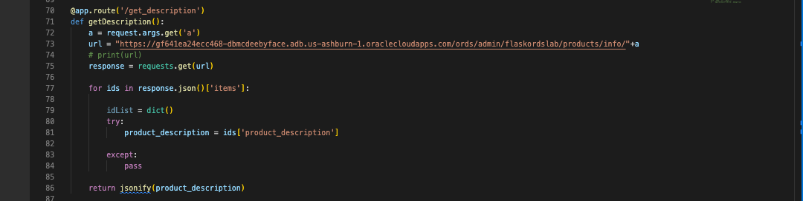
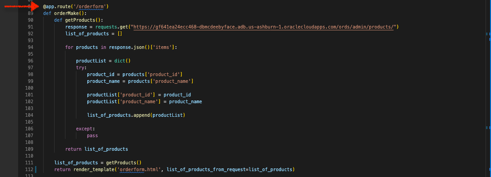
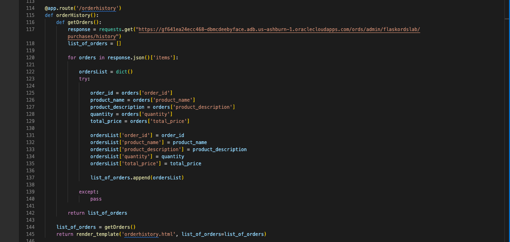
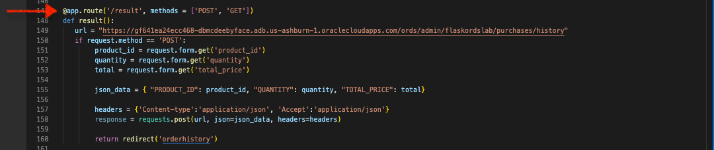

# Title of the Lab

## Introduction

In this lab we will explore the technologies and frameworks that comprise our sample web application.

Estimated Time: 20 minutes

### About Oracle REST Data Services (ORDS) and developer tools 
This lab will discuss a variety of Enterpruise and open source technologies, including: 
- Oracle REST Data Services (ORDS)
- Oracle Clould Infrastructure (OCI) <i>Always Free</i> Tier Tenancy
- Datbase Actions
<!-- I'm actually not sure about cURL, but I don't want to forget it -->
<!-- Make sure any changes here are also included in the Learn More section - we'll want to include those resources as well  -->
- cURL
- Python 3.10.x and later 
- Python packages (libraries) such as: 
  - Flask 
  - Folium 
  - Json
 - Requests 
- <i>select</i> JavaScript functions 
- Bootstrap HTML and CSS frameworks
- Microsoft Visual Studio Code 

We will discuss and explore these technologies and solutions in a practical sense. However, should you wish explore above what this workshop covers, we encourage you to refer to the "Learn More" section of this page. 

### Objectives

In this lab, you will:
* Inspect the provided Python application 
* Review the provided HMTL and CSS
* Review the provided JavaScript Functions

### Prerequisites
<!-- At least for this lab, do we even need prerequisites? -->
* a text editor (such as Visual Studio Code or Sublime Text)

This lab assumes you have:
* An Oracle Cloud Infrastructure account
* All previous labs successfully completed

<!-- *This is the "fold" - below items are collapsed by default* -->

## Task 1: Navigate to the ORDS generated API
<!-- What is the mechanism to provide users with the app, html, etc? -->
(optional) Step 1 opening paragraph.

1. Locate your Python application

    Once you have located your python location (saved locally), open it with the editor of your choice. In this example, we have chosen to open the <b>app.py</b> file in Visual Studio Code (VS Code or VSC). 

    

2. Review the libraries included in this application 

    Once the application loads into your editor, notice the libaries we import to make this application work: 

    

    You may have used these in other projects as they are popular in Python application development. Libraries include: 
    <!-- Should probably include brief descriptions of all these and what we will use them for -->
    - Folium
      - plugins
      - JavaScriptLink
      - Tooltip
      - Icon
    - Flask
    - Imported from Flask:
      - Flask 
      - Json
      - render_template
      - request
      - redirect
      - jsonify
    - requests
    - json 


4. Review the Python application

    Beginning with the first line in our code you'll see we have created an instance of the "Flask" class: 

      ```app = Flask(__name__)```

    You may have seen this before, but in this case the argument "name" is sufficient, for a small scale application as this. You may review the selected documentation on this subject in the "Learn More" section of this lab. 

    

5. Review the Folium contents of the application

    Here you'll see several parts to the Folium section of the application. 
    1. We set the initial, base Folium map = `m`
      - You'll also notice we've included starting coordinates, set minimum and maximum zoom properties, as well as a visual presentation option (i.e. "Stamen Toner")
    2. We include a tooltip; which you'll later when we load the application 
    3. Next we rely on the "Requests" library to `GET` json from our Autonomous Database, via ORDS APIs
      - We perform an iteration to gather the necessary information for populating our map
    4. We'll then create individual markers for the museum locations we retrieved from our database 
      - Here we'll pass the latitude and longitude coordinates
      - We'll then include information pop-ups for all the museums
        - Notice how we include the `museum_name` as HTML, the icon color and type, along with `tooltip`

          :bulb: <i>The tooltip generates a helpful bubble when hovered over that reads "Click me!"; you'll see it soon enough.</i>
    5. Finally you'll see the line: 
    `lvmap = m._repr_html_()`
    We include this to temporarily save our map as a HTML iframe (this includes all necessary HTML and JavaScript properties), which we'll later use as an argument in our application's index page (in Flask)

6. Review our application routes

    If you are familiar with Flask, then you'll know all about routes. You may skim this section to become acquainted with the behavior of the application. If not, here is the primer: application routes (aka `app.route()`) are triggered when actions are performed in the application. 
    
    In some cases the results of a function may be passed back to the user, in other cases a new HTML page may load, in other cases the user may be redirected to a new page.
    
    In all cases, you'll notice that an ORDS endpoint is used for either a `GET` or `POST` method.

    #### The Routes 

    1. `@app.route('/')`
          
        

        This route contains the `index()` function. When a user navigates to the home page they'll be presented with the `index.html` page. We are also including our newly constructed Folium map, `lvnmap` as an argument. 
      
        We'll review the HTML pages shortly so you can view all functions and their output in context.

    2. `@app.route('/get_price')`

        
    
        The function of this route `getPrice()` appends `a` to an ORDS endpoint. From there we retrieve product prices from a product table. This will be one of the fields we'll use in a drop-down menu (found on the `orderform.html` page). 
    
        You'll notice the final line in this function `return jsonify(product_price)` which takes the response and converts it to the JSON format while also assigning it a mimetype of "application/json". Later, we'll review this route along with a JavaScript function, to learn how they work in tandem with our ORDS endpoint. 

    3. `@app.route('/get_description')`

        
    
        Much like the `get_price` app route, this function requests product description information from our database. It uses a similar syntax as before. We then `return jsonify(product_description)` which takes the response and converts it like before. 
    
    4. `@app.route('/orderform')`

        
    
        Using a separate ORDS endpoint, our application performs a more typical `GET` request. Here we return a list of products, along with the `orderform.html` page. You'll notice how we set some of these items similar, but not quite the same, names. This is done for the benefit of the associated JavaScript we'll rely on. We'll review this in the next lab. 

    5. `@app.route('/orderhistory')`

        

        Performing a `GET` request to this endpoint will return the items in a table that stores customer order history. While this particular application doesn't cover credentialing of individual customers, the aim is to showcase the ease of retrieving <i>specific</i> customer data with relative ease.

        You'll see how this app route is triggering in the `orderform.html` page. 

    6. `@app.route(/result', methods = ['POST', 'GET'])`

        

        Using the same ORDS endpoint as the `orderhistory` app route, we can infer that this route expects a `POST` request originating from the Flask application. This function also performs actions such as establishing the key:value pairs of the incoming data, and the JSON payload headers well. 

        In short, this function is triggered by the submit action on the `orderform.html` page. But rather than staying on that page, the user is redirected to the 'orderhistory.html` page. 

      


    

<!-- ## Task 2: Concise Step Description

1. Sub step 1 - tables sample

  Use tables sparingly:

  | Column 1 | Column 2 | Column 3 |
  | --- | --- | --- |
  | 1 | Some text or a link | More text  |
  | 2 |Some text or a link | More text |
  | 3 | Some text or a link | More text |

2. You can also include bulleted lists - make sure to indent 4 spaces:

    - List item 1
    - List item 2

3. Code examples

    ```
    Adding code examples
  	Indentation is important for the code example to appear inside the step
    Multiple lines of code
  	<copy>Enclose the text you want to copy in <copy></copy>.</copy>
    ```

4. Code examples that include variables

	```
  <copy>ssh -i <ssh-key-file></copy>
  ``` -->

## Learn More
* [A minimal application in Flask](https://flask.palletsprojects.com/en/2.1.x/quickstart/#a-minimal-application)
* [About the Flask "Application Object"](https://flask.palletsprojects.com/en/2.1.x/api/#application-object)
<!-- * [About cURL](https://curl.se/)
* [About Python](https://www.python.org/)
* [About Flask for Python](https://flask.palletsprojects.com/en/2.1.x/)
* [About Folium for Python](https://github.com/python-visualization/folium)
* [About Json for Python ](https://docs.python.org/3/library/json.html)
* [About Requests for Python](https://requests.readthedocs.io/en/latest/)
* [About Bootstrap](https://getbootstrap.com/docs/5.2/getting-started/introduction/)
* [Mozilla Developer Network (MDN) Web Docs](https://developer.mozilla.org/en-US/) -->

## Acknowledgements
* **Author** - <Name, Title, Group>
* **Contributors** -  <Name, Group> -- optional
* **Last Updated By/Date** - <Name, Month Year>
