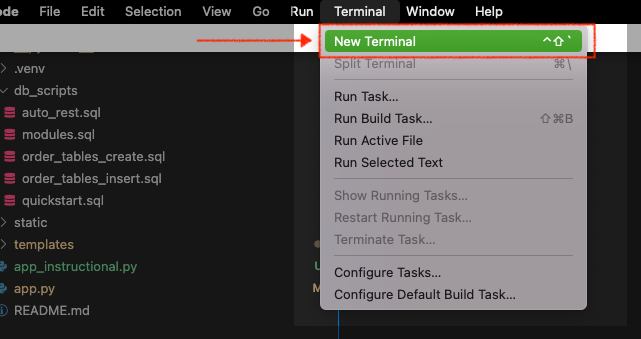
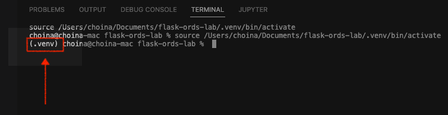
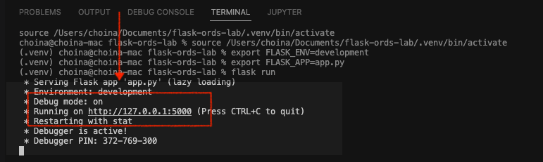
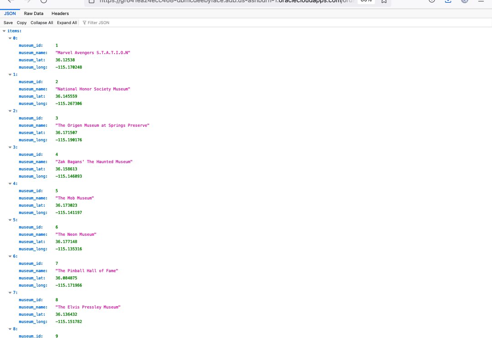
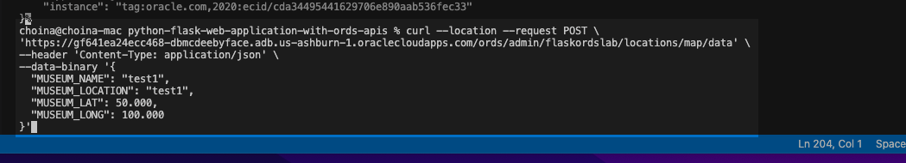
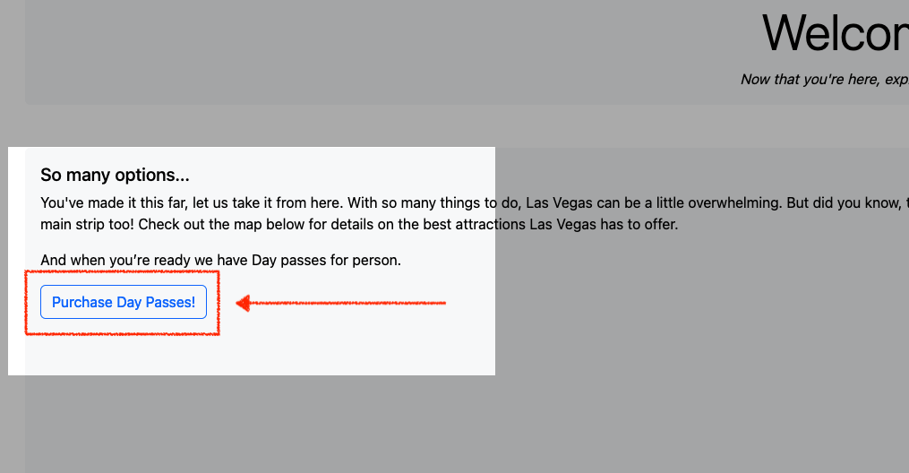

# Walk-through of Flask application and Oracle REST APIs

## Introduction

In this Lab we will obtain the code needed for our Flask application to run. We'll briefly review how to start a Flask application. We will then step through the three main `HTML` pages of this application; pausing to review key features and characteristics. The main focus of this Lab will be on the flexibility and extensibility of Oracle REST APIs. We will also discuss the interactions between these Oracle REST APIs and the Flask application. 

Estimated Time: 25 minutes

### About Oracle REST Data Services (ORDS)

This lab will cover topics including: 
- Oracle REST Data Services (ORDS) APIs
    - `GET` request query parameters
    - Example `POST` requests with cURL commands
- The Flask framework 

### Objectives

In this lab, you will:
* Obtain all code necessary to complete this Workshop
* Review the Flask application's core functions/operations
* Review the application's relationship with Oracle REST APIs 

### Prerequisites
* A text editor (such as Visual Studio Code or Sublime Text)
* Flask Installation 
* Virtual Environment Installation

This lab assumes you have:
* All previous labs successfully completed

## Task 1: Obtain code for this Workshop

1. Download the ZIP file containing the Flask application for this Workshop via [Object Storage]().
2. Once downloaded, un-compress the ZIP file and open with your text editor (we will use Visual Studio Code for this Workshop). The contents should look similar to this: 

    

    At a <i>minimum</i> you'll want to ensure you have a `static` folder, `templates` folder, and the Python application `app.py`.

:bulb: <i>For details on how to run a Flask application in a Virtual Environment (venv), refer to the [Installation](https://flask.palletsprojects.com/en/2.2.x/installation/) and [Quick Start](https://flask.palletsprojects.com/en/2.2.x/quickstart/) steps in the Flask documentation.</i>

## Task 2: Activate the Virtual Environment 

While the main focus of this Workshop is not Flask, we will periodically review certain helpful actions for the developer. If you have limited experience with the Flask framework, this may be beneficial. If you do get stuck, we encourage you to review the [Flask](https://flask.palletsprojects.com/en/2.2.x/installation/#) documentation first, <i>then</i> return to this Lab once you are more comfortable with Flask operations. 

1. Activate your virtual environment from your terminal. 

    

    Commands are different for MacOS/Linux and Windows. Alternatively, if using VS Code, we recommend you follow [these instructions](https://code.visualstudio.com/docs/python/tutorial-flask) on how to install Python virtual environments in VS Code. Once complete, come back to this Lab and continue. You may also refer to the "Learn More" section of this Lab for more details on Virtual Environments in VS Code.
    
    If you choose to activate the virtual environment manually, use the following commands to activate:

    - MacOS/Linux: ```$<copy>. venv/bin/activate</copy>```
    - Windows: ```><copy>venv\Scripts\activate</copy>```
    
    

    You should now see the prefix (or similar to) `(.venv)` in your terminal:
    
    

## Task 3: Activate Flask
1. Next we'll start the Flask Application.

    - There are various ways you can start your Flask application, this is the more manual method. If you'd like to review or learn about automated options for setting environment variables, you may refer to the "Learn More" section of this Lab. 
         
    1. Enter the following command:
    
       ```<copy>export FLASK_ENV=development</copy>```
    
       
    
    2. Then:
    
       ```<copy>export FLASK_APP=app.py</copy>```

       
    
    3. Finally:

       ```<copy>flask run</copy>```
    
       

    4. Once the development server starts right-click the server IP address to open the Flask application. The application will automatically open in your default browser. 

        

### Task 4: Review the basic HTTPS operations of the Flask application

1. Review the `index.html` page.

    - When the Flask application first loads, you'll see this screen:

    

    - You may explore the navigation tab (hamburger icon on upper right-hand corner). But we'll first explore the Folium map at the bottom of this `index` page. 
    
:bulb:  <i>We'll conduct a more in-depth review in a later Lab. But you should know that Folium "makes it easy to visualize data that’s been manipulated in Python on an interactive Leaflet.js map. To expand your knowledge of Folium and Leaflet.js, visit the "Learn More" section for more details.</i>

2. While focused on the Folium map, we can interact with location markers - these represent various attractions in the downtown Las Vegas area. In this application we are focused on venues such as museums and art installations.  

:brain: <i>"Folium builds on the data wrangling strengths of the Python ecosystem and the mapping strengths of the leaflet.js library. Manipulate your data in Python, then visualize it on a Leaflet map via Folium...It enables both the binding of data to a map for choropleth visualizations as well as passing rich vector/raster/HTML visualizations as markers on the map."</i>

   - Each marker will have a "Tool-tip"; when hovered over, the user can choose to click it to reveal additional information:

   

   - When clicked, these markers reveal an attraction's name. 
   
:smiley: <i>Here is where we first encounter Oracle REST APIs. You'll see the code in a later Lab, but for now, we'll show you in the browser, the API responsible for providing us with this map's information.</i>

3. Let's try that now. Copy the following URI: <copy>https://yfuxkbz2ls7taze-ordshandsonlabs.adb.us-phoenix-1.oraclecloudapps.com/ords/python/flask/museums/</copy> and place it into your browser's address bar. You should see the `items` from the `GET` request:

   

    - <i>This</i> `GET` request is where the Folium map <i>gets</i> its input from.

4. Manipulating the `GET` request:

    1. But let's say you are a developer, and you've been provided with a set of Oracle REST APIs like this one. On the surface, they are simple enough. But you actually wield much more power than you may realize - with query parameters.

       - Try this. Take the URI we just used, add this to the end ```<copy>?q={"$orderby":{"museum_lat" : "ASC"}}</copy>```, and then enter it into your browser's address bar. 
          
         The new address should look like this: 

         

       Once the page reloads, you'll see something like this: 

       

   :question: What do you notice? If you caught that the venues are all ordered in ascending order, according to their latitudes, you'd be correct!

    2. Let's try a trickier one. Take that original URI, and then add this to the end: 
    ```<copy>?q={"museum_lat":{"$between":[36.05,36.15]}}</copy>```

        Now enter it into your browser's address bar:

        
        
    :question: What do you see now? You can probably tell by now, but we restricted our results to a very narrow band of latitudes. We have only scratched the surface with filtering in queries. But once you understand how your data is structured, and what is available, the possibilities are endless.

    3. The ability to perform myriad `GET` requests with a single API + query parameters is powerful. But we can manipulate other HTTPS Operations (Methods) too! Lets take a look at a`POST` request.

5. Remixing the `POST` request. 

    - We've created a Resource Handler for this table that can be used for the `POST` operation/method. 
     - Let's say you'd like to add another location to this table. You as the developer can do that. This is <i>your</i> application, you should be able to make changes on-the-fly, as you deem necessary. Once the logic is set up on the database end, anything you feed to the table (that fits that logic) is acceptable.

    1. First, begin by copying the appropriate cURL command for your environment. 

        1. Command Prompt:
            ```
            <copy>
            curl -v -X POST ^
            -H "Content-Type: application/json" "https://yfuxkbz2ls7taze-ordshandsonlabs.adb.us-phoenix-1.oraclecloudapps.com/ords/python/flask/museums/" ^
            -d "{\"MUSEUM_NAME\":\"<VALUE>\",\"MUSEUM_LOCATION\":\"<VALUE>\",\"MUSEUM_LAT\":\"<VALUE>\",\"MUSEUM_LONG\":\"<VALUE>\",\"message\":\"<VALUE>\"}"
            </copy>
            ```
        2. Power Shell:
            ```
            <copy>
            curl.exe -v -X POST `
            -H "Content-Type: application/json" "https://yfuxkbz2ls7taze-ordshandsonlabs.adb.us-phoenix-1.oraclecloudapps.com/ords/python/flask/museums/" `
                -d "{\"MUSEUM_NAME\":\"<VALUE>\",\"MUSEUM_LOCATION\":\"<VALUE>\",\"MUSEUM_LAT\":\"<VALUE>\",\"MUSEUM_LONG\":\"<VALUE>\",\"message\":\"<VALUE>\"}"
            </copy>
            ```
        3. Bash:
            ```
            <copy>
            curl --location --request POST \
            'https://yfuxkbz2ls7taze-ordshandsonlabs.adb.us-phoenix-1.oraclecloudapps.com/ords/python/flask/museums/' \
            --header 'Content-Type: application/json' \
            --data-binary '{
                "MUSEUM_NAME": "<VALUE>",
                "MUSEUM_LOCATION": "<VALUE>",
                "MUSEUM_LAT": "<VALUE>",
                "MUSEUM_LONG": "<VALUE>",
                "message": "<VALUE>" 
            }'
            </copy>
            ```
    2. Then add whatever values you'd like, as long as they adhere to the datatypes Oracle REST Data Services (ORDS) expects. Be sure to choose something unique so you can easily identify it. Review this table for what our Database table expects:  

        |Key              |Value's Data Type |Example Value                                |
        |---------------- | ---------------- | ------------------------------------------- |
        |`MUSEUM_NAME`    |VARCHAR2(500 BYTE)|"Henry's Old Time Saloon Museum" <sup>a</sup>|
        |`MUSEUM_LOCATION`|VARCHAR2(500 BYTE)|"123 Tipsy Ave." <sup>a</sup>                |
        |`MUSEUM_LAT`     |NUMBER(8,6)       |50.000000 <sup>b<sup>                        |
        |`MUSEUM_LONG`    |NUMBER(9,6)       |100.000000 <sup>c</sup>                      |

        <sup>a</sup> Name and location should be strings. When placing into the cURL command, make sure you use quotes (single or double where applicable)
        
        <sup>b</sup> We've specified "Precision" and "Scale for the latitude. That's 8 digits in the number; 6 of them to the <i>right</i> of the decimal. 

        <sup>c</sup> We've also specified "Precision" and "Scale for the longitude. Here we have 9 digits in the number; 6 of them to the <i>right</i> of the decimal. 

        :pirate_flag:  Here is an example of a Bash cURL command:</i>
        ```<copy>
        curl --location --request POST \
        'https://[Place your ORDS REST API here]' \
        --header 'Content-Type: application/json' \
        --data-binary '{
        "MUSEUM_NAME": "test1",
        "MUSEUM_LOCATION": "test1",
        "MUSEUM_LAT": 50.12345,
        "MUSEUM_LONG": 100.12345 
        }'</copy>
        ```
    3. Enter the cURL Command in your terminal. 

        
    
    4. Then, using the URI from the first/previous `GET` request, enter it into your browser's address bar. You should now see the new record added to your list.  

        
    
        :question: You're probably wondering how this actually gets added to the database. Well, you as the developer may never see this part but the logic for this `POST` Resource Handler actually looks like this: 
        
       

       - However, if you've been provided credentials to Oracle Cloud Infrastructure you may one day use the Database Actions interface to create your very own custom APIs. 
       
    :bulb: <i>Refer to the `README` file for how to set up your Autonomous Database environment so it mirrors the Workshop environment.</i>

5.  Congratulations! You've just sent a `POST` request with the help of ORDS. By now you should have a better understanding of what occurs "under the covers" on the database in this Flask application.

### Task 4: Review the remainder of application

1. With your still application open in the browser, click the "Purchase Day Passes" button:

    

2. You should see the `orderform.html` page load. Yet again, we have information provided to us by ORDS. The "choose an option" dropdown has already been populated with product choices; this was done upon page load. The information came from our database and was handled exclusively by our Oracle REST APIs.

    

3. When you make a selection, you'll see the "Description" <i>and</i> "Price per" fields change to reflect your product selection. If you thought "Oracle REST APIs" just then, you'd be correct. We have Oracle REST APIs for requesting product description <i>and</i> pricing information.  

    

:bulb: <i>A more performant alternative to this approach might be to request all data from a single API. However, this example merely highlights how <u>many</u> Oracle REST APIs can be used on a single page.</i>

4.  Next, update the "Passes needed" field. As you do this you'll see the "Total Price" field update. When you're satisfied with your selections click the "Complete my purchase" button:

    

5. The `orderhistory.html` page will load. 

:brain: <i>To keep this simple, we've omitted the payment gateway step, but since you have access to the code, you <i>could</i> always add that in later.</i>

   - A table with our previous orders will appear. Yet again, we have been served this data through another Oracle REST API. 
   
       

6. You'll see how everything works together in our `app.py` file. But for now, its important to understand the role Oracle REST APIs play in this application. 

7. Congratulations, you made it! You should now have a better understanding of:
- what this particlar Flask application does
- the importance or Oracle REST APIs to this application
- How Oracle REST APIs can:
    - accelerate application development, <i>and</i> 
    - reduce complexity

### You may now proceed to the [next Lab](#next).

## Learn More
* [A minimal application in Flask](https://flask.palletsprojects.com/en/2.1.x/quickstart/#a-minimal-application)
* [About the Flask "Application Object"](https://flask.palletsprojects.com/en/2.1.x/api/#application-object)
* [Python Virtual Environments in VS Code](https://code.visualstudio.com/docs/python/environments)
* About environment variables in Flask:
    * [The `python-dotenv` library](https://github.com/theskumar/python-dotenv#readme)
    * [Flask documentation - Environment variables](https://flask.palletsprojects.com/en/2.2.x/cli/#environment-variables-from-dotenv)
* [About Folium](https://python-visualization.github.io/folium/)
* [About Leaflet.js](https://leafletjs.com/)

## Acknowledgements
* **Author** - Chris Hoina, Senior Product Manager, Database Tools
* **Contributors**
  - Jeff Smith, Distuinguished Product Manager, Database Tools
  - Justin Biard, Senior Member of Technical Staff, Database Tools 
  - Zachary Talke, Product Manager, Database Tools
  - Brian Spendolini, Principal Product Manager
* **Last Updated By/Date** - Chris Hoina, August 2022
