# Lab 1: Walk-through of Flask application and Oracle REST APIs

## Introduction

In this Lab, you'll obtain the code needed for the Flask application. We'll briefly review how to start Flask. We'll then step through this application's three main `HTML` pages, pausing to examine key features and characteristics. 

The main focus of this Lab will be discovering the flexibility and extensibility of Oracle REST APIs. Throughout this Lab, we will discuss the interactions between Oracle REST APIs and the Flask application. 

This Lab will cover topics including: 

- Oracle REST Data Services (ORDS) APIs
- **`GET`** request query parameters
- Example **`POST`** requests with cURL commands
- The Flask framework 

Estimated Time: 25 minutes

Watch the video below for a quick walk-through of the lab.
[Walk-through of Flask application and Oracle REST APIs](videohub:1_vvob20bc)

### Objectives

In this Lab, you will:

- Obtain all code necessary to complete the Workshop
- Review the Flask application's core functions/operations
- Review the application's relationship with Oracle REST APIs 

### Prerequisites

- A text editor (such as Visual Studio Code or Sublime Text)
- Flask installation 
- Virtual environment installation

This Lab assumes you have:

- All previous labs successfully completed

## Task 1: Obtain code for this workshop

1. [Download the ZIP](https://objectstorage.us-ashburn-1.oraclecloud.com/p/jyHA4nclWcTaekNIdpKPq3u2gsLb00v_1mmRKDIuOEsp--D6GJWS_tMrqGmb85R2/n/c4u04/b/livelabsfiles/o/labfiles/flask-ords-lab-main.zip) file that contains our the Flask application and associated `HTML` files

2. Once downloaded, un-compress the ZIP file and open it with your text editor (examples in this Workshop will use Visual Studio Code). The contents should look similar to this: 

    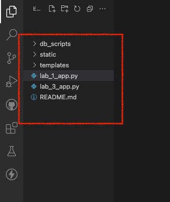

> 💡 *For details on how to run a Flask application in a Virtual Environment (venv), refer to the [Installation](https://flask.palletsprojects.com/en/2.2.x/installation/) and [Quick Start](https://flask.palletsprojects.com/en/2.2.x/quickstart/) steps in the Flask documentation.*

## Task 2: Activate the virtual environment

While the main focus of this Workshop is not Flask, we will periodically review specific practical actions for the developer. The reviews may be helpful if you have limited experience with the Flask framework. 

Stuck? We encourage you to review the [Flask](https://flask.palletsprojects.com/en/2.2.x/installation/#) documentation first, *then* return to this Lab once you are more comfortable with Flask operations. 

1. Open your terminal.

    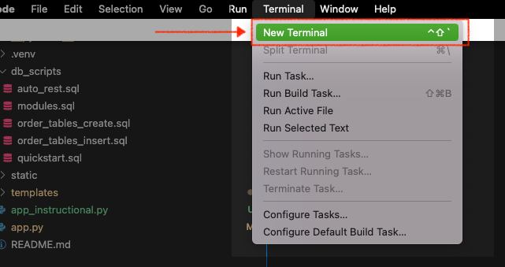

    * Commands are different for macOS/Linux and Windows. Alternatively, if using VS Code, we recommend you follow [these instructions](https://code.visualstudio.com/docs/python/tutorial-flask) on how to install Python virtual environments in VS Code (once complete, come back to this Lab). 

    > 🆘 *If  your Virtual Environment fails to start in VS Code, **check your Python Interpreter**!*

    You can do this by:

      1. Navigating to your Command Palette
      
        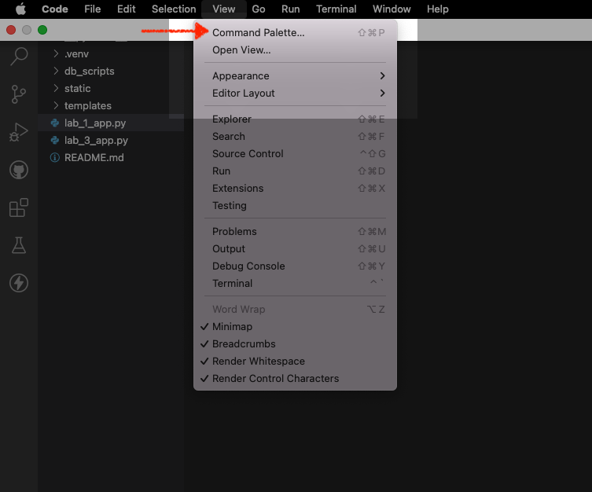

      2. Searching for and selecting *Python: Select Interpreter*
   
        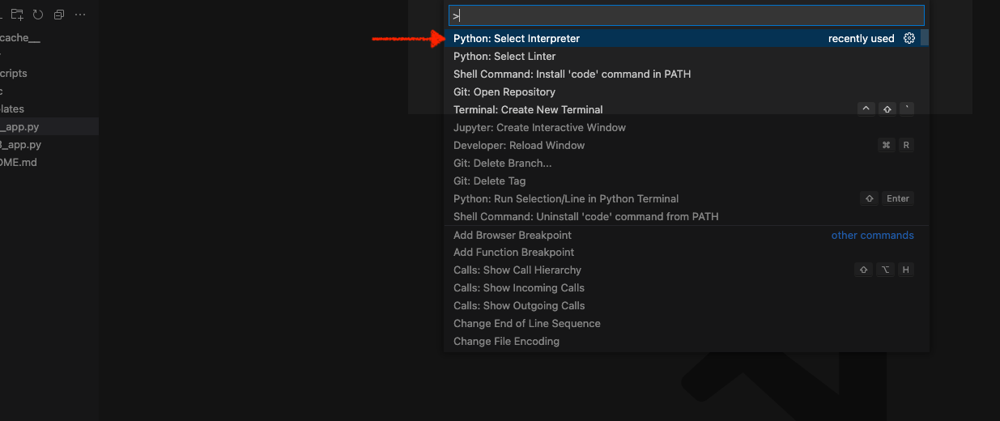

      3. Selecting the Python Interpreter associated with the Virtual Environment

        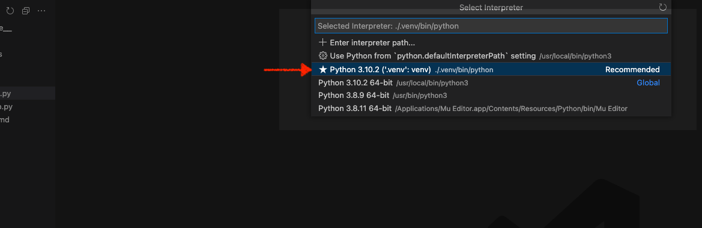

2. If you choose to activate the virtual environment *manually*, use the following commands to activate:

    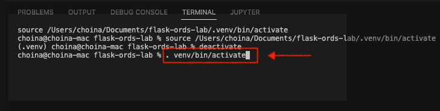

    macOS/Linux
    ```
    <copy>. venv/bin/activate</copy>
    ```
    Windows
    ```
    <copy>venv\Scripts\activate</copy>
    ```

3. You should now see the prefix (or similar to) **`(.venv)`** in your terminal:
    
    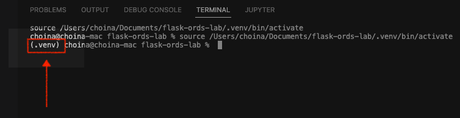

## Task 3: Activate Flask

Next, we'll start the Flask Application.

There are various ways you can start your Flask application. This is the more manual method. Suppose you'd like to review or learn about automated options for setting environment variables. In that case, you may refer to this Lab's "Learn More" section. 
         
1. Enter the following command (*Mac OS/Linux users*): 
    ```python
    <copy>export FLASK_ENV=development</copy>
    ```
  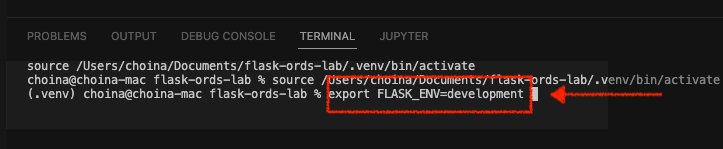
    
2. Then(*Mac OS/Linux users*):
    ```
    <copy>export FLASK_APP=lab_1_app.py</copy>
    ```
    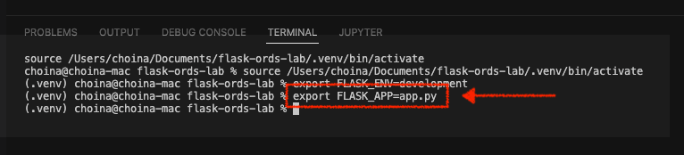
    
3. Finally(*Mac OS/Linux users*): 
    ```
    <copy>flask run</copy>
    ```
    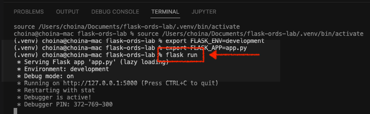

> 🚨 **PC/Windows users**, starting Flask is straightforward (Once you've activated your Virtual Environment you will still need to install `Flask` and `Folium`). You may use the following command to start Flask:*

    ```
    <copy>flask --app lab_1_app.py run</copy>
    ```

4. Once the development server is live, right-click the server IP address to open the Flask application. The application will automatically open in your default browser. 

    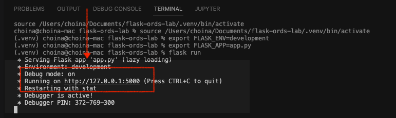

## Task 4: Review the basic HTTPS operations - Part 1

1. Review the **`index.html`** page.

    - When the Flask application first loads, you'll see this screen:

    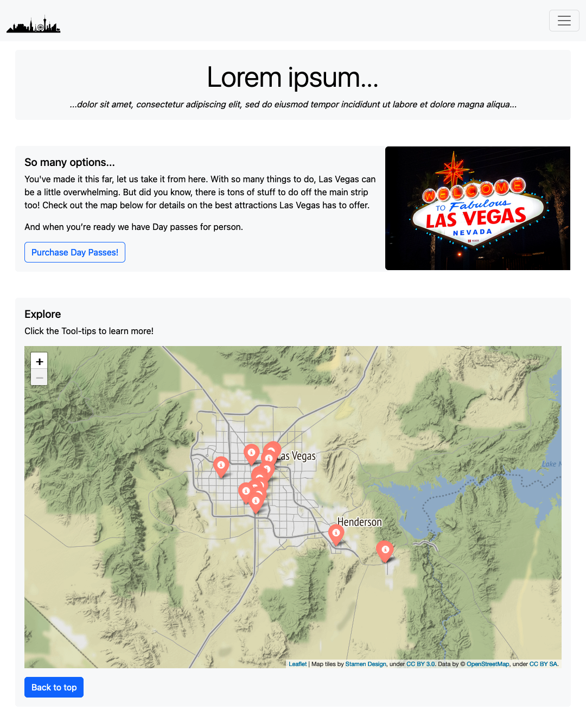

   🏗 *But first, let's personalize this Welcome page.*

## Task 5: Personalize the index.html page

1. You'll notice the filler text at the top of the **`index.html`** page. Let's customize that to make this application unique *to you*.

    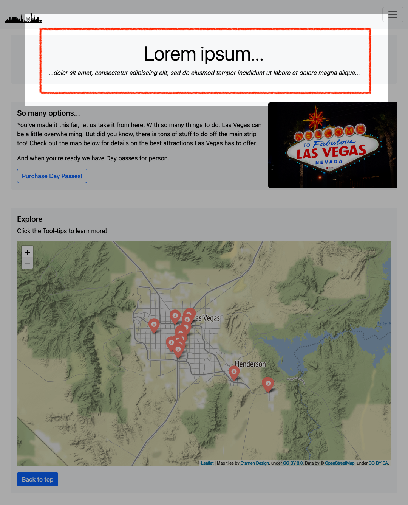

2. Return to your editor and expand the **`templates`** folder. There you'll find the **`index.html`** file. Select it.

    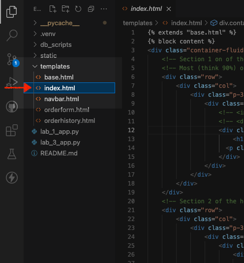

3. Scroll down till you see the **`<div class="card-body">`** container on Line 12. Change the text in Lines 13-14 to something of your choosing. 

    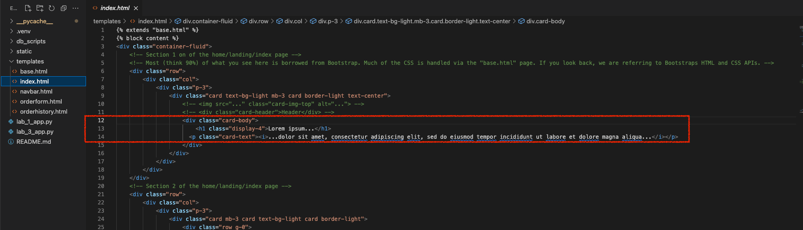
    *<sub>Once satisfied, save the file.</sub>*
    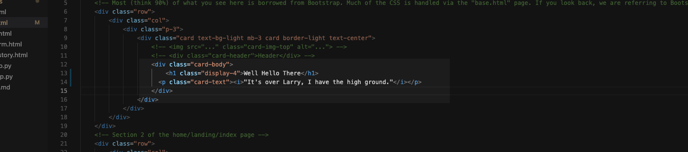

4. Return to the browser window where the Flask application is displaying. And reload the page. 

    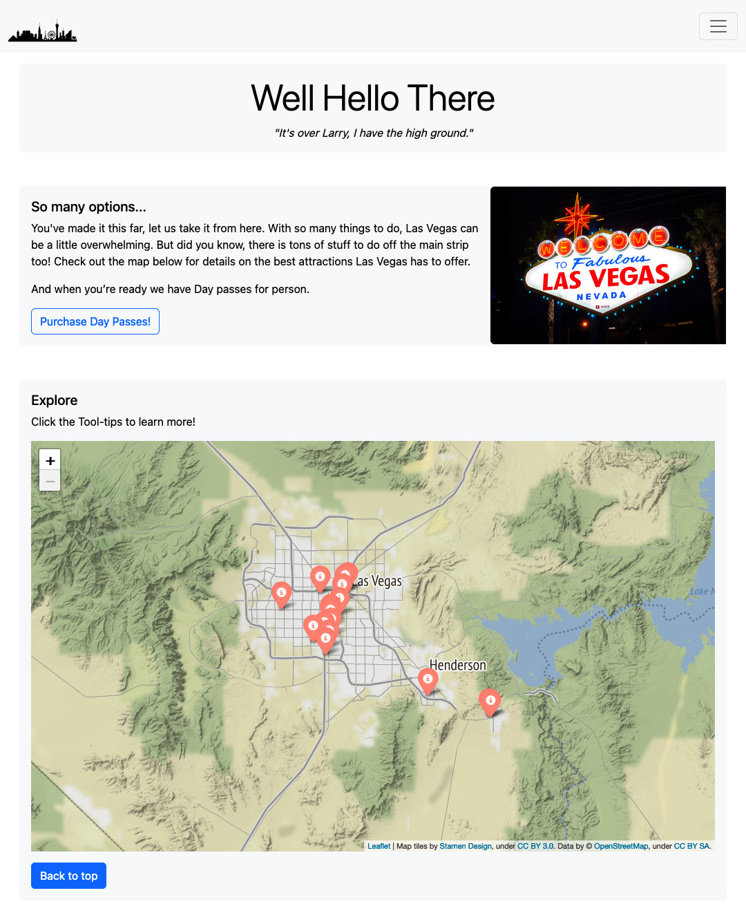

5. You should now see the updated text from the **`index`** template. Congratulations, you've just personalized the application!

## Task 6: Review the basic HTTPS operations - Part 2

1. You can explore the navigation tab (hamburger icon on the upper right-hand corner). 

    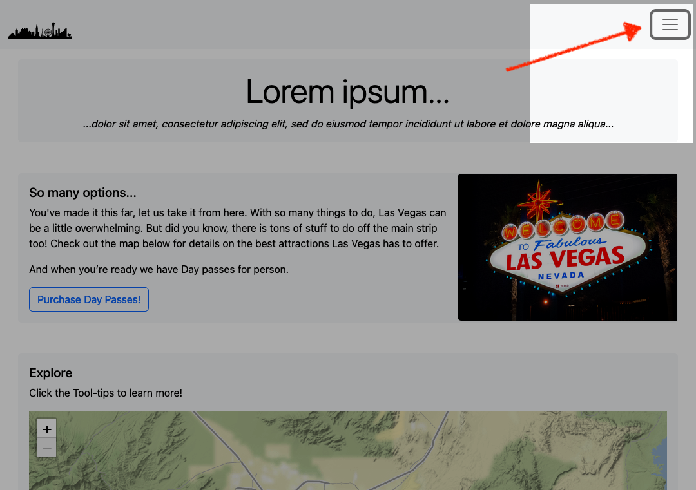

2. Expand, and you'll find helpful Oracle REST API resources.

    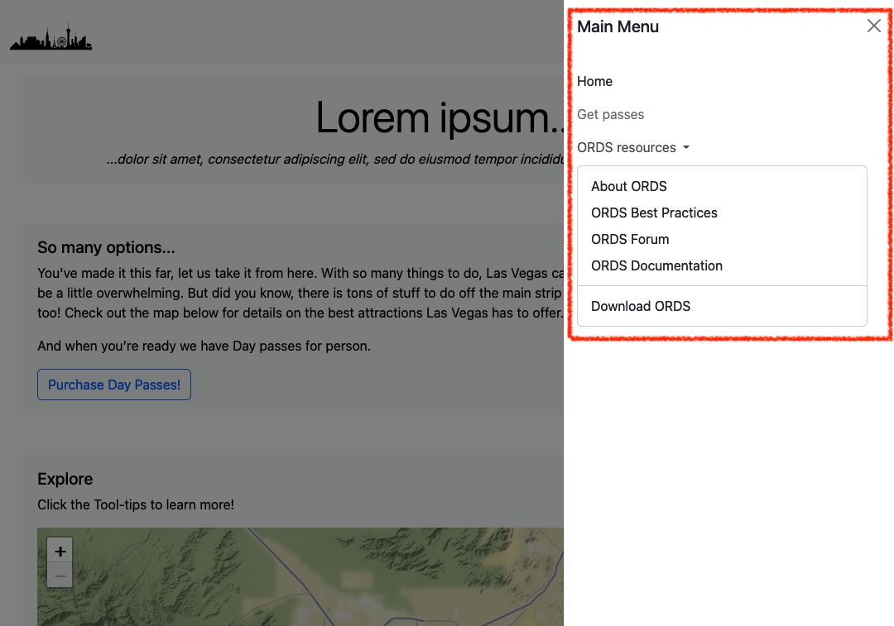

3. But we'll first explore the *Folium* map at the bottom of this **`index`** page. 
    
   > 🧠 *Folium "makes it easy to visualize data manipulated in Python on an interactive Leaflet.js map. Manipulate your data in Python, then visualize it on a Leaflet map via Folium...It enables both the binding of data to a map for choropleth visualizations and passing rich vector/raster/HTML visualizations as markers on the map. To expand your knowledge of Folium and Leaflet.js, see the "Learn More" section for more details.*

4. When in Folium map, we can interact with location markers - these represent various attractions in the downtown Las Vegas area. In this application, we are focused on venues such as museums and art installations.  

    - Each marker will have a **Tool-tip**; when hovered over, the user can choose to click it to reveal additional information:

    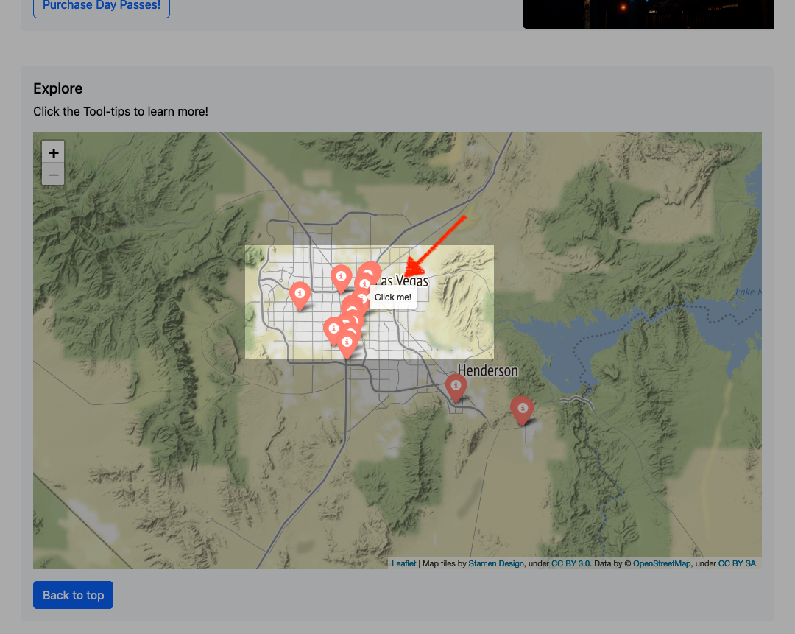

    - When clicked, these markers reveal an attraction's name. 
   
    > 😀 *Here is where we first encounter Oracle REST APIs. You'll see the code in a later Lab, but for now, we'll show you, in the browser, the API responsible for providing us with this map's information.*

5. Let's look at this Oracle endpoint now. 

   Copy the following URI.

    ```
    <copy>https://yfuxkbz2ls7taze-ordshandsonlabs.adb.us-phoenix-1.oraclecloudapps.com/ords/python/flask/museums/</copy>
    ```

   Now place it into your browser's address bar and press Enter. You should see the **`items`** from the **`GET`** request:

   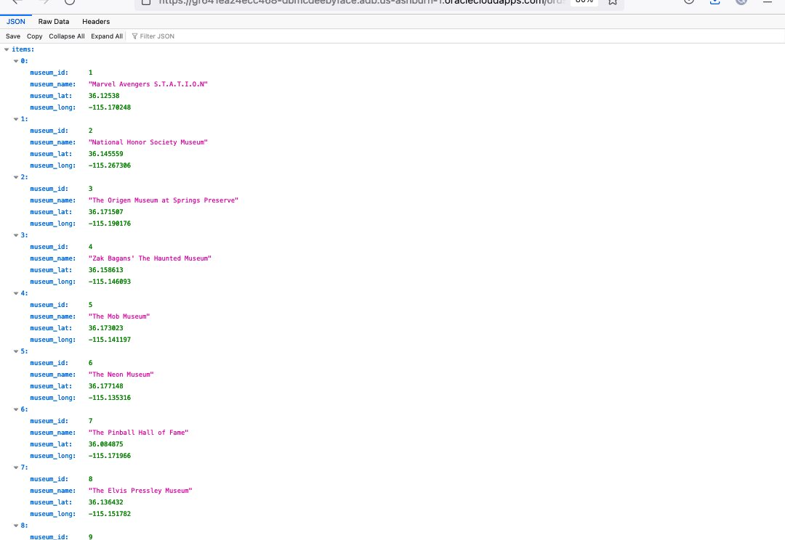

   > 😀 *This* **`GET`** request is where the Folium map *`GET`s* its input.

6. Manipulating the **`GET`** request:

   But let's say you are a developer, and you've been provided with a set of Oracle REST APIs like these. On the surface, they are simple enough. Still, you wield much more power than you may realize - with query parameters!

   Try this. Take the URI we just used, and add this to the end:

     ```
     <copy>?q={"$orderby":{"museum_lat":"ASC"}}</copy>
     ```
   
   Enter it into your browser's address bar, and press Enter. 
   
   <sub>*The new address should look like this:*</sub>
   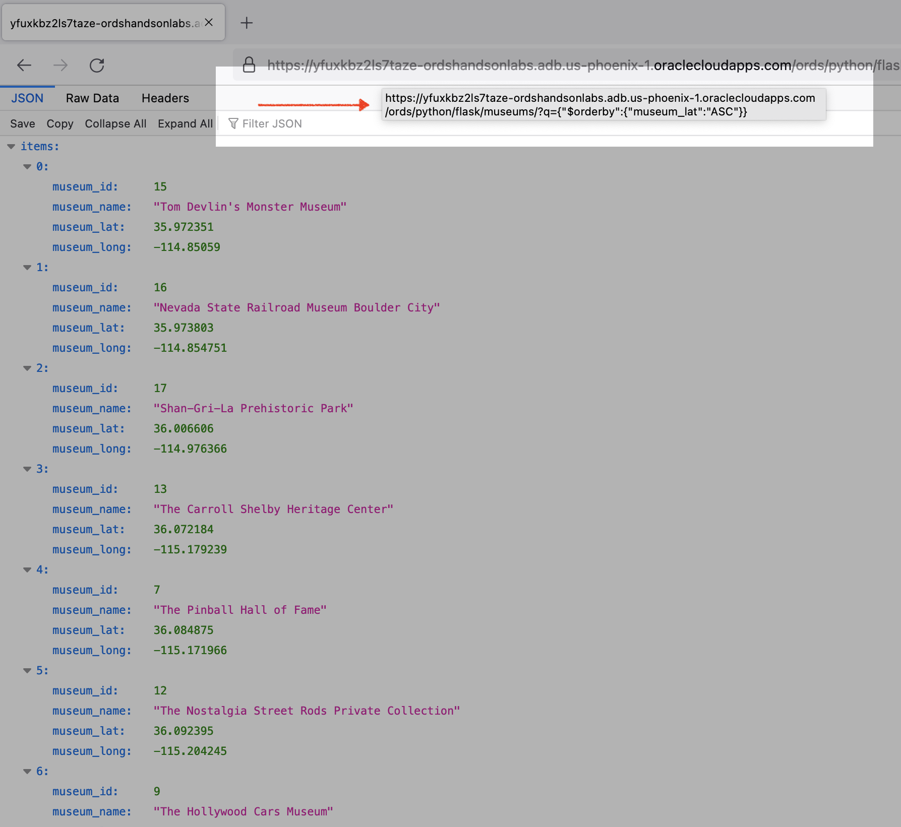

   Once the page reloads, you'll see something like this: 

   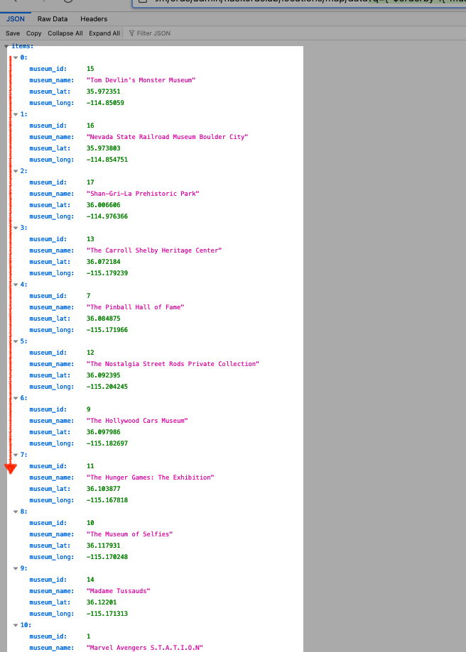

   > ❓ **What do you notice?** If you caught that the venues are all ordered in ascending order, according to their latitudes, you'd be correct!

7. Let's try a trickier one. Take that original URI, and add this to the end: 
    ```
    <copy>?q={"museum_lat":{"$between":[36.05,36.15]}}</copy>
    ```
    Enter it into your browser's address bar:

      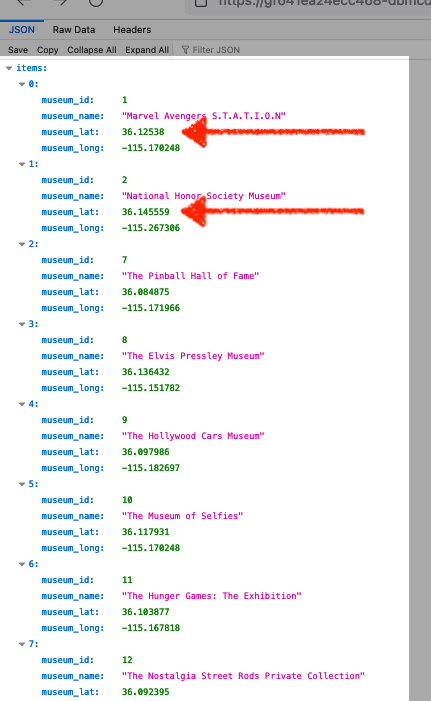
        
    > ❓ **What do you see now?** You can probably tell by now, but we've restricted our results to a narrow band of latitudes.
          
     - We have only scratched the surface with filtering in queries. But the possibilities are endless once you understand how your data is structured and what is available.

     - The ability to perform myriad **`GET`** requests with a single API + query parameters is powerful. But we can manipulate other HTTPS Operations (Methods) too! Let's take a look at a **`POST`** request.

8. Remixing the **`POST`** request. 
   
   We've created a Resource Handler for this table that can be used for the **`POST`** operation/method. 
   
   Let's say you'd like to add another location to this table. You, as the developer, can do that. This is *your* application, and you should be able to make changes on-the-fly! Once the logic is set up on the database end, anything you feed to the table (that fits that logic) is acceptable.

    1. We'll do this next step in a terminal. First, begin by copying the appropriate cURL command for your environment.

        - Command Prompt:

            ```bash
            <copy>curl -v -X POST ^
            -H "Content-Type: application/json" "https://yfuxkbz2ls7taze-ordshandsonlabs.adb.us-phoenix-1.oraclecloudapps.com/ords/python/flask/museums/" ^
            -d "{\"MUSEUM_NAME\":\"<VALUE>\",\"MUSEUM_LOCATION\":\"<VALUE>\",\"MUSEUM_LAT\":\"<VALUE>\",\"MUSEUM_LONG\":\"<VALUE>\",\"message\":\"<VALUE>\"}"</copy>
            ```

        - Power Shell:
        
            ```shell
            <copy>curl.exe -v -X POST `
            -H "Content-Type: application/json" "https://yfuxkbz2ls7taze-ordshandsonlabs.adb.us-phoenix-1.oraclecloudapps.com/ords/python/flask/museums/" `
            -d "{\"MUSEUM_NAME\":\"<VALUE>\",\"MUSEUM_LOCATION\":\"<VALUE>\",\"MUSEUM_LAT\":\"<VALUE>\",\"MUSEUM_LONG\":\"<VALUE>\",\"message\":\"<VALUE>\"}"</copy>
            ```

        - Bash:

            ```bash
            <copy>curl --location --request POST \
            'https://yfuxkbz2ls7taze-ordshandsonlabs.adb.us-phoenix-1.oraclecloudapps.com/ords/python/flask/museums/' \
            --header 'Content-Type: application/json' \
            --data-binary '{
            "MUSEUM_NAME": "<VALUE>",
            "MUSEUM_LOCATION": "<VALUE>",
            "MUSEUM_LAT": "<VALUE>",
            "MUSEUM_LONG": "<VALUE>",
            "message": "<VALUE>" 
            }'</copy>
            ```

    2. Next, choose some **`{Key: Values}`** that adhere to the datatypes Oracle REST Data Services (ORDS) expects. *Be sure to choose something unique* so you can quickly identify it. Review this table for what our Database table expects:  
      
        |Key              |Value's Data Type |Example Value                                |
        |---------------- | ---------------- | ------------------------------------------- |
        |`MUSEUM_NAME`    |VARCHAR2(500 BYTE)|"Henry's Old Time Saloon Museum" <sup>a</sup>|
        |`MUSEUM_LOCATION`|VARCHAR2(500 BYTE)|"123 Tipsy Ave." <sup>a</sup>                |
        |`MUSEUM_LAT`     |NUMBER(8,6)       |50.000000 <sup>b<sup>                        |
        |`MUSEUM_LONG`    |NUMBER(9,6)       |100.000000 <sup>c</sup>                      |
        {: title="`{Key:Value}` Reminder Table"}
    
       <sup><sup>a</sup> Both Name and Location are strings, so they you'll need to retain the quotes in your cURL command.</sup>
      
       <sup><sup>b</sup> We've specified "Precision" and "Scale" for the latitude. That's 8 digits in the number; 6 of them to the *right* of the decimal.</sup>
      
       <sup><sup>c</sup> We've also specified "Precision" and "Scale for the longitude. Here we have 9 digits in the number; 6 of them to the *right* of the decimal.</sup>
    
      > 🏴‍☠️ *Here is our example of the Bash cURL command we sent:*
   
      ```bash
      <copy>curl --location --request POST \
      'https://[Place your ORDS REST API here]' \
      --header 'Content-Type: application/json' \
      --data-binary '{
          "MUSEUM_NAME": "test1",
          "MUSEUM_LOCATION": "test1",
          "MUSEUM_LAT": 50.12345,
          "MUSEUM_LONG": 100.12345
          }'</copy>
      ```

9. Enter the cURL Command in your terminal (*your command may differ slightly*) to `POST` this entry to the associated table (located in our Autonomous Database).

       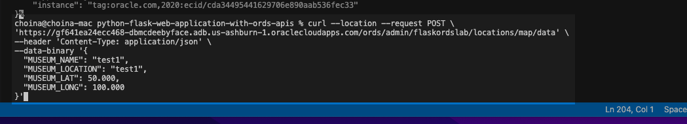
    
10. Then, using the URI from the first/previous **`GET`** request, enter it into your browser's address bar. You should now see the new record added to your list.  

    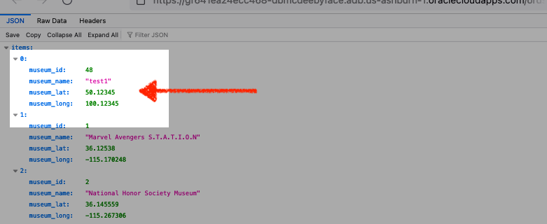

    > ❓ You're probably wondering, "*how does this actually get added to the database?*"
    
    - Well, you as the developer may never see this part, but the logic for this `POST` Resource Handler actually looks like this: 
    
       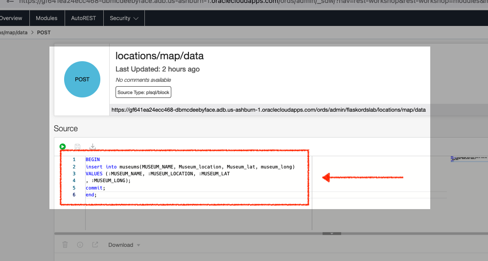

    - *However*, if you've been provided credentials to Oracle Cloud Infrastructure, you may one day use the Database Actions interface to create your own custom APIs. 
    
    > 💡 *Refer to the `README` file retrieved in [Task 1](#Task1Obtaincodeforthisworkshop) for information on how to use the provided database scripts for setting up an Autonomous Database environment like this one.*

11. Pause for a moment and take pride in your accomplishments! You've just sent a `POST` request with the help of ORDS. At this stage, you should better understand what occurs "under the covers" on the Oracle Autonomous database in this Flask application.

## Task 7: Review the remaining pages

1. With your application still open in the browser, click the "Purchase Day Passes" button:

    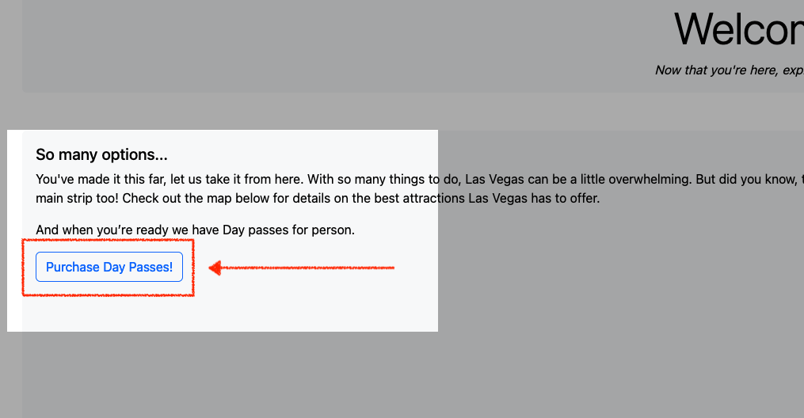

2. You should see the **`orderform.html`** page load. 

     > 😀 Yet again, we have information provided to us by ORDS. 
  
   The *Choose an option* dropdown has already been populated with product choices; this was done upon page load. The information came from our database and was handled exclusively by our Oracle REST APIs.
  
     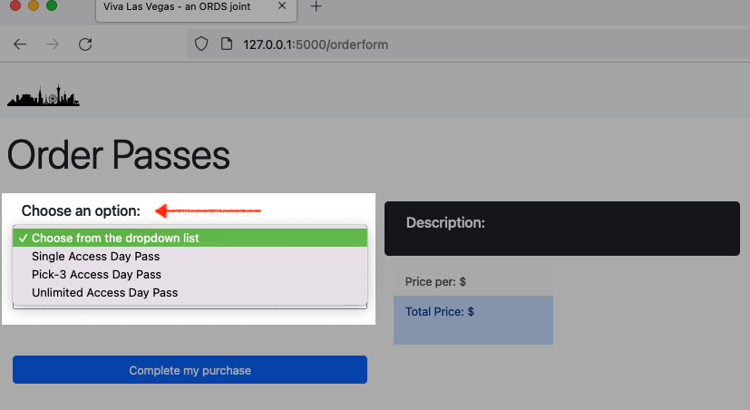

3. When you make a selection, you'll see the *Description* and *Price per* fields change to reflect your product selection. You'd be correct if you thought "Oracle REST APIs" just then. We have Oracle REST APIs requesting product descriptions *and* pricing information.

   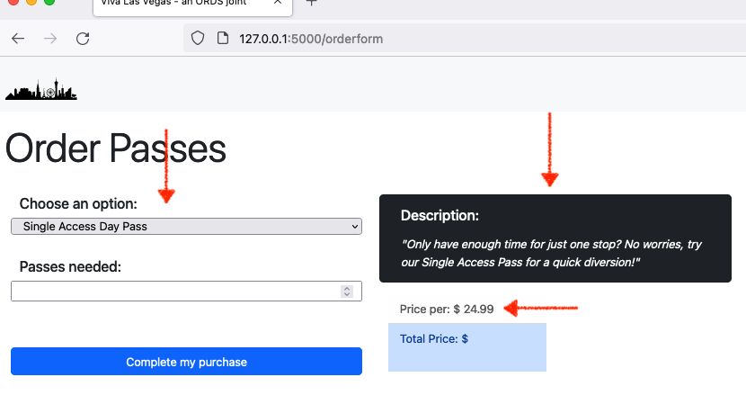

   > 💡 *A more performant alternative* to this approach might be to request all data from a single API. However, this example merely highlights how *multiple* Oracle REST APIs can be used on a single page.

4. Next, update the *Passes needed* field. You'll see the *Total Price* field update as you do this. When you're satisfied with your selections, click the "Complete my purchase" button:

   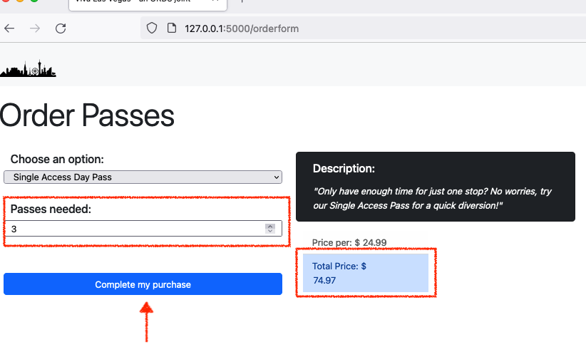

5. The **`orderhistory.html`** page will load. 

     > 🧠 *To keep this simple, we've omitted the payment gateway step, but since you have access to the code, you could always add that later.*

    A table with our previous orders will appear. Yet again, we have been served this data through another Oracle REST API.

    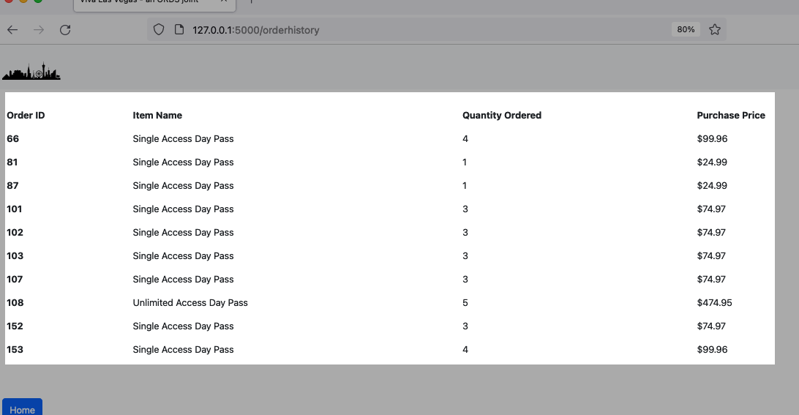 

6. To exit the Flask application, return to your terminal and press the `Control` + `C` keys.

7. Soon, you'll see how everything works together in our **`app.py`** file. But for now, it's essential to understand Oracle REST APIs' role in this application. 

8. Congratulations, you made it! You should now have a better understanding of:

   - This particular Flask application
   - The interactions between Oracle REST APIs and this application
   - How Oracle REST APIs can:
     - Accelerate application development, *and*
     - Reduce complexity

### You may now **proceed to the next Lab.**

## Learn More

- [A minimal application in Flask](https://flask.palletsprojects.com/en/2.2.x/quickstart/)
- [About the Flask "Application Object"](https://flask.palletsprojects.com/en/2.2.x/api/)
- [Python Virtual Environments in VS Code](https://code.visualstudio.com/docs/python/environments)
- About environment variables in Flask:

  - [The `python-dotenv` library](https://github.com/theskumar/python-dotenv#readme)
  - [Flask documentation - Environment variables](https://flask.palletsprojects.com/en/2.2.x/cli/#environment-variables-from-dotenv)
- [About Folium](https://python-visualization.github.io/folium/)
- [About Leaflet.js](https://leafletjs.com/)

## Acknowledgements
* **Author** - Chris Hoina, Senior Product Manager, Database Tools
* **Contributors**
  - Jeff Smith, Distinguished Product Manager, Database Tools
  - Justin Biard, Senior Member of Technical Staff, Database Tools 
  - Zachary Talke, Product Manager, Database Tools
  - Brian Spendolini, Contributor
* **Last Updated By/Date** - Chris Hoina, March 2023
