# Lab 3: Review the Python and Oracle REST API relationship

## Introduction

In the previous Lab, you explored Oracle REST APIs in a Swagger Editor session.

Next, we'll add Oracle REST APIs to our Flask application and briefly discuss the application's routes and their functions.

Estimated Time: 20 minutes

Watch the video below for a quick walk-through of the lab.
[Review the Python and Oracle REST API relationship](videohub:1_9clchh0f)

### Objectives

In this Lab, you will:

* Add Oracle REST APIs to a Flask application
* Review the basic operations of the application

### Prerequisites

This Lab assumes you have:

* Successfully completed all previous Labs

## Task 1: Locate and open the Python file for the Flask application

1. Locate your copy of the **`flask-ords-lab`** folder and open the **`lab_3_app.py`** file in Visual Studio Code.

   

   > 🏴‍☠️ The examples in this Lab will rely on Visual Studio Code for code editing.

## Task 2: Review the Python application and functions

1. Note the libraries included in this application.

     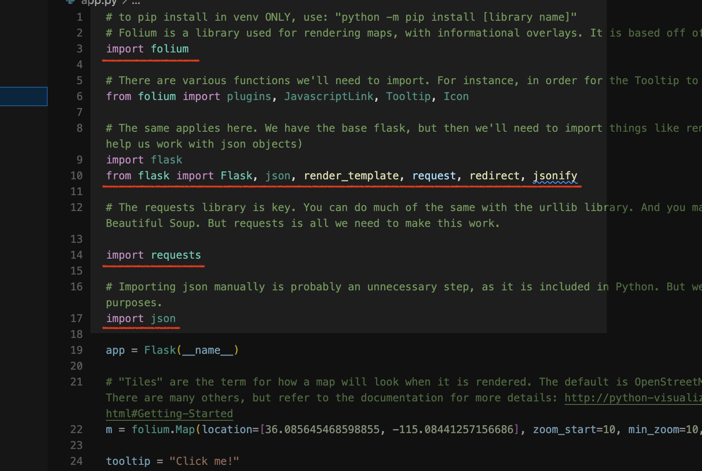

    We'll rely on:

      * **`Folium`**
      * **`Flask`**
      * **`jsonify`**
      * **`requests`**
      * **`json`**

2. You'll notice we have created an instance of the **`Flask`** class: **`app = Flask(__name__)`**.

   The argument **`(__name__)`** is sufficient for such a small-scale application.

   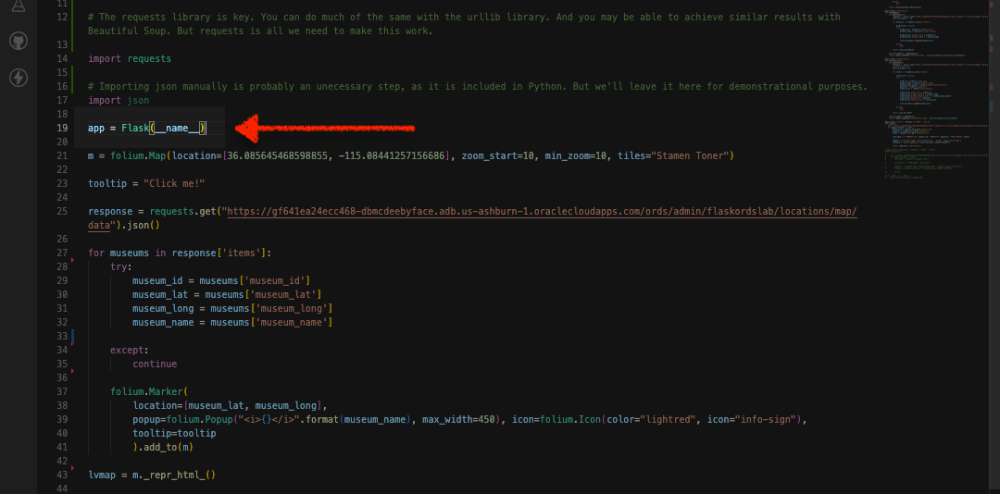

## Task 3: Review the Folium map

1. Next, you'll see the `Folium` section of the application.

   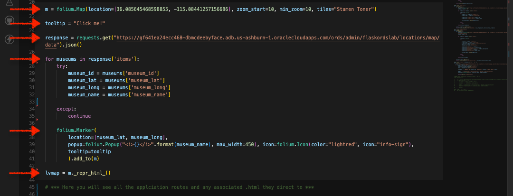
   <sup>*We've included starting coordinates (approximately the downtown Las Vegas, NV area), set minimum and maximum zoom properties, and set the visual presentation option (i.e., "Stamen Terrain").*</sup>

   In this section we:

    * set the initial base Folium map = `m`
    * include a tooltip (which you'll see later when we load the application)
    * use the "Requests" library along with our Oracle REST APIs to **`GET`** JSON from our Autonomous Database
  
       > ❓ Anything missing?

       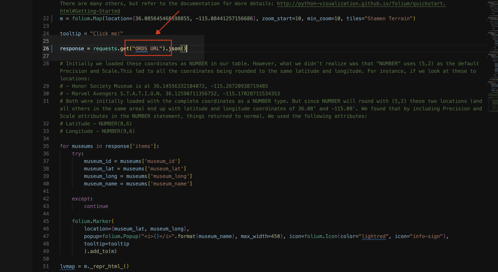

2. Replace **`[ORDS URI HERE]`** with the following:

    ```html
    <copy>https://yfuxkbz2ls7taze-ordshandsonlabs.adb.us-phoenix-1.oraclecloudapps.com/ords/python/flask/museums/
    </copy>
    ```  

   <details>
     <summary>**CLICK HERE TO REVEAL CODE BLOCK**</summary>

     ```python
     <copy>m = folium.Map(location=[36.085645468598855, -115.08441257156686], zoom_start=10, min_zoom=10, tiles="Stamen Terrain")

     tooltip = "Click me!"

     response = requests.get("https://yfuxkbz2ls7taze-ordshandsonlabs.adb.us-phoenix-1.oraclecloudapps.com/ords/python/flask/museums/").json()

     for museums in response['items']:
       try: 
         museum_id = museums['museum_id']
         museum_lat = museums['museum_lat']
         museum_long = museums['museum_long']
         museum_name = museums['museum_name']

     except: 
         continue

     folium.Marker(
         location=[museum_lat, museum_long],
         popup=folium.Popup("<i>{}</i>".format(museum_name), max_width=450), icon=folium.Icon(color="lightred", icon="info-sign"),
         tooltip=tooltip
         ).add_to(m)

     lvmap = m._repr_html_()</copy>
     ```

   </details>

3. With the endpoint restored, we can iterate on our table data to gather the necessary information for populating our Folium map.

    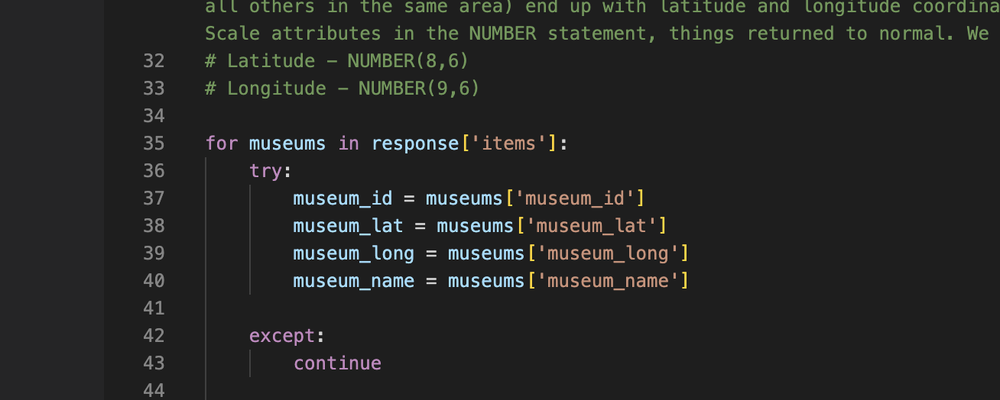
  
4. We'll then create individual markers for the museum locations we retrieved from our database.

   Here, we'll pass the latitude and longitude coordinates and informational pop-ups for all the locations.

   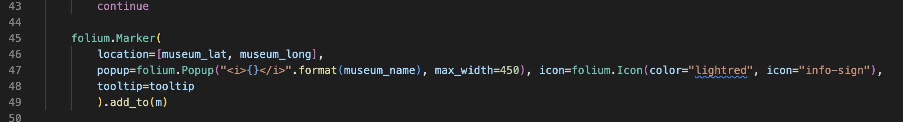
   <sup>*Notice how we include **`museum_name`** as HTML, icon color, and type, as well as a **`tooltip`.***</sup>

   > 💡 The tooltip generates a helpful bubble that reads *Click me!* when hovered over.

5. Finally, you'll see the line **`lvmap = m._repr_html_()`**:

   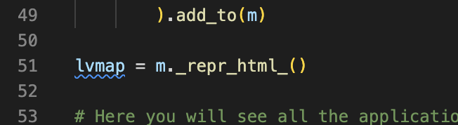
   <sup>*We include this to temporarily save our map as an HTML iframe (this consists of all necessary HTML and JavaScript properties).*</sup>

## Task 4: Review the Flask application routes

> 🧠 Application routes are triggered when actions are performed in the application. They can trigger a function, a new HTML page may load, or it may redirect the user to another page.
  
1. **`@app.route('/')`**

    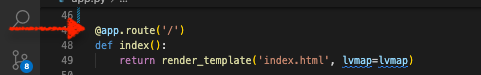

    This route contains the **`index()`** function. When a user navigates to the home page, they'll be presented with the **`index.html`** page. We also include,**`lvmap`**, the Folium map.

2. **`@app.route('/get_price')`**

    

    The function of the **`getPrice()`** route appends the letter **`a`** to an ORDS endpoint. To see this in action, take this ORDS URL and place it into your browser's address bar.

      ```html
      <copy>https://yfuxkbz2ls7taze-ordshandsonlabs.adb.us-phoenix-1.oraclecloudapps.com/ords/python/flask/products/pricing/</copy>
      ```

    > ❓ Press **`Enter`** on your keyboard, what do you see?

      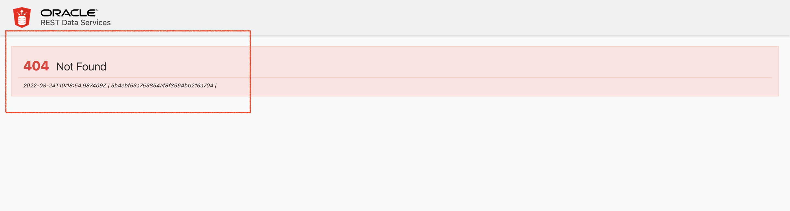

      This function needs a specific **`product_id`**. Recall from the previous Lab, this Path: **`/products/pricing/{product_id}`**.

     For this endpoint to work, include a 1, 2, or 3 after that final trailing backslash. Then press `Enter`:

     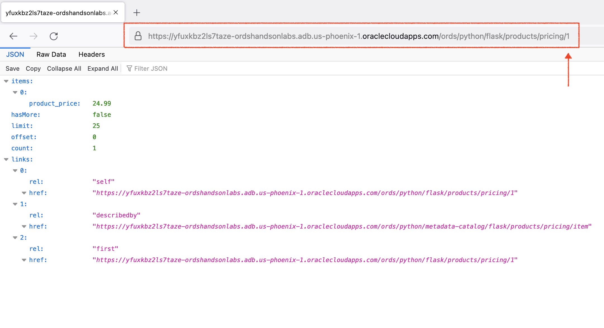

     At this stage, a user will have triggered the retrieval of product prices from a product table. This information is used as one of the fields in a drop-down menu (found on the **`orderform.html`** page).
  
     Before moving on, make sure your **`get_price`** function has the correct Path:

      ```html
      <copy>https://yfuxkbz2ls7taze-ordshandsonlabs.adb.us-phoenix-1.oraclecloudapps.com/ords/python/flask/products/pricing/</copy>
      ```

      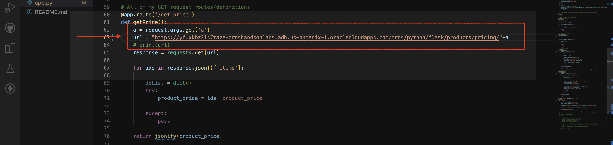

      <details>
        <summary>**CLICK HERE TO REVEAL CODE BLOCK**</summary>

      ```python
      <copy>@app.route('/get_price')
      def getPrice():
      a = request.args.get('a')
      url = "https://yfuxkbz2ls7taze-ordshandsonlabs.adb.us-phoenix-1.oraclecloudapps.com/ords/python/flask/products/pricing/"+a
      
      response = requests.get(url)
      
      for ids in response.json()['items']:
        
          idList = dict()
          try:
              product_price = ids['product_price']
              /      
          except:
              pass
              
      return jsonify(product_price)</copy>
      ```

      </details>
  
3. **`@app.route('/get_description')`**
  
   This function requests product description information using a similar syntax. We then **`return jsonify(product_description)`**, which takes the response (production description information) and converts it as we saw in the previous function.

    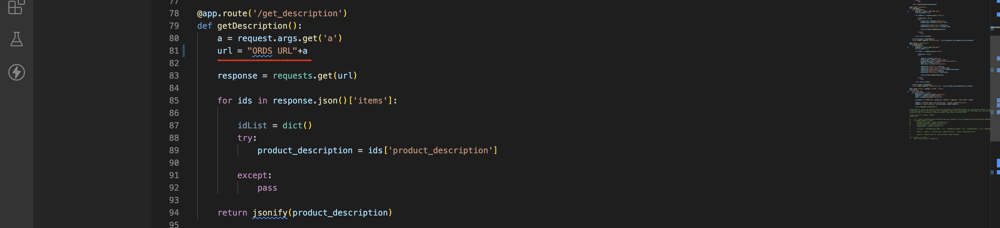
  
     Place this endpoint in the correct location:  

      ```html
      <copy>https://yfuxkbz2ls7taze-ordshandsonlabs.adb.us-phoenix-1.oraclecloudapps.com/ords/python/flask/products/descriptions/</copy>
      ```

      It should resemble this:

      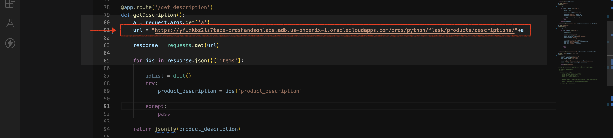

    <details>
      <summary>**CLICK HERE TO REVEAL CODE BLOCK**</summary>
  
      ```python
      <copy>@app.route('/get_description')
      def getDescription():
      a = request.args.get('a')
      url = "https://yfuxkbz2ls7taze-ordshandsonlabs.adb.us-phoenix-1.oraclecloudapps.com/ords/python/flask/products/descriptions/"+a
      response = requests.get(url)
      
      for ids in response.json()['items']:
        
          idList = dict()
          try:
              product_description = ids['product_description']
          
          except:
              pass
              
      return jsonify(product_description)</copy>
      ```

    </details>

4. **`@app.route('/orderform')`**
   We'll need to include another URI for this **`GET`** request to work.

    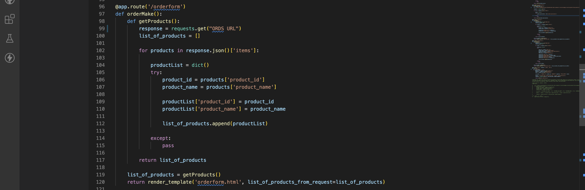
  
     Place this in the correct location:

      ```html
      <copy>https://yfuxkbz2ls7taze-ordshandsonlabs.adb.us-phoenix-1.oraclecloudapps.com/ords/python/flask/products/</copy>
      ```

     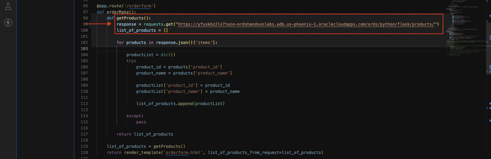

     Our application performs a more typical **`GET`** request using a separate ORDS endpoint. Here we return a list of products and redirect the user to an **`orderform.html`** page.

      <details>
      <summary>**CLICK HERE TO REVEAL CODE BLOCK**</summary>
          ```python
          <copy>@app.route('/orderform')
          def orderMake():
            def getProducts():
            response = requests.get("https://yfuxkbz2ls7taze-ordshandsonlabs.adb.us-phoenix-1.oraclecloudapps.com/ords/python/flask/products/")

            list_of_products = []
            
                for products in response.json()['items']:
                        
                  productList = dict()
                  try: 
                    product_id = products['product_id']
                    product_name = products['product_name'] 
                    
                    productList['product_id'] = product_id
                    productList['product_name'] = product_name
                          
                    list_of_products.append(productList)
                            
                  except:
                    pass
                    
                return list_of_products
                
            list_of_products = getProducts()
            return render_template('orderform.html',list_of_products_from_request=list_of_products)</copy>
            ```

   </details>

5. **`@app.route('/orderhistory')`**

    Performing a **`GET`** request to this endpoint will return all *previously* purchased items; displayed in table format.

    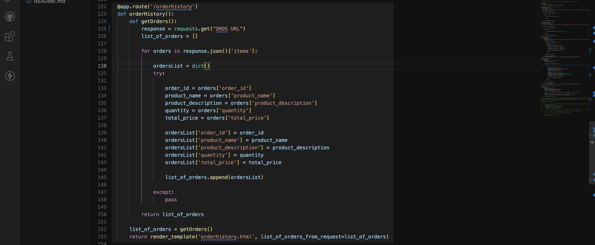

    Place this in the correct location:

     ```html
     <copy>https://yfuxkbz2ls7taze-ordshandsonlabs.adb.us-phoenix-1. oraclecloudapps.com/ords/python/flask/orders/</copy>
     ```

   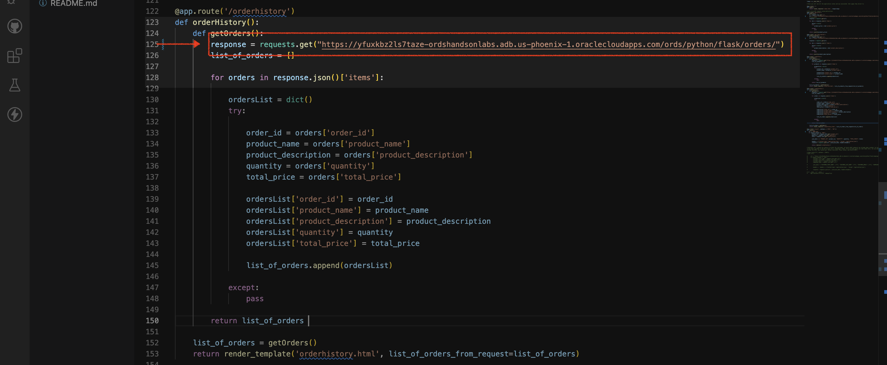

      <details>
        <summary>**CLICK HERE TO REVEAL CODE BLOCK**</summary>
          ```python
          <copy>@app.route('/orderhistory')
          def orderHistory():
              def getOrders():
                  response = requests.get("https://yfuxkbz2ls7taze-ordshandsonlabs.adb.us-phoenix-1.oraclecloudapps.com/ords/python/flask/orders/")
                  list_of_orders = []
                  
                  for orders in response.json()['items']:
                    
                      ordersList = dict()
                      try:
                        
                          order_id = orders['order_id']
                          product_name = orders['product_name']
                          product_description = orders['product_description']
                          quantity = orders['quantity']
                          total_price = orders['total_price']
                          
                          ordersList['order_id'] = order_id
                          ordersList['product_name'] = product_name
                          ordersList['product_description'] = product_description 
                          ordersList['quantity'] = quantity
                          ordersList['total_price'] = total_price
                          
                          list_of_orders.append(ordersList)
                          
                      except:
                          pass
                          
                  return list_of_orders
                  /
              list_of_orders = getOrders()
              return render_template('orderhistory.html', list_of_orders_from_request=list_of_orders)</copy>
            ```

    </details>

   > 🧠 *You've seen this app route in action in Lab 1 of this Workshop! Remember the **`orderform.html`** page?*

6. **`@app.route(/result', methods = ['POST', 'GET'])`**

    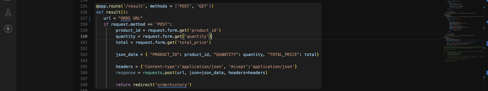

    Here we have the same ORDS endpoint as in the **`orderhistory`** app route. But instead of a **`GET`**, this is a **`POST`** request. Recall in Lab 1, when a user clicks `Complete my Purchase`,

      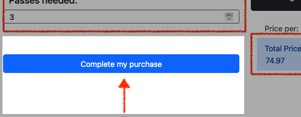

     And this route expects a **`POST`** request originating from the Flask application. Once this request posts successfully, the user is redirected to the **`orderhistory.html`** page (as you saw in the previous step). 

    > 🧠 *This function also performs actions such as establishing the **`{Key: Value}`** pairs of the incoming data and the JSON payload headers.*

    Update the function with the following ORDS URL:

    ```html
    <copy>https://yfuxkbz2ls7taze-ordshandsonlabs.adb.us-phoenix-1.oraclecloudapps.com/ords/python/flask/orders/</copy>
    ```
  
    Your final route should look like this:

    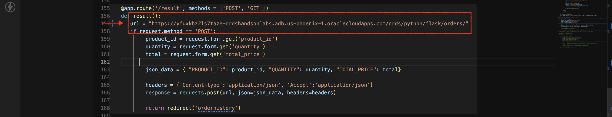

    <details>
      <summary>**CLICK HERE TO REVEAL CODE BLOCK**</summary>
      ```python
      <copy>@app.route('/result', methods = ['POST', 'GET'])
      def result():
        url = "https://yfuxkbz2ls7taze-ordshandsonlabs.adb.us-phoenix-1.oraclecloudapps.com/ords/python/flask/orders/"
        if request.method == 'POST':
              product_id = request.form.get('product_id')
              quantity = request.form.get('quantity')
              total = request.form.get('total_price')

              json_data = { "PRODUCT_ID": product_id, "QUANTITY": quantity,"TOTAL_PRICE": total}
              
              headers = {'Content-type':'application/json', 'Accept':'application/json'}
              response = requests.post(url, json=json_data, headers=headers)
              
              return redirect('orderhistory')</copy>
      ```
    </details>

7. At this stage, you should have updated all ORDS endpoints. Next, we'll briefly review the included HTML and CSS in this Flask application.

### You may now **proceed to the next Lab.**

## Learn More

* [A minimal application in Flask](https://flask.palletsprojects.com/en/2.2.x/quickstart/)
* [About the Flask "Application Object"](https://flask.palletsprojects.com/en/2.2.x/api/)

## Acknowledgements

* **Author** - Chris Hoina, Senior Product Manager, Database Tools

* **Contributors**

  * Jeff Smith, Distinguished Product Manager, Database Tools
  * Justin Biard, Senior Member of Technical Staff, Database Tools
  * Zachary Talke,Senior Product Manager, Database Tools

* **Last Updated By/Date** - Chris Hoina/February 2024
