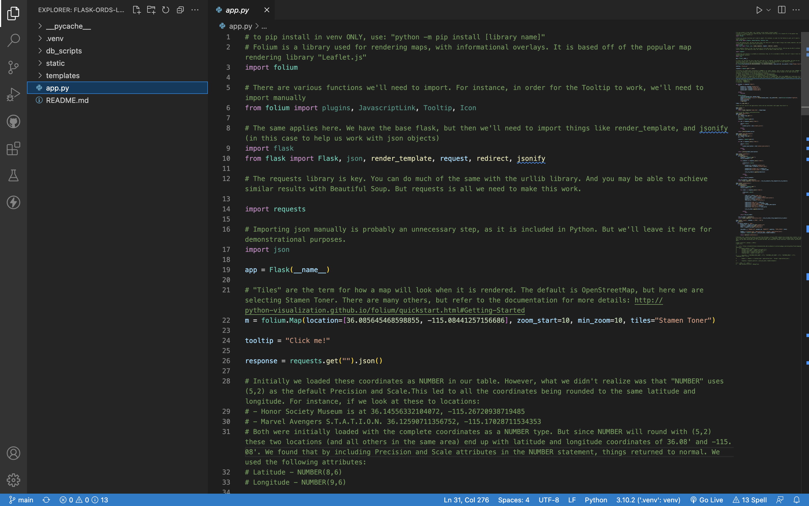
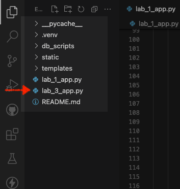
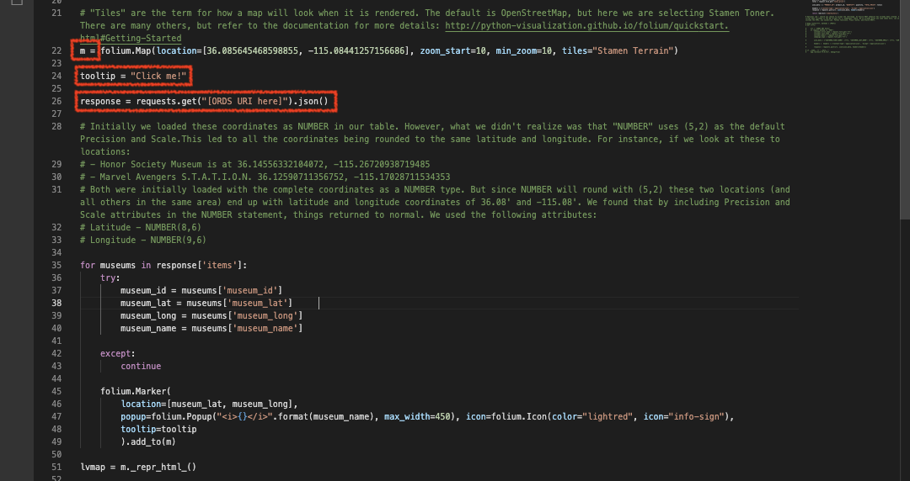
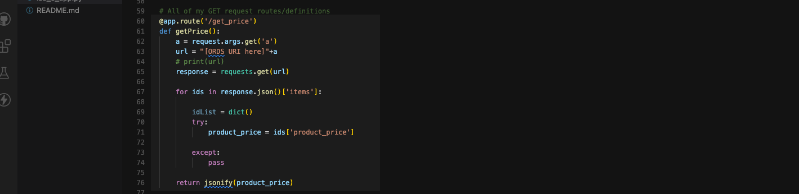

# Review the application and routes

## Introduction

In the previous Lab you explored Oracle REST APIs in a Swagger Editor session. By now you should have a better understanding of what these Oracle REST APIs are capable of. 

Next, we'll add Oracle REST APIs to our Flask application's Python file. And briefly discuss the Flask application's routes and their functions.

Estimated Time: 20 minutes

### Objectives

In this lab, you will:
* Add Oracle REST APIs to our Flask application
* Review the provided Python application 

### Prerequisites
This lab assumes you have:
* All previous labs successfully completed

## Task 1: Locate and open the Python file for Flask application

1. Locate your local copy of the `flask-ords-lab` folder and open it in your text editor. 

    > :pirate_flag: The examples in this Lab will use Visual Studio Code.

    

2. Navigate to, and open the `lab_3_app.py` file in your editor. 

     

## Task 2: Review the Python application and functions

1. Note the libraries included in this application. 

     

  - You may have used these before. Notable inclusions are:
    - `Folium`
     - `Flask`
        - `jsonify`
     - `requests`
     - `json`

2. **Python application overview**. Beginning with the first line in our code you'll see we have created an instance of the `Flask` class: ```app = Flask(__name__)```. You may be familiar with this.

  Here the argument `(__name__)` is sufficient for such a small scale application. You may review the selected documentation on this subject in the "Learn More" section of this lab. 

    

## Task 3: Review the Folium map 

1. **Review the Folium content**. Here you'll see the Folium section of the application. 

    

    1. We set the initial, base Folium map = `m`
        - We've also included starting coordinates (approximately the downtown Las Vegas, NV area), set minimum and maximum zoom properties, and set the visual presentation option (i.e. "Stamen Terrain").
    2. We include a tooltip (which you'll see later when we load the application).
    3. Next we rely on the "Requests" library to `GET` json from our Autonomous Database, via ORDS APIs.

      > :question: <i>But do you notice anything missing?</i> 

       

    4. If you guessed an Oracle REST endpoint, you'd be correct. Replace the `ORDS URL` with the following one: 
        ```
        <copy>https://yfuxkbz2ls7taze-ordshandsonlabs.adb.us-phoenix-1.oraclecloudapps.com/ords/python/flask/museums/
        </copy>
        ```  
         - *Now* that we've restored the endpoint, we can iterate on our table data to gather the necessary information for populating our Folium map.

         
    5. We'll then create individual markers for the museum locations we retrieved from our database:
        1. Here we'll pass the latitude and longitude coordinates
        2. We'll then include information pop-ups for all the museums
        3. Notice how we include the `museum_name` as HTML, the icon color and type, along with a `tooltip`:

          

        > :bulb: The tooltip generates a helpful bubble when hovered over that reads "Click me!"; you'll see it soon enough.

    6. Finally you'll see the line `lvmap = m._repr_html_()`:

       
       
       - We include this to temporarily save our map as a HTML iframe (this includes all necessary HTML and JavaScript properties), which we'll later use as an argument in our application's index page (in Flask).

## Task 4: Review the Flask application routes

   :brain: <i>A Routes Primer</i>: Application routes (aka `app.route()`) are triggered when actions are performed in the application. The results of a function may be passed back to the user, a new HTML page may load, or may redirect the user to a new page. 
  
1. `@app.route('/')`
        
    

    This route contains the `index()` function. When a user navigates to the home page they'll be presented with the `index.html` page. We are also including our newly constructed Folium map, `lvmap` as an argument. 
    
    In the next Lab we'll review the HTML pages so you can view all functions and their output in context.

2. `@app.route('/get_price')`

    

    The function of the `getPrice()` route appends `a` to an ORDS endpoint. To see this in action take this ORDS URL: <copy>https://yfuxkbz2ls7taze-ordshandsonlabs.adb.us-phoenix-1.oraclecloudapps.com/ords/python/flask/products/pricing/</copy> and place it into your browser's address bar. 
  
    > :question: *Click **Enter**, what do you see?*

    You should see something like this:
        
    

    And that's because our function expects to see a specific `product_id`. Remember from the last Lab, this Path is: `/products/pricing{product_id}`. For things to work, we'll need to include a `product_id`. 
    
    Include either a 1, 2, or 3 after that final trailing backslash, and hit enter. *Like this*: 
 
    

    Now you should have a better idea of how this, and other functions will work "under the covers". 
    
    At this stage, a user will have triggered the retrieval of product prices from a product table. This information is used as one of the fields in a drop-down menu (found on the `orderform.html` page). 
    
    Make sure your `get_price` function is correct using this: 
      ```
      <copy>https://yfuxkbz2ls7taze-ordshandsonlabs.adb.us-phoenix-1.oraclecloudapps.com/ords/python/flask/products/pricing/</copy>
      ``` 

      It should resemble this: 

      
    
3. `@app.route('/get_description')`
  
  Much like the `get_price` app route, this function requests product description information from our database using a similar syntax as before. We then `return jsonify(product_description)` which takes the response and converts it like you may have noticed in the previous function.

    
  
    Take this and place it in the correct location so our function works:  
      ```
      <copy>https://yfuxkbz2ls7taze-ordshandsonlabs.adb.us-phoenix-1.oraclecloudapps.com/ords/python/flask/products/descriptions/</copy>
      ```
    It should resemble this: 

    

4. `@app.route('/orderform')`

  You should see something like this:

    

  We'll need to include another URI for our `GET` request to work. Copy/paste this in the correct location:
    ```
    <copy>https://yfuxkbz2ls7taze-ordshandsonlabs.adb.us-phoenix-1.oraclecloudapps.com/ords/python/flask/products/</copy>
    ``` 

    
    
  Using a separate ORDS endpoint, our application performs a more typical `GET` request. Here we return a list of products, and redirect the user to an `orderform.html` page. 

5. `@app.route('/orderhistory')`

  

  Performing a `GET` request to this endpoint will return all *previously* purchased items; displayed in a table for the user. 

  Use the following to complete this function: 
    ```
    <copy>https://yfuxkbz2ls7taze-ordshandsonlabs.adb.us-phoenix-1.oraclecloudapps.com/ords/python/flask/orders/</copy>
    ```

      

    > :brain: <i>You've actually seen this app route in action in Lab 1 of this Workshop! Remember the `orderform.html` page?</i>

6. `@app.route(/result', methods = ['POST', 'GET'])`

    

    - Here we have the same ORDS endpoint as in the `orderhistory` app route. But instead of a `GET` we are working with a `POST` request. If you remember back to Lab 1, a user will click:

      

    - And this route expects a `POST` request originating from the Flask application. Once this request posts successfully the user is redirected to the `orderhistory.html` page (as you saw in the previous step). 
    
       > :brain: <i>This function also performs actions such as establishing the key:value pairs of the incoming data, and the JSON payload headers well.</i>

    - Update the function with the following ORDS URL: 
      ```
      <copy>https://yfuxkbz2ls7taze-ordshandsonlabs.adb.us-phoenix-1.oraclecloudapps.com/ords/python/flask/orders/</copy>
      ```
    - Your final route should look like this: 

      

7. At this stage you should have all ORDS endpoints in the proper places. All application routes and their underlying functions should work correctly. Next, we'll briefly review the included HTML and CSS in this Flask application. Congratulations!
    
### You may now proceed to the [next Lab](#next).

## Learn More
* [A minimal application in Flask](https://flask.palletsprojects.com/en/2.1.x/quickstart/#a-minimal-application)
* [About the Flask "Application Object"](https://flask.palletsprojects.com/en/2.1.x/api/#application-object)

## Acknowledgements
* **Author** - Chris Hoina, Senior Product Manager, Database Tools
* **Contributors**
  - Jeff Smith, Distuinguished Product Manager, Database Tools
  - Justin Biard, Senior Member of Technical Staff, Database Tools 
  - Zachary Talke, Product Manager, Database Tools
  - Brian Spendolini, Principal Product Manager
* **Last Updated By/Date** - Chris Hoina, August 2022
