# Lab 4: A Bootstrap and JavaScript primer

## Introduction

Back in Lab 1, we walked through the Flask application as a user. You were first introduced to the HTML of this Flask application. 

In this Lab, we'll review the HTML pages, the Bootstrap framework, and the JavaScript functions used in this Flask application. 

Estimated Time: 10 minutes

Watch the video below for a quick walk-through of the lab.
[A Bootstrap and JavaScript primer](videohub:1_35mhjhhg)

### Objectives
In this Lab, you will review:
* HTML templates
* CSS
* JavaScript functions

### Prerequisites
This Lab assumes you have:
* All previous labs successfully completed

## Task 1: Locate the templates folder

1. With Visual Studio Code open, locate your **`templates`** folder:

   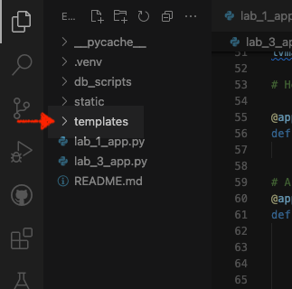

2. Expand the **`templates`** folder: 

   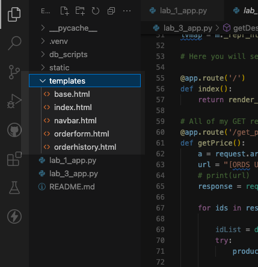

  The **`templates`** folder is quite simple. Here you'll find all HTML pages used in the Flask application: 
    * **`base.html`**
    * **`index.html`**
    * **`navbar.html`**
    * **`orderform.html`** 
    * **`orderhistory.html`**

  Next, we'll review the HTML pages in more detail.

## Task 2: Review the HTML pages

1. **`base.html`**

    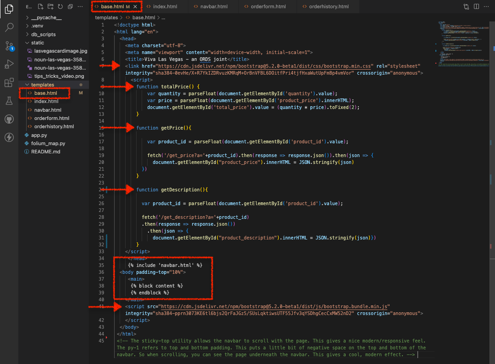

    The **`base`** HTML page is quite literally the base, the foundation of this application. You'll notice we include an API for Bootstrap's CSS framework. At the bottom of this page, you'll see we also have the API for JavaScript. This allows us to easily extend the Bootstrap framework - which will enable us to rely on Bootstrap for much of the presentation layer of this application. If not, all HTML and CSS must be coded from scratch. 

    You'll also notice three JavaScript functions:  
    * **`totalPrice()`**
    * **`getPrice()`**
    * **`getDescription()`** 
    
    These functions are triggered when a user visits and/or interacts with the **`orderform.html`** page. We'll discuss in more detail the output of each function shortly. 

    You may also notice Jinja templating near the **`</head>`**, and **`<main>`** HTML tags. The different variations (which you'll see throughout) are referred to as "delimiters":
    <!--  -->
    * **``** - used for statements
    * **`{{ ... }}`** - used for expressions
    * **`{# ... #}`** - used for comments
    
    Each serves different purposes, but all allow us to efficiently and dynamically pass in additional information while using syntax similar to python. While Jinja education is outside the scope of this Lab, you may review the **Learn More** section of this Lab to study the Jinja documentation.

    We will rely on this **`base.html`** page across the application. We will also need the navigation bar across all pages; thus, we include it so it will render on all pages (i.e., the **``** placeholder).

    When we include an HTML page inside another, it will *always* render with the page. A parent-child relationship is established among **`base.html`** (parent) and **`navbar.html`** (child). Later, we'll discuss the **`navbar.html`** page in more detail.

    We take a similar approach with the following placeholders:

    **` `**

    Now, anywhere else in our HTML where we specify  "block content," it will render in the corresponding body section of the **`base.html`**. 
    
    > 💡 *Other pages will "extend" the **`base.html`** file, ensuring each page includes the properties of the **`base.html`** page (like our JavaScript functions and Bootstrap's HTML and CSS). But to the user, they will still remain on the page of focus, as we'll see on the **`index.html`** page.*

2. **`navbar.html`** 

    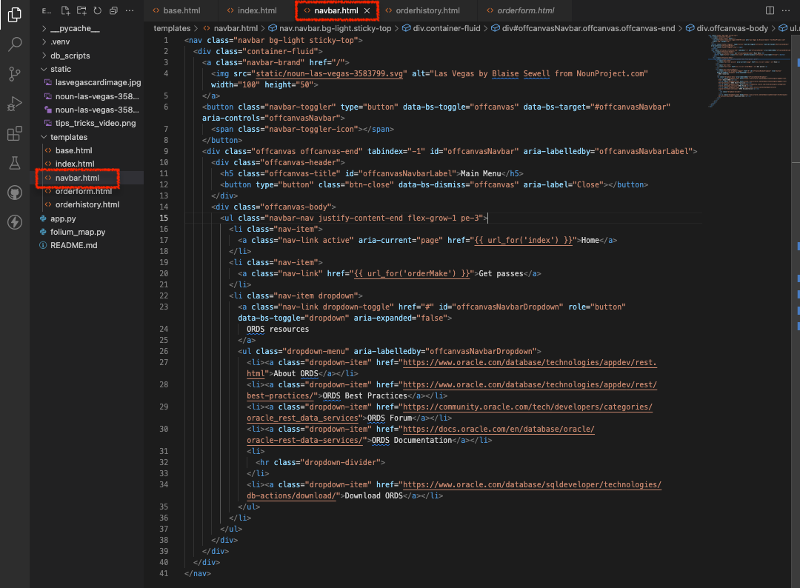

    Before we review the **`index.html`** page, we'll briefly check the **`navbar.html`** page.  Rather than having to create this navbar from scratch, we borrow extensively from the Bootstrap framework. In fact, much of this navbar remains unchanged from the original Bootstrap example (except for the links we've provided and minor design adjustments). 
    
    > ❓ *Look familiar?*
    
       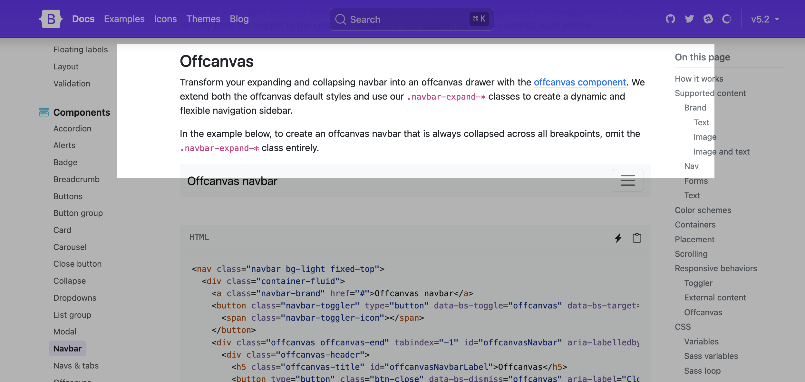

3. **`index.html`** 

    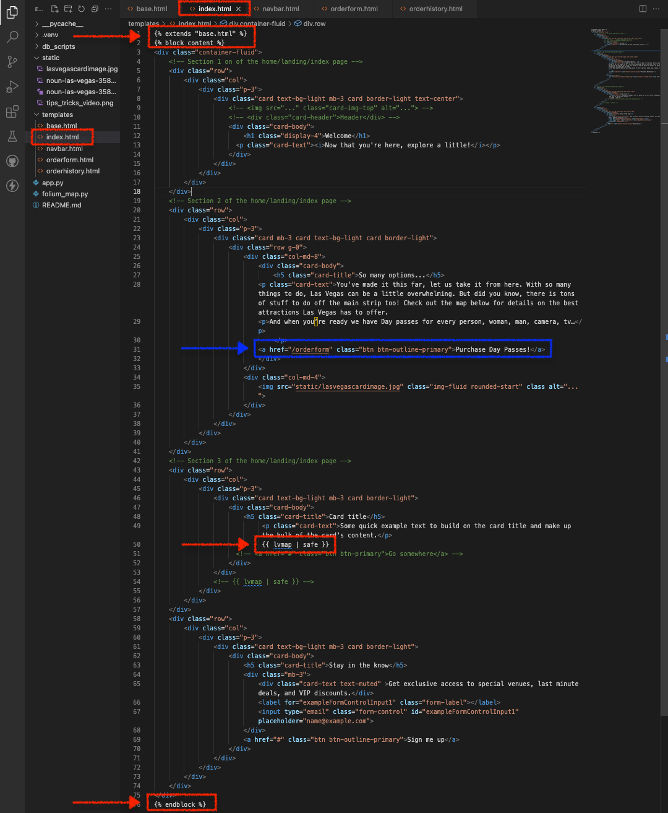

    The "landing page" for the user. When the user is first welcomed, they'll find a section related to the product/service. 
    
    > 💡 *Notice the Jinja here as well.*
  
    Recall how "block content" works with the **`base.html`** page. The HTML on this **`index.html`** page will "extend" the **`base`** page (i.e. **``**), while still displaying the **`index.html`** page. 
    
    And since the **`navbar`** is included in the **`base`** page, it will also display here.

    Further down, you will see **`{{ lvmap | safe }}`**. This allows us to pass in the Folium map (created in our **`app.py`** file - you saw this in Labs 2 and 3). We use the "safe" filter to indicate that this should *not* be escaped, should there be a case where automatic escaping is enabled. Otherwise, we run the risk of our map not rendering. 

    Finally, you'll see a button (surrounded by the blue box), which, when clicked, will take the user to the **`orderform.html`** page.

    <!--  -->

4. **`orderform.html`**

    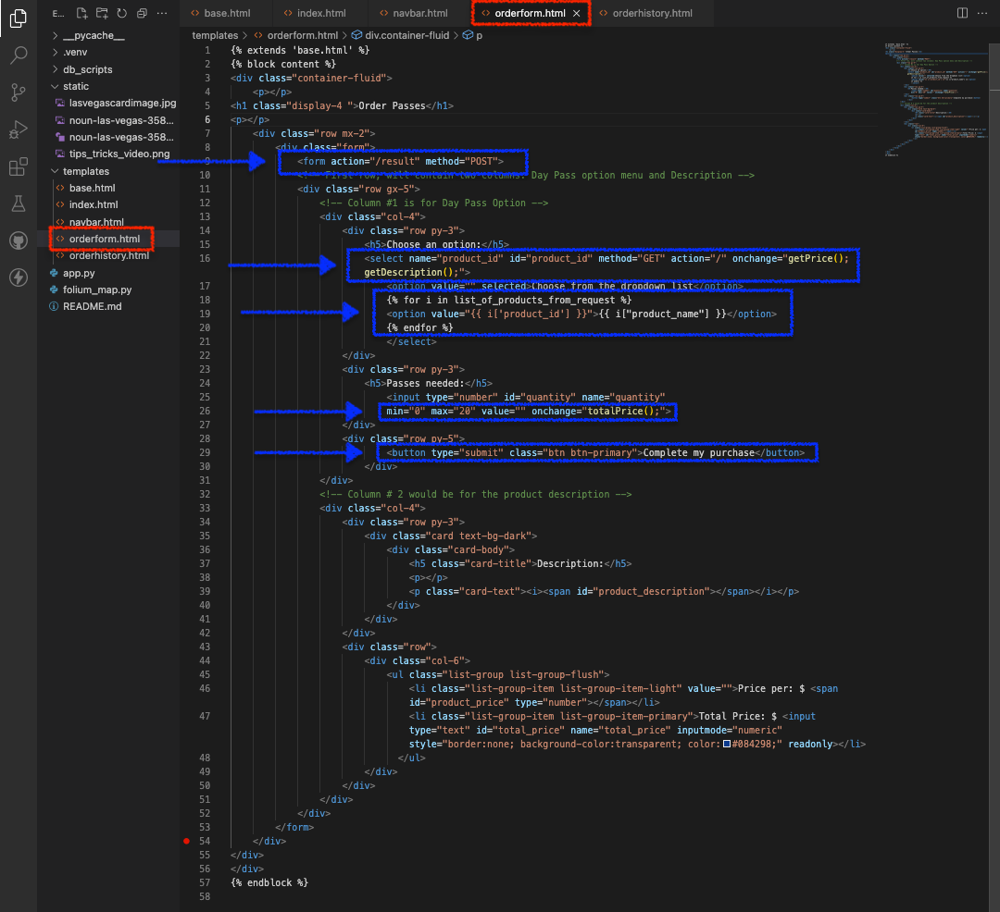

    If you recall, the index page (after clicking the "Purchase Day Passes" button) takes the user to this order form page. Here we see that `base.html` page is extended, and we see similar Jinja formatting. We also see several new additions to this HTML page.

## Task 3: Review ordering actions

1. You will notice that once the form is submitted, **`@app.route('result')`** is triggered.

  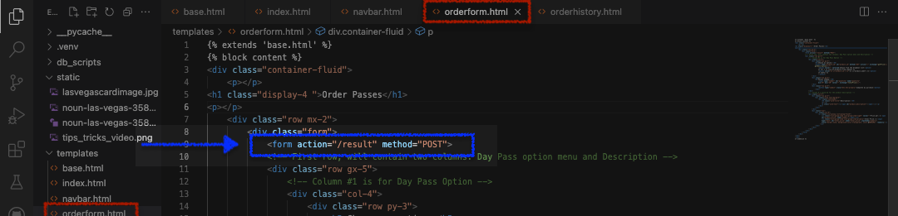

  Recall on the **`app.py`** file that this route accepts both **`POST`** and **`GET`** methods (aka "requests"). The function included in **`@app.route('result')`**, has an ORDS endpoint, which expects a JSON payload. After receiving this **`POST`** request, the related table will be updated to include a customer's order information.

2. The **`method="GET"`** and **`action="/"`** code performs a **`GET`** request and returns the results to this page when a change in the product dropdown list is detected. 

   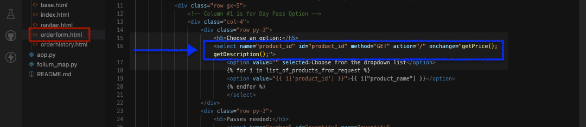
    
3. The two JavaScript functions **`getPrice()`** and **`getDescription`** can be found on the **`base.html`** file. But if you recall, each of these functions is associated with two separate Python functions in the **`app.py`** file. As a user selects a product, one function will retrieve the product's unit price, and the other will retrieve the product description.
    
   The results of each are placed in the HTML document according to their Element IDs: **`id="product_description"`** and **`id="product_price"`**. We use **`<span></span>`** to include the contents of these **`GET`** requests directly into the body of the HTML.

3. Here, you'll see a list we populated from the results of a **`GET`** request in our **`@app.route('/orderform')`** route.  

  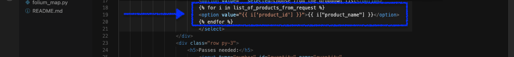

  We pass and iterate through the list to populate the contents of this dropdown field. And as different products are selected, this triggers the **`onchange=""`** event in the previous sequence. 

4. Yet again, see a JavaScript function. Although this time, no API requests are required. 

   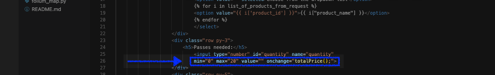

   This function calculates the total cost of the purchase based on the quantity and product type selected.

5. If you recall, the submit button acts as the **`form action`** we highlighted in the first sequence of this HTML page.  

   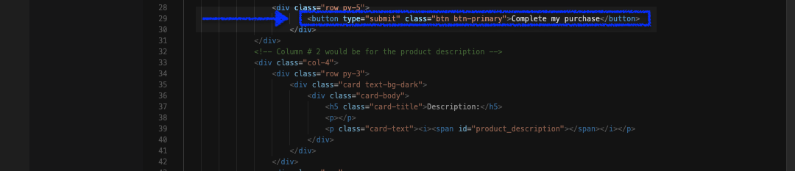

   Once a user submits their purchase, all information is sent as a JSON payload to an "Order History" table in our Oracle Autonomous Database.
  
   You learned how this was accomplished with our ORDS endpoints in the previous Lab.

5. Once a purchase is made, a user will be directed to a page containing their order history (contents can be seen in the blue box). 

   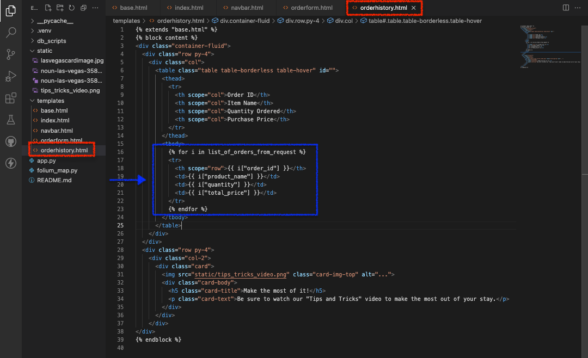

   Of course, in an actual web application, there will be a payment gateway step; this is outside the scope of this workshop. However, should you wish to learn more, Stripe has extensive documentation on how this can be achieved in a Flask application. Refer to the "Learn More" section of this Lab for details. 

  > 💡 *Note: Since you're sharing these endpoints, you may see orders from participants; that is to be expected.*

## Task 4: Restart Flask 

1. The final step is to restart Flask and let you expand on the existing application. 

2. Navigate to your recently updated **`lab_3_app.py`** file. You may choose to name it something unique or simply **`app.py`**

3. Use the original Flask start commands for starting the Flask application:

    1. Activate your Virtual Environment (if not automatically recognized by the VS Code Python Interpreter):

        * macOS/Linux
        ```python 
        <copy>. venv/bin/activate</copy>
        ```
        * Windows
        ```shell 
        <copy>venv\Scripts\activate</copy>
        ```
        
    2. Next, enter your Flask commands(*Mac OS/Linux users*):
        1. Set to *development*:
        ```
        <copy>export FLASK_ENV=development</copy>
        ```
        2. Point to the application:
        ```
        <copy>export FLASK_APP=[your app name].py</copy>
        ```
        3. Start Flask:
        ```
        <copy>flask run</copy>
        ```

             > 🚨 *Recall, for **PC/Windows users**, starting Flask is straightforward. After you've activated your Virtual Environment, you may need to pip install `Flask` and `Folium`. Once complete, you may use the following command to start Flask:* 
    
            ```
            <copy>flask --app lab_1_app.py run</copy>
            ```

      3. Go forth and create!

4. Congratulations! You should thoroughly understand how HTML presents the underlying logic to an actual user. And you should have your own *personalized* version of the Flask application.

5. In the next section, we'll introduce concepts surrounding security and authentication for Oracle REST APIs.

### You may now **proceed to the next Lab.**

## Learn More

* [Flask and Stripe](https://stripe.com/docs/legacy-checkout/flask)
* [About Bootstrap](https://getbootstrap.com/docs/5.2/getting-started/introduction/)
* [Mozilla Developer Network (MDN) Web Docs](https://developer.mozilla.org/en-US/)

## Acknowledgements

* **Author** - Chris Hoina, Senior Product Manager, Database Tools

* **Contributors**

  * Jeff Smith, Distinguished Product Manager, Database Tools
  * Justin Biard, Senior Member of Technical Staff, Database Tools
  * Zachary Talke, Product Manager, Database Tools
  * Brian Spendolini, Contributor

* **Last Updated By/Date** - Chris Hoina/March 2023