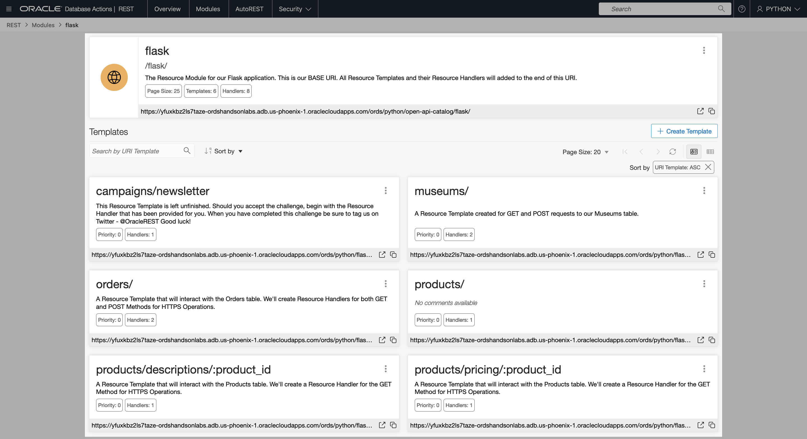
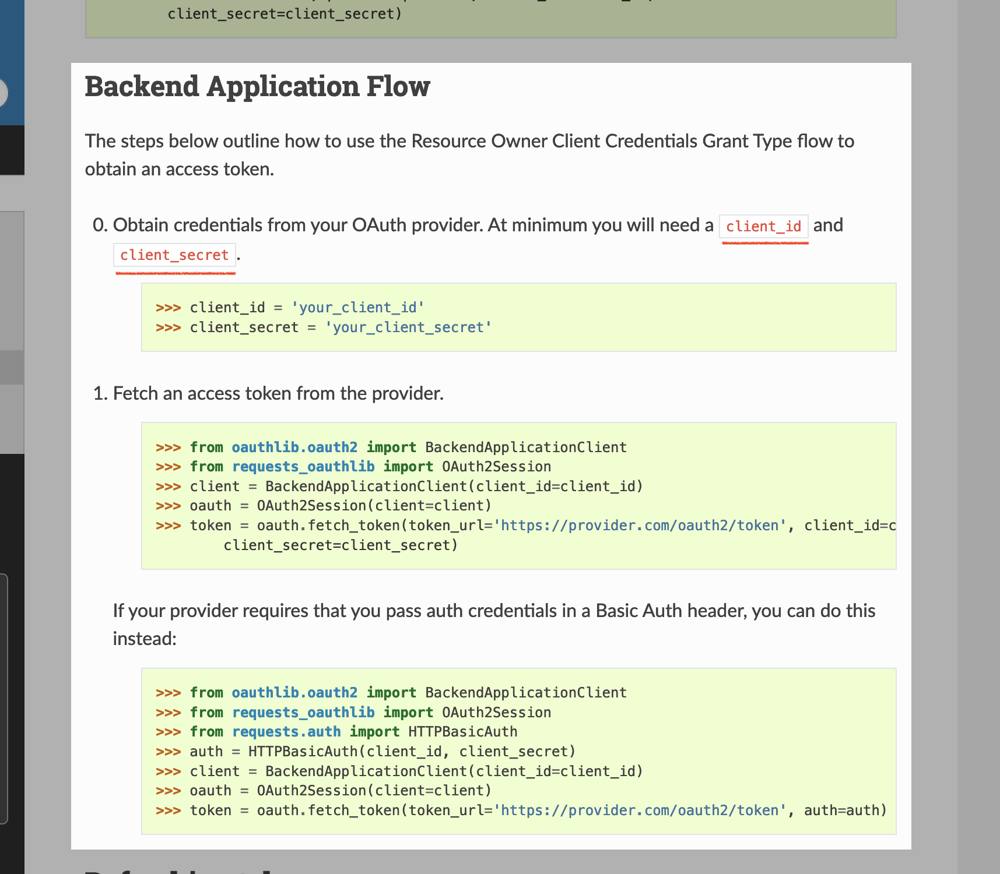

# A word on security

## Introduction

You may have noticed that our Oracle REST APIs did not require authentication (in the form of a Bearer Token) throughout these Labs. We have deliberately disabled security since testing and interacting with API endpoints can be more manageable.

However, best practices for applications such as our example Flask application would require users to authenticate before accessing services.

## Task 1: Understanding Privileges

1. Controlling access to protected resources is done by defining privileges. Privileges restrict access to only users with at least one set of specified roles.

   * A Privilege is then associated with one or more Resource Modules (such as our `flask` Resource Module):

     

   * But before those Resource Modules can be accessed, the user must be authenticated and then authorized to ensure that the user has one of the required roles. Here is an example cURL command that includes a Bearer Token for authentication: 

     

## Task 2: Learn about securing Oracle REST APIs 

1. The importance of security cannot be understated. While not required to complete this Workshop, we encourage you to review our **How to build powerful, secure REST APIs for your Oracle Database** Workshop. There you will learn about security principles related to Oracle REST APIs:

    * OAuth 2.0 workflow for authorization
    * Roles and Privileges

2. Once you've completed the Workshop, we encourage you to return to this Flask application and secure your Oracle REST APIs with the correct workflow:

   

     > 🧠 You can modify API requests slightly so they complement the sample Flask application by ensuring services are performed *securely*.

3. You may visit the Modern Application Development with Oracle REST Data Services Workshop [here](https://apexapps.oracle.com/pls/apex/dbpm/r/livelabs/view-workshop?wid=815). Or, in the **Other LiveLabs you might like** section of this Workshop. There you will complete objectives such as:
    * Create an Autonomous Database
    * Connect to your Autonomous Database using Database Actions/SQL Developer Web
    * Create and Auto-REST enable a table
    * Load data into the database
    * Publish RESTful services for various database objects
    * Secure the REST endpoints

4. Congratulations, you've made it to the end of this Workshop! By now you should have a thorough understanding of this sample Flask application. And you should also be familiar with Oracle REST APIs and their various capabilities and characteristics. 
   
    * You are encouraged to take the provided database scripts, Flask and Python files, and make this application your own. How can you manipulate the Oracle REST APIs to put your own personal spin on the application? 

### You may now **proceed to the next lab.**

## Learn More
* [OAuth 2.0 workflows in Python's requests-oauthlib](https://requests-oauthlib.readthedocs.io/en/latest/oauth2_workflow.html#)
* [Protecting ORDS Resources](https://docs.oracle.com/en/database/oracle/oracle-rest-data-services/22.2/qsord/get-started-with-oracle-rest-data-services.html#GUID-F6961F9D-C0FA-4ED4-AA88-88FDDF208D83)
* [OAuth 2.0 sessions with Python's Authlib](https://docs.authlib.org/en/latest/client/oauth2.html) 
* [Python & REST APIs: Testing my Oracle Autonomous Database](https://www.thatjeffsmith.com/archive/2022/09/python-rest-apis-testing-my-oracle-autonomous-database/)

## Acknowledgements

* **Author** - Chris Hoina, Senior Product Manager, Database Tools

* **Contributors**
  * Jeff Smith, Distinguished Product Manager, Database Tools
  * Zachary Talke, Product Manager, Database Tools
  * Brian Spendolini, Contributor
  
* **Last Updated By/Date** - Chris Hoina/March 2023
