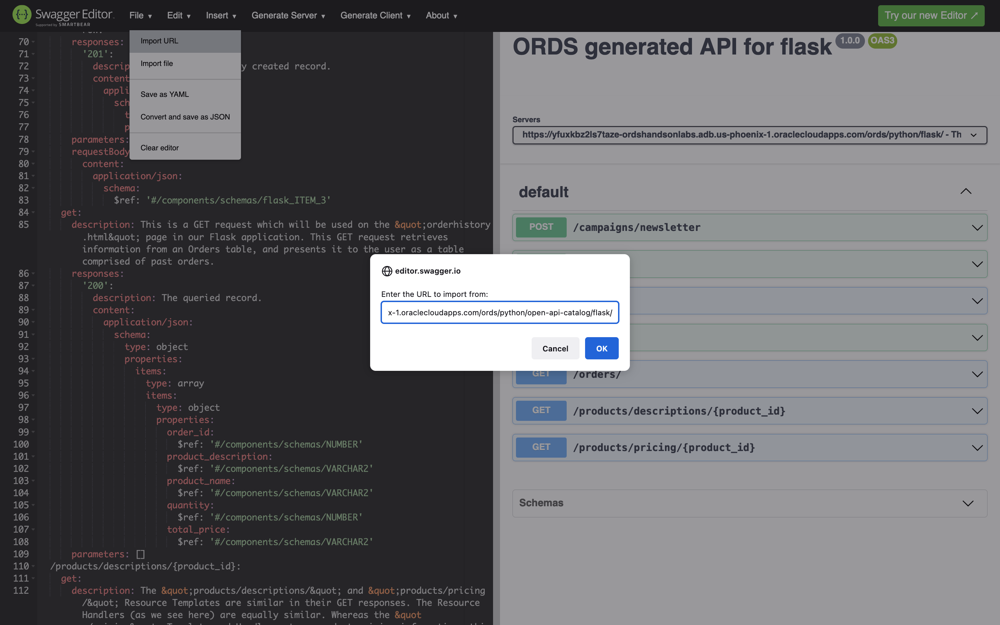
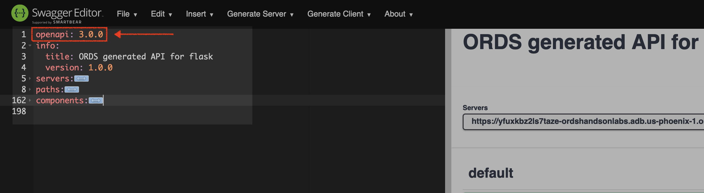
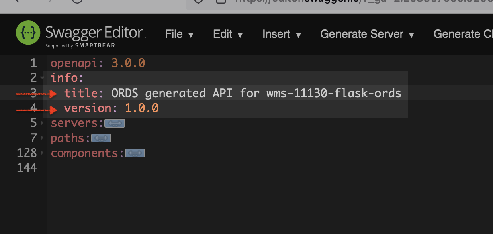
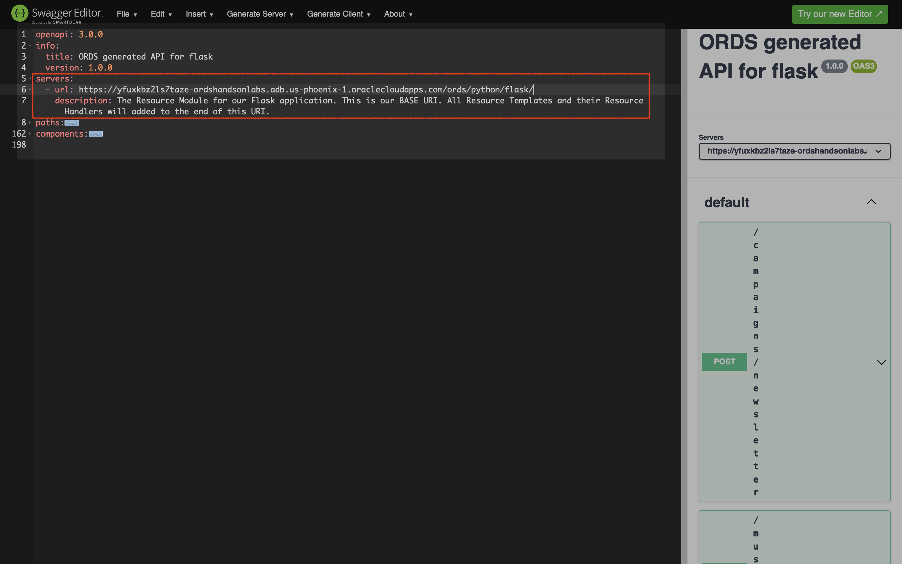
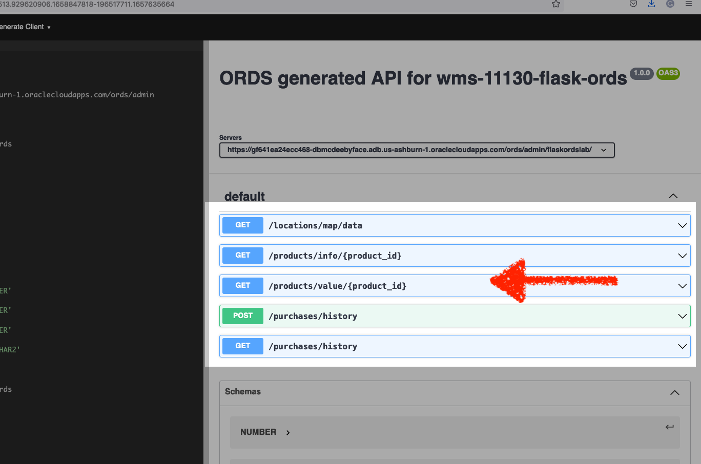
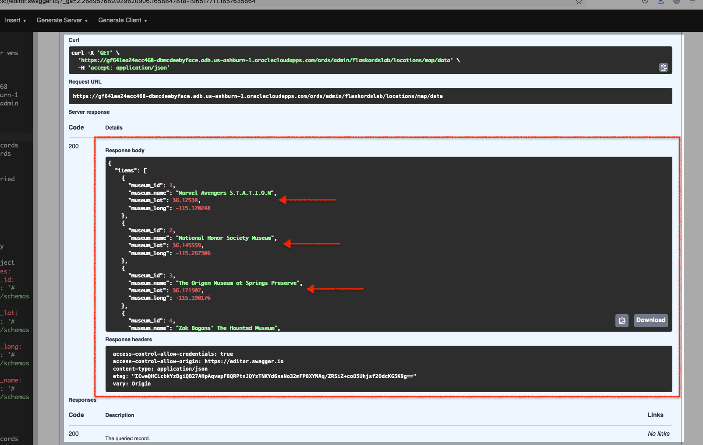
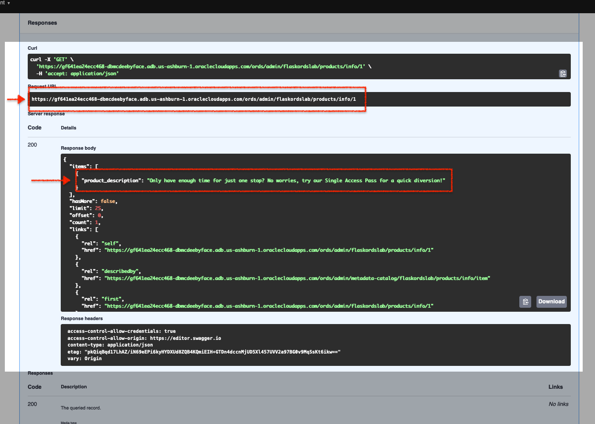
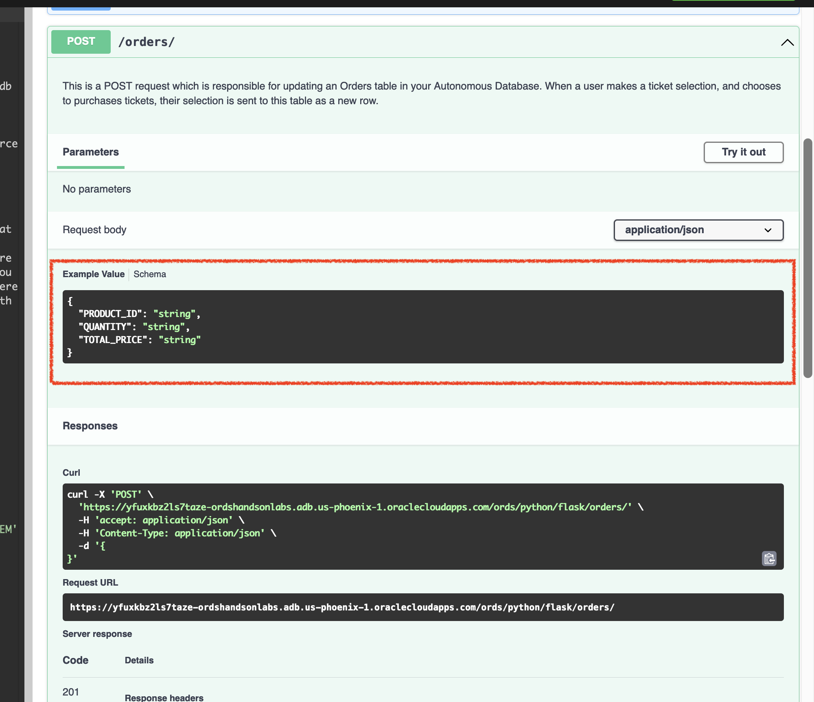

# Lab 2: Oracle REST API <i>deeper</i> dive

## Introduction

In the previous Lab you were first introduced to our sample Flask application, and its basic functions. You also learned, <i>superficially</i> about some of the capabilities of Oracle REST APIs. 

As a developer, you may have some experience with APIs and API development. You may have even tested APIs in tools like Postman, or in a Swagger editor of your choice. Well in this Lab we will continue our exploration of Oracle REST APIs, using the browser-based OpenAPI Swagger editor. 

Estimated Time: 20 minutes

### Objectives

In this lab, you will:
- Inspect and interact with the provided Oracle REST APIs
- Review the available Paths and HTTPS Operations
- Review OpenAPI documentation 

### Prerequisites

This Lab assumes you have:
- All previous Labs successfully completed

## Task 1: Navigate to the Swagger Editor

For this lab we'll rely on Swagger's Open Source Editor to review our ORDS Base URI, as well as the available API <i>Paths</i> and <i>Operations</i>.

:bulb: <i>You may skip straight to the [Swagger Editor](https://editor.swagger.io/), or follow along below.</i>

1. Navigate to the [Swagger home page](https://swagger.io/) and select the Swagger editor link (located under the <b>Tools</b> dropdown):

    

2. Next, select "Live Demo"; a blank Swagger Editor session should load.

    

3. If a new Editor session page does not appear, navigate to the `File` menu option, and select `Clear Editor`. A new blank session should then appear.

    

4. Next, navigate to `File` then `Import URL`.

    Copy the following ORDS Base URI:

    ```
    <copy>https://yfuxkbz2ls7taze-ordshandsonlabs.adb.us-phoenix-1.oraclecloudapps.com/ords/python/open-api-catalog/flask/</copy>
    ```

    

    Paste it into the input field, click `OK`.

    

5. Locate the Swagger documentation - available Paths and their Operations.

    Once loaded, Swagger documentation will appear on the left along with a list of the available ORDS Paths and their Operations on the right of your screen. These Paths and Operations are all you will need for our Flask application to work properly.

      

## Task 2: Review the OpenAPI 3.0 definitions

1. Begin by collapsing the Swagger documentation tree:

    

2. We'll briefly review the tree, before reviewing the ORDS Paths and their Operations.

    - `openapi` - this particular ORDS API adheres to the OpenAPI 3.0 specification for API documentation. To learn more about OpenAPI specifications, you may refer to the resources provided in the "Learn More" section of this lab.

      

    - `info` - here you can see the `title` and `version` of the ORDS API <i>Base URI</i>.

      

    - `servers` - this is the actual Base URI for this ORDS API. All Paths and parameters will be added to this existing <b>U</b>niversal <b>R</b>esource <b>I</b>dentifier (URI), referred to as a **URL** here.

      

    - `paths` - here you'll see available Paths: 
      
        
    
       - Expand the `/orders/` Path, and you can see we've set this to accept both `GET` and `POST` requests.

         

       - Reviewing the `GET` Method, and you can see all of its properties.

         

    - `components` - here you can review the Components; or those <i>globally-defined</i> parameters that may be shared across the various Paths and their HTTPS Operations.

      

## Task 3: Explore ORDS Templates and Handlers

1. Locate the Paths

    Under the "default" section of the browser (on the right side of your browser window), you'll see the <i>Paths</i> available to you:
    
   

:bulb: <i>You may refer to the "Learn More" section of this Lab to learn more about Resource Templates and their relationship to Resource Handlers.</i>

2. Explore the Paths

    Here we'll review selected Paths and discuss their importance to the Flask application.

      1. `GET` `/museums/`

          1. Hover over this Path and a dropdown arrow will appear. Click this to expand the window.

              :bulb: <i>You'll follow similar actions for subsequent Paths.</i>

              

          2. Click "Try it out".

              

          3. The "Execute" button will appear, click it to issue a `GET` request.

              

          4. Scroll down slightly, to see the <b>Response Body</b> of the `GET` request.
          
             :question: <i>What does this payload look like it could be used for?</i> If you guessed a map rendering, than you'd be correct! We use this information to populate a Folium map for our Flask application's main page (aka `index.html`).

              

             :brain: <i>Folium is a Python library, based on the Lealflet.js, used for visualizing data on interactive Leaflet maps. See the "Learn More" section for details.</i>

      2. `GET` `/products/descriptions/{product_id}`

          1. Expand the window for this path, and click `Try it out`. Notice the input field for an Implicit Parameter; we'll be updating this shortly.

              

          2. Your Flask application has three different products, each with their own Product ID (i.e. `product_id`). For testing this Path, input the number`1`. And then click `Execute`.

              

          3. Notice how the Request URL (the first red box in the image below) has changed slightly, to include the `product_id`. Next, we'll review the Server response. 

             - You'll see this `product_description` (the second ree box in the image below) appear on the ordering/purchasing page of our Flask application. As the user makes a product selection a separate API call is executed to display the description for that product.

               

             - A similar Path has been created for `GET` `/products/pricing/{product_id}`. But instead of a product description, the unit price for a product is returned.

               

      3. `POST` `/orders/`

          1. Next we'll review the `/orders/` Path. Recall this Path has both a `GET` and a `POST` request. We'll review the `POST` request for this example.

              Expand the window and click `Try it out`. Notice the Example Value - Schema; how a JSON object is structured when a `POST` request is sent.

              

          2. After clicking `Try it out` the Request body will expand, you'll see a placeholder array.
          
             

          3. Remove the contents of the array. Leave the `{}` in place and click `Execute`.
            
             
          
         :pirate_flag: <i>We have included SQL in our database to accept an empty array for testing purposes.</i>
          
           4. Once the `POST` executes successfully, you'll see in the Response body, a `201` Server Response code which indicates that a new resource was created.

              
           
              - The action we just performed mirrors what customer would do should they complete a transaction in our sample Flask application.

           

            :bulb: <i>Recall that the `/orders/` Path has `GET` and a `POST` Operations. The steps for the `GET` of this Path are similar to what we explored in the `/museums/` Path.</i>

    4. Congratulations! You should now have a better understanding of how our Oracle REST APIs are structured as well as the role they play in this sample Flask application. 

        In the next Lab we'll review our Python file (`app.py`) and review routing, functions, and how they interact with these same Oracle REST APIs.  
        
### You may now proceed to the [next Lab](#next).

## Learn More

- [About ORDS](https://www.oracle.com/database/technologies/appdev/rest.html)
- [About OpenAPI Specifications](https://swagger.io/docs/specification/basic-structure/)
- [About ORDS Resource Templates and Handlers](https://docs.oracle.com/en/database/oracle/oracle-rest-data-services/22.2/orddg/developing-REST-applications.html#GUID-50E24524-32BB-470D-8015-6C25C9B47A44)
- [About Folium](http://python-visualization.github.io/folium/)
- [About Leaflet.js](https://leafletjs.com/)

## Acknowledgements

* **Author** - Chris Hoina, Senior Product Manager, Database Tools
- **Contributors**
  - Jeff Smith, Distuinguished Product Manager, Database Tools
  - Zachary Talke, Product Manager, Database Tools
  - Brian Spendolini, Principal Product Manager
- **Last Updated By/Date** - Chris Hoina, August 2022
