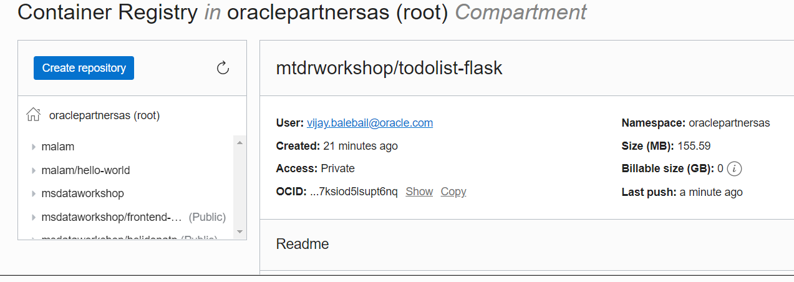
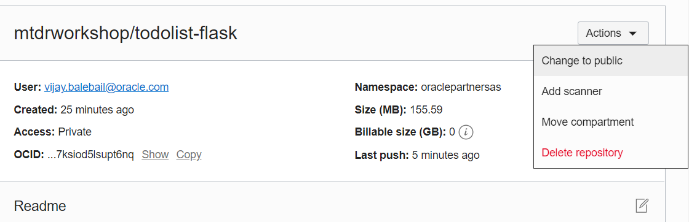
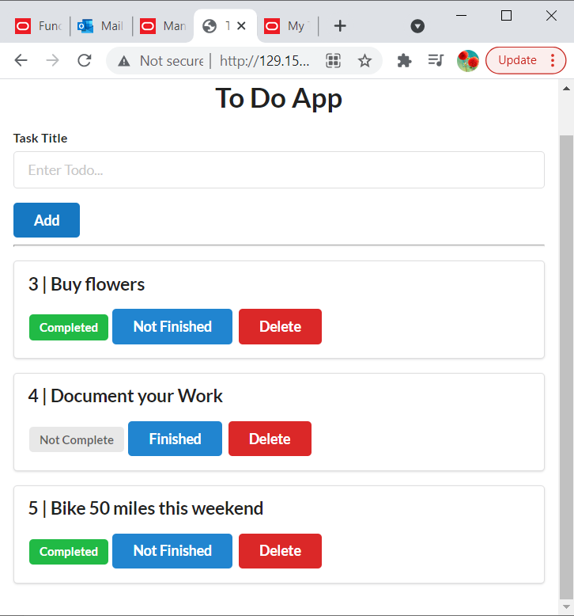
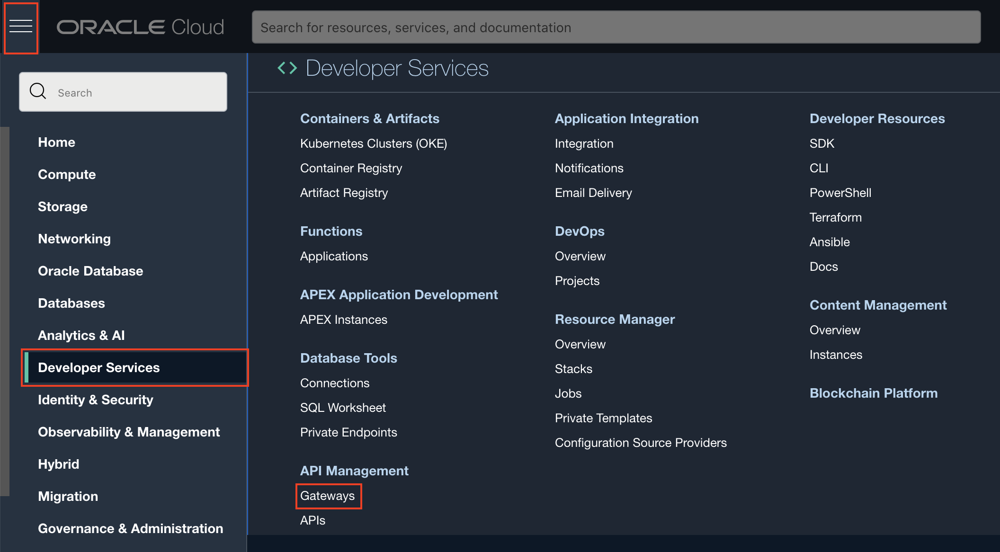
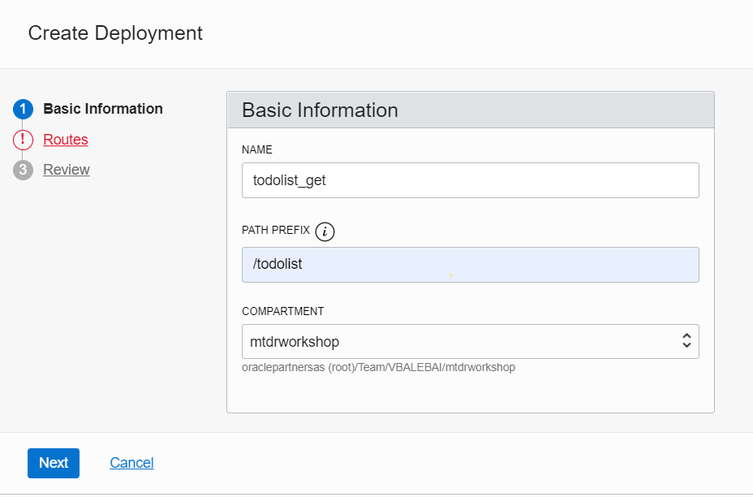
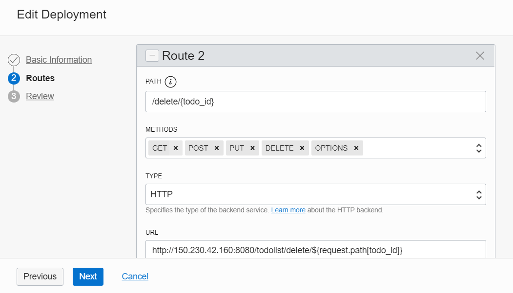
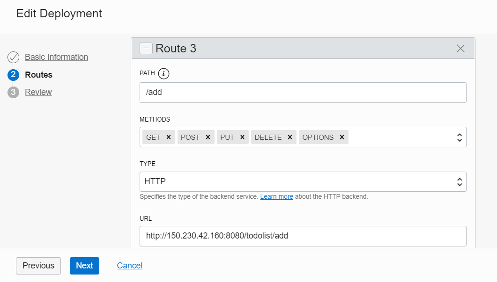
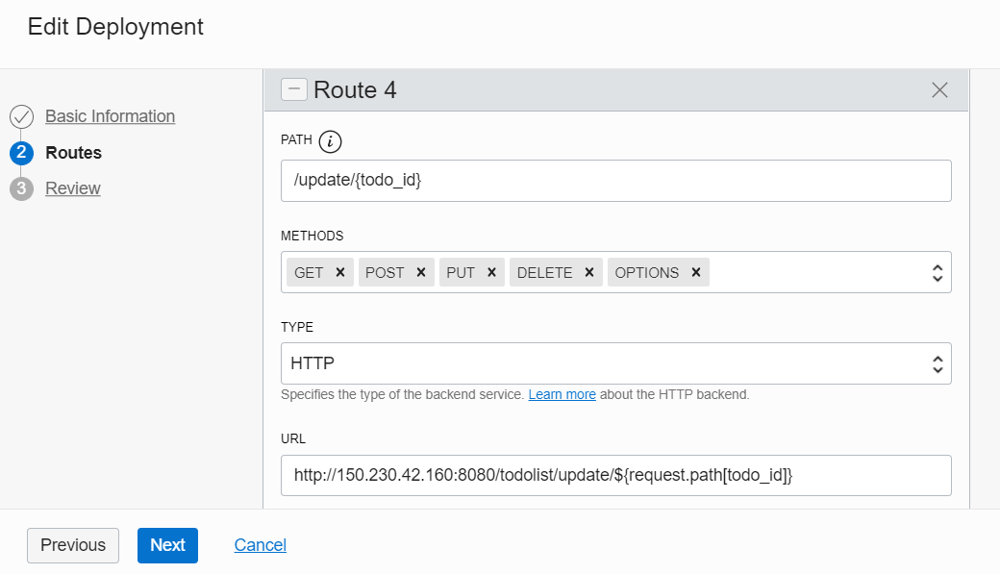
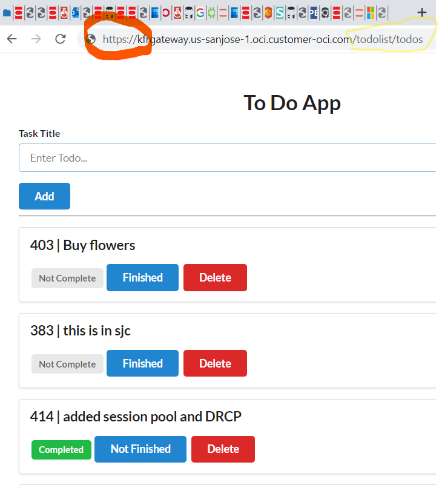

# Backend

## Introduction

In this lab,
- You will build a Python/Flask Docker image.
- You will deploy the Docker image to OKE.
- Configure the API Gateway.

Estimated time: ~45 minutes.

### Understanding the Python/backend application

As with most React applications (https://reactjs.org/), this application uses remote APIs to handle data persistence. The backend implements 5 REST APIs including:
- Retrieving the current list of todo items
- Adding a new todo item
- Updating an existing todo items
- Deleting a todo item.


### Objectives

* Set values for environment variables
* Build and deploy the Docker image of the application
* Deploy the image on the Oracle Kubernetes Engine (OKE)
* Describe the steps for Undeploying
* Configure the API Gateway
* Test the backend application

### Prerequisites

- This lab requires the completion of lab 1 and the provision of the OCI components.


## Task 1: Set values for workshop environment variables

1. Set the root directory of the workshop

	```
	<copy>export MTDRWORKSHOP_LOCATION=~/mtdrworkshop</copy>
	```
2. Run source addAndSourcePropertiesInBashrc.sh

	The following command will set the values of environment variables in mtdrworkshop.properties and source ~/.bashrc

	```
	<copy>cd $MTDRWORKSHOP_LOCATION; source addAndSourcePropertiesInBashrc.sh</copy>
	```

## Task 2: Build and push the Docker images to the OCI Registry

1. Ensure that the "DOCKER_REGISTRY" variable is set

 Example: `<region-key>.ocir.io/<object-storage-namespace>/<firstname.lastname>/<repo-name>`
 If the variable is not set or is an empty string, the push will fail (but the docker image will be built).

2. copy the Python/Flask Todo app from github.

	```
	<copy>
	mkdir ~/mtdrworkshop/python
	cd ~/mtdrworkshop/python
	git clone https://github.com/vijaybalebail/Todo-List-Dockerized-Flask-WebApp.git
	cd Todo-List-Dockerized-Flask-WebApp
	</copy>
	```

3. Unzip the database wallet.zip file within the new web app.

	```
	<copy>
	unzip ~/mtdrworkshop/setup-dev-environment/wallet.zip
	</copy>
	```

4. Pick mtdrb_tp service alias (see the list of aliases in
   ./tnsnames.ora)

   

5. There are many ways to pass database credentials from the backend to Oracle database. We are using a config file. Edit the config.cfg file and edit the username,password and connect string. This user and password is the one created during lab_setup.

	```
	<copy>
	ADB_USER="TODOUSER"
	ADB_PASSWORD="Saturday_123"
	ADB_TNSNAMEs="mtdrdb_tp"
	</copy>
	```

6. Edit the sqlnet.ora and change the docker virtual wallet directory to "/app"

	```
	<copy>
	WALLET_LOCATION = (SOURCE = (METHOD = file) (METHOD_DATA = (DIRECTORY="/app")))
	SSL_SERVER_DN_MATCH=yes
	</copy>
	```

7. We now can build the a docker image with Python, Oracle Client , and the todo application app.js.Look at the construct of the Dockerfile and execute the command to build the docker image.

	```
	<copy> docker build  -t todolist-flask:latest . </copy>

	 (us-ashburn-1)$ docker build  -t todolist-flask:latest .
	Sending build context to Docker daemon  1.297MB
	Step 1/15 : FROM oraclelinux:7-slim
	Trying to pull repository docker.io/library/oraclelinux ...
	7-slim: Pulling from docker.io/library/oraclelinux
	7627bfb99533: Pull complete


	Step 15/15 : CMD python3 app.py
	 ---> Running in 94ef1e230b45
	Removing intermediate container 94ef1e230b45
	 ---> 02f268c26542
	Successfully built 02f268c26542
	Successfully tagged todolist-flask:latest
	```

	Verify that the images are CREATED.
	```
	$ <copy>
	docker images</copy>
	REPOSITORY          TAG                 IMAGE ID            CREATED             SIZE
	todolist-flask      latest              02f268c26542        34 seconds ago      477MB
	oraclelinux         7-slim              0a28ba78f4c9        2 months ago        132MB

	```

## Task 3: Run Docker image locally and verify.
 We created our image using the command docker build. Now that we have an image, we can run that image and see if our application is running correctly. Since we are running a application that listens on a port, we will have to run this in Detach or background mode.

1. Run image locally and verify the image is running.

	```
	<copy>
	docker run -d  -p 5003:5000  todolist-flask:latest
	docker ps
	</copy>
	$    docker ps
	CONTAINER ID        IMAGE                   COMMAND                       PORTS                    NAMES
	b167d3a24057        todolist-flask:latest   "/bin/sh -c 'python3…"    0.0.0.0:5003->5000/tcp   relaxed_shirley
	```

2. Run curl get script to verify you can access data locally.

	```
	<copy>
	curl -GET http://0.0.0.0:5003/todolist/foo2	 
	</copy>
	```

## Task 4: Tag & push image to the registry.

1. Now that you have a docker image running locally, you are now ready to run it from OKE cluster. Give a tag to the image that you're going to push to Oracle Cloud Infrastructure Registry by entering:

	```
	<copy>
	docker tag todolist-flask:latest $DOCKER_REGISTRY/todolist-flask:latest
	docker push $DOCKER_REGISTRY/todolist-flask:latest
	</copy>
	```
In a couple of minutes, you should have successfully built and pushed the images into the OCIR repository.

2. Check your container registry from the **root compartment**

	Go to the Console, click the hamburger menu in the top-left corner and open	**Developer Services > Container Registry**.

	

3. Mark Access as Public  (if Private)
	(**Actions** > **Change to Public**):

	


## Task 5: Deploy on Kubernetes and Check the Status

1. Verify the todo.yaml file.
   Ensure you have the image name in oracle docker registory, the name of the imagePullSecret that was created in step 5 of lab1.

	```
	<copy>cd ~/mtdrworkshop/python/Todo-List-Dockerized-Flask-WebApp;
	cp todo_template.yaml todo.yaml
	sed -i "s|%DOCKER_REGISTRY%|${DOCKER_REGISTRY}|g" todo.yaml
	kubectl create -f todo.yaml
  </copy>
	```

2. Check the status using the following commands. Verify the status is running for pods and you have a external-ip for LoadBalancer. You may have to rerun the command as it could take a couple of minutes to allocate a ip-address.

	```
	$<copy>kubectl get all</copy>
	$ kubectl get all
	NAME                                      READY   STATUS             RESTARTS   AGE
	pod/todo-deployment-657895dd59-qd89j      1/1     Running            0          3m1s

	NAME                   TYPE           CLUSTER-IP    EXTERNAL-IP      PORT(S)          AGE
	service/kubernetes     ClusterIP      10.96.0.1     <none>           443/TCP          32h
	service/todo-service   LoadBalancer   10.96.77.65   132.226.36.134   8080:31093/TCP   3m1s

	NAME                                 READY   UP-TO-DATE   AVAILABLE   AGE
	deployment.apps/todo-deployment      1/1     1            1           3m2s

	NAME                                            DESIRED   CURRENT   READY   AGE
	replicaset.apps/todo-deployment-657895dd59      1         1         1       3m2s

  ```


	The following command returns the Kubernetes service of ToDo application with a load balancer exposed through an external API
	```
	<copy>kubectl get services</copy>
	```

	

3. $ kubectl get pods
	```
	<copy>kubectl get pods</copy>
	```

	

4. Continuously tailing the log of one of the pods

  $ kubectl logs -f <pod name>
  Example kubectl logs -f todo-deployment-657895dd59-qd89j

5. For debugging deployment issues, you can run describe command and look at the errors at the end.

    kubectl describe pod <pod name>
    Example kubectl describe pod todo-deployment-657895dd59-qd89j

6. Now that your application has a external ipaddress, you can now access it both through curl and any web browser.
    ```
    curl -X GET http://<external_ipaddress>:8080/todolist
    or
    open a browser to the link http://<external_ipaddress:8080/todolist
    ```
    

    In this app,  Flask app provides end points and data from ADB. The GUI is rendered using https://github.com/Semantic-Org/Semantic-UI in a html templates.

## Task 6: Configure the API Gateway (optional steps)

A common requirement is to build an API endpoints for docker applications with the HTTP/HTTPS URL of a back-end service.
This can be done using Oracle API Gateway service.

The API Gateway protects any RESTful service running on Container Engine for Kubernetes, Compute, or other endpoints through policy enforcement, metrics and logging.
Rather than exposing the Todo App directly, we will use the API Gateway to define cross-origin resource sharing (CORS).

1. From the hamburger menu navigate to **Developer Services** > **Gateways**
   

2. Configure the basic info: name, compartment, VCN and Subnet
    - VCN: pick on of the vitual circuit network
    - Subnet pick the public subnet (svclbsubnet)

	The click "Create".
  	

3. Click on Todolist gateway
    

4. Click on Deployments
   

5. Create a todolist deployment
   

6. Configure the routes: we will define two routes:
    - /tododo for the first two APIs: GET, POST and OPTIONS
    

    - add  /todolist/delete route API: (GET, PUT and DELETE)
	   

     - add  /todolist/add route APIs.
 	   

     - add  /todolist/update route API.
      


## Task 7: Testing the backend application through the API Gateway

1. Navigate to the newly create Gateway Deployment Detail an copy the endpoint
   

2. Testing through the API Gateway endpoint
  postfix the gateway endpoint with "/todolist/todos" as shown in the image below


  It should display the Todo Item(s) in the TodoItem table. At least the row you have created in Lab 1.

   

That is it. You have now exposed the applications endpoints through Oracle API Gateway.

## Acknowledgements

* **Author** -  - Vijay Balebail, Director Product Management.
* **Contributors** -  Satyabrata Mishra, Rajeev Rumale
* **Last Updated By/Date** - Kamryn Vinson, November 2021