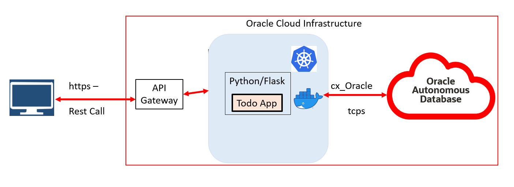

# Introduction

## About this Workshop

In this workshop, you will learn how to build and deploy a simple  Cloud native application using the most commonly used frameworks and the Oracle Cloud Infrastructure services.

Estimated Workshop Time: 70 minutes

### About Product/Technology

You will learn how to use the Autonomous Database, the Container Registry, the Kubernetes Cluster (OKE) , Python/Flask and the API Gateway managed services of the Oracle Cloud Infrastructure through the deployment of a simple MyToDo List React JS application.

### Objectives

In this 2 part lab, you will:
* Provision a Kubernetes cluster, an Oracle Autonomous Database instance, a Container Registry, and an API Gateway
* Understand, build and deploy a Python/Flask application implementing the REST APIs, using Docker, OCI Container Registry and Oracle Kubernetes service (OKE).

### Prerequisites

* An Oracle Free Tier, Always Free, Paid or LiveLabs Cloud Account

You may now proceed to the next lab.

## Acknowledgements

* **Author** -  - Vijay Balebail, Dir. Product Management.
* **Contributors** - Satyabrata Mishra, Senior Product Manager
