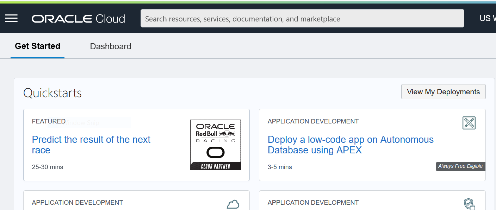
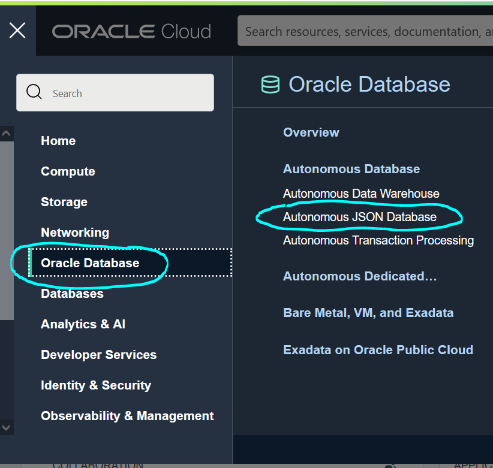
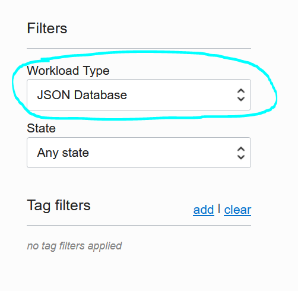
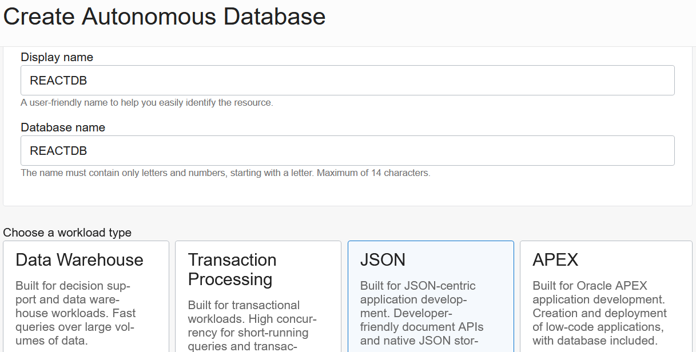
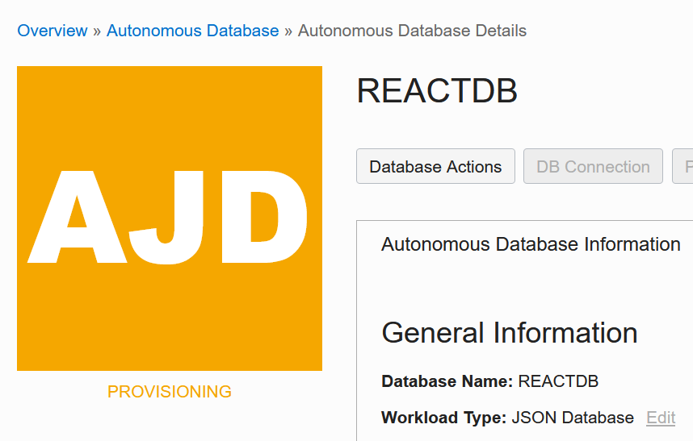
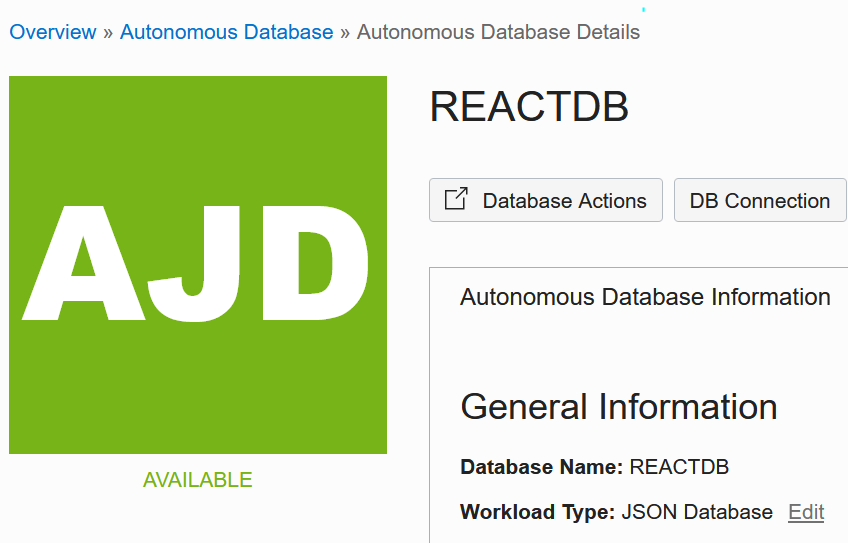

# Provision an Autonomous JSON Database Instance 

## Introduction

This lab will be a step by step guide to provisioning your Autonomous JSON database instance. This database will be used in future labs to connect the data, which you will upload in the next lab. 

Estimated Time: 15 minutes

### Objectives

In this lab, you will:
* Login to your Oracle Cloud account
* Learn to provision a database instance

### Prerequisites

This lab assumes you have:
* An Oracle account

## Task 1: Choose Autonomous JSON Database

1. Login to your Oracle Cloud account.

	

2. Click on the navigation menu in the top left corner of the page. Select **Oracle Database** and then choose **Autonomous JSON database**. 

    

3. Scroll down to check that the workload type under list scope reads **JSON Database**.

    

## Task 2: Create AJD Instance

1. Click **Create Autonomous Database** 

2. This will open a configuration screen where you will specify the requirements for this instance.
  
3. Here you will enter the basic information for your database. 

    - **Compartment** Select the compartment from the dropdown menu.
    - **Display Name** Provide a display name, for the purposes of this lab use: REACTDB
    - **Database Name**  Use letters and numbers only, starting with a letter. Maximum length is 14 characters. (Underscores not initially supported.) For this lab, use REACTDB.

    

4. Choose a workload type.
    
    - **JSON** For this lab, choose JSON as the workload type. 

5. Select **Shared Infrastructure** as the workload type.

6. Create ADMIN credentials.
    - **Password** Specify the password for ADMIN user of the service instance and confirm the password.

    The password must meet the following requirements:
    - The password must be between 12 and 30 characters long and must include at least one uppercase letter, one lowercase letter, and one numeric character.
    - The password cannot contain the username.
    - The password cannot contain the double quote (") character.
    - The password must be different from the last 4 passwords used.
    - The password must not be the same password that is set less than 24 hours ago.
    - Re-enter the password to confirm it. Make a note of this password.

7. Select Network Access Type.
    - Select **Secure access from everywhere**
    - Select **License Included**

8. Click Create Autonomous Database.
    - Database configuration window will close and you will see that the database is **Provisioning**.
    - When the database is done provisioning the icon will change to green and will say **Available**
    - It may take a few minutes for this to complete.
    
    
    

You may now **proceed to the next lab**.

## Acknowledgements
* **Author** - Andres Quintana - Database Product Management 
* **Contributors** - Bronze Martin
* **Last Updated By/Date** - Andres Quintana, April 2022