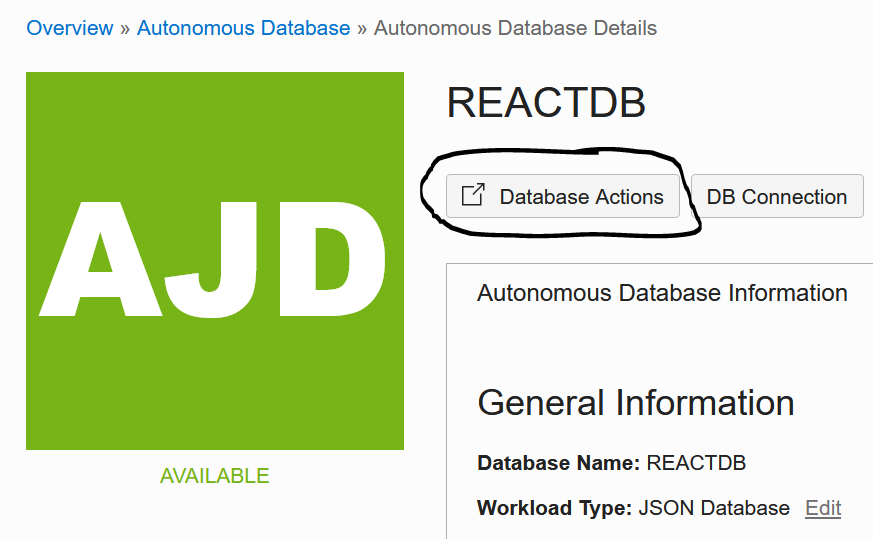
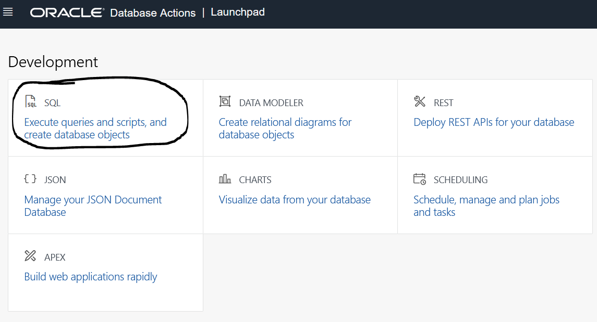
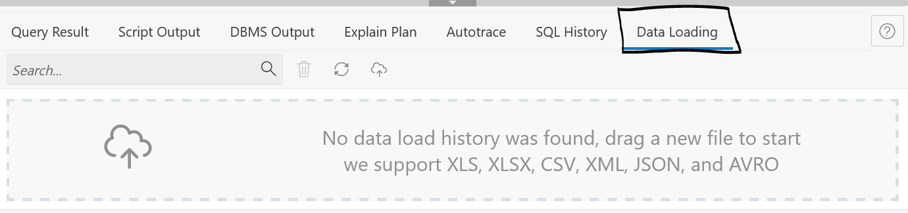
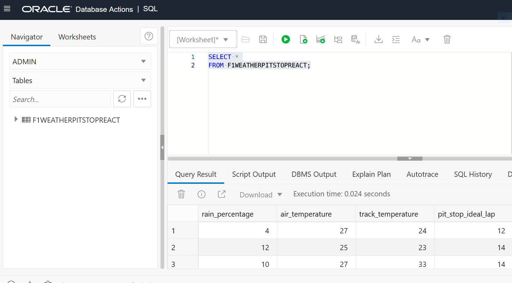

## Introduction

In this lab you will download a prepared dataset and upload that data to the database created in the previous lab. Once the data is uploaded you will perform a simple exploratory analysis of the data.

Estimated Time: 20 minutes

### Objectives

In this lab, you will:
* Download the attached dataset. 
* Upload the dataset to the Autonomous JSON Database Created in the previous lab.
* Prepare to connect the database to the React Interface.

### Prerequisites 

This lab assumes you have:
* An Oracle account
* All previous labs successfully completed

## Task 1: Download the Dataset

The data that you are about to download represents three variables: percentage chance of rain, air temperature, and track temperature which will be used to select the optimal lap for your team's initial pit-stop in a Formula-1 race. 

1. Download the dataset.
  - Click to download the dataset to your local computer. 

  Download the [Formula 1 Weather Conditions](https://objectstorage.us-ashburn-1.oraclecloud.com/p/LNAcA6wNFvhkvHGPcWIbKlyGkicSOVCIgWLIu6t7W2BQfwq2NSLCsXpTL9wVzjuP/n/c4u04/b/livelabsfiles/o/developer-library/F1WeatherPitStopReact.csv?download=1) dataset.

## Task 2: <Upload Data to the Database>

1. Database Actions.
  - Click on database actions. 
  - *This will open a new window and might be blocked by pop-up blockers.* 

     

  - From the database actions page click on **SQL**. That will take you to the database user interface where you will click through a demo navigation before you are able to work in the interface. 

      

2. Load the data into the database.
  - Click on **Data Loading** and navigate to to the downloaded dataset to upload the .csv file into the database. 

     

3. View the data.
  - Use the code below to view the data in the database. 
      ```
    <copy>
    SELECT * 
    FROM F1WEATHERPITSTOPREACT;
    </copy>
    ```

    

  - Now that the data is successfully loaded into the database you will be able to connect the database to the interface in the next lab. The interface will automate data-driven insights to optimize the race crew's decision making. 

## Task 3: <Explore the Data>

1. Explore the data. 
  - Let's use some simple SQL queries to explore the data a bit further. We have a large dataset of historic data collected at a racetrack. We want to know which factors influence the decision to take an initial pit stop. We will look at Air Temperature, Percentage Chance of Rain, and Track Temperature. 
  - First, let's determine if there are any NULL values in the data. 
    ```
    <copy>
    SELECT RAIN_PERCENTAGE, AIR_TEMPERATURE, TRACK_TEMPERATURE, PIT_STOP_IDEAL_LAP
    FROM F1WEATHERPITSTOPREACT 
    WHERE PIT_STOP_IDEAL_LAP IS NULL
    OR RAIN_PERCENTAGE IS NULL
    OR AIR_TEMPERATURE IS NULL
    OR TRACK_TEMPERATURE IS NULL
    </copy>
    ```
  - After determining that there are no NULL values in the data we will know that the next exploratory tests are not skewed by data gaps. 

2. Test the data. 
  - Now, we will test the data by determining the optimal pit stop lap based on an assumed previous experience with this track where we know we will want to take a pit stop before or at lap 10. 
    ```
    <copy>
    SELECT PIT_STOP_IDEAL_LAP, TRACK_TEMPERATURE, AIR_TEMPERATURE, RAIN_PERCENTAGE
    FROM F1WEATHERPITSTOPREACT
    HERE PIT_STOP_IDEAL_LAP <= 10 
    </copy>
    ```
  - As you can see, the results show the conditions that will optimize the initial pit stop lap. 

3. Next steps. 
  - We have explored and tested the data, now it is time to connect this data to the user interface. 

You may now **proceed to the next lab**.

## Acknowledgements
* **Author** - Andres Quintana - Database Product Management 
* **Contributors** - Bronze Martin 
* **Last Updated By/Date** - Andres Quintana, May 2022
