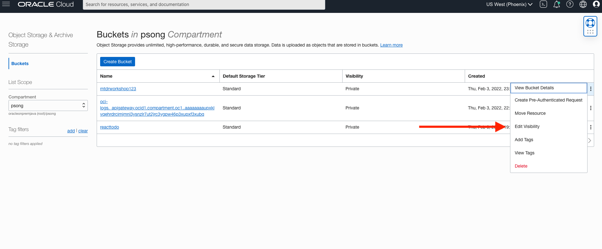

## Introduction

In this lab you will download a prepared user interface and connect the data from the database created in the previous lab. Once the interface is connected you will use the built in tools to determine the optimal pit stop lap. 

Estimated Time: 20 minutes

### Objectives

In this lab, you will:
* Download the attached user interface. 
* Connect the dataset from the Autonomous JSON Database Created in the previous lab.
* Examine the data.

### Prerequisites 

This lab assumes you have:
* An Oracle account
* All previous labs successfully completed

## Task 1: <Download the Interface Files>

The user interface that you are about to download will be used to select the optimal lap for your team's initial pit-stop in a Formula-1 race. 

1. Download the User Interface.
  - Click to download the user interface to your local computer. 

  Download the [User Interface](par file link) - my_app.zip

## Task 2: <Hosting on the Oracle Cloud Object Storage>

The build folder will be uploaded to object storage so you can access your application from OCI.

1. Open up the hamburger menu in the top-left corner of the Console and select Object Storage > Object Storage.

    

  Create the 'mtdrworkshop' (or another name if that's taken) bucket
    
  

  Enter in the bucket details.

   


2. Install the Staci utility for copying directories to OCI object storage bucket with folder hierarchies

* git clone https://github.com/maxjahn/staci.git
  ```
    <copy>
    git clone https://github.com/maxjahn/staci.git
    </copy>
    ```
* cd staci
  ```
    <copy>
    cd staci
    </copy>
    ```
* go mod init staci
   ```
    <copy>
    go mod init staci
    </copy>
    ```
* go get -d
  ```
    <copy>
    go get -d
    </copy>
    ```
* go build
  ```
    <copy>
    go build
    </copy>
    ```

1. If you have never used your laptop for connecting to an Oracle Cloud account, you need to setup an OCI config file and create an API key

* Follow Step #2 in the following doc https://bit.ly/3vM7v2h for that purpose.

2. Upload a static build into the bucket, using the staci binary. -source build should be the path to build from npm run build earlier. -target mtdrworkshop should be the name of the bucket
   ```
    <copy>
    ./staci/staci -source build -target mtdrworkshop
    </copy>
    ```
  * The application is visible in the 'mtdrworkshop' bucket of your tenancy

  * Click on the index.html object and copy the URL of the index object

  

  * You may now run the application from Object store, using the URL of the index that you've copied above.

  

## Task 3: <Explore the Interface>

1. Explore the Interface. 

It's time to make your predictions ...
 

   * Read through the objective and click the start predicting button when you're ready to start predicting. 

  

   * In this section, you will be manipulating four different variables: track temperature, air temperature, rain percentage, and initial pick stop time. Please input in each box respectively. Once you're finished, click the submit button. 
  
  

  * Now that you have submitted your predictions, you will see a box pop up that informs you of your race time in comparison to the optimal race time. The optimal race time is tuned from the best scores on the dataset we called backed from. 

  

  * Feel free to adjust your predictions as you wish! 

  You have now **successfully completed the lab**.

## Acknowledgements
* **Author** - Andres Quintana - Database Product Management 
* **Contributors** - Bronze Martin 
* **Last Updated By/Date** - Andres Quintana, May 2022