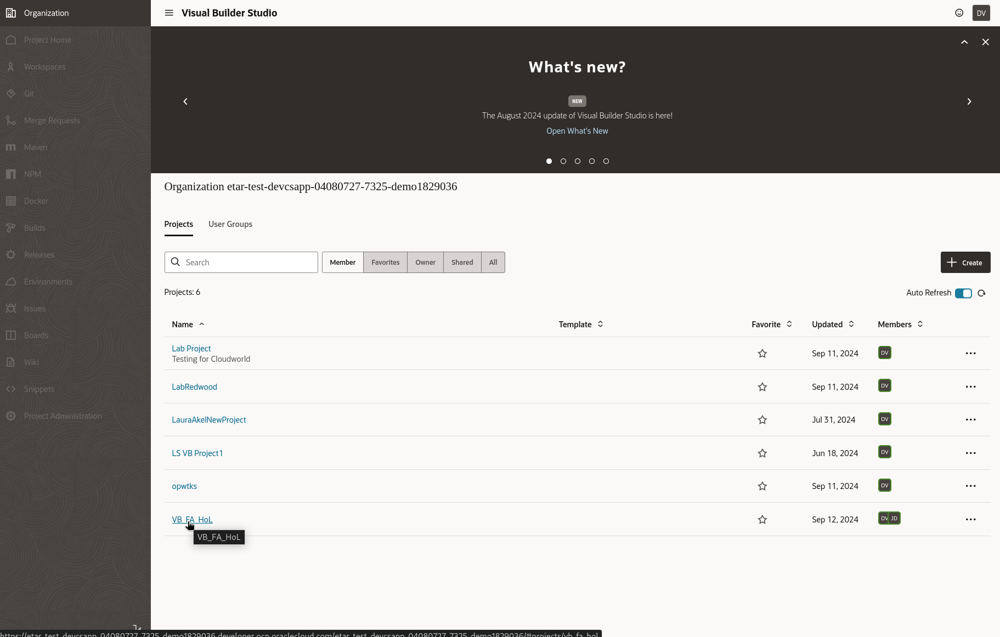
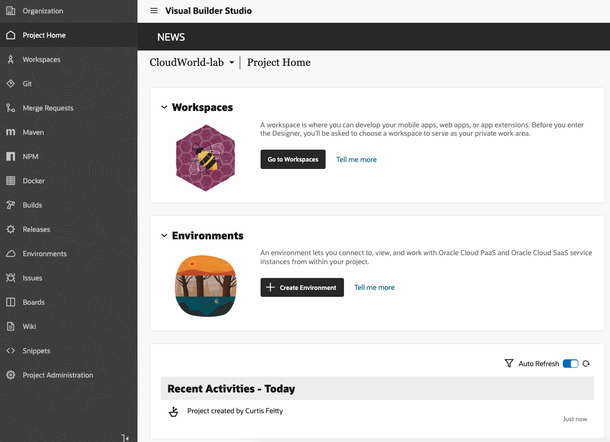
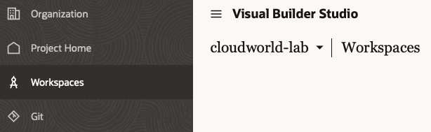

# Create a New Extension

## Introduction

Starting in Oracle Fusion Cloud Applications, we'll navigate to Visual Builder Studio and create a new workspace where we can develop our extension.

Estimated Lab Time: 5 minutes

### About Oracle Visual Builder Studio
Oracle Visual Builder Studio (which we'll call "VB Studio" from now on) is included as one of the configuration tools that come with Oracle Fusion Cloud Apps. We'll use VB Studio to create and manage a project where we develop extensions.

### Objectives

In this lab, you will:
* Access VB Studio
* Create a new workspace

## Task 1: Access Visual Builder Studio

Users with [the right roles](https://docs.oracle.com/en/cloud/paas/visual-builder/visualbuilder-administration/configure-oracle-cloud-applications-custom-roles.html) can access VB Studio from their Oracle Fusion Cloud Applications' TEST instance.

1. Log in to Oracle Fusion Cloud Applications using the URL and credentials provided by your instructor:

	

2. In the hamburger menu at the top left, navigate to the **Configuration** section and expand it. Select the **Visual Builder** option (in this case, synonymous with "Visual Builder Studio"):

  

3. Select the project provided by your instructor.

  

3. You'll be taken to the project home page.

	

## Task 2: Create a Workspace
You are on the project's home page

From here you can navigate to all your project's components, including environments, Git repositories, CI/CD pipelines, issue tracking system, wikis, and much more. In this lab, we'll focus only on workspaces. A *workspace* is a private area where you can develop your extension. Among other things, the workspace defines your Git repository, your Oracle Fusion Cloud Application environment, and other important details.

1. Click **Workspaces** in the left navigation menu:

	

2. Click **New**, then select **New Application Extension** to create a new workspace for your extension:

	

3. In the New Application Extension dialog, populate the fields with these values:
| Field | Value | Explanation |
| --- | --- | --- |
| Extension Name | YourName-Accounts | To keep the names distinct, use your first name plus the first initial of your last name, as in *MaryC-Accounts* |
| Development Environment |Choose the option available | Mapped to your SaaS instance|
| Root Folder | extension1 | Do not change |
| Sandbox | No sandbox selected | Not needed in this scenario |
| Use scratch repository | Check | For now, you can just work in a private Git repository |
{: title="New App Extension Properties"}

	

4. Click **Create**.  It may take a couple of minutes to create your workspace.  When VB Studio is finished, you'll be taken into the Designer, where you can get to work:

	

You may **proceed to the next lab**.

## Learn More

* [What Is an Extension?](https://docs.oracle.com/en/cloud/paas/visual-builder/visualbuilder-building-appui/basics.html#GUID-A729A4FB-CD2E-48C8-BDE3-577DEE835332)
* [What Is a Workspace?](https://docs.oracle.com/en/cloud/paas/visual-builder/visualbuilder-building-appui/basics.html#GUID-8E1EF322-51B5-4411-BAAA-F2AB3796C8FB)

## Acknowledgements
* **Author** - Shay Shmeltzer, Oracle Cloud Development Tools, September 2022
* **Contributors** -  Marcie Caccamo, Blaine Carter, Oracle Cloud Development Tools
* **Last Updated By/Date** - Blaine Carter, Oracle Cloud Development Tools, March 2023
