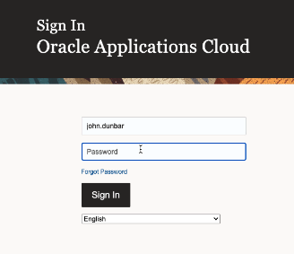
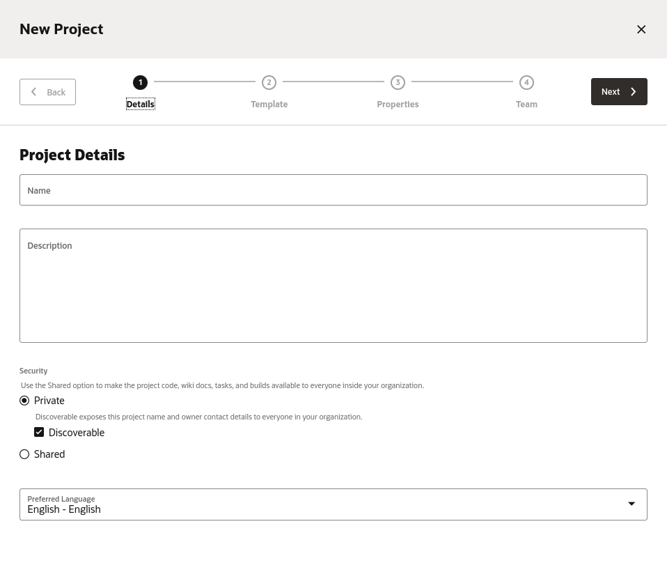
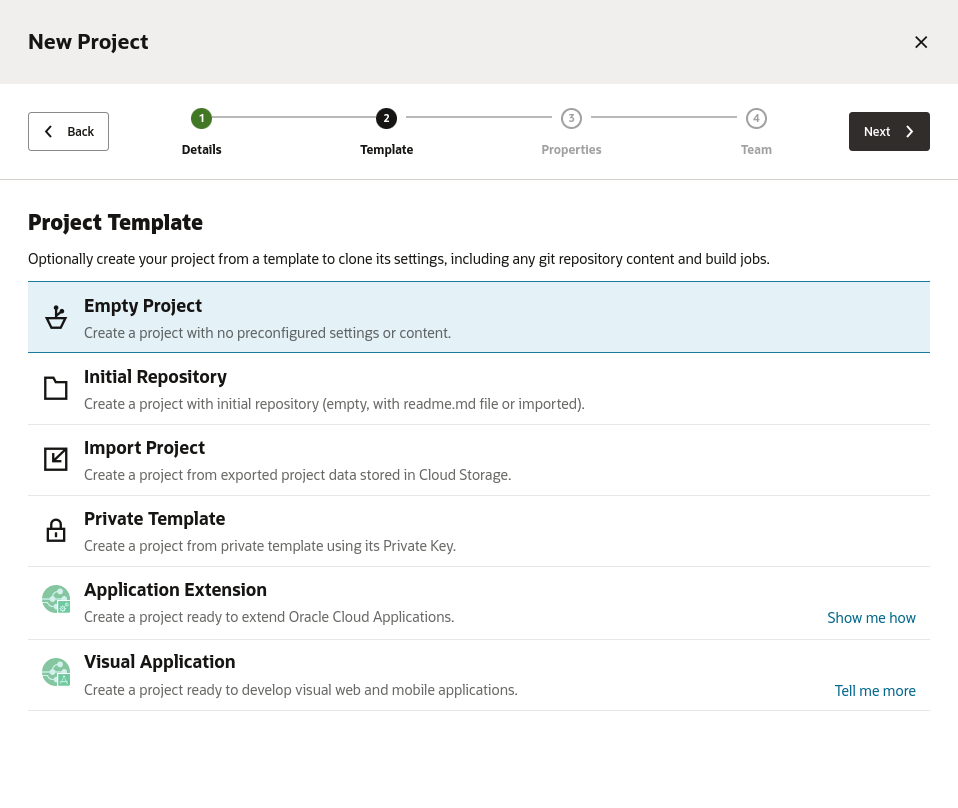
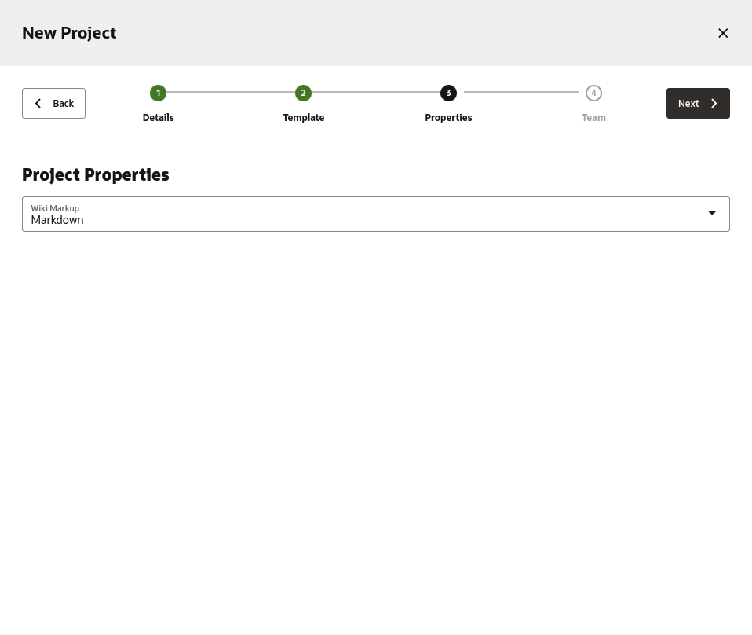
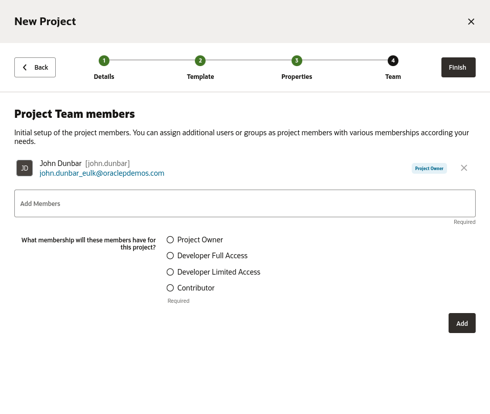
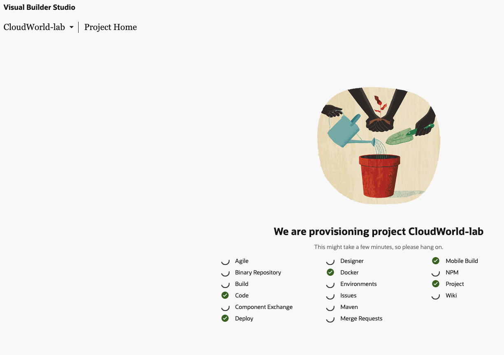
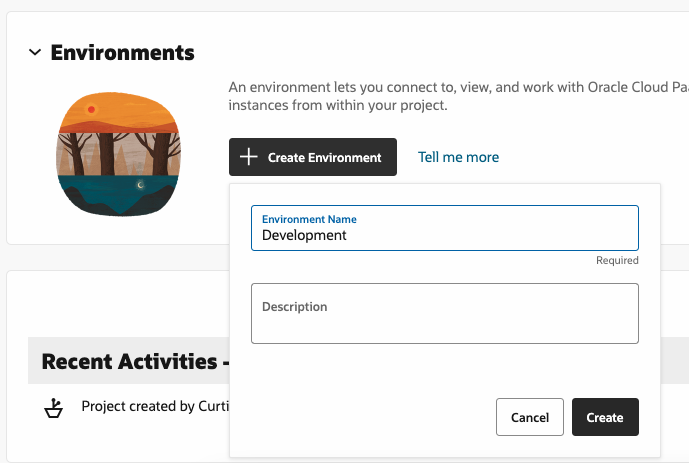
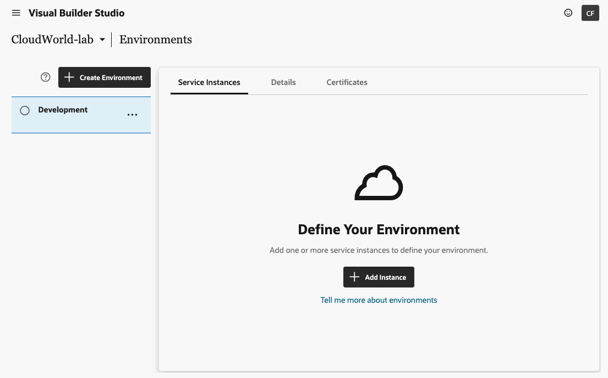
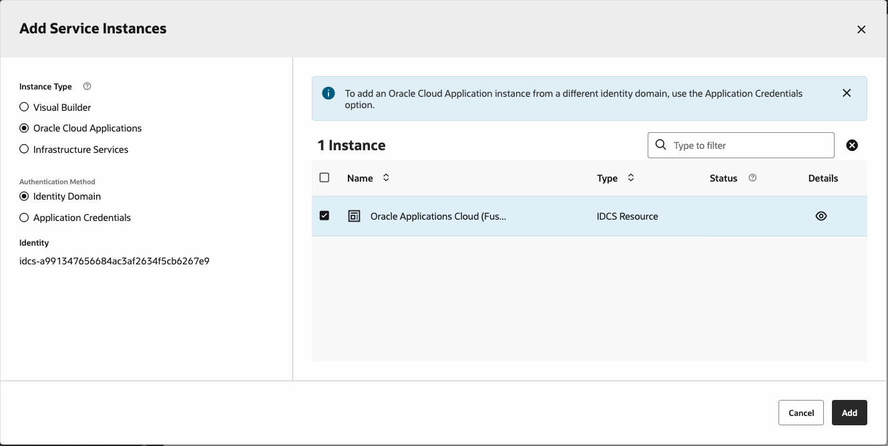

# Create a New Extension

## Introduction

Starting in Oracle Fusion Cloud Applications, we'll navigate to Visual Builder Studio and create a new workspace where we can develop our extension.

Estimated Lab Time: 5 minutes

### About Oracle Visual Builder Studio
Oracle Visual Builder Studio (which we'll call "VB Studio" from now on) is included as one of the configuration tools that come with Oracle Fusion Cloud Apps. We'll use VB Studio to create and manage a project where we develop extensions.

### Objectives

In this lab, you will:
* Access VB Studio
* Create a project
* Create a new workspace

## Task 1: Access Visual Builder Studio and Create a Project

Users with [the right roles](https://docs.oracle.com/en/cloud/paas/visual-builder/visualbuilder-administration/configure-oracle-cloud-applications-custom-roles.html) can access VB Studio from their Oracle Fusion Cloud Applications' TEST instance.

1. Log in to Oracle Fusion Cloud Applications:

	

2. In the hamburger menu at the top left, navigate to the **Configuration** section and expand it. Select the **Visual Builder** option (in this case, synonymous with "Visual Builder Studio"):

  

3. On the Organization page, if you don't already have a project click the **Create** button to create a new project.

  

	VB Studio uses *projects* to manage individual development teams' activities.

4. In the New Project dialog provide a name for the project and keep the default setting of Private project, then click **Next**.

	

5. In the second step we choose a project template, we are going to use the **Empty Project** template, then click **Next**.

	

6. In the third step you choose a syntax for the project's wiki, we can keep the default value and then click **Next**.

	

7. In the fourth step you choose team members for the project, we can keep the default values and then click **Finish**.

	

8. Visual Builder Studio will now create the project, this may take a minute or two to complete.

	

9. When the creation finishes you'll be taken to the project home page.

	

## Task 2: Define an Environment

Environments consist of servers into which your extension will be deployed. Specifically for Oracle Fusion Cloud Applications Extensions we need to point to an instance of Oracle Fusion Cloud Application.

1. Click the **Create Environment** button in the Environments section, and provide the name **Development**.

	

2. In the Environments page, click the **Add Instance** button to add a new server instance to our environment.

	

3. In the Instance Type switch to look for **Oracle Cloud Applications**, this will tell VB Studio to look up for the Fusion Cloud App instance in your tenancy. Once it is located check the checkbox next to it. Then press the **Add** button to add this instance to your environment.

	

4. Once the instance has been added you'll go back to the project home page. You are now ready to create a new app extension on this new instance.

	

Make sure the environment has a green checkmark indicating it is available to use.

## Task 3: Create a Workspace
You are on the project's home page

From here you can navigate to all your project's components, including environments, Git repositories, CI/CD pipelines, issue tracking system, wikis, and much more. In this lab, we'll focus only on workspaces. A *workspace* is a private area where you can develop your extension. Among other things, the workspace defines your Git repository, your Oracle Fusion Cloud Application environment, and other important details.

1. Click **Workspaces** in the left navigation menu:

	

2. Click **New**, then select **New Application Extension** to create a new workspace for your extension:

	

3. In the New Application Extension dialog, populate the fields with these values:
| Field | Value | Explanation |
| --- | --- | --- |
| Extension Name | YourName-Accounts | To keep the names distinct, use your first name plus the first initial of your last name, as in *MaryC-Accounts* |
| Development Environment |Choose the option available | Mapped to your SaaS instance|
| Base Oracle Cloud Application | None | Not needed in this scenario |
| Sandbox | No sandbox selected | Not needed in this scenario |
| Use scratch repository | Check | For now, you can just work in a private Git repository |
{: title="New App Extension Properties"}

	

4. Click **Create**.  It may take a couple of minutes to create your workspace.  When VB Studio is finished, you'll be taken into the Designer, where you can get to work:

	

You may **proceed to the next lab**.

## Learn More

* [What Is an Extension?](https://docs.oracle.com/en/cloud/paas/visual-builder/visualbuilder-building-appui/basics.html#GUID-A729A4FB-CD2E-48C8-BDE3-577DEE835332)
* [What Is a Workspace?](https://docs.oracle.com/en/cloud/paas/visual-builder/visualbuilder-building-appui/basics.html#GUID-8E1EF322-51B5-4411-BAAA-F2AB3796C8FB)

## Acknowledgements
* **Author** - Shay Shmeltzer, Oracle Cloud Development Tools, September 2022
* **Contributors** -  Marcie Caccamo, Blaine Carter, Oracle Cloud Development Tools
* **Last Updated By/Date** - Blaine Carter, Oracle Cloud Development Tools, March 2023
