# Adding an Edit Page and a Details Page

## Introduction

This lab leverages quick starts in Oracle Visual Builder to create additional pages that will let you manipulate data in Oracle Cloud Apps.

Estimated Time: 10 minutes

### About Visual Builder Quick Starts
Visual Builder simplifies creating user interfaces on top of data with quick starts - guided dialogs that create pages that can update, insert, delete and view data.

### Objectives

In this lab, you will:
* Create an Edit Page
* Create a Details Page
* Preview your application

## Task 1: Create an Edit Page

Now that we have a page that shows data about accounts, we might want to update the data or insert new information about an account. In this section we leverage the quick starts of Visual Builder to create these pages. In this section we'll use the default layouts, and we'll modify the pages in the next tutorial.

1. Back in the Design view of the application, select the table of accounts in either the structure pane or the visual editor.

	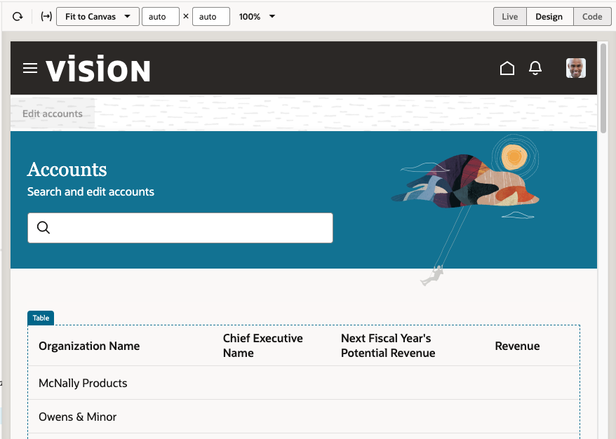

2. In the properties palette, select the quick start tab.

  
3. There are different types of pages we can create for the rows that are shown in the table. We'll start by picking the **Add Edit Page**, this will create a page that will let us edit the details of a row we selected from the table.
	  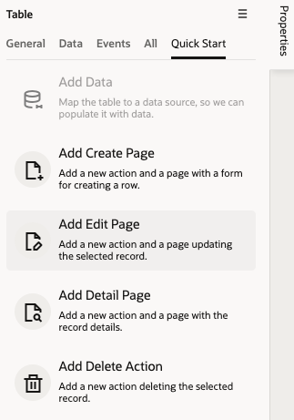

4. In the dialog that pops up for selecting the object from which we pick a specific record the **Accounts** object is already selected, keep it that way and click **next**. Repeat this in the next step of the wizard which points out the object that will be updated, so click **Next** there too.
	  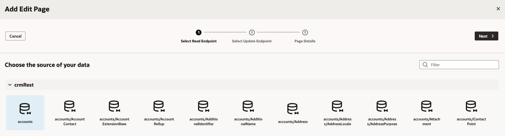
5. We now end up on a page that lets us choose the specific fields we want to edit in the page we are creating. We'll use the Filter at the top of list of fields to locate specific fields.
	  
6. Search for **name** and then **revenue** and select the following fields:
* OrganizationName
* CEOName
* CurrentFiscalYearPotentialRevenueAmount
* NextFisicalYearPotentialRevenueAmount
	  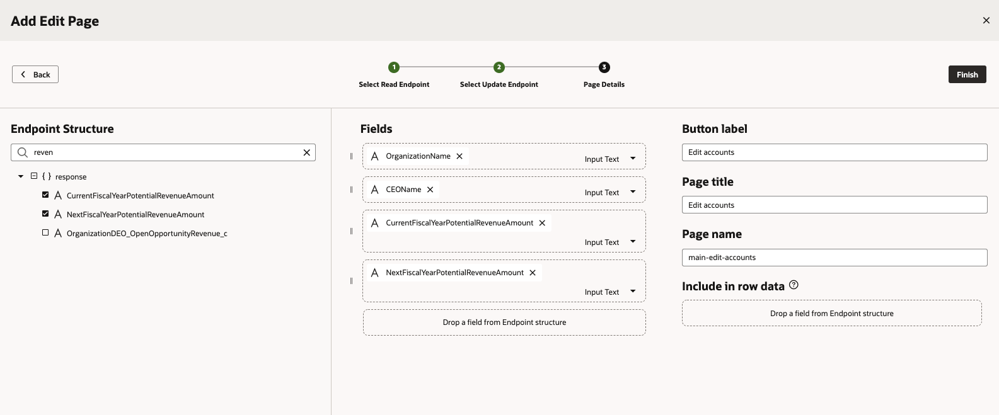
7. Click **Finish** to complete the quick start and create the page. Note that you'll end up on the Accounts search page, but now there is an Edit Accounts button at the top of the page.
	  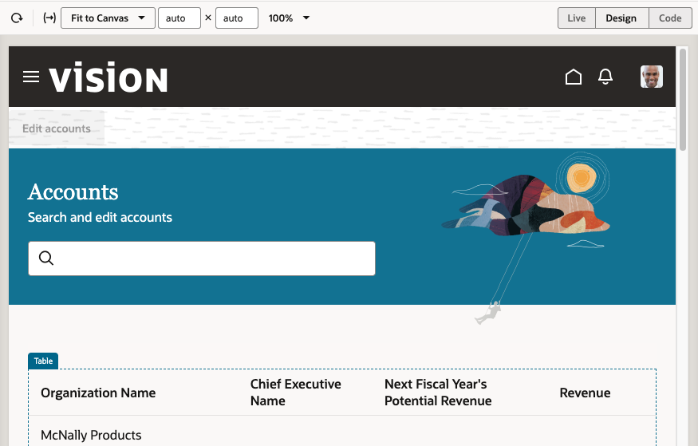

## Task 2: Create a Detail Page

We'll use a similar process to create a page where we can see more information on each account.

1. In the Design view of the application, select the table of accounts in either the structure pane or the visual editor.

2. In the properties palette, select the quick start tab.

  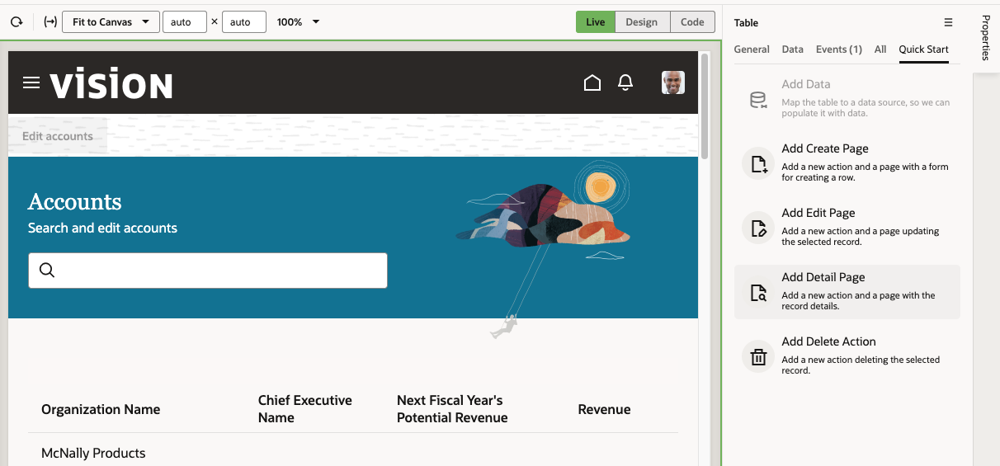
3. This time pick the **Add Detail Page**, this will create a page that will let us edit the details of a row we selected from the table.

4. In the dialog that pops up for selecting the object from which we pick a specific record the **Accounts** object is already selected, keep it that way and click **next**.
  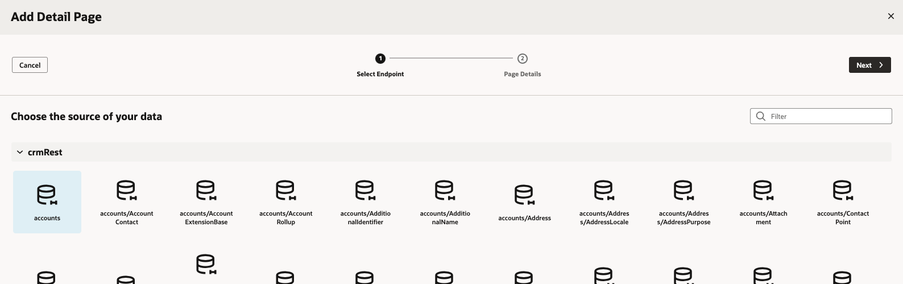

5. In the field selection page use the Filter at the top of list of fields to locate specific fields.

6. Select the following fields:
* OrganizationName
* CEOName
* OwnerName
* AddressLine1
* AddressLine2
* AddressLine3
* AddressLine4
* City
* County
* Country

  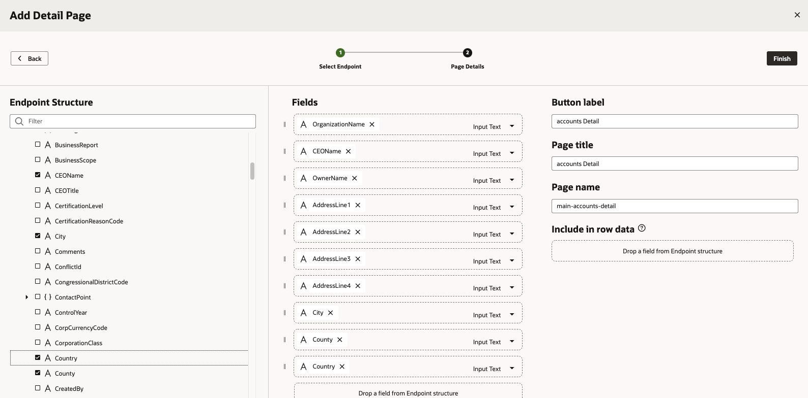
7. Click **Finish** to complete the quick start and create the page.
  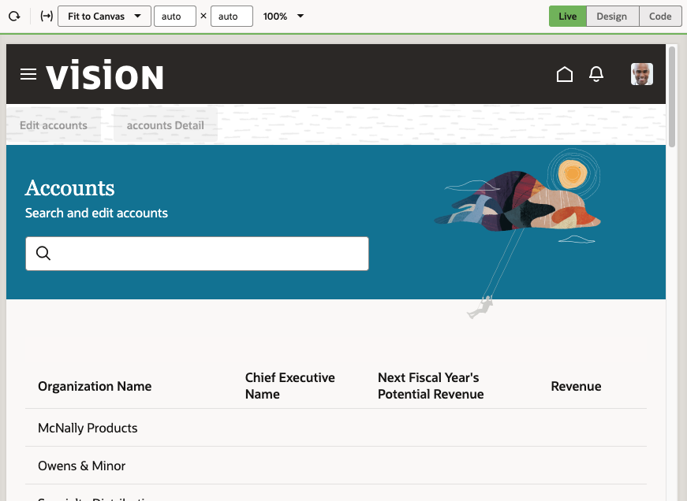
8. Let's preview the updated app. Click the Preview button to run the new app, and navigate to the other browser tab to see the updated page loaded.
  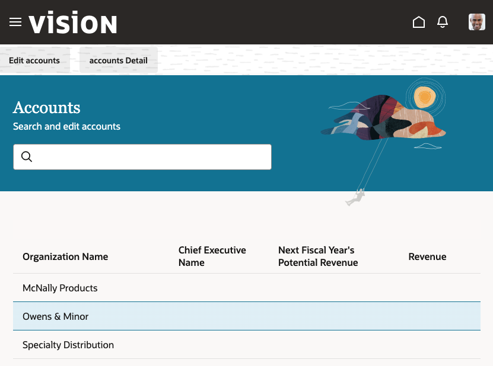
9. When the page loads, search to locate a specific record, then select that record in the table and click the **edit accounts** button, this takes you to the edit page. Update information such as the CEO Name and revenue for the account and click the **Save** button. The data is submitted to Oracle Cloud Apps and is saved there. It will show up in your table too.
  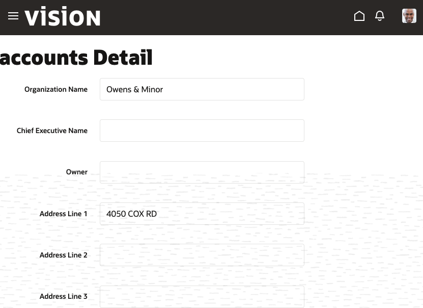
10. Click on another record and then click the "account Details" button to find out the address of the account. Use the browser's back button to return to the list page.
  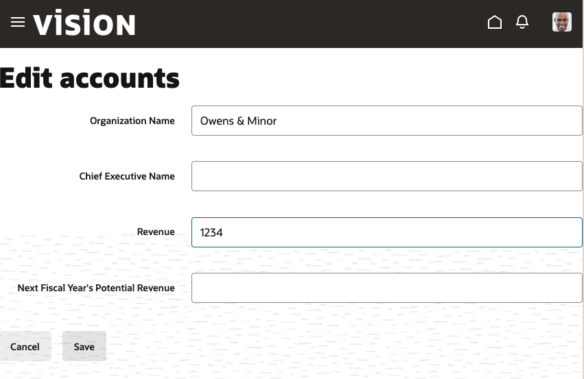
Our application is functioning well. The next step would be to fine tune the look and feel of the pages and apply some of the Redwood page templates.

## Learn More

*(optional - include links to docs, white papers, blogs, etc)*

* [Quick Starts](https://docs.oracle.com/en/cloud/paas/visual-builder/visualbuilder-building-appui/work-pages-and-flows1.html#GUID-DD40C71D-A8AE-43E2-A2F4-798AF3D49983)

## Acknowledgements
* **Author** - Shay Shmeltzer, Oracle Cloud Development Tools, August 2022
* **Contributors** -  Blaine Carter, Oracle Cloud Development Tools
* **Last Updated By/Date** - Shay Shmeltzer, Oracle Cloud Development Tools, August 2022
