# Applying RedwoodTemplates

## Introduction

This lab we'll apply a couple of the Redwood page template to improve the user experience of working with our pages. With the Redwood templates we will get the same look and feel of applications created by the Oracle developers for our pages, and we'll be able to leverage the usability features they implement.

Estimated Time: 10 minutes

### About Oracle Redwood Experience
The Redwood user experience and design is the results of years of usability study conducted by the Oracle Design Experience team. They implement clear patterns that help end users work with your application in a smooth way.

### Objectives

In this lab, you will:
* Using the simple create and edit template
* Using the foldout template

## Task 1: Applying Template to the Edit Page

1. Back in the Design view of the main-start page, select the **Live** button at the top, this allows you to interact with the application in the design interface in the same way you do when your run it. Click the Edit button for one of the rows.

	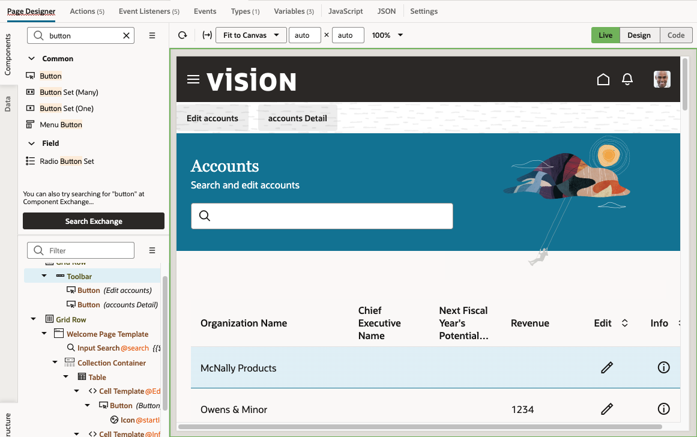

2. A new tab is opened with the Edit page in it, and data for the account you selected will be fetched. Switch back to the Design view for the page. This allows you to edit it.

  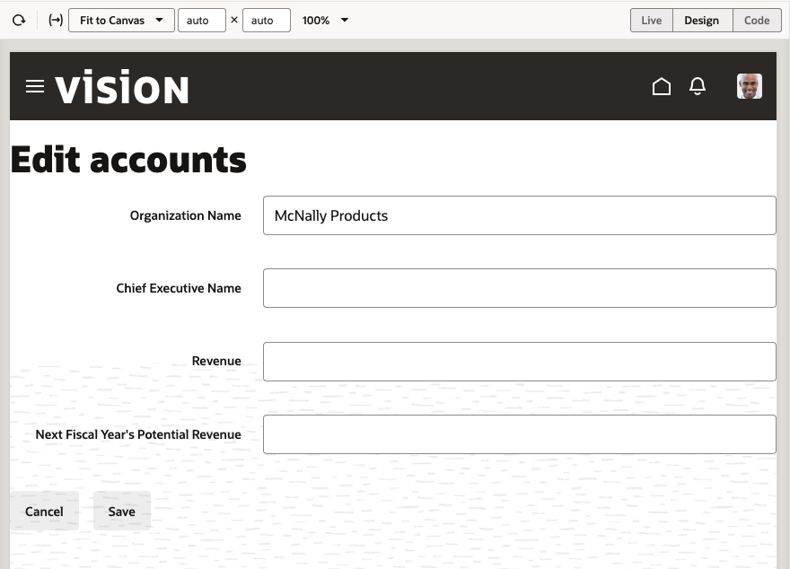
3. In the components palette search for **edit**, and locate the **Simple Edit and Create Template**. Drag it to the top of the page hierarchy in the structure pane.
	  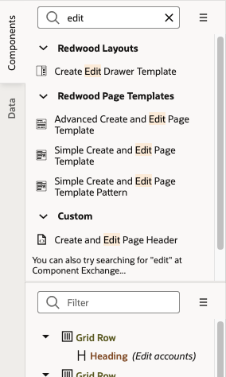

4. In the property inspector change the following template properties:

|Property |Value |
| --- | --- |
|Page Title | Edit Account |
|Page Subtitle | Add missing information |
|Primary Action Label | Save |
|Display Mode for the Header | Mixed |

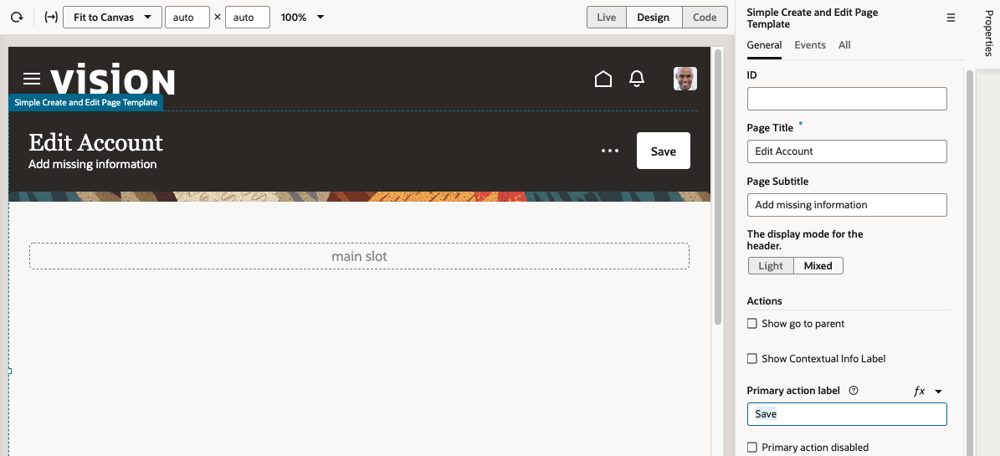

5. Now that the template is set, we should bring back the content of the page into it's right location in the template. In the structure pane locate the **Grid Row** inside which is your Form and the surrounding Validation Group.
	  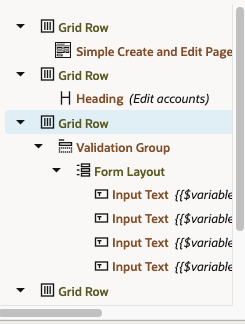
6. Drag the **Grid Row** and drop it onto the  **Simple Create and Edit Page Template** in the structure pane. Your page content should be back in place.
	  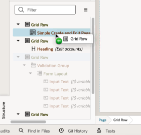
7. In the structure pane you can now delete the two other grid rows that contain the extra Heading and Toolbar that were used in the previous layout. The template we use have those built-in as part of the template.
	  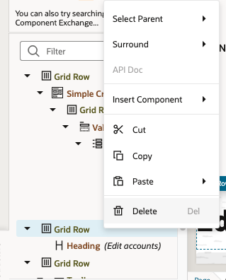
	  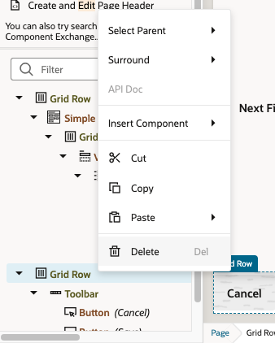

8.  Your page should look similar to this now:

	  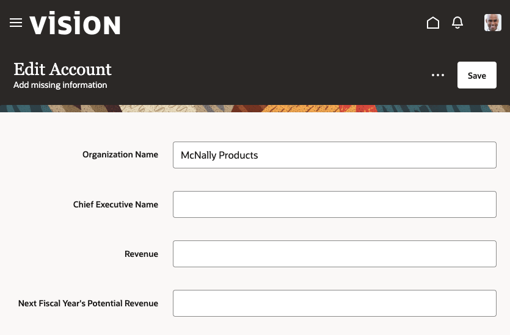
## Task 2: Hooking up Template's Action

1. The template we use has a primary action built in. We need to hook it up to save the data that we modified in the page. Select the **Simple Create and Edit Page Template** in the structure pane.

2. In the properties inspector switch to the **Events** tab. Click to create **New Event** and from the list select the **spPrimaryAction**. This built in action is mapped to the main button on the page.
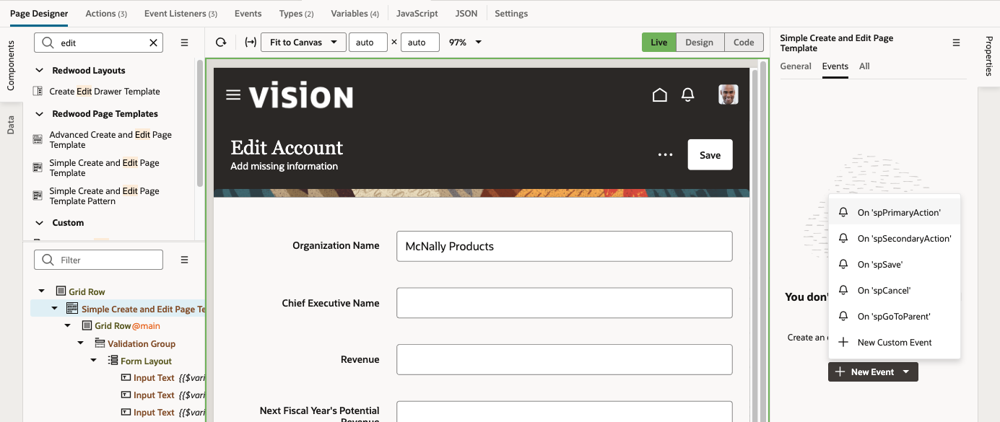

3. When the Action Chain editor opens up, drag a **Call Action Chain** action onto the + icon.
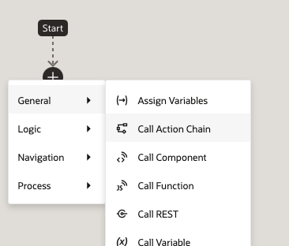

4. Map the **Action ID** property to the **SaveAccountChain** action chain created by the quick start.

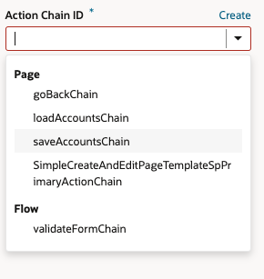
5. Switch back to the Page Designer view, switch to the **Live** mode, modify the revenue field value, and click the **Save** button in the page to verify that it works, saves the changes and navigates back to the Accounts page.
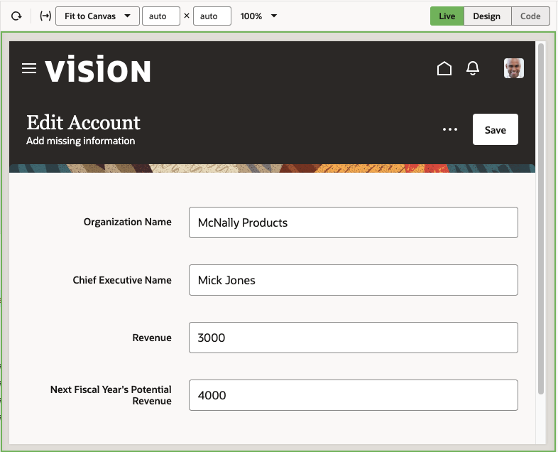

## Task 3: Using the Foldout Template

Now let's apply a template to the info page, we'll use the foldout effect in this page.

1. Back in the Design view of the main-start page, select the **Live** button at the top. Click the **Info** button for one of the rows.

	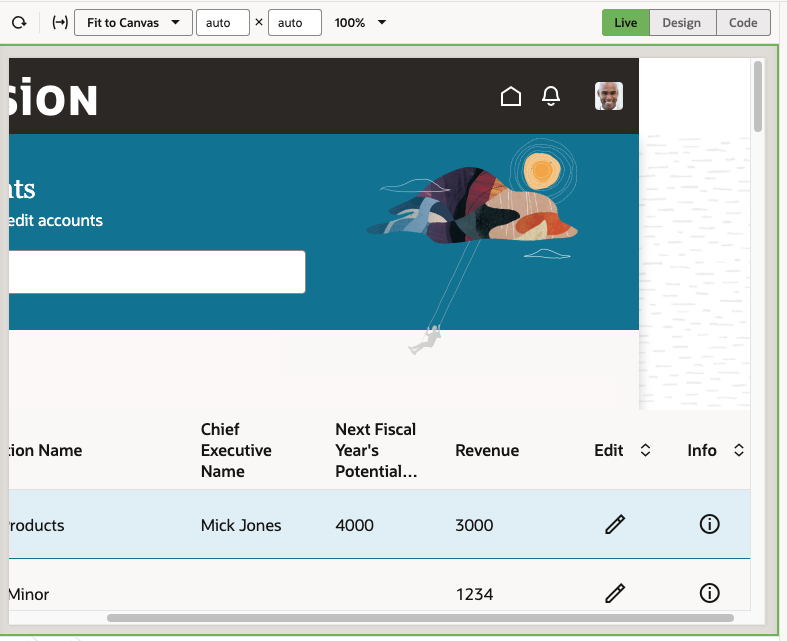

	> **Note:** Use this format for notes, hints, tips. Only use one "Note" at a time in a step.

2. A new tab is opened with the Details page in it, and data for the account you selected will be fetched. Switch back to the Design view for the page. This allows you to edit it.

  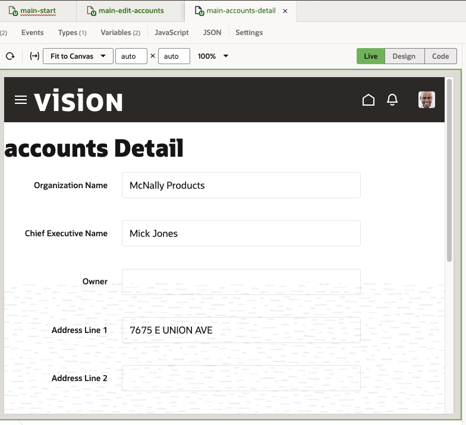
3. In the components palette search for **fold**, and locate the **Foldout Layout Horizontal Template Pattern**. Drag it to the top of the page hierarchy in the structure pane.
	  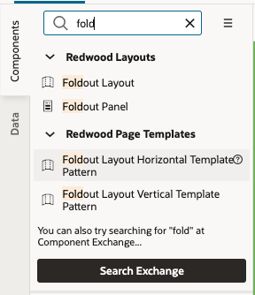

	  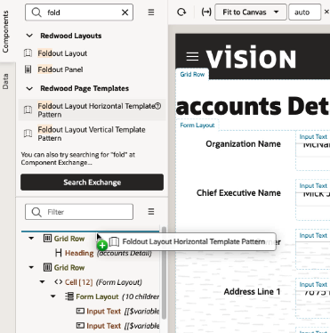

4. A pattern applies more than just a UI template and can add variables and actions to your page too.In the property inspector you'll note that various properties are mapped to variables. To change the values of these properties we'll update the default values of the variables.

5. Click the **Variables** tab of the page.

	  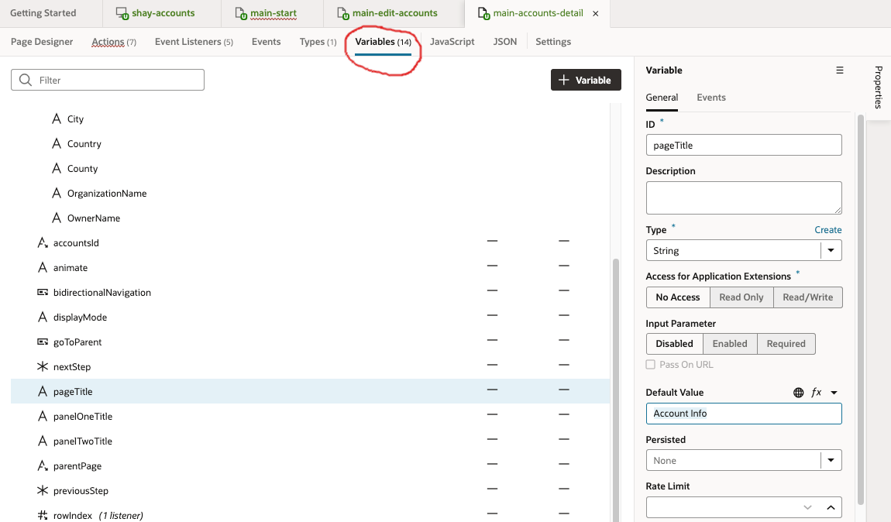

Locate each one of the following variables and modify the value in their **Default Value** property.
change the following template properties:

|Variable |Default Value |
| --- | --- |
|PageTitle | Account Info |
|PanelOneTitle| Company |
|PanelTwoTitle | Address |
|GoToParent | false |
|BiDirectionalNavigation | false |

	  

5. Go Back to the **Page Designer** tab to see the effect of your changes in the page. Now that the template is set, we should bring back the content of the page into it's right location in the template. In the structure pane locate the **Form Layout** inside which is your Form .

6. Drag the **Form Layout** and drop it onto the first **Div** of the first **Foldout Panel** in the structure pane. Your page content should be back in place. However, we are showing too much information in this panel, let's move some of it to the next panel.
	  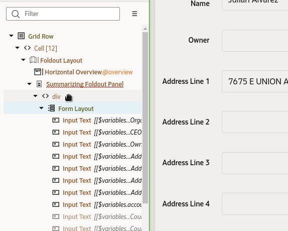
7. In the components palette locate the **Form Layout** component. Drag it into the second **Foldout Panel** and into the **Default** slot.
	  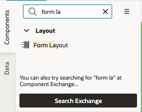
8. In the structure pane select the fourth field in the Form Layout, and **shift-select** all the other fields after that. Drag all of them in one go into the new **Form Layout** you created in the second foldout panel.

9. Select this second **Form Layout** in the structure pane, and update the **Label Edge** property of the form to **Start**. This will make this form look like the other form that is already on your page.

10. Switch back to the tab for the **main-start** page and click the preview button to see your completed app.

Your table now has action buttons that look good and work as expected. The next step is to fine tune the look and feel of the pages created by the quick starts and apply some Redwood templates to them.

## Learn More

*(optional - include links to docs, white papers, blogs, etc)*

* [Oracle Redwood](http://oracle.com/redwood)

## Acknowledgements
* **Author** - Shay Shmeltzer, Oracle Cloud Development Tools, August 2022
* **Contributors** -  Blaine Carter, Oracle Cloud Development Tools
* **Last Updated By/Date** - Shay Shmeltzer, Oracle Cloud Development Tools, August 2022
