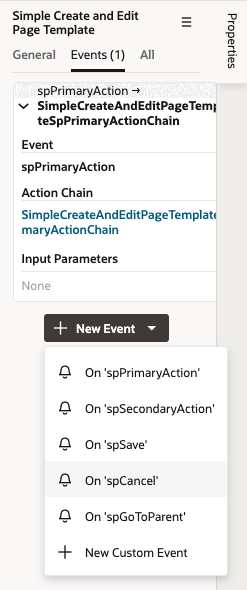
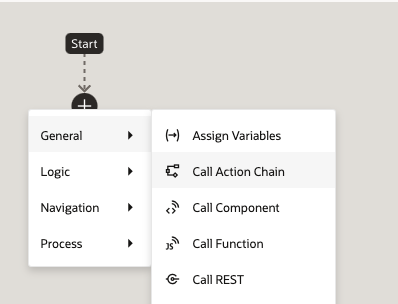
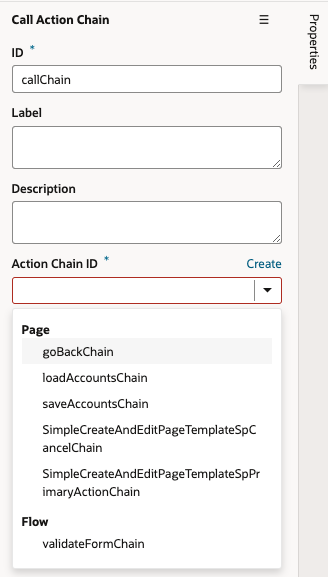
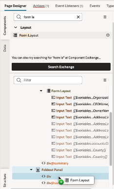
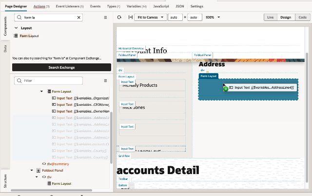
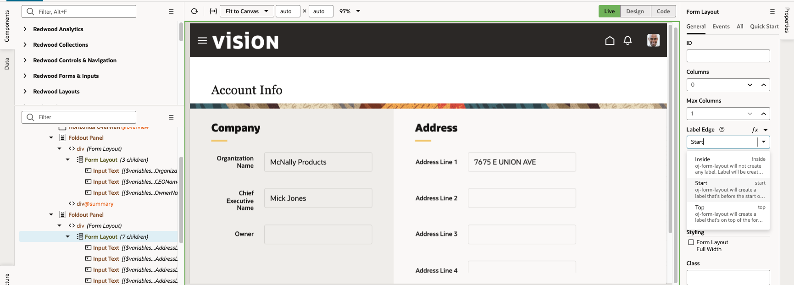

# Apply Redwood Templates

## Introduction

In this lab we'll apply a couple of the Redwood page templates to improve the user experience of working with our pages. The Redwood templates not only provide a consistent look and feel across the pages in our app (remember, we based our current page on the Welcome page template), but we'll also be able to leverage the usability features they offer.

Estimated Time: 20 minutes

### About the Oracle Redwood User Experience
The Redwood User Experience is a collective reinvention of how Oracle customers interact with technology and consume information. While Redwood includes a beautiful new set of user interface elements, including the templates you'll work with in this lab, it's also a philosophical approach to solving customer problems in a differentiated and satisfying way.

### Objectives

In this lab, you will:
* Use the Simple Create and Edit Page template
* Use the Foldout template

## Task 1: Apply a Template to the Edit Page

1. Back in Design view, click the **Live** button:

	

	Live mode allows you to interact with your app as if it were actually running.

2. Click the edit icon for one of the rows.

	The Edit page opens, with data for the account you selected displayed.

3. Switch back to Design mode so you can edit the page:

  

4. In the Components palette search for **edit**, and locate the **Simple Create and Edit Template**:
	  

5. Drag it to the top of the page hierarchy in the Structure pane, and drop it when you see a blue line above Grid Row.

6. In the Properties pane, set these properties to customize the template:

	|Property |Value |
	| --- | --- |
	|Page Title | Edit Account |
	|Page Subtitle | Add missing information |
	|Display Mode for the Header | Mixed |
	|Primary action label | Save |
	{: title="Template Properties"}

Your screen should look like this:
	  

Now that the template is set, let's redisplay the content of the page in its correct location in the template.

7. In the Structure pane, locate the **Grid Row** that corresponds to the Form Layout:
	  

8. Drag the **Grid Row** and drop it onto the **Simple Create and Edit Page Template**:
	  

	Your page content should be back in place.

	The template we applied already supplies a heading and toolbar, so we can remove the grid rows for those elements in the Structure pane.

9. Select the **Heading Grid Row**, right-click, then click **Delete**:  
	  

10.  Do the same thing for the **Toolbar Grid Row**:
 	

	Your page should now look something like this:

	  

## Task 2: Hook Up the Template's Actions

The Simple Create and Edit Page Template has a primary action built in, Save, but we need to make it functional.

1. In the Structure pane, select **Simple Create and Edit Page Template**.

2. In the Properties pane, click **Events**, then click **+ New Event**:

3. Select **On spPrimaryAction**, which will map the built-in action to the main button on the page.

4. In the Action Chain editor, drag **Call Action Chain** and drop it on the + icon om the middle (or you can click the + button in the diagram and choose the action from the menu):

5. In the Properties pane, map the **Action Chain ID** property to the **saveAccountsChain** action chain, which was created by the Quick Start.

6. Let's also add an action to handle the cancel button. In the Structure pane, select **Simple Create and Edit Page Template**.

7. In the Properties pane, click **Events**, then click **+ New Event**, and select the **On spCancel** event.

8. In the Action Chain editor, click the plus sign to add a **Call Action Chain**.

9. In the Properties pane, map the **Action Chain ID** property to the **goBackChain** action chain, which was created by the Quick Start.

10. Click the **Page Designer** tab and switch to **Live** mode.

11. In the **Revenue** field, enter a value, the click the **Save** button to verify that it works:

You should see the value you just entered reflected in the canvas area.

## Task 3: Use the Foldout Template

Now let's apply a template to the Details page.  In this case, we'll use a template that creates a foldout effect for the page.

1. In the Page Designer, click the **info** icon for one of the rows:

	

	You should see the Accounts Detail page for the row you chose:

  

2. In the Components palette, search for **fold**, and find the **Foldout Layout Horizontal Template Pattern**:

 

3. Drag the template to the top of the page hierarchy in the Structure pane, and drop it when you see the blue line above Grid Row:

	  

A pattern applies more than just a new look and feel to the user interface; it can add variables and actions to your page as well. In the Properties pane, notice that many template properties have been mapped to variables, but they may not be the values we want. To change the values of these properties, we'll need to update the variables' default values.

4. In the row containing the **Page Designer** tab, click **Variables**:

	  

5. Locate each of these variables, then modify its **Default Value** property as shown here. (You don't have to save anything between modifications.)

	|Variable |Default Value |
	| --- | --- |
	|pageTitle | Account Info |
	|panelOneTitle| Company |
	|panelTwoTitle | Address |
	|goToParent | false |
	|biDirectionalNavigation | false |
	{: title="Default values for page variables"}

	Here's a sample screenshot for the pageTitle variable:

	  

6. Click **Page Designer** to see the effect of your changes in the page.

	Now that the template is set, let's re-introduce the content of the page into its rightful location in the template.

7. In the Structure pane, locate the **Form Layout**.

8. Drag **Form Layout** and drop it onto the first **div** in the first **Foldout Panel** in the Structure pane:
 

	Your page content should be back in place. However, we're displaying too much information in this panel, so let's move some of it to the next panel.

9. In the Components palette, find the **Form Layout** component:
	  

10. Drag it to the second **Foldout Panel** and drop it onto the first **div**, selecting the **Default** slot:
		

11. In the Structure pane select, click the fourth field in the Form Layout, and **Shift-select** all the other fields after that. Drag all of them into the new **Form Layout** you created in the second foldout panel:
	  

12. Select this second **Form Layout** in the Structure pane.  In the Properties pane, change the **Label Edge** property to **Start**.
	  

	This will make the form look like the other form that is already on your page.
	(You can now delete the original "accounts Details" header that is at the bottom of the screen).

13. Switch back to the tab for the **main-start** page, then click **Preview** in the header to see your completed app.

Your work is finished! In the real world, at this point you would likely do more testing, then deploy your extension to your Oracle Fusion Cloud Applications instance. Thanks for completing this workshop!

## Learn More

* [Oracle Visual Builder Studio](https://docs.oracle.com/en/cloud/paas/visual-builder/index.html)

## Acknowledgements
* **Author** - Shay Shmeltzer, Oracle Cloud Development Tools, September 2022
* **Contributors** -  Marcie Caccamo, Blaine Carter, Oracle Cloud Development Tools
* **Last Updated By/Date** - Shay Shmeltzer, Oracle Cloud Development Tools, September 2022
