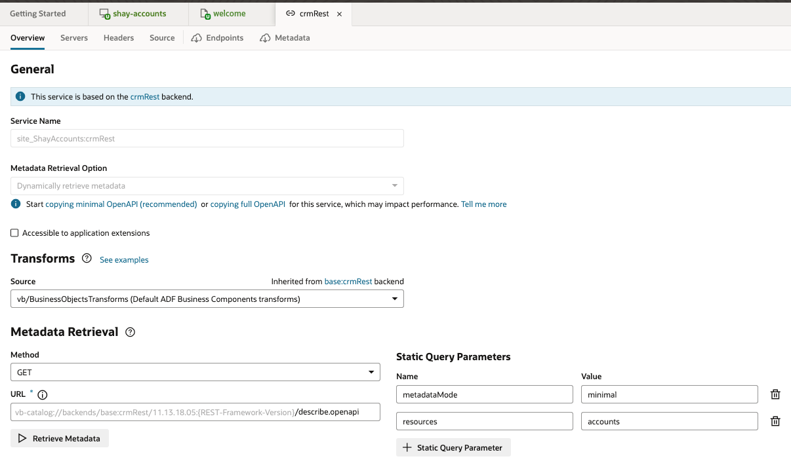
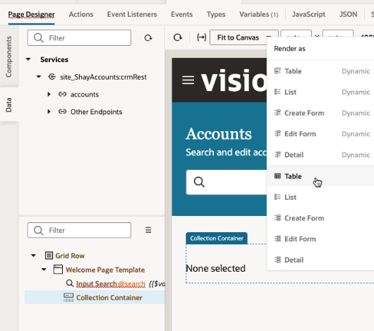
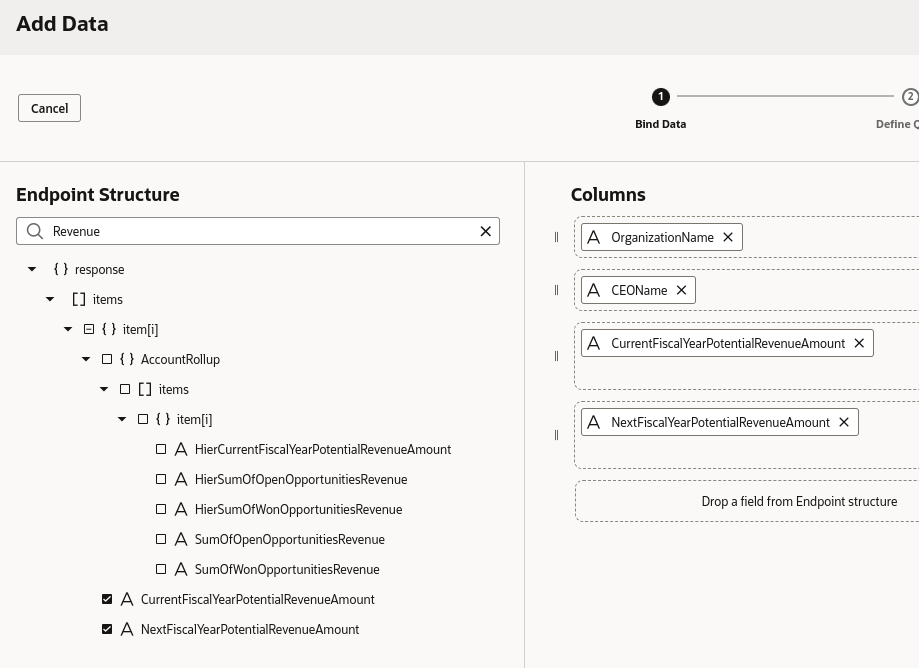
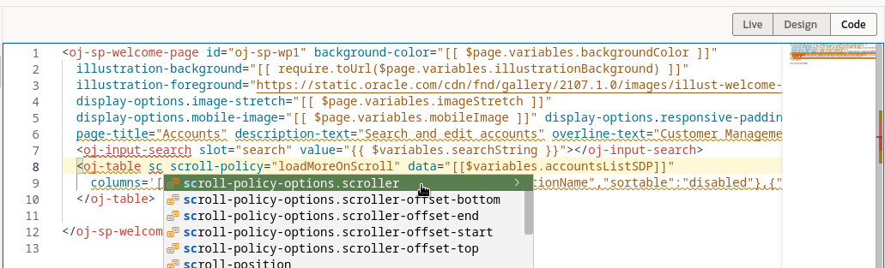

# Connecting to Oracle Fusion Apps Data

## Introduction

This lab walks you through creating a connection to data from Oracle Fusion Cloud Applications. We'll work with the service catalog in Visual Builder to browse available REST services, pick one up and show data from it in our page.

Estimated Time: 5 minutes

### About Oracle Cloud Apps REST APIs
Oracle Cloud Apps provide REST based access to information in the system. Visual Builder is built to use these endpoints leveraging a service catalog, single-sign-on and knowledge of advanced functionality of the services such as filtering and pagination.

### Objectives

In this lab, you will:
* Work with service catalog
* Leverage the data palette
* Define filtering on data
* Previewing your application

## Task 1: Browser the service catalog

Up until now we worked on the UI (front end) of your application, now we turn to work with the backend. Visual Builder Studio comes with a built in catalog that connects to your Oracle Fusion Apps catalog of services. This simplifies creating connection to use data from the apps.

1. On the left side application navigator click on the third tab "Services"

	

	> **Note:** Use this format for notes, hints, tips. Only use one "Note" at a time in a step.

2. Click + to create a new service connection.

3. You get three options for the source of your REST service connection. We'll use the first one and **Select from Catalog**, but just so you'll know the two other options let you define connection to:
 * REST services based on their OpenAPI/Swagger description (which can be useful for working with custom objects you created with the Application Composer that comes with Oracle SaaS)
* REST services based on their endpoints - this let you connect to any REST service available over the internet, which can be useful for integrating with third party apps.
	  

4. Click **Select from Catalog** and once loaded choose the catalog for **Sales and Services**. Note that you can use the same approach to access services from your HCM, ERP and SCM apps too. We encourage you to explore the other catalogs to see other business objects that are available in other areas of interest.
	  
5. From the list of objects available for you in the Oracle CX system choose **Accounts** (you can use the search box at the top to help locate the service). Then click **Create** button. This create a connection to the data object and adds it to your app.
	  
6. A tab with information about the service shows up. We'll keep all the default definition so you can **close the tab** and return to the tab for the main-start page.
	  

## Task 2: Add Data to your Page

1. In the page designer click the **Data** tab on the left and expend the services nodes until you can see the **Accounts** service.
	  
2. Drag and drop the Accounts service to the structure pane and drop it on the **collection container**.
	  
3. The Render As popup shows up. Visual Builder knows how to show data in multiple ways including various type of forms that let you modify data. For now we just want to show a table of the data. From the Render As choose the **Table** option (not the Table Dynamic).
	  
4. From the list of endpoints choose the first one **getMany** which shows the top object (an account).
	  
5. The Add Data dialog shows up and VB queries to find out which fields are available in the business object - as you'll see it is a long list of fields.

6. Use the Filter field at the top to locate and choose the following fields (use name, and then revenue as filters to find the fields):
* OrganizationName
* CEOName
* CurrentFiscalYearPotentialRevenueAmount
* NextFisicalYearPotentialRevenueAmount
	  
	  
Once the four fields are selected click Next once to get to the query definition step.

7. We are going to let the user filter the list of accounts. We do this by defining a filterCriterion for the REST endpoint. Click **FilterCriterion** on the right. This will show up the filter builder at the bottom of the dialog.
	  
8. **Click to Add Condition** in the Attribute field choose OrganizationName, keep the operator as **Contains ($co)**, and on the right side locate your search variable (type searchString) to get **$variable.searchString**. When done click **done** and then **Finish** to close the dialog.
	  
			  
					  
A table with the selected fields is added to your page and the data for it will be fetched live from Oracle SaaS.

9. To leverage the pagination capabilities of the service (and not fetch all the records available on startup) we'll add a scroll policy to the table.
10. Switch to the code view by pressing the **Code** button at the top of the preview.
					  
11. Locate the line that starts with <oj-table... that's the definition of the table. Stand in an empty space in the line click space and start typing **sc** note how code completion helps you choose the right property. Choose **scroll-policy-option.scroller** and in the value for the attribute use **"html"**.
					  
											  

The result code for the line should look similar to this:

		<oj-table scroll-policy-option.scorller="html" scroll-policy="loadMoreOnScroll" ...>

Switch back to the design mode to see the resulting table with data fetched into it.

We are now ready to preview the application's Functionality

11. Click the preview button at the top right of the page. This will prepare your application to be previewed and then will open a new tab in your browser where you can see your running app.
											  
12. Play around with your live app, providing search criteria to filter the list. Also note the smart pagination happening when you scroll through the records in the table. Records are being fetched as needed.
											  

Now that we have a running page that fetches data, the next step is to add pages that will allow us to edit the data and update Oracle's SaaS.

## Learn More

* [Service Connections](https://docs.oracle.com/en/cloud/paas/visual-builder/visualbuilder-building-appui/add-service-connections-your-extension1.html)

## Acknowledgements
* **Author** - Shay Shmeltzer, Oracle Cloud Development Tools, August 2022
* **Contributors** -  Blaine Carter, Oracle Cloud Development Tools
* **Last Updated By/Date** - Shay Shmeltzer, Oracle Cloud Development Tools, August 2022
