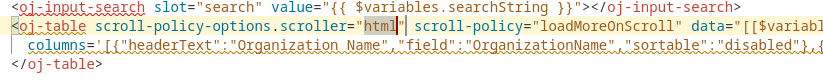

# Connect to Oracle Fusion Cloud Apps Data

## Introduction

This lab shows you how to create a connection to data that lives in Oracle Fusion Cloud Applications. We'll use the service catalog in VB Studio to browse the available REST services, pick one, then display data from it on our page.

Estimated Time: 15 minutes

### About Oracle Fusion Cloud Apps REST APIs
Oracle Fusion Cloud Apps provides REST-based access to its data. VB Studio is built to use those endpoints by leveraging a service catalog, single sign-on, and knowledge of the services' advanced functionality, such as filtering and pagination.

### Objectives

In this lab, you will:
* Work with the service catalog
* Leverage the Data palette
* Define filtering on data
* Preview your application

## Task 1: Browse the Service Catalog

Up until now we've worked on the UI (front end) of your application, but now it's time to work with the backend. VB Studio comes with a built-in catalog that automatically connects to your Oracle Fusion Cloud Apps catalog of services, which makes it easy to create a connection to the data from those Apps.

1. On the far left side of the Designer's navigator, click the third tab, **Services**:

	

2. Click **+ Service Connection**.

	There are three options for defining the source of your REST service connection. We'll use the first one, **Select from Catalog**, but it's important to know what the other two options do too.  With these, you can define connections to:
	 * REST services based on their OpenAPI/Swagger description. This can be useful when working with custom objects you created with the Application Composer, which comes with Oracle SaaS.
	* REST services based on their endpoints. This option allows you connect to any REST service available over the internet, which can be useful for integrating with third-party apps.
		  

4. Click **Select from Catalog**. When it loads, click **Sales and Services**:
	  

	You can use this approach to access services from your HCM, ERP, and SCM Apps too. You may want to take a moment now to explore these catalogs and see the available business objects for the Apps you use.

5. From the list of objects in the Oracle CX system, choose **Accounts**, using the filter at the top to help you, if needed:
	  

6. Click **Create**. This creates a connection to the data object and adds it to your app.		

	A tab with information about the service is displayed:
	  
		We'll keep all the default definitions here, so you can close this tab and return to the tab displaying the main-start page.
## Task 2: Add Data to Your Page

1. In the Designer, click the **Data** tab on the left and expand the Services node until you can see the **accounts** service:
	  
2. Drag and drop the accounts service to the Structure pane and drop it on the **Collection Container**:
	  

	VB Studio can display data in many different formats, including various types of forms that let your users modify data. In this case we just want to display data in a table.   

3. In the **Render as** pop-up, choose **Table** (not Table Dynamic, the first option):
	  
4. Choose the first endpoint, **getMany**, which shows the top object (an account):
	  

	The Add Data dialog displays all the fields that are available for the accounts business object&mdash;quite a long list!  

5. Using the filter field at the top, locate each of these fields, then click each field name to add it as a column in our table:
	* OrganizationName
	* CEOName
	* CurrentFiscalYearPotentialRevenueAmount
	* NextFisicalYearPotentialRevenueAmount

	Your screen should look like this:
	  

6. Click **Next**.

	We want the user to be able to filter the list of accounts, so we must define a *filterCriterion* for the REST endpoint.

7. Click **FilterCriterion** on the right, under Target.
	This displays the filter builder at the bottom of the dialog:
	  
8. In the filter builder, click **Click to add condition**.
9. Click in the **Attribute** field, then start typing **Orga ...** until you can choose **OrganizationName**:
	  

10. Keep the operator as **Contains ($co)**. In the **Attribute** field on the right, locate the search variable you created by typing **searchString**, which will add **$variable.searchString** to this field:
			  

11. Click **Done**.  Your screen should look like this: 			
					  

	The filter we just built now essentially says: If the organization name contains the user's search string (that is, the variable name), then filter the data in the table to show that row.

12. Click **Finish** to close the dialog.

In a moment we'll see that a table with the selected fields has been added to your page. The data for this table will be fetched live from Oracle SaaS using the service connection we defined in this lab.

To leverage the service's pagination capabilities (as opposed to fetching all the records available on start up), let's add a scroll policy to the table.

13. Switch to Code view by clicking **Code** button at the top of the preview:
					  
14. Locate the line that starts with <oj-table.., which is the definition for the table.

	There's already a default scroll policy here, but we're going to add another one.

15. Position your cursor in the space right after <oj table and type **sc**:
					  

	Notice how VB Studio's code completion feature helps you choose the right property.

16. Choose **scroll-policy-option.scroller**. For the attribute, use **"html"**:
											  

	  The code for this line should now look similar to this:

		<oj-table scroll-policy-option.scroller="html" scroll-policy="loadMoreOnScroll" ...>

17. Click **Design** so we can see the resulting table with data fetched into it. We can take an even closer look at the app by using the Preview feature.  

18. In the Designer's header, click **Preview** in the top right:
											  

	This opens a new tab in your browser where you can see your running app, complete with our new table.

At this point you may want to play around with your live app, using different keywords to filter the list by organization name. Also, notice the smart pagination that occurs when you scroll through the records in the table; that is, records are fetched only as needed.
											  

Now that we have a running page that fetches data, the next step is to add pages that will allow us to edit the data, which means updating the Oracle's SaaS business object behind the scenes.

## Learn More

* [Service Connections](https://docs.oracle.com/en/cloud/paas/visual-builder/visualbuilder-building-appui/add-service-connections-your-extension1.html)

## Acknowledgements
* **Author** - Shay Shmeltzer, Oracle Cloud Development Tools, August 2022
* **Contributors** -  Marcie Caccamo, Blaine Carter, Oracle Cloud Development Tools
* **Last Updated By/Date** - Shay Shmeltzer, Oracle Cloud Development Tools, August 2022
