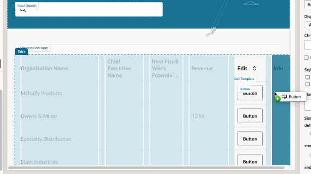
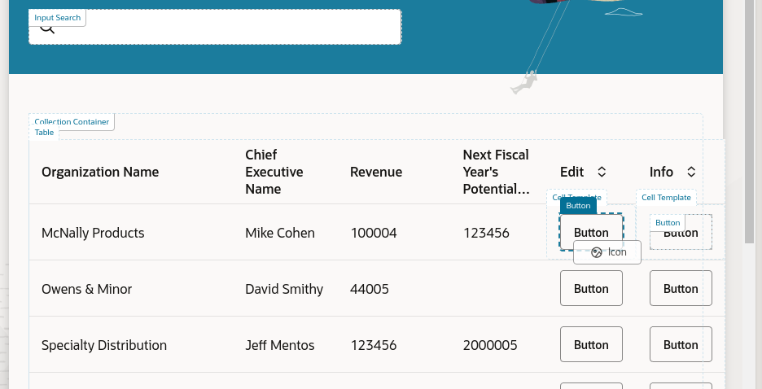

# Add Buttons and Action Chains

## Introduction

In this lab we'll learn how to work with events and action chains to add functionality to our application.

Estimated Time: 10 minutes

### About Action Chains
In VB Studio, you use a visual editor to create business logic that responds to events occurring in the user interface.  Each sequence of business logic is called an *action chain*.  For example, an action chain might dictate what happens when a user clicks a button on a page.

### Objectives

In this lab, you will:
* Add user interfaces components to your page
* Define action chains that respond to UI events
* Work with variables

## Task 1: Add Empty Columns To the Table

While the Quick Starts added buttons to the top of the page for editing and displaying details, it might be nicer to have buttons in each row of the table for those functions, so users don't have to select the row first. Let's see how we can make that happen.

First we'll add two columns to the table, to hold each of the buttons.

1. Back in Design view, select the table in either the Structure pane or the canvas:

	

2. In the Properties pane, click the **Data** tab, then click the **Edit Columns** icon next to the Table Columns heading:  

  

3. Click **New Empty Column** twice to add two empty columns to your table, then click anywhere outside the pop-up to dismiss it:
	  

	The new columns are represented by the vertical lines at the far left in the Table Columns area (in this example, under the word **Revenue**).

4. Click the vertical line for the first empty column, then click the arrow on the right to see this column's details.

5. In the **Columns, Header Text** field, type **Edit**, then click the **Table Columns** back arrow to go back to the Data tab:
	  

6. Repeat step 5 for the second empty column, this time setting **Columns, Header Text** to **Info**:
	  

Your screen should now look something like this:  

  

We've now added two more columns to our table, which you can see in the canvas area.  (You may need to close some tabs or resize some areas to see them.)

## Task 2: Add Icon Buttons

Let's use the empty columns we just created to add some icon-based buttons that look like a pencil (for Edit) and an exclamation point (for Details).  Then we'll wire up these buttons to some actions so that they'll do something when the user clicks on them.

1. In Design view, click **Components** to display the Components palette, then search for the **Button** component:

	

2. Drag the Button component and drop it into the empty Edit column in your table. The editor highlights the location you can drop the button into; make sure you drop it into the middle of the column:
	

3. Drag another Button component into the Info column:
	

4. Back in the Components palette, locate the Icon component:
	

5. Drag the Icon component into the Structure pane and drop it on to the first button (the one for the Edit column). When prompted, choose **startIcon** as the slot for the icon:
	

6. In the Properties pane, click the image under Icon to choose a different image:
	

7. In the Icon Gallery, search for **Edit**, then click **Select**:
	

8. Repeat steps 5-7, this time dragging the Icon component onto the second button in Structure view:

	

9. Use the Properties palette to select the **Information** icon from the Icon Gallery:
	

10. In the canvas area, click any **Edit** button, then use the Properties pane to set these properties:

| Property | Value |
| --- | --- |
| Display | Icons |
| Chroming |Borderless |
{: title="Button Properties"}

11. Repeat step 10 for the **Information** button.

We now have nice-looking icon-based buttons for each row, but so far they don't do anything. We'll change that in the next task.
	

## Task 3: Define Action Chains

VB Studio apps are event-driven, which means that an event is fired when an end user performs an operation in the user interface. As a developer, you can create an *action chain* that kicks off a series of actions in response to an event. Let's see how to create an action chain visually using the Action Chains editor.

1. In Design view, select the Edit button, then click **Events** in the Properties pane:

	

2. Click **+ New Event**, then **On ojAction**:
	

	You're now in the Action Chain Editor.

	On the left side, you can see all the actions you can define, including calling REST endpoints, invoking JavaScript functions, and many more. The Quick Starts we used to create the Edit and Details pages already created action chains that invoke the needed logic for us. All we need to do is call those action chains from the new action chain we're defining.

3. From the list of actions on the left, drag **Call Action Chain** and drop it onto the + sign:
	

4. In the Properties pane, click the arrow in the **Action Chain ID** field and select **NavigateToEditAccountsChain** from the drop-down:
	

 Let's take a step back.  We've set things up so that when the Edit button is clicked, we will navigate to the Edit page created for us by the Quick Start. However, as we can see from the Properties pane, this action chain expects a value for the input parameter **accountsId**.

5. Click the **Not Mapped** label:
	

 The Assign Input Parameters dialog allows us to easily map values to variables using drag and drop.

6. Under Sources->Action Chain on the left, drag the action chain variable **key** and drop it on the **accountsid** parameter in the Target area on the right:
	

7. Click **Save**.

8. Click **Page Designer** to go back to the visual view of the main-start page:
	

9. Repeat steps 1-8, this time for the **Info** button. When creating your **On ojAction** action chain, use the **Call Action Chain** action, and select **NavigateToAccountsDetailChain** in the Action Chain ID field. As before, map the **key** variable to the accountsId input parameter.
	

	Let's take another look at the app to see our changes in action.

10. Click **Preview** in the header, then open the new browser tab.

 You can now click the Edit and Info icons in a row to open the Edit and Detail pages for the organization selected. Pretty cool!

 We don't need the buttons at the top of the page anymore, so let's remove them.
 	

12. In the Page Designer, go to the Structure pane.  Under **Toolbar**, right-click each button and click **Delete** to remove it from your page:

	

Your table now has buttons that are attractively rendered and that work as expected. The next step is to fine-tune the look and feel of the pages created by the Quick Starts by applying some Redwood templates to them.

## Learn More

* [Action Chains](https://docs.oracle.com/en/cloud/paas/visual-builder/visualbuilder-building-appui/work-action-chains.html)

## Acknowledgements
* **Author** - Shay Shmeltzer, Oracle Cloud Development Tools, August 2022
* **Contributors** -  Blaine Carter, Oracle Cloud Development Tools
* **Last Updated By/Date** - Shay Shmeltzer, Oracle Cloud Development Tools, August 2022
