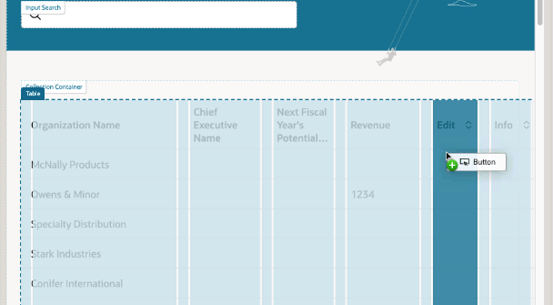

# Add Buttons and Action Chains

## Introduction

In this lab we'll learn how to work with events and action chains to add functionality to our application.

Estimated Time: 10 minutes

### About Action Chains
In VB Studio, you use a visual editor to create business logic that responds to events occurring in the user interface.  Each sequence of business logic is called an *action chain*.  For example, an action chain might dictate what happens when a user clicks a button on a page.

### Objectives

In this lab, you will:
* Add user interfaces components to your page
* Define action chains that respond to UI events
* Work with variables

## Task 1: Add Empty Columns To the Table

Earlier, you created pages for displaying and editing the accounts data.  You will configure those later.  Now you will add buttons in each row of the table that will be used to navigate to those pages. Let's see how we can make that happen.

First we'll add two columns to the table, to hold each of the buttons.

1. Back in Design view, select the table in either the Structure pane or the canvas:

	

2. In the Properties pane, click the **Data** tab, then click the **Edit Columns** icon next to the Table Columns heading:  

  

3. Click **New Empty Column** twice to add two empty columns to your table, then click anywhere outside the pop-up to dismiss it:
	  

	The new columns are represented by the horizontal lines at the far left in the Table Columns area (in this example, under the word **Revenue**).

4. Click the horizontal line for the first empty column, then click the arrow on the right to see this column's details.

5. In the **Columns, Header Text** field, type **Edit**, then click the **Table Columns** back arrow to go back to the Data tab:
	  

6. Repeat step 5 for the second empty column, this time setting **Columns, Header Text** to **Info**:
	  

Your screen should now look something like this:  

  

We've now added two more columns to our table, which you can see in the canvas area.  (You may need to close some tabs or resize some areas to see them.)

## Task 2: Add Icon Buttons

Let's use the empty columns we just created to add some icon-based buttons that look like a pencil (for Edit) and a circled 'i' (for Details).  Then we'll wire up these buttons to some actions so that they'll do something when the user clicks on them.

1. In Design view, click **Components** to display the Components palette, then search for the **Button** component:

	

2. Drag the Button component and drop it into the empty Edit column in your table. The editor highlights the location you can drop the button into; make sure you drop it into the middle of the column:
	

3. Drag another Button component into the Info column:
	

4. Back in the Components palette, locate the Icon component:
	

5. Drag the Icon component and drop it on to the first button (the one for the Edit column). You can do this either in the visual editor or in the Structure pane. When prompted, choose **startIcon** as the slot for the icon:
	

6. In the Properties pane, click the image under Icon to choose a different image:
	

7. In the Icon Gallery, search for **Edit**, then click **Select**:
	

8. Repeat steps 5-7, this time dragging the Icon component onto the second button in Structure view:

	

9. Use the Properties palette to select the **Information** icon from the Icon Gallery:
	

10. In the canvas area, click any **Edit** button, then use the Properties pane to set these properties:

| Property | Value |
| --- | --- |
| Display | Icons |
| Chroming |Borderless |
{: title="Button Properties"}

11. Repeat step 10 for the **Information** button.

We now have nice-looking icon-based buttons for each row, but so far they don't do anything. We'll change that in the next task.
	

## Task 3: Info button Action Chain

VB Studio apps are event-driven, which means that an event is fired when an end user performs an operation in the user interface. As a developer, you can create an *action chain* that kicks off a series of actions in response to an event. Let's see how to create an action chain visually using the Action Chains editor.

1. In Design view, select the Info button, then click **Events** in the Properties pane:

	

2. Click **+ Event Listener**, then **On ojAction**. Note if you see an onClick event instead, it means you selected the icon instead of the button - switch to select the button in the structure panel.:
	

	You're now in the Action Chain Editor.

	On the left side, you can see all the actions you can define, including calling REST endpoints, invoking JavaScript functions, and many more.

3. From the list of actions on the left, drag **Navigate To Page**
	
  and drop it onto the canvas:
	

4. In the Properties pane, locate the page list and click **Create**:
	

5. In **Create Page** window, set the **Page Id** to **details**:

6. Select the **Horizontal Foldout Layout Page Template**:

7. Click **Create**:
	

8. In the properties panel, locate the **rowIndex** parameter and click **Select Variable**:

  

9. Under **Action Chain** select  **key**:

  

10. In the properties panel, locate the **parentPage** parameter and click **Select Variable**:

  

11. Under **Flow / System** select  **currentPage**:

  

Your **ButtonActionChain** should look like this:

  

## Task 4: Edit button Action Chain

1. Switch back to the Design view in the Page Designer tab, select the Edit button, then click **Events** in the Properties pane:

	

2. Click **+ Event Listener**, then **On ojAction**. Note if you see an onClick event instead, it means you selected the icon instead of the button - switch to select the button in the structure panel.:
	

	You're now in the Action Chain Editor.

	On the left side, you can see all the actions you can define, including calling REST endpoints, invoking JavaScript functions, and many more.

3. From the list of actions on the left, drag **Navigate To Page**
	
  and drop it onto the canvas:
	

4. In the Properties pane, locate the page list and click **Create**:
	

5. In **Create Page** window, set the **Page Id** to **edit**:

6. Select the **Simple Create and Edit Page Template**:

7. Click **Create**:
	

 Let's take a step back.  We set things up so that when the Edit button is clicked, we will navigate to a new edit page created with the Redwood **Simple Create and Edit Page Template**. However, since we intend to use this as an **Edit** page, we need to enable an input parameter that we can use to link the record on the welcome page to the record being edited in the new page.

8. Click the **Go to Page** link to open the new page:
	

9. Switch to the **variables** tab:

  

10. In the list of variables, click on **objectId**:

  

11. In the properties on the right set **Input Parameter** to **Required**:

  

12. Switch back to **welcome** and open the **Actions** tab:

  

13. Switch to **ButtonActionChain1** then click on the **Navigate To Page** action:

  

14. In the properties panel, locate the **objectId** parameter and click **Select Variable**:
If you don't see the parameter, you may need to refresh your screen.

  

15. Under **Action Chain** select  **key**:

  

Your **ButtonActionChain1** should look like this:

  

You have created two new pages for your application and setup buttons to navigate to them.

Let's move on to the next lab, where we'll learn how to configure the Account Details page.

You may now **proceed to the next lab**.

## Learn More

* [Action Chains](https://docs.oracle.com/en/cloud/paas/visual-builder/visualbuilder-building-appui/work-action-chains.html)

## Acknowledgements
* **Author** - Shay Shmeltzer, Oracle Cloud Development Tools, September 2022
* **Contributors** -  Marcie Caccamo, Blaine Carter, Oracle Cloud Development Tools
* **Last Updated By/Date** - Blaine Carter, Oracle Cloud Development Tools, May 2023
