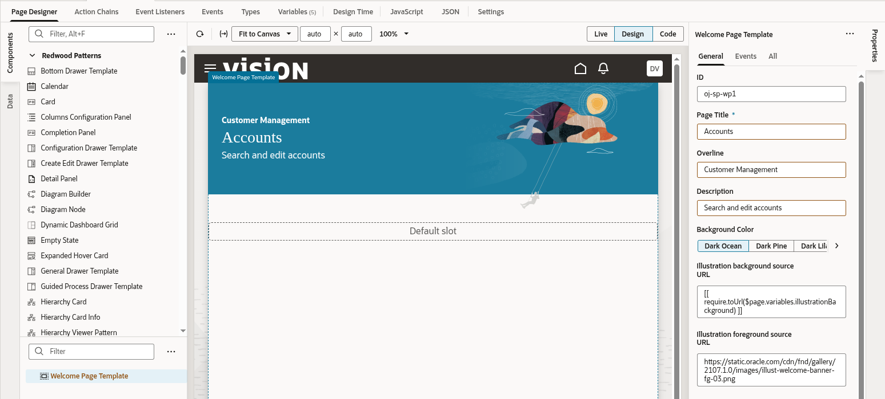

# Creating Your First Page

## Introduction

In this lab we'll use the Redwood Welcome Page template, along with Oracle JET UI components, to create a page that connects to an Oracle SaaS object.  Our page will display a list of accounts, and allow the list to be filtered.

Estimated Time: 5 minutes

### Objectives

In this lab, you will:
* Get familiar with the development environment
* Learn to create pages
* Leverage Redwood templates and components

## Task 1: Create an App UI

You should now be in the Designer, VB Studio's visual editor. We'll start by creating our own *App UI*, which is simply an application that includes a user interface component in the form of Visual Builder pages and flows. With App UIs, you can create new interfaces that address specific business needs for your company.

1. On the left side of the Designer, click **+ App UI**:  

	

	> **Note:** Use this format for notes, hints, tips. Only use one "Note" at a time in a step.

2. In the Create App UI dialog, provide a name in the form **YourName-Accounts**, then click **Create**:

  

3. In the Diagram view on the right, you can see the flows and pages for this App UI. A flow is a part of your application that contains pages that relate to each other. An application can contain multiple flows, and a flow can contain many pages. In this case we have one flow, *main*, and one page, *main-start*:

  

4. Double-click  **main-start** to open the page in the Page Designer:

  

## Task 2: Design Your Page

1. Let's explore the areas of the visual editor. Note that you can click on the various tabs to expand/collapse areas of your development environment.

  

  | #| Tab | Functionality |
  | --- | --- | --- |
  | 1 | Components | Contain UI components you can add to a page  |
  | 2 |Data | List data objects you can work with - based on connections you created to SaaS objects |
  | 3 | Structure | Hierarchical view of the structure of your page |
	  | 4 | Properties | A declarative way to define the properties of the selected component in your page |
	  | 5 | Visual Editor | Shows you a design/live and code view of your page content |
{: title="IDE areas"}

2. The components palette contains over a hundred UI components that you can drag and drop onto your pages to design your interfaces. We are going to leverage page templates designed by Oracle's Design team for the Redwood apps to accelerate our application development. The templates provide a responsive user experience and will adjust your application to the device accessing it.

3. Use the search box at the top of the components palette to search for **welcome** which will find the **welcome page template**. Drag the component from the component palette and drop it on the visual editor.  
  

4. Let's set some properties of the template. Click the **All** tab in the component palette and modify the following properties:

| # | Property | Value |
| --- | --- | --- |
| 1 | Background Color | Choose your preferred color  |
| 2 |Page Title | Accounts |
| 3 | Description Text| Search and edit accounts |
| 4 | Illustration Foreground | https://static.oracle.com/cdn/fnd/gallery/2107.1.0/images/illust-welcome-banner-fg-03.png |
{: title="Template Properties"}

  

## Task 3: Adding a search component and defining a variable

1. In the search box for the components palette type **search**. This will locate a component called **input search**.
2. Drag the input search and drop it on the page in the visual editor (or onto the structure pane on top of the welcome template). A popup will let you choose into which slot of the template to drop the component. Drop it into the **search slot**.
  

3. We need to keep track of the term the user is searching for. To do that we'll use a page variable.
While the input search is selected in the visual editor, click the **data** tab in the properties palette.

4. Click the little arrow at the top right of the value field to popup a list of variables.

5. Click the create **create variable** next to the page to create a page level variable. Note that we have multiple scopes for variables which makes it easy to share the values of these variables across pages and flow in the application when needed.
  

6. For the id of the variable type **searchString** and keep the type as String and click create. The value property now has a reference to the variable in it.
  

## Task 4: Adding a collection container and working with the structure pane

1. In the search box for the components palette type **collection**. This will locate a component called **collection container**.
2. Drag the collection container to the structure pane onto the Welcome Page template.
  
3. Select the **default** slot as the location for the collection container.
  
The layout of our first page is ready now, and the next step is to add some data to the page from Oracle Fusion Cloud Apps.
Note how so far all the design of the page was done with simple drag and drop functionality and setting properties. This visual development approach is key to the productivity offered by Visual Builder. Note however that there is a code button at the top right of the visual preview area. If you'll click on it you'll be able to see the actual HTML code used in your page. The code can be modified directly if needed, but for now we'll return to the design view by clicking the design button.
  

Now that our layout for the page is ready, it is time to get some data from Oracle SaaS into the page, which is what the next lab does.

## Learn More

* [Use the Page Designer](https://docs.oracle.com/en/cloud/paas/visual-builder/visualbuilder-building-appui/get-started1.html#GUID-CC2B203D-51D3-4408-8D0B-4E26C86BCBC0)
* [Oracle JET](http://oracle.com/jet)

## Acknowledgements
* **Author** - Shay Shmeltzer, Oracle Cloud Development Tools, August 2022
* **Contributors** -  Blaine Carter, Oracle Cloud Development Tools
* **Last Updated By/Date** - Shay Shmeltzer, Oracle Cloud Development Tools, August 2022
