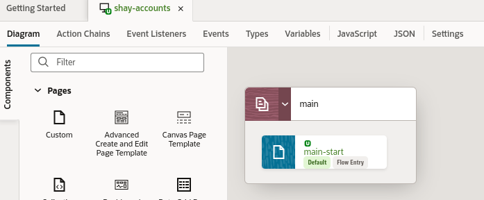
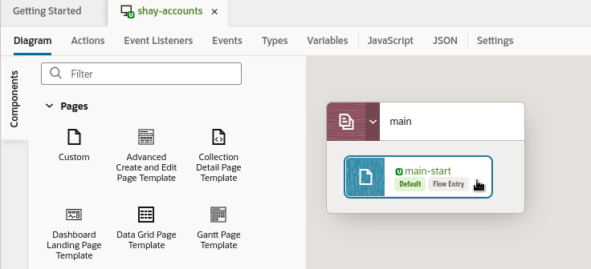
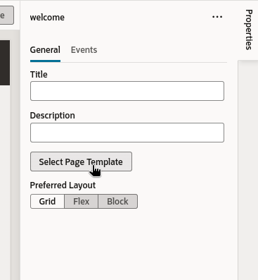
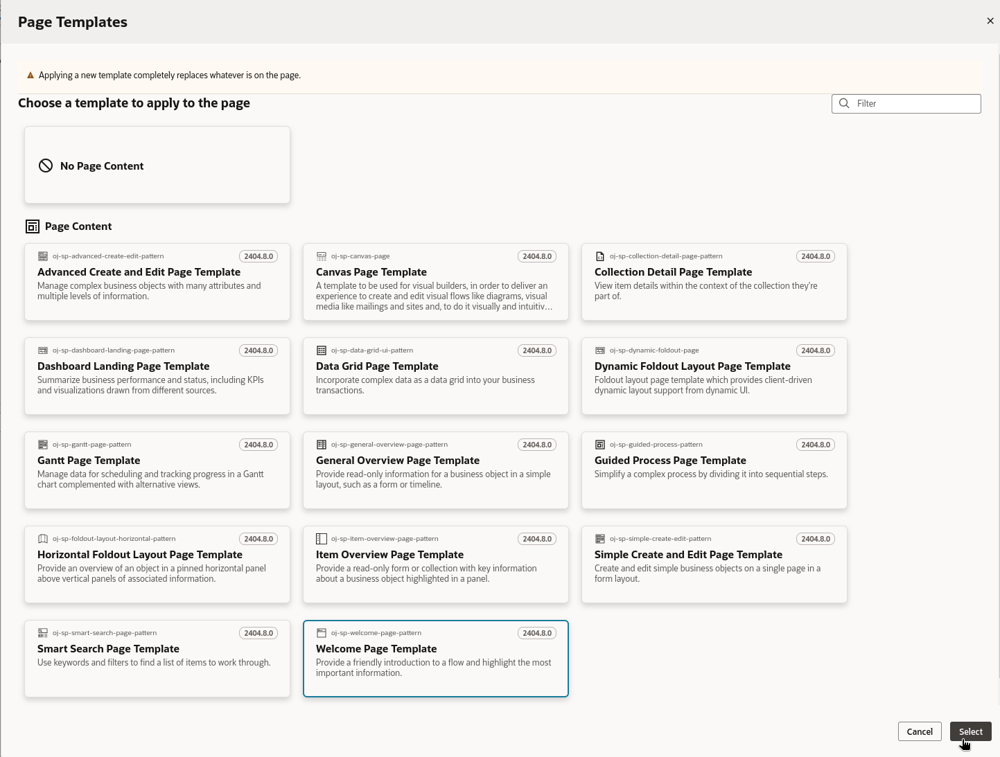
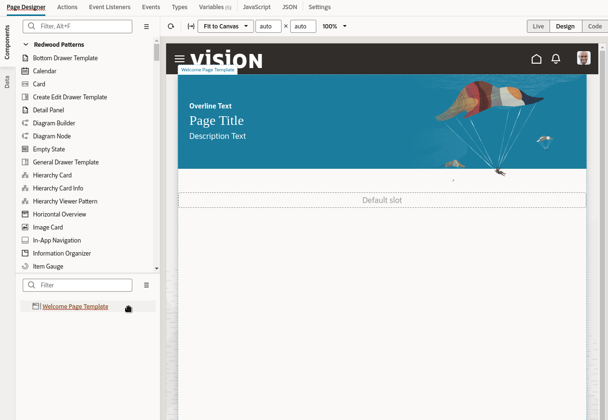
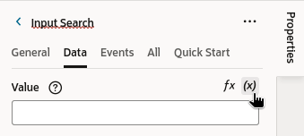

# Welcome page

## Introduction

In this lab we'll create a new application and create a welcome page built from the Redwood **Welcome Page Template**.  We will use Oracle JET UI components to display a list of accounts, and allow the list to be filtered.

**About the Oracle Redwood User Experience**

The Redwood User Experience is a collective reinvention of how Oracle customers interact with technology and consume information. While Redwood includes a beautiful new set of user interface elements, including the templates you'll work with in this lab, it's also a philosophical approach to solving customer problems in a differentiated and satisfying way.  Redwood page templates improve the user experience of working with our pages. The Redwood templates not only provide a consistent look and feel across the pages in our app, but we'll also be able to leverage the usability features they offer.

Estimated Time: 15 minutes

### Objectives

In this lab, you will:
* Get familiar with the development environment
* Leverage Redwood templates and components to create a welcome page
* Add Oracle JET UI components to your page

Before we get started, let's explore the Designer a bit.

**Tip:** There are lots of tabs you can click to expand/collapse different areas and give yourself more room to work.

  

Here are the key areas of the Designer you'll use throughout this workshop:

| # | Tab | Functionality |
| --- | --- | --- |
| 1 | Components | UI components you can add to a page, sorted into categories  |
| 2 | Data | Data objects you can work with, based on connections you create to SaaS objects |
| 3 | Structure | Hierarchical view of the page's structure  |
| 4 |Properties | Declarative area to define properties for the component selected in your page |
| 5 |Canvas | Displays a design/live view (or code view) of your page content |
{: title="Designer Regions"}

Note that you can collapse and expand tabs to better manage your working area. When collapsed the tab will show as a vertical tab on the side of the editor. To expand/collapse a tab click that specific tab.

The Components palette contains over a hundred UI components that you can drag and drop onto your pages to design your interfaces. In this workshop, we're going to leverage some page templates designed by Oracle's Redwood Design team to accelerate our application development. These templates provide a responsive user experience, which means your app will adjust to the device accessing it.

**Tip:** In the header area (the black bar along the top), you'll also find the Undo and Redo buttons, which look like this:

  

If you make a mistake during this lab, click Undo to back out of the last step you did.

## Task 1: Create an App UI

You should now be in the Designer, VB Studio's visual editor. We'll start by creating an *App UI*, which is simply an application that includes a user interface component in the form of Visual Builder pages and flows. With App UIs, you can create new interfaces that address specific business needs for your company.

1. On the left side of the Designer's navigator, click the first tab, App UIs, click **+ App UI**:

  

2. In the Create App UI dialog, provide a name in the form **YourName-Accounts**, then click **Create**:

  

In the Diagram view on the right, you can see the flows and pages for this App UI. A flow contains pages that relate to each other. An application can contain multiple flows, and a flow can contain many pages. In this case we have one flow, *main*, and one page, *main-start*:

  

## Task 2: Change the Page Template

You should be in the Diagram tab with the Components open.

1. Double-click  **main-start** to open the default page:

  

You are going to configure the main-start page to use the Redwood **Welcome Page Template**.

2. In the right panel you'll find the page properties, click the **Select Page Template** button:

  

In the **Page Templates** window you will see a page named **Welcome Page Template**.  If you do not see this template, go back to the first lab and make sure you have all of the components installed.

3. Select the **Welcome Page Template** and click **Select**:

  

## Task 3: Configure the Welcome Page

1. Under **Structure** click on **Welcome Page Template**:

  

2. Click the **All** tab in the Properties pane and modify these properties:

| # | Property | Value |
| --- | --- | --- |
| 1 | Background Color | Choose your preferred color  |
| 2 | Description| **Search and edit accounts** |
| 3 | Illustration foreground source URL | https://static.oracle.com/cdn/fnd/gallery/2107.1.0/images/illust-welcome-banner-fg-03.png |
| 4 |Page Title | **Accounts** |
{: title="Template Properties"}

Your screen should look like this:
  

In the next lab, we'll add some more useful components to the page.

## Task 4: Add a Search Component and Define a Variable

1. In the Components palette's search box, type **search**, which will locate a component called **Input Search**.
2. Drag this component and drop it on the page in the canvas. A pop-up will appear asking which slot you want to use; choose **Search slot**:
  

	This field is where users will enter a search term to locate an account. We need to keep track of these terms, so we'll use a page variable to do that.

3. While the input search is selected in the canvas, click the **Data** tab in the Properties pane.

4. Click the little arrow at the top right of the **Value** field to display a list of variables. (you might need to hover your mouse on the field first)

  

5. Next to the **Page** category, click **Create Variable** to create a page-level variable:

  

	Notice that there are multiple scopes for variables, which helps to share their values across pages and flows in the application.

6. In the Create Variable dialog's ID field, type **searchString**, leaving the Type as String. Click **Create**:

  

The Value field in the Properties pane now contains a reference to our new variable.

## Task 5: Add a Collection Container

In this task we'll add a container to the page, which will later hold some data we'll get from Oracle Fusion Cloud Applications.

1. In the Components palette's search box type **collection**, which will locate a component called **Collection Container**.
2. Drag this component to the Structure pane and drop it on top of the Welcome Page template:
  
3. In the slots pop-up, select **Default**:
  
The layout of our first page is now ready.  Our next step is to add some data to the page from Oracle Fusion Cloud Apps.

Notice how all of our design tasks so far have been done with simple drag and drop functionality and setting properties. This visual development approach is key to the productivity that Visual Builder Studio provides. If you prefer to work in code, however, you can always do so by clicking the Code button right above where the page preview is displayed. Any modifications you make to your page's HTML code while in Code mode are automatically reflected in Design mode, should you choose to return to it.

At this point your screen should look like this:
  

Let's move on to the next lab, where we'll learn how to get some data from Oracle SaaS onto the page.

You may now **proceed to the next lab**.

## Learn More

* [Use the Page Designer](https://docs.oracle.com/en/cloud/paas/visual-builder/visualbuilder-building-appui/get-started1.html#GUID-CC2B203D-51D3-4408-8D0B-4E26C86BCBC0)
* [Oracle JET](http://oracle.com/jet)

## Acknowledgements
* **Author** - Shay Shmeltzer, Oracle Cloud Development Tools, August 2022
* **Contributors** -  Marcie Caccamo, Blaine Carter, Oracle Cloud Development Tools
* **Last Updated By/Date** - Blaine Carter, Oracle Cloud Development Tools, March 2023
