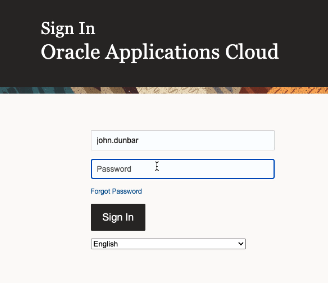
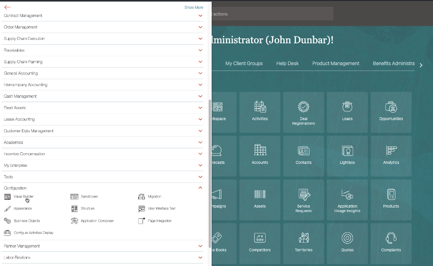
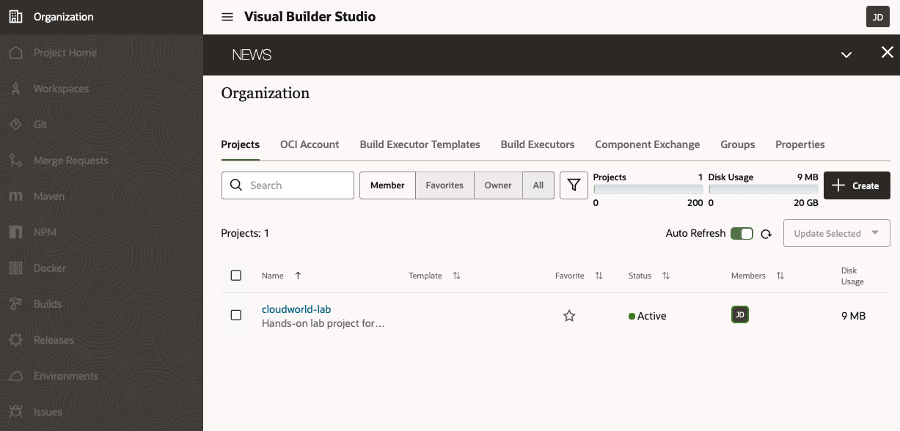
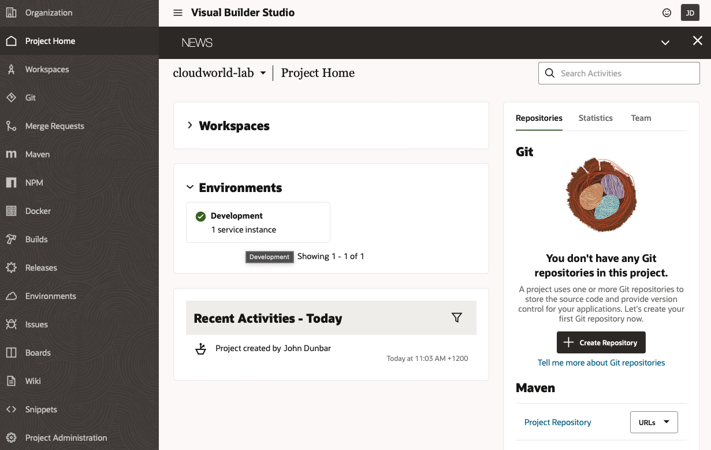
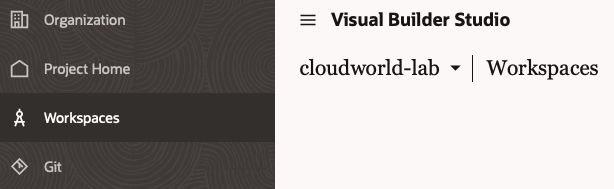
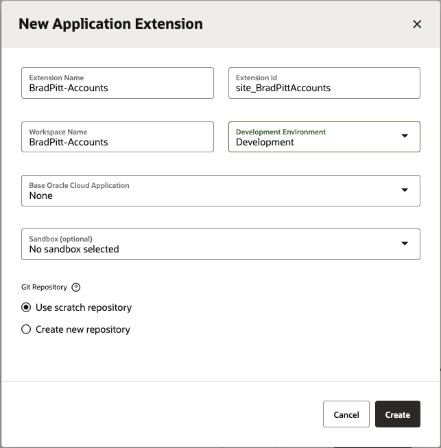
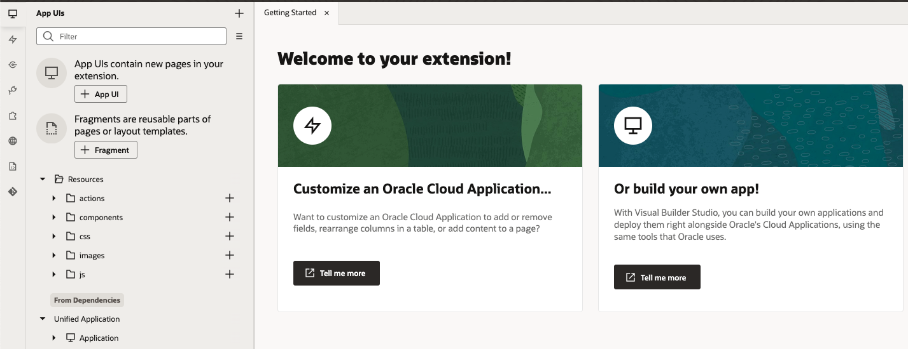

# Creating a New Application Extension

## Introduction

Starting in Oracle Fusion Cloud Applications, we'll navigate to Visual Builder and create a new workspace where we can develop our new Application Extension.

Estimated Lab Time: 5 minutes

### About Oracle Visual Builder
Oracle Visual Builder Studio is included as one of the configuration tools that come with Oracle Cloud Apps. We'll be using it to create and manage a project where we develop extensions.

### Objectives

In this lab, you will:
* Access Oracle Visual Builder Studio
* Create a new workspace

## Task 1: Access Visual Builder and Create a Workspace

Users with the right roles can access Visual Builder Studio from the TEST instance of their Oracle Cloud Applications.

1. Login to Oracle Cloud Applications

	

2. From the hamburger menu at the top right, navigate to the **Configuration** section and expand it. Select the **Visual Builder** option.

  

3. When prompted to select a project choose the **CloudWorld-lab** project. Visual Builder Studio uses projects to manage development teams activities.

  

4. You'll be taken into the project home page. From here you can navigate to all the components of your project. Including Environments, Git repositories, CI/CD pipelines, Issue tracking system, wiki and much more. In this lab we'll only focus on the Workspace part.

	

5. Click the **Workspaces** section on the left navigation menu

	

6. Click the **New** button and select **New Application Extension** to create a new workspace for your own extension.

	

7. In the creation dialog that pops up populate the fields with these values
| Field | Value | Explanation |
| --- | --- | --- |
| Extension Name | YourName-Accounts | To keep a distinct name use your name  |
| Development Environment |Choose the option available | This is mapped to your SaaS instance|
| Base Oracle Cloud Application | None | We are creating a new app without dependencies |
| Use Scratch Repository | Checked | For now we just want your personal copy of the code |
{: title="New App Extension Properties"}

	

8. Click Create - this might take a couple of minutes to complete and then you'll be taken into the Visual Builder development environment.

	
## Learn More

* [What is an Extension](https://docs.oracle.com/en/cloud/paas/visual-builder/visualbuilder-building-appui/basics.html#GUID-A729A4FB-CD2E-48C8-BDE3-577DEE835332)
* [What is a Workspace](https://docs.oracle.com/en/cloud/paas/visual-builder/visualbuilder-building-appui/basics.html#GUID-8E1EF322-51B5-4411-BAAA-F2AB3796C8FB)

## Acknowledgements
* **Author** - Shay Shmeltzer, Oracle Cloud Development Tools, August 2022
* **Contributors** -  Blaine Carter, Oracle Cloud Development Tools
* **Last Updated By/Date** - Shay Shmeltzer, Oracle Cloud Development Tools, August 2022
