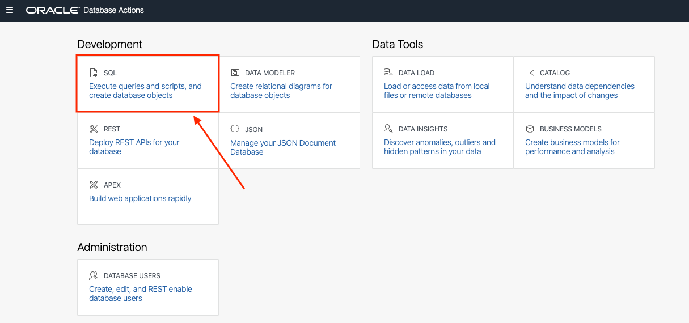
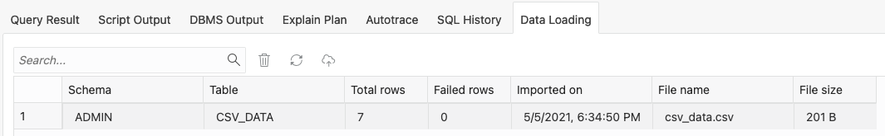
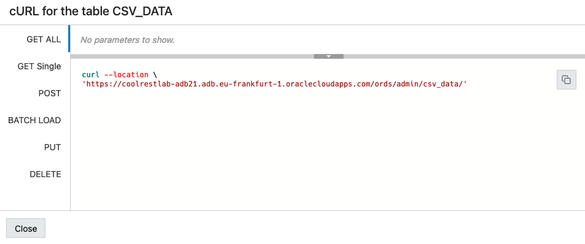

# Modern Application Development with Oracle REST Data Services - Create and auto-REST enable a table

## Introduction

In this lab you will use Database Actions/SQL Developer Web to connect to your Database, create and REST enable a table.

Estimated Lab Time: 20 minutes

Watch the video below for a quick walk through of the lab.

[](youtube:xr957th1h3U)

### Objectives

- Create and Auto-REST enable a table

### Prerequisites

This lab assumes you have completed the following labs:
* Lab 1: [Login to Oracle Cloud](https://raw.githubusercontent.com/oracle/learning-library/master/common/labs/cloud-login/pre-register-free-tier-account.md)
* Lab 2: [Provision an Autonomous Database](https://raw.githubusercontent.com/oracle/learning-library/master/data-management-library/autonomous-database/shared/adb-provision/adb-provision.md)
* Lab 3: [Connect to your Autonomous Database using Database Actions/SQL Developer Web](https://raw.githubusercontent.com/oracle/learning-library/master/common/labs/sqldevweb-login/sqldevweb-login.md)

## Task 1: Create a Table in the Autonomous Database

1. Start by signing in as the **admin** using [Database Actions](https://raw.githubusercontent.com/oracle/learning-library/master/common/labs/sqldevweb-login/sqldevweb-login.md) if not already there. Once logged in, click the **SQL tile**.

    

**If this is your first time accessing the SQL Worksheet, you will be presented with a guided tour. Complete the tour or click the X in any tour popup window to quit the tour.**

2. We are now ready to load data into the database. For this task, we will use the **Data Loading tab** in the SQL Worksheet.

    

3. Click the **Data Loading area**; the center of the gray dotted-line box.

    

4. The **Upload Data into New Table model** will appear.

    

5. We are going to use some sample data to load data into the database and create a table at the same time. Start by **downloading** this file

    **(right-click and download the file with the following link)**

    [csv data](https://objectstorage.us-ashburn-1.oraclecloud.com/p/LNAcA6wNFvhkvHGPcWIbKlyGkicSOVCIgWLIu6t7W2BQfwq2NSLCsXpTL9wVzjuP/n/c4u04/b/livelabsfiles/o/developer-library/csv_data.csv)

6. Once on your desktop, **drag the file into the Upload Data into New Table model**. You can also click the Select Files button and find where you downloaded it via your operating system's/Web Browser's file browser.

    

7. The modal will then give you a preview of what the data will look like in an Oracle table. Go ahead and **click the Next button** on the bottom right of the modal.

    

8. On the following step of the data loading modal, we can see the **name of the table** we are going to create (CSV_DATA) as well as the column and data types for the table.

    

    Set all the columns to be of VARCHAR2 with the length of 4000. This will provide a flawless data loading experience.
    
    

    When table and columns look like the below image, **Click Next** on the bottom right of the modal.

    

9. On the **last step** of the modal, we can see a review of the table name and source file

    

    the DDL (Data Definition Language) for creating the table

    

    and if you scroll down, the column mappings.

    

10. When you are done taking a look, **click the Finish button** in the lower right of the modal.

    

    The Data Loader will now process the file by creating a table and loading the CSV file data into that table. 

    

    Once its done, you will see a row in the Data Loading tab that indicates how many rows were uploaded, if any failed and the table name.

    

11. We can take a look at our newly created table and the data in it **by using the navigator on the left of the SQL Worksheet**. Just **right click the table name** and **select Open** from the pop up menu.

    

    In the slider that has come out from the right of the page, we can look at the data definition, triggers, constraints and even the data itself.

    

## Task 2: Auto-REST Enable a Table

1. REST enabling a table couldn't be easier. To do this, find the table we just created named **CSV_DATA** in the navigator on the left of the SQL Worksheet.

    

2. Right click on the table name and select **REST** in the pop up menu then **Enable**.

    

3. The REST Enable Object slider will appear from the right side of the page. Keep the default values and when ready, click the **Enable** button in the lower right of the slider.

    

4. Thats it! Your table is REST enabled. We can work with the REST endpoints by using cURL commands that the SQL Worksheet can provide to us. To get to these endpoints, again right click the table name as we did in the previous step, select **REST**, then **cURL Command**.

    

    On the right of the page, we see the cURL for the table CSV_DATA side out panel.

    

5. Here we can work with the various REST endpoints. To try one, click the copy icon  for the **GET ALL** endpoint.

    

6. You can use this** cURL command** we just copied in the **Oracle Cloud Infrastructure Cloud Shell** or on your local compute if cURL is installed. Here is the command running:

    ```
    >curl --location \
    'https://coolrestlab-adb21.adb.eu-frankfurt-1.oraclecloudapps.com/ords/admin/csv_data/'

    {"items":[{"col1":"e40a9db6","col2":"1b","col3":"27531","links":[{"rel":"self","href":"https://coolrestlab-adb21.adb.eu-frankfurt-1.oraclecloudapps.com/
    ords/admin/csv_data/AAAYuOAAAAAAF3%2FAAA"}]},{"col1":"6182c817","col2":"73","col3":"5355332","links":[{"rel":"self","href":"https://coolrestlab-adb21.adb.
    eu-frankfurt-1.oraclecloudapps.com/ords/admin/csv_data/AAAYuOAAAAAAF3%2FAAB"}]},{"col1":"5ed9e437","col2":"d2","col3":"4834758","links":[{"rel":"self",
    "href":"https://coolrestlab-adb21.adb.eu-frankfurt-1.oraclecloudapps.com/ords/admin/csv_data/AAAYuOAAAAAAF3%2FAAC"}]},{"col1":"d77868a1","col2":"64",
    "col3":"2129797","links":[{"rel":"self","href":"https://coolrestlab-adb21.adb.eu-frankfurt-1.oraclecloudapps.com/ords/admin/csv_data/
    AAAYuOAAAAAAF3%2FAAD"}]},{"col1":"09bfaa73","col2":"89","col3":"3294896","links":[{"rel":"self","href":"https://coolrestlab-adb21.adb.eu-frankfurt-1.
    oraclecloudapps.com/ords/admin/csv_data/AAAYuOAAAAAAF3%2FAAE"}]},{"col1":"5054cca2","col2":"97","col3":"3474577","links":[{"rel":"self","href":"https://
    coolrestlab-adb21.adb.eu-frankfurt-1.oraclecloudapps.com/ords/admin/csv_data/AAAYuOAAAAAAF3%2FAAF"}]},{"col1":"d20e9eb4","col2":"7c","col3":"2728720",
    "links":[{"rel":"self","href":"https://coolrestlab-adb21.adb.eu-frankfurt-1.oraclecloudapps.com/ords/admin/csv_data/AAAYuOAAAAAAF3%2FAAG"}]}],
    "hasMore":false,"limit":25,"offset":0,"count":7,"links":[{"rel":"self","href":"https://coolrestlab-adb21.adb.eu-frankfurt-1.oraclecloudapps.com/ords/
    admin/csv_data/"},{"rel":"edit","href":"https://coolrestlab-adb21.adb.eu-frankfurt-1.oraclecloudapps.com/ords/admin/csv_data/"},{"rel":"describedby",
    "href":"https://coolrestlab-adb21.adb.eu-frankfurt-1.oraclecloudapps.com/ords/admin/metadata-catalog/csv_data/"},{"rel":"first","href":"https://
    coolrestlab-adb21.adb.eu-frankfurt-1.oraclecloudapps.com/ords/admin/csv_data/"}]}% 
    ```

The next lab will go over using the **BATCH LOAD** endpoint.

## Conclusion

In this lab, you created a table from a csv file and REST enabled it with auto-REST.

You may now [proceed to the next lab](#next).


## Acknowledgements

- **Author** - Jeff Smith, Distinguished Product Manager and Brian Spendolini, Trainee Product Manager
- **Last Updated By/Date** - Brian Spendolini, April 2022
- **Workshop Expiry Date** - June 2022
