# How to build powerful, secure REST APIs for your Oracle Database - REST Enable Business Logic and Custom SQL

## Introduction

In this lab, you will use Database Actions and the REST console to build a REST API using a parametrized PL/SQL procedure and SQL statement. 

Estimated Lab Time: 20 minutes

Watch the video below for a quick walk through of the lab.

[](youtube:6Y_BArzNgaw)

### You can learn more about REST in the  **Learn More About REST** section the [introduction](../intro/intro.md) page of this lab.

### Objectives

- Publish REST API using Custom SQL
- Publish REST API using stored PL/SQL procedure
- Explore the OpenAPI View created by ORDS


### Prerequisites

- The following lab requires an <a href="https://www.oracle.com/cloud/free/" target="\_blank">Oracle Cloud account</a>. You may use your own cloud account, a cloud account that you obtained through a trial, or a training account whose details were given to you by an Oracle instructor.

This lab assumes you have completed the following labs:
* Lab 1: [Login to Oracle Cloud](https://oracle-livelabs.github.io/common/labs/cloud-login/pre-register-free-tier-account.md)
* Lab 2: [Provision an Autonomous Database](https://oracle-livelabs.github.io/adb/shared/adb-provision/adb-provision.md)
* Lab 3: [Connect to your Autonomous Database using Database Actions/SQL Developer Web](https://oracle-livelabs.github.io/common/labs/sqldevweb-login/sqldevweb-login.md)
* Lab 4: [Create and auto-REST enable a table](../create-table/create-table.md)
* Lab 5: [Loading Data and Creating Business Objects](../load-data-and-biz-objs/load-data-and-biz-objs.md)

## Task 1: REST Enable a custom SQL Statement

**If this is your first time accessing the REST Workshop, you will be presented with a guided tour. Complete the tour or click the X in any tour popup window to quit the tour.**

1. Start by using the **Database Actions Menu** in the upper left of the page and select **REST**

    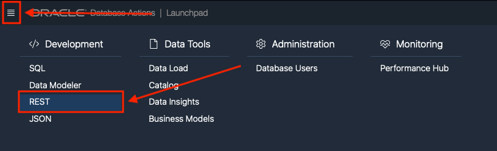

2. Once on the **REST page**, use the upper tab bar to select **Modules**

    

3. On the Modules page, left click the **+ Create Module** button in the upper right.

    

4. The **Create Module** slider comes out from the right of the page.

    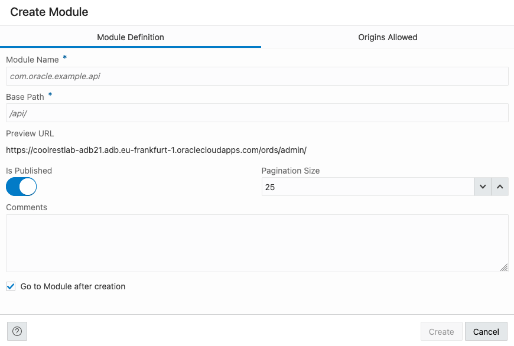

5. Using the **Create Module** slider, we start with the Module name. Lets use the following value of **com.oracle.livelab.api**

    ````
    <copy>com.oracle.livelab.api</copy>
    ````

    

6. For the **Base Path** field, we can use the default of **/api/**. Enter **/api/** in the **base path field**.

    ````
    <copy>/api/</copy>
    ````

    

    Also select **Not Protected** with the **Protected By Privilege** select list.

    

7. When the **Create Module** slider looks like the below image (**NOTE: your URL hostname will be different than the below image**), left click the **Create** button.

    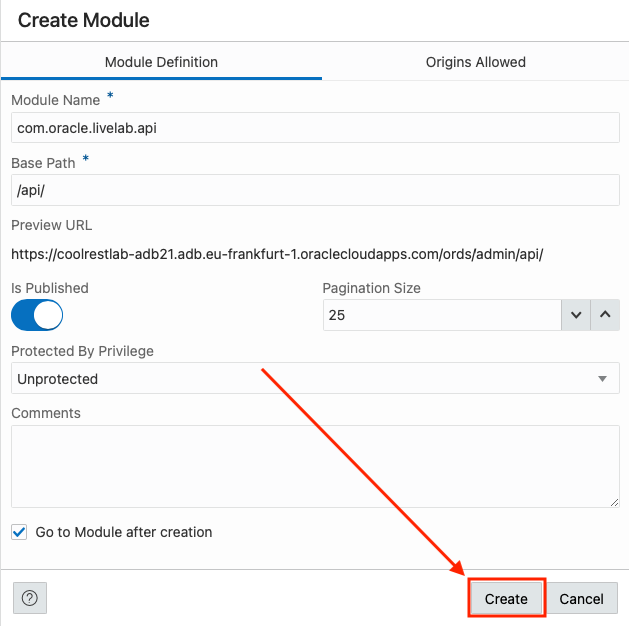

8. Our module has now been created.

    

    We are now going to create a **Template** for the newly created module. Start by left clicking the **+ Create Template** button on the right side of the page, right under our module we just created.

    

9. The **Create Template** slider comes out of the right of the page. 

    
    
    Here we will create the endpoint or URL location for our REST enabled SQL Statement that takes in a value.

10. In the **URI Template** template field, enter **sqlreport/:id**

    ````
    <copy>sqlreport/:id</copy>
    ````

    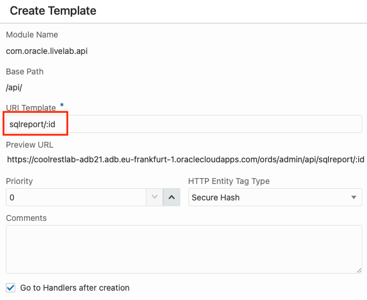

11. When the **URI Template** slider looks like the below image (**NOTE: your URL hostname will be different than the below image**), left click the **Create** button.

    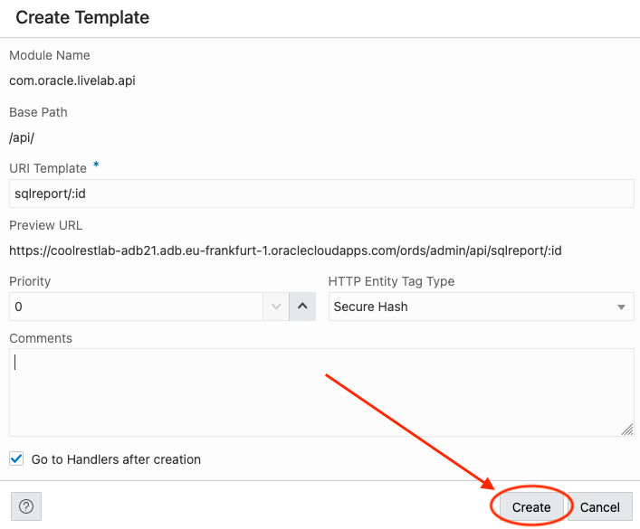

12. Now that the template has been created

    

    we need to create the **Handler** that will contain the SQL Statement. Click the **+ Create Handler** button on the right of the page, just below our newly created template.

    

13. The **Create Handler** slider comes out of the right of the page. 

    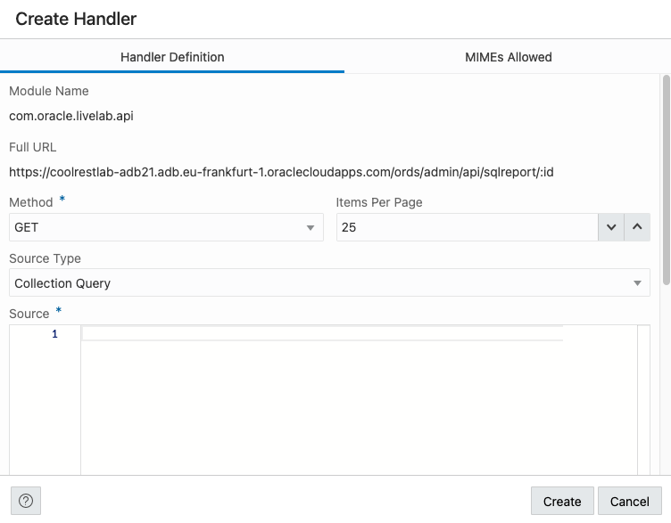

    Here we will be entering the SQL the REST endpoint will use.

14. Enter **select * from csv_data where col2 = :id** in the **Source** section of the **Create Handler** slider:

    ````
    <copy>select * from csv_data where col2 = :id</copy>
    ````

    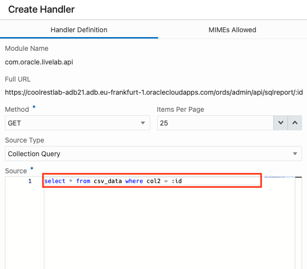

15. When the **Create Handler** slider looks like the below image (**NOTE: your URL hostname will be different than the below image**), left click the **Create** button.

    

16. Back on Template page, we can try our handler out. Click the **execute** button  in the **Source** section of the page.

    

17. After clicking the **execute** button , a **Bind Variables** modal will appear. Enter **a1** for the value in **id field** and then left click **OK** on the modal.

    

18. You can see the results of the query just below the **Source** section. (You may need to scroll the page down)

    

19. We can try the REST endpoint by clicking the pop out icon  in the Template region on the top of the page.

    

20. In the new browser tab/window with the REST endpoint URL

    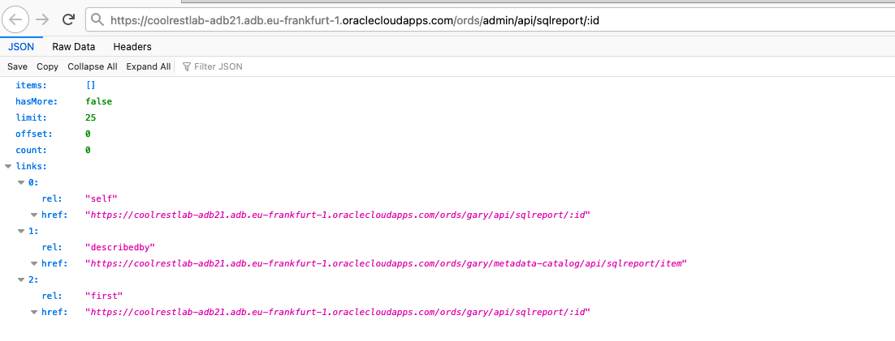

    replace the :id with a1 and submit the URL

    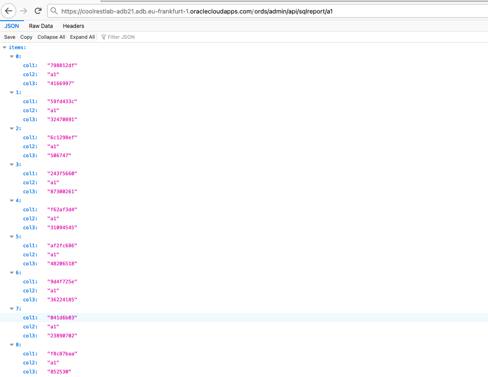

## Task 2: REST Enable Business Logic (PL/SQL procedure)

1. It's now time to REST enable our Business Logic or PL/SQL procedure we created in the previous lab. To start, left click our module com.oracle.livelab.api in the Database Actions breadcrumbs in the upper left of the page.

    

2. As before, we are going to create a new **Template**. Left click the **+ Create Template** button on the right side of the page, right under our module.

    

3. The **Create Template** slider comes out of the right of the page. 

    
    
4. In the **URI Template** template field, enter bizlogic

    ````
    <copy>bizlogic</copy>
    ````

    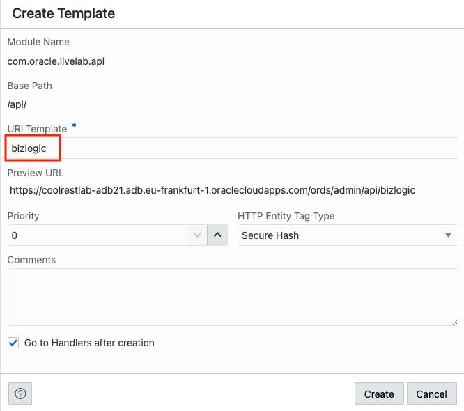

5. When the **URI Template** slider looks like the below image (**NOTE: your URL hostname will be different than the below image**), left click the **Create** button.

    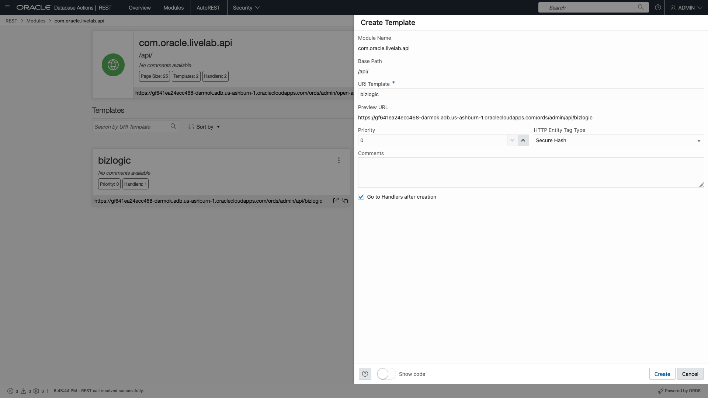

6. Click the **+ Create Handler** button on the right of the page, just below our newly created template just as we did before.

    

7. The **Create Handler** slider comes out of the right of the page. 

    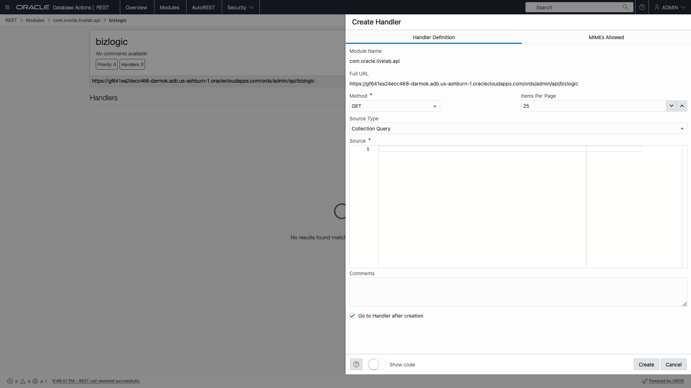

8. We need to change the **Method** from GET to POST because we are submitting a value to the REST Service. Use the dropdown in the **Method** field to select **POST**.

    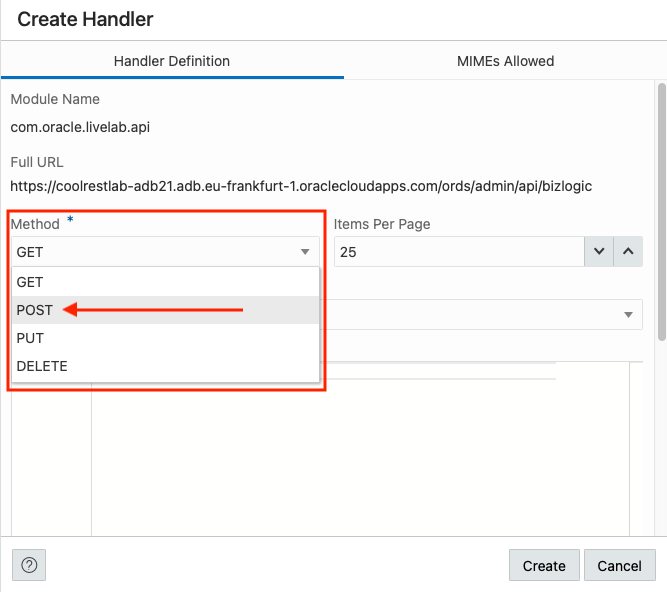

    Upon changing the **Method** to post, we see the **Source Type** change to PL/SQL.

9. Now, in the **Source** field, enter the following PL/SQL

    ````
    <copy>
    BEGIN
        return_count(p_input => :id, p_output => :output);
    end;
    </copy>
    ````

    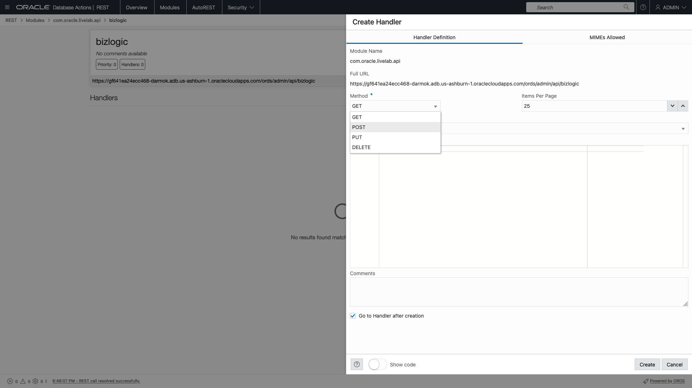

10. When the **Create Handler** slider looks like the below image (**NOTE: your URL hostname will be different than the below image**), left click the **Create** button.

    

11. Next step we need to create an output parameter so we can return the result; the count or rows where the passed in value is equal to the values in col2 in our table. On the bottom on the bizlogic details page, under the **Source** area, we see the **+ Create Parameter** button. Left click the **+ Create Parameter** button.

    

12. The **Create Parameter** slider comes out of the right of the page. 

    

13. For the **Parameter Name** field and the **Bind Variable Name** field, enter **output**

    ````
    <copy>output</copy>
    ````

    

14. For the **Source Type** field, use the dropdown and select **Response**

    

15. For the **Parameter Type** field, use the dropdown and select **INT**. (We are returning a number remember)

    

16. Lastly, for the **Access Method**, use the dropdown and select **Output**

    

17. When the **Create Parameter** slider looks like the below image (**NOTE: your URL hostname will be different than the below image**), left click the **Create** button.

    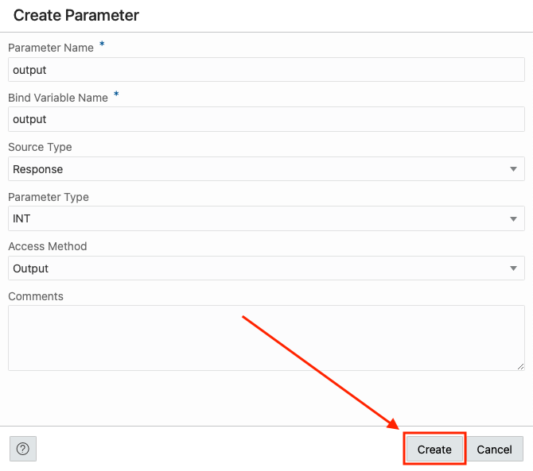

18. You will see the newly created parameter in the parameters table on the bottom of the page.

    

    We are now ready to test this REST API.

19. Left click **bizlogic** in the Database Actions breadcrumbs in the upper left of the page.

    

20. Now, using the popout menu icon  on our **bizlogic POST tile**, select **Get cURL command**.

    

21. The cURL Command modal pops up.

    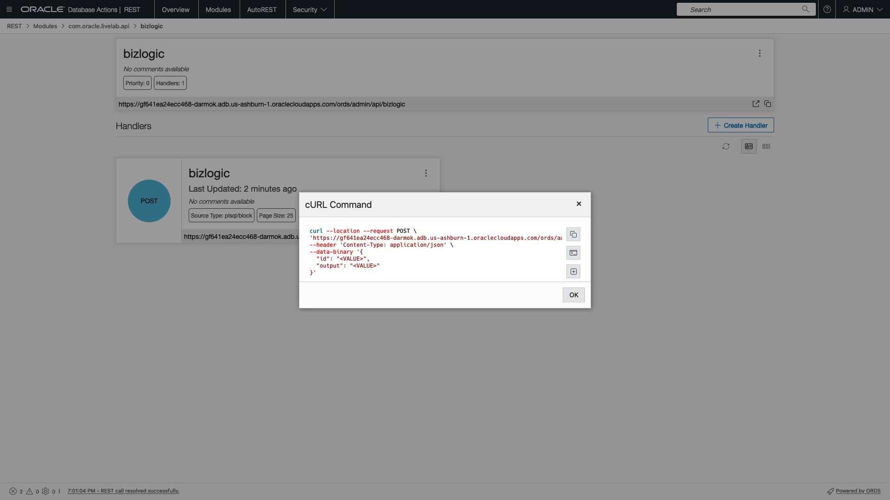

    Use the **Fill Bind Variables Values** icon  to fill in the **id** field with the value of **a1** in the **Substitutions** modal. Then click OK when done.
    
    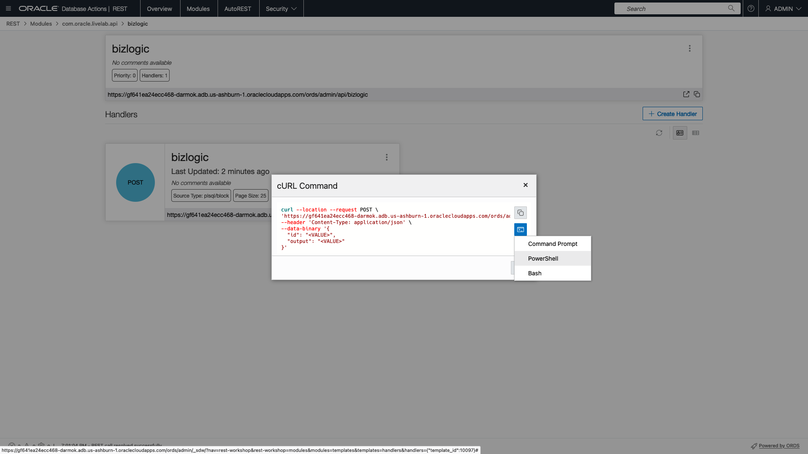

22. Click the copy icon  to copy the cURL command with the added Substitution value.

    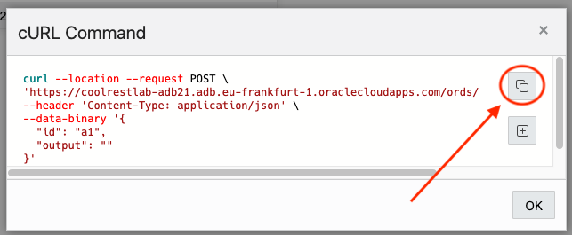

23. Using the Oracle Cloud Infrastructure Cloud Shell, paste and run the cURL command and see that the count is returned as the output variable.

    ```
    curl -X POST \
    'https://coolrestlab-adb21.adb.eu-frankfurt-1.oraclecloudapps.com/ords/admin/api/bizlogic' \
    --header 'Content-Type: application/json' \
    --data-binary '{
    "id": "a1",
    "output": "" 
    }'
    {"output":8204}%                                                                
    ```

    

    You can test other values by changing the id variable. Valid combinations are the first character is a lowercase **a** through **f** and the second character can be *1* though **9**. Valid examples are a1, e9, d3, b6, etc.

## Task 3: Explore the OpenAPI View created by ORDS

1. Start by going back to the module's main page. This can be done by clicking the module's name in the breadcrumbs in the upper left of the page.

    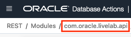

2. Click the the pop out icon  in the Module region and select **OpenAPI View**.

    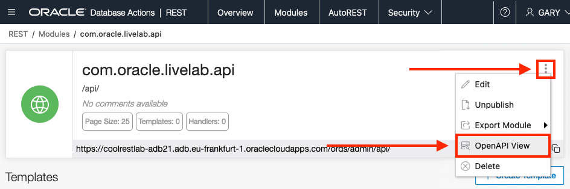

3. The OpenAPI View page displays your REST services as a Swagger UI implementation.

    

    You can explore the APIs you created and try them out right there in the page 
    
    

    as well as export this page as an OpenAPI doc for use in other tools and services using the pop out icon  and selecting **Export Module** then **OpenAPI**.

    


## Conclusion

In this lab, you published a REST API using Custom SQL and accepting an input as well as published a REST API using a stored PL/SQL procedure.

You may now [proceed to the next lab](#next).


## Acknowledgements


 - **Author** - Jeff Smith, Distinguished Product Manager
 - **Last Updated By/Date** - Jeff Smith, July 2022


