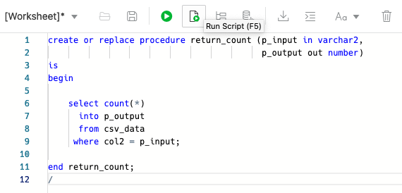
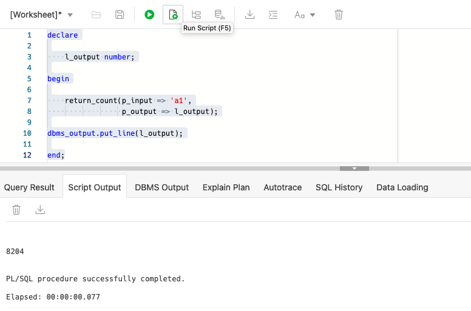

# Load data and create business logic

## Introduction

In this lab you will use the batch load API to load large amounts of data into a table.

Estimated Lab Time: 20 minutes

Watch the video below for a quick walk-through of the lab.
[Load data and create business logic](videohub:1_rgksftgt)

### Objectives

- Load a CSV of over 2 million rows into the CSV_DATA table
- Create PL/SQL business objects in the database

### Prerequisites

- The following lab requires an [Oracle Cloud account](https://www.oracle.com/cloud/free/). You may use your own cloud account, a cloud account that you obtained through a trial, or a training account whose details were given to you by an Oracle instructor.

- This lab assumes you have completed all previous Labs.

## Task 1: Download a CSV from an OCI Cloud Storage Bucket

1. Next we will use the `BATCHLOAD` `HTTP` method to insert data, from a CSV file, into your table. We'll accomplish this with a `curl` command.

2. Before executing this `curl` command, you'll need to retrieve a large CSV file from an OCI Cloud Storage Bucket. You can perform these next steps using a local computer with `cURL` installed <i>or</i> with the **Oracle Cloud Infrastructure Cloud Shell**.

   

   <details>
     <summary>💡***CLICK to learn more*** **about the OCI Cloud Shell.**</summary>
     <div style="background-color:HoneyDew;padding:5px;border-radius:15px;">Every Oracle Cloud Infrastructure account has Cloud Shell--a web browser-based terminal accessible from the Oracle Cloud Console.<p></p>
     It provides access to a Linux shell, with a pre-authenticated Oracle Cloud Infrastructure CLI, pre-authenticated Ansible installation, and other useful tools. Available to all OCI users, the Cloud Shell will appear in the Oracle Cloud Console as a persistent frame of the Console, and will stay active as you navigate to different pages of the Console.
     <p></p>
     To use the Cloud Shell, after logging into your Oracle Cloud Infrastructure account, click the Cloud Shell icon in the upper right of the Oracle Cloud Infrastructure banner.
   </details>

3. Using the below `curl` command, download the CSV file to a directory in your OCI Cloud Shell, or your local computer.

    ````curl
    <copy>curl -o 2M.csv https://objectstorage.us-ashburn-1.oraclecloud.com/p/LNAcA6wNFvhkvHGPcWIbKlyGkicSOVCIgWLIu6t7W2BQfwq2NSLCsXpTL9wVzjuP/n/c4u04/b/livelabsfiles/o/developer-library/2M.csv</copy>
    ````

4. Now that you have the file locally, you can batch load it to your `CSV_DATA` table. To do this you will need to retrieve the `BATCHLOAD` ORDS endpoint, from your `REST`-enabled table.

## Task 2: Retrieve your Batchload REST-endpoint

<div>
 <h1 style="background-color:HoneyDew;">Oracle CloudWorld 2023 <i>Exclusive</i></h1>
</div>

1. Navigate to the OpenAPI view for the `CSV_DATA` table, as shown in the previous lab.

   

2. Expand the `POST/batchload` block. 

   

   Click the `Try it out` button, followed by the `Execute` button.

   

   

   Under the `Responses` section, you will see a sample `curl` command. Copy this command, save it to a clipboard; we'll use this as the basis for your own `curl` command.

   

3. You can retain the headers (indicated by `-H`), but change the `-d` (aka `--data`) to `--data-binary` followed by the filename or filepath [of where you saved the `2M.csv` file].

    <details>
        <summary>💡***CLICK to learn*** **why we use `--data-binary`.**</summary>
        <div style="background-color:HoneyDew;padding:5px;border-radius:15px;">This will perform a <code>POST</code> much like when using the <code>--data</code> option, only <i>exactly as specified</i> with no extra processing.
        <p></p>
        Newlines and carriage returns are preserved and conversions are never performed. To pass in a filename, use the <code>@</code> character, followed by the filename or filepath.
    </div>
    </details>

4. Your `curl` command should resemble what you see below. In this example, you'll notice an additional, *optional* `--write-out` option; which will provide you with a summary of the `POST` request's operation. You'll also notice a `--user` header for your user's credentials.

    ```sh
      <copy>
        curl --write-out '%{time_total}' -X 'POST' \
        'http://localhost:8080/ords/ordstest/csv_data/batchload' \
        -H 'accept: application/json' \
        -H 'Content-Type: text/csv' \
        --user 'ordstest:password1234' \
        --data-binary '@/Users/choina/Desktop/2M.csv'
      </copy>
   ```

## Task 3: Batchload data into your CSV_DATA table

1. You may execute the `curl` command in the shell or your choice (locally or within the OCI Cloud Shell). Below is a sample output:

   

    

2. Next, return to the **SQL worksheet**. You can verify the batch load is running (or has completed) by executing the following SQL:

    ```sql
    <copy>
       select count(*) from csv_data;
    </copy>
    ```

   Execute the statement by highlighting the command with your mouse, then point and click the green arrow (**Run Statement**) button in the tool bar. Alternatively you may press `Ctrl-Enter / Return` (on Windows) or `Command + Enter / Return` (MacOS) while on the same line as the SQL statement.

    

    Either method will yield the following result:

    

## Task 4: Add a function to simulate business logic

1. Next you'll **add a function** to your database schema to simulate the execution of business logic.

    The following procedure returns a count of all the rows that match an input provided to *col2 of the table*:

    ````
    <copy>
    create or replace procedure return_count (p_input in varchar2, 
                                              p_output out number) 
    is
    begin

        select count(*) 
          into p_output
          from csv_data
         where col2 = p_input;

    end return_count;
    /
    </copy>
    ````

    Copy and paste this code into the SQL Worksheet and left click the **Run Script** button on the toolbar:

    

2.  We can test this function with the following PL/SQL block. Copy and paste the following into the SQL Worksheet and execute the block with the **Run Script** button:

    ````pl/sql
    <copy>
    declare
        l_output number;
    begin

        return_count(p_input => 'a1',
                     p_output => l_output);

    dbms_output.put_line(l_output);

    end;
    /
    </copy>
    ````

    

3. In this lab, you loaded over two million rows into a table with `cURL` and an ORDS `REST` endpoint as well as added business logic to the database.

You may now [proceed to the next lab](#next).

## Acknowledgements

 - **Author** 
    - Jeff Smith, Distinguished Product Manager
    - Chris Hoina, Senior Product Manager
 - **Last Updated By/Date**
    - Chris Hoina, September 2023

