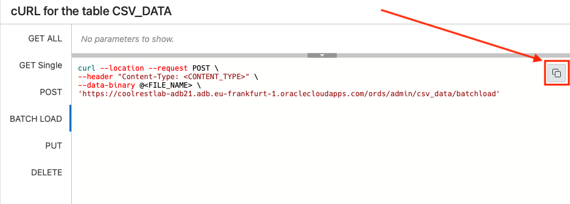

# Load data and create business logic

## Introduction

In this lab you will use the batch load API to load large amounts of data into a table.

Estimated Lab Time: 20 minutes

Watch the video below for a quick walk through of the lab.

[Video overview of the Lab.](youtube:t57IlegnhjA)

### Objectives

- Load a CSV of over 2 million rows into the CSV_DATA table
- Create PL/SQL business objects in the database

### Prerequisites

- The following lab requires an [Oracle Cloud account](https://www.oracle.com/cloud/free/). You may use your own cloud account, a cloud account that you obtained through a trial, or a training account whose details were given to you by an Oracle instructor.

- This lab assumes you have completed all previous Labs. 

## Task 1: Load data into the Database

1. Start by again using the **cURL slide out** on our **REST enabled table**.

    

2. We now see the cURL for the table CSV_DATA slideout on the right side of the web browser. 

    

    Left click the **BATCH LOAD** side tab.

    

3. Next, click the copy icon  for the **BATCH LOAD** endpoint.

    

    It should be similar to the following:

    ```
    <copy>curl --location --request POST \
    --header "Content-Type: <CONTENT_TYPE>" \
    --data-binary @<FILE_NAME> \
    'https://coolrestlab-adb21.adb.eu-frankfurt-1.oraclecloudapps.com/ords/admin/csv_data/batchload'</copy> 
    ```

    **Save this code in a text editor or a notes application, as we will be using it momentarily.**

4.  We'll alter this for our data load. First, we need to be in either the **Oracle Cloud Infrastructure Cloud Shell** or a local computer with cURL installed. Every Oracle Cloud Infrastructure account has Cloud Shell so we would encourage using that. 

    💡 ***Oracle Cloud Infrastructure (OCI) Cloud Shell is a web browser-based terminal accessible from the Oracle Cloud Console. It provides access to a Linux shell, with a pre-authenticated Oracle Cloud Infrastructure CLI, pre-authenticated Ansible installation, and other useful tools. Available to all OCI users, the Cloud Shell will appear in the Oracle Cloud Console as a persistent frame of the Console, and will stay active as you navigate to different pages of the Console.***
    
    To use the Cloud Shell, after logging into your Oracle Cloud Infrastructure account, click the Cloud Shell icon in the upper right of the Oracle Cloud Infrastructure banner:

    

    The Cloud Shell will open on the lower part of the web browser:

    

    We will be using the Oracle Cloud Infrastructure Cloud Shell for examples in this lab going forward.

5. On to the data load. First, download the CSV file. Using the Cloud Shell, enter the following command:

    ````
    <copy>curl -o 2M.csv https://objectstorage.us-ashburn-1.oraclecloud.com/p/LNAcA6wNFvhkvHGPcWIbKlyGkicSOVCIgWLIu6t7W2BQfwq2NSLCsXpTL9wVzjuP/n/c4u04/b/livelabsfiles/o/developer-library/2M.csv</copy>
    ````

6. Now that we have the file locally, we can load it into the database. Using our cURL command from earlier, we'll make a few adjustments and then run it in the Cloud Shell. 

    💡 *We'll be adding to this command, so use a text editor or notes application on the side.*

    Our **BATCH LOAD** cURL command was similar to the following:

    ```
    curl --location --request POST \
    --header "Content-Type: <CONTENT_TYPE>" \
    --data-binary @<FILE_NAME> \
    'https://coolrestlab-adb21.adb.eu-frankfurt-1.oraclecloudapps.com/ords/admin/csv_data/batchload' 
    ```

    Next we'll make some adjustments. First, we can include **--write-out '%{time_total}'** to see exactly how long this data load will take. 

    ```
    curl --write-out '%{time_total}'
    ```

    We'll need to tell the REST endpoint this will be a POST operation, by including **-X POST**.

    ```
    curl --write-out '%{time_total}' -X POST
    ```

    We'll indicate the CSV file and name with the following option: **--data-binary "@2M.csv"**

    ```
    curl --write-out '%{time_total}' -X POST --data-binary "@2M.csv"
    ```

    We'll also need to set the headers of this HTTP request. We'll set the content type and tell it we are sending over a CSV file. The -H option indicates we are setting header variables and we include the Content Type like this: **-H "Content-Type:text/csv"**

    ```
    curl --write-out '%{time_total}' -X POST --data-binary "@2M.csv" -H "Content-Type:text/csv"
    ```

    Next, we can add basic authentication by passing over the username and password of our database schema with the following: **--user "admin:PASSWORD"**. Remember to replace **PASSWORD** with the password you used when you first created the user in Lab 1.

    ```
    curl --write-out '%{time_total}' -X POST --data-binary "@2M.csv" \
    -H "Content-Type:text/csv" --user "admin:PASSWORD"
    ```

    Finally, we need to **add the URL we copied previously**. We will be replacing **batchload** with **batchload?batchRows=5000&errorsMax=20** to indicate that:
      
    - this is a batch load
    - we want to load them in groups of 5000, and 
    - to stop running if we hit 20 errors


    ```
    <copy>curl --write-out '%{time_total}' -X POST --data-binary "@2M.csv" \
    -H "Content-Type:text/csv" --user "admin:123456ZAQWSX!!" \
    "https://coolrestlab-adb21.adb.eu-frankfurt-1.oraclecloudapps.com/ords/admin/csv_data/batchload?batchRows=5000&errorsMax=20"</copy>
    ```

    You should now have the complete cURL command we'll use to load the data into the table. Remember to replace **PASSWORD** with our own password used when we first created the user in Lab 1. 

7. Using the **Cloud Shell**, **paste** your constructed cURL at the **command prompt**.

    

8. When the **command is finished**, you should see that all **2,097,148 records were inserted** into the table.

    ```
    curl --write-out '%{time_total}' -X POST --data-binary "@2M.csv" \
    -H "Content-Type:text/csv" --user "admin:123456ZAQWSX!!" \
    "https://coolrestlab-adb21.adb.eu-frankfurt-1.oraclecloudapps.com/ords/admin/csv_data/batchload?batchRows=5000&errorsMax=20"

    #INFO Number of rows processed: 2,097,148
    #INFO Number of rows in error: 0
    #INFO Last row processed in final committed batch: 2,097,148
    0 - SUCCESS: Load processed without errors
    29.447
    ```
        
    `29.447` is the result of the **--write-out '%{time_total}'** option we added, indicating it took about 30 seconds to load 2 million records!

9. Back in the **SQL worksheet**, we can verify the load by running the following SQL. **In the worksheet**, enter the following statement:

    ````
    <copy>select count(*) from csv_data;</copy>
    ````

    You can highlight the command with your mouse/point and click the green arrow **Run Statement** button in the tool bar or press ctrl-enter/return (Windows)/command-enter/return (MacOS) while on the same line as the statement in the worksheet.

    

    Either method will give the following result:

    

10. Next we will **add a function** to our database schema to simulate some business logic. 

    The following function returns a count of all the rows that match the input provided to col2 in the table:

    ````
    <copy>
    create or replace procedure return_count (p_input in varchar2, 
                                              p_output out number) 
    is
    begin

        select count(*) 
          into p_output
          from csv_data
         where col2 = p_input;

    end return_count;
    /
    </copy>
    ````

    Copy and paste this code into the SQL Worksheet and left click the **Run Script** button on the toolbar:

    

11.  We can test this function with a quick PL/SQL procedure. Copy and paste the following into the SQL Worksheet and run the procedure with the **Run Script** button:

    ````
    <copy>
    declare
        l_output number;
    begin

        return_count(p_input => 'a1',
                     p_output => l_output);

    dbms_output.put_line(l_output);

    end;
    /
    </copy>
    ````

    

12. In this lab, you loaded over two million rows into a table with cURL and REST as well as added business logic to the database.

You may now [proceed to the next lab](#next).

## Acknowledgements

 - **Author** 
    - Jeff Smith, Distinguished Product Manager
    - Chris Hoina, Senior Product Manager 
    - Brian Spendolini
 - **Last Updated By/Date** 
    - Chris Hoina, September 2022

