# Containerize and migrate to OCI Container Instances

## Introduction

In this lab, we will create container images for the application components and deploy them to the Container Instances service. Container Instances is an excellent tool for running containerized applications, without the need to manage any underlying infrastructure. Just deploy and go.

To help streamline the process, you'll use a custom script to create and publish container images to the OCI Container Registry. Container Registry makes it easy to store, share, and managed container images. Registries can be private (default) or public.

Estimated Lab Time: 15 minutes

### Prerequisites

* An Oracle Free Tier or Paid Cloud Account

## Task 1: Prepare the environment

1. Run the script to set the environment. This script will

    - check dependencies
    - create self-signed certificates, if needed
    - log into the container registry to validate credentials
    - print component versions.

    ```
    <copy>npx zx scripts/setenv.mjs</copy>
    ```

  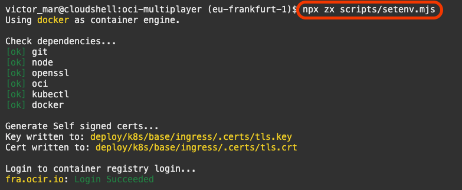 

2. The script will ask for the following information. At _`Autonomous Database Compartment Name`_ you just type _**ENTER**_ to select the root compartment. If you are familiar with OCI compartments, then feel free to pick an existing compartment name.

  

3. At _`Autonomous Database name`_ you just type `multiplayer`.

    ```
    <copy>multiplayer</copy>
    ```

  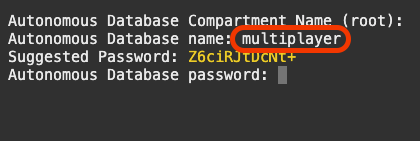

1. At _`Autonomous Database password`_ you can use the _`Suggested Password`_ in yellow. It is a password generated on the fly by `openssl` for you.

    > NOTE: your password will be different to the one on the picture.

  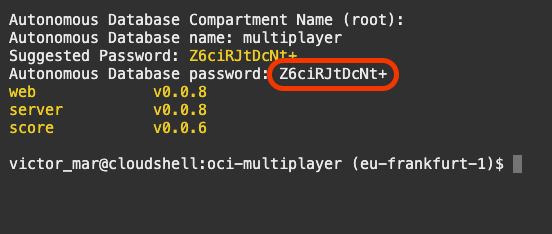

2. Create and publish the **`server`** container image.

    ```
    <copy>npx zx scripts/release.mjs server</copy>
    ```

  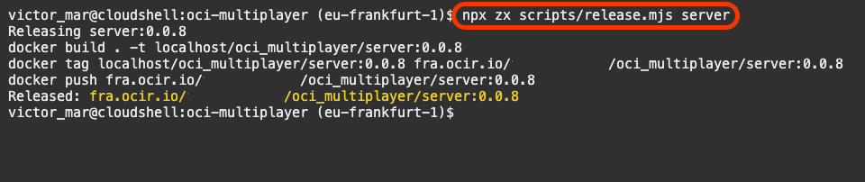

3. Create and publish the **`web`** container image.

    ```
    <copy>npx zx scripts/release.mjs web</copy>
    ```

  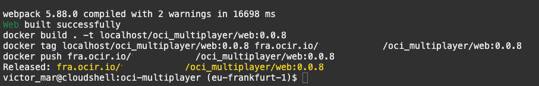 

4. Run the `ci.mjs` command that will give you information about how to create your container instance.

    ```
    <copy>npx zx scripts/ci.mjs</copy>
    ```

  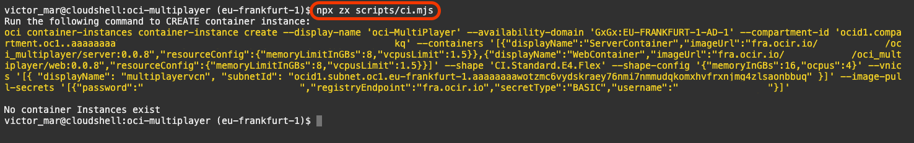 

5. Copy the yellow command, paste it on Cloud Shell, and run it.

  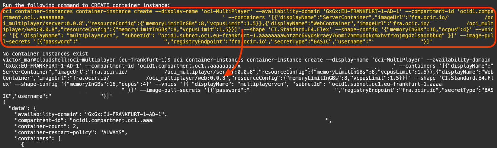 

6. In the Web UI, you can navigate to **`Developer Services`** -> **`Container Instances`** to watch the progress of the deployment.

  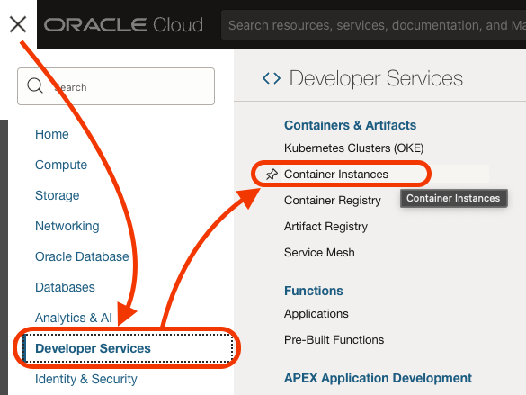 

7. You will see the list of container instances. The one you created will be in `creating` state, or maybe already in `Active` state.

  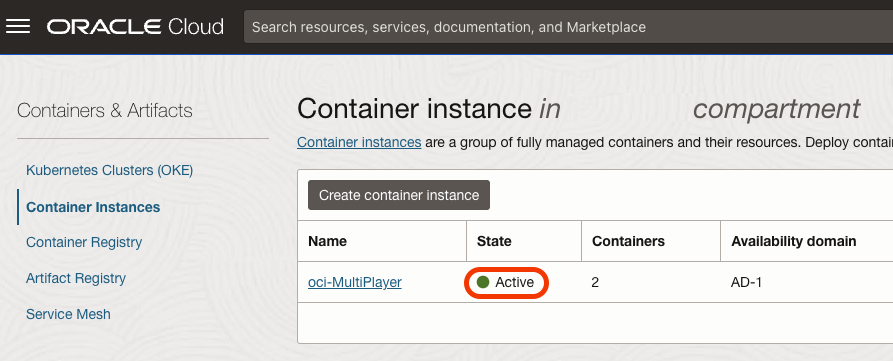 

8. Click on the `oci-Multiplayer` container instance.

  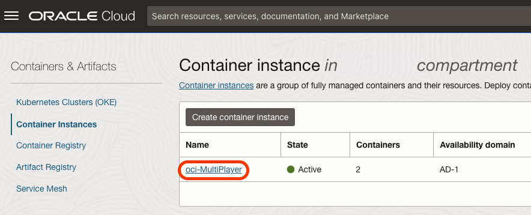 

9. Inside the container instance, on the left-side menu, you can click `Containers` and, you will see the two containers.

  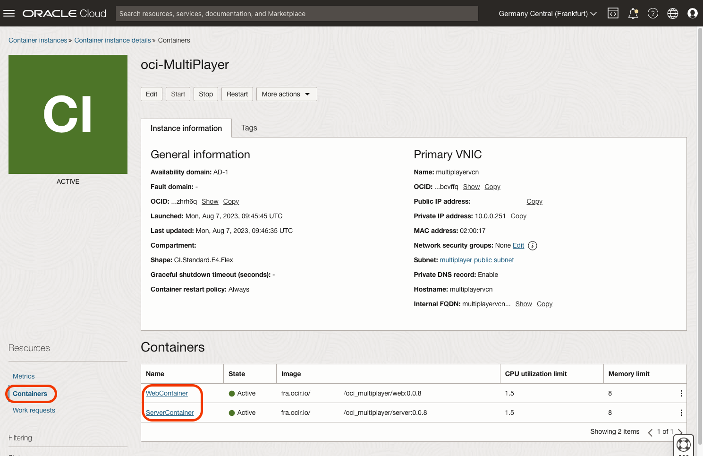

## Task 2: Create a Load Balancer

In this second and final task, you will add the Container Instance private IP address to the backend set of a new load balancer. This process will be done with Terraform so you can easily clean it up.

1. The Terraform file `terraform.tfvars` contains variables. You are going to generate that file by running the following command:

    ```
    <copy>npx zx scripts/tfvars.mjs ci</copy>
    ```

2. During the execution of the script, you will have to answer a few questions. The first one is the _CI Deployment Compartment Name_. You just type _**ENTER**_ to select the root compartment. If you are familiar with OCI compartments, then feel free to pick an existing compartment name.

  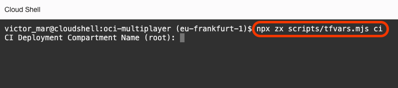

3. The second one will be the Private IP address. Locate the private IP address for your container instance on the OCI web console.

  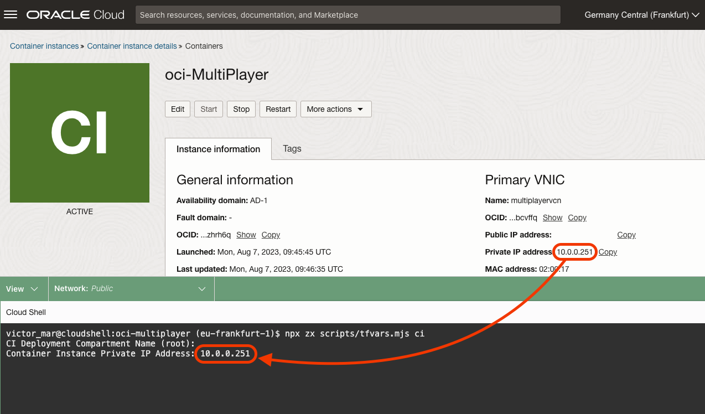

4. The command will create the `tfvars` file, you can deploy a load balancer in front of your two containers with Terraform.

  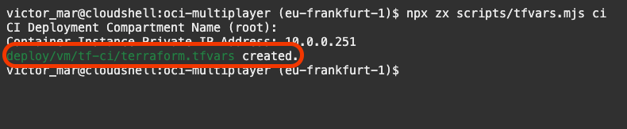

5. Change the directory to `deploy/vm/tf-ci` with the following command:

    ```
    <copy>cd deploy/vm/tf-ci</copy>
    ```

6. Run Terraform Init to set up the Terraform environment.

    ```
    <copy>terraform init</copy>
    ```

  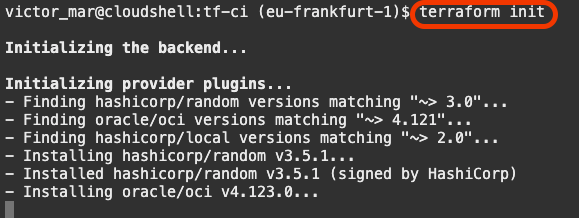

7. Run Terraform apply to start creating the resources.

    ```
    <copy>terraform apply -auto-approve</copy>
    ```

  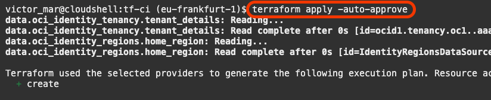

8. Copy the `lb_public_ip`. It is the Load Balancer public IP address.

  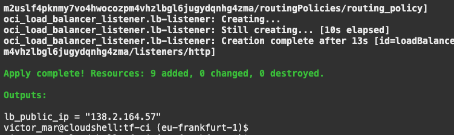

9. Paste it on a browser and try the Container Instance deployment.

  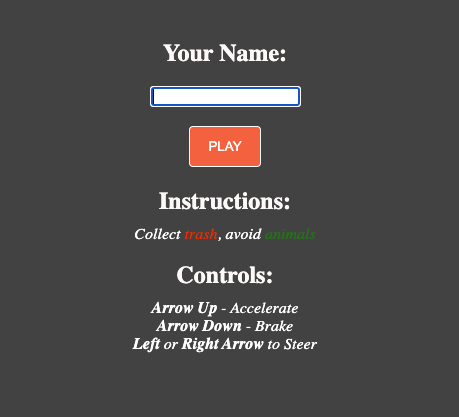

You may now [proceed to the next lab](#next).

## Acknowledgements

* **Author** - Victor Martin - Technology Product Strategy Director - EMEA
* **Author** - Wojciech (Vojtech) Pluta - Developer Relations - Immersive Technology Lead
* **Author** - Eli Schilling - Developer Advocate - Cloud Native and DevOps
* **Last Updated By/Date** - August, 2023
