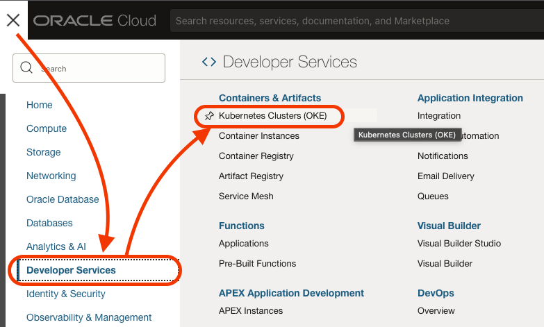
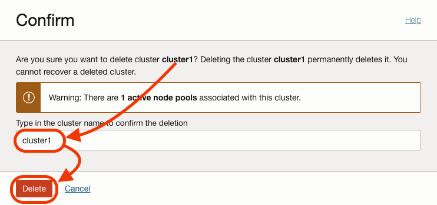
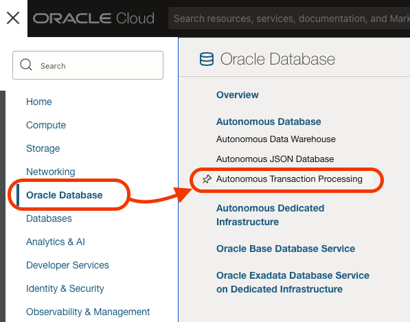

# Clean Up (optional)

## Destroy Infrastructure

In this lab, you are going to destroy all the resources you have created on Oracle Cloud to make sure your tenancy is clean from everything done during this workshop.

Estimated Time: 10 minutes

Watch the video below for a quick walk-through of this lab.
[AppDev Multiplayer Lab 4](videohub:xxx)

### Prerequisites

- Oracle Cloud Account.
- Be an OCI administrator in your account (in Free Tier, you are an administrator by default).
- Finish the previous Lab.

## Task 1: Kubernetes

1. Run on Cloud Shell the delete command to clean up Kubernetes. This might take a couple of minutes.

    ```bash
    <copy>kubectl delete -k deploy/k8s/overlays/prod</copy>
    ```

  

2. Go to **`Developer Services`** -> **`Kubernetes Cluster (OKE)`**.

  

3. Click on the dots at the row of your Kubernetes Cluster, on the right. On the submenu, click **Delete**.

  

4. Confirm the deletion by typing the name of the cluster, in bold at the top. Click **Delete**.

  

## Task 2: VMs and Container Instances.

1. Make sure you are still on the directory `deploy/vm/tf-ci`.

    ```
    <copy>cd ~/oci-multiplayer/deploy/vm/tf-ci</copy>
    ```

2. Run Terraform destroy to delete the resources.

    ```
    <copy>terraform destroy -auto-approve</copy>
    ```

  

  

3. Change the directory back to the root of the project with the following command:

    ```
    <copy>cd ~/oci-multiplayer</copy>
    ```

4. Run the `ci.mjs` command that will give you information about how to delete your container instance.

    ```
    <copy>npx zx scripts/ci.mjs</copy>
    ```

  

5. Copy and paste on the console the second yellow command to delete the container instance.

  

6. On the list of container instances, you will see the id of your container instance. Replace `CONTAINER_INSTANCE_OCID` with the id and run the command.

  

7. Confirm that you are sure you want to delete this resource by typing `y`.

  

8. Clean also the infrastructure from Lab 1 by running this command:

    ```
    <copy>./scripts/stop_VM.sh</copy>
    ```

  

1. When Terraform completes the `destroy` you will get this green message.

   

## Task 3: Autonomous Database and Networking

1. Navigate to **`Oracle Databases`** -> **`Autonomous Transaction Processing`**.

  

2. Click on the dots at the row of your Autonomous Database, on the right. On the submenu, click **Terminate**.

  

3. Confirm the termination by typing the name of the Autonomous Database, `multiplayer`. Click **Terminate Autonomous Database**.

  

4. Navigate to **`Oracle Databases`** -> **`Autonomous Transaction Processing`**.

  

5. Click on the VCN listed that starts with `oke-vcn-quick...`.

  

6. Click on **Delete**.

  

7. Click on **Scan**.

  

8.  Wait for the scanning to finish. When the Delete All button is active, click it.

  

9.  After a few seconds, all resources in the VCN will be deleted.

10.  Congratulations, you have completed the clean-up of this workshop.


## Acknowledgements

* **Author** - Victor Martin - Technology Product Strategy Director - EMEA
* **Author** - Wojciech (Vojtech) Pluta - Developer Relations - Immersive Technology Lead
* **Last Updated By/Date** - August, 2023
