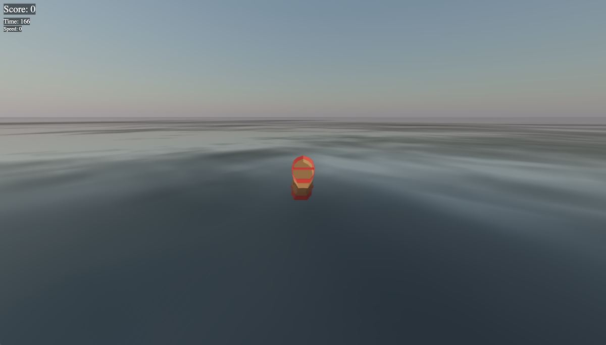

# Introduction

## The power of Cloud Native on Oracle Cloud

In this workshop, you will learn how to deploy a simple [Three.js](https://threejs.org/) application to the cloud, then iterate through the modernization process to enhance the application and ultimately deploy it to [Kubernetes](https://kubernetes.io/).

When building and deploying applications in the cloud it is important to understand the capabilities provided by the cloud and learn to align those with the requirements of your application. Whether starting with enhancing a simple application, or deconstructing a legacy monolith, there are a variety of choices to help right-size your solution.

Estimated Time: 2 minutes

### Objectives
In this workshop, you will:

- Deploy a simple [Three.js](https://threejs.org/) application to OCI Compute with [Terraform](https://www.terraform.io/), using [Ansible](https://www.ansible.com/) to provide code and configuration.
- Create container images of the application components and migrate them to [OCI Container Images](https://www.oracle.com/cloud/cloud-native/container-instances/).
- Add [Redis](https://redis.com/) and [Nginx](https://www.nginx.com/) controller to your application to support scalability, while deploying to [Oracle Container Engine for Kubernetes (OKE)](https://www.oracle.com/cloud/cloud-native/container-engine-kubernetes/).

### Prerequisites

You must have an OCI account. [Click here](https://www.oracle.com/cloud/free/?source=:ow:o:s:nav::DevoGetStarted&intcmp=:ow:o:s:nav::DevoGetStarted) to create a new cloud account.

If you are using an Oracle Free Tier, it must be active and with remaining free credits.

You must be an OCI administrator in your account (in Free Tier, you are an administrator by default).

You may now [proceed to the next lab](#next).

## Acknowledgements

* **Author** - Victor Martin - Technology Product Strategy Director - EMEA
* **Author** - Wojciech (Vojtech) Pluta - Developer Relations - Immersive Technology Lead
* **Author** - Eli Schilling - Developer Relations - Cloud Native and DevOps
* **Last Updated By/Date** - August, 2023
