# Enhance the application architecture

## Introduction
In this lab, we will enhance our application to continue moving toward a more Cloud Native design. For this, an [Autonomous Database](https://www.oracle.com/autonomous-database/) will be deployed, new application components will be added, and the entire solution will be deployed to [Oracle Container Engine for Kubernetes (OKE)](https://www.oracle.com/cloud/cloud-native/container-engine-kubernetes/).


Estimated Time: 15 minutes

Watch the video below for a quick walk-through of this lab.
[AppDev Multiplayer Lab 3](videohub:xxx)

### Prerequisites

- Oracle Cloud Account.
- Be an OCI administrator in your account (in Free Tier, you are an administrator by default).
- Finish the previous Lab.

### Objectives

In this lab, you will complete the process of deploying the application on a Kubernetes Cluster in Oracle Cloud. The deployment process utilizes some scripts, `kubectl` and manual deployment of a Database and Kubernetes Cluster through the UI. With that, you will know how to deploy your applications in many different ways.

## Task 1: Create OKE Cluster with Virtual Nodes

1. Minimize Cloud Shell and navigate to **`Developer Services`** -> **`Kubernetes Cluster (OKE)`**.

  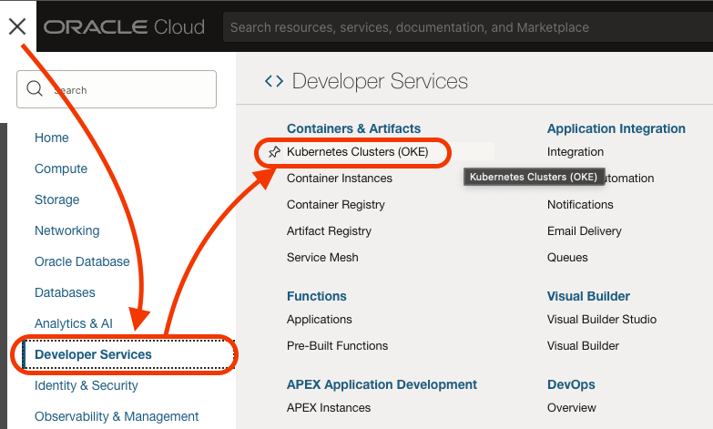

2. Click **Create cluster**.

  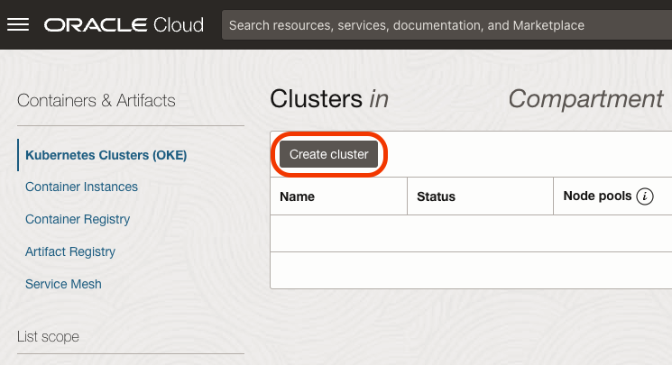

1. Select _**Quick create**_, then click **Submit**.

  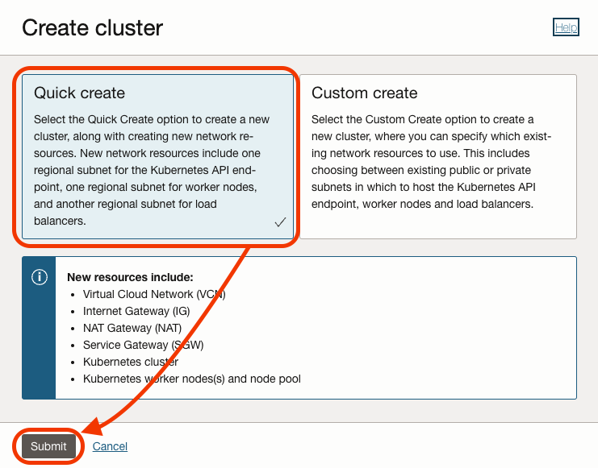

1. Provide a name for the cluster, under _Node Type_ choose **Managed**, leave all other settings as default and click _**Next**_.

  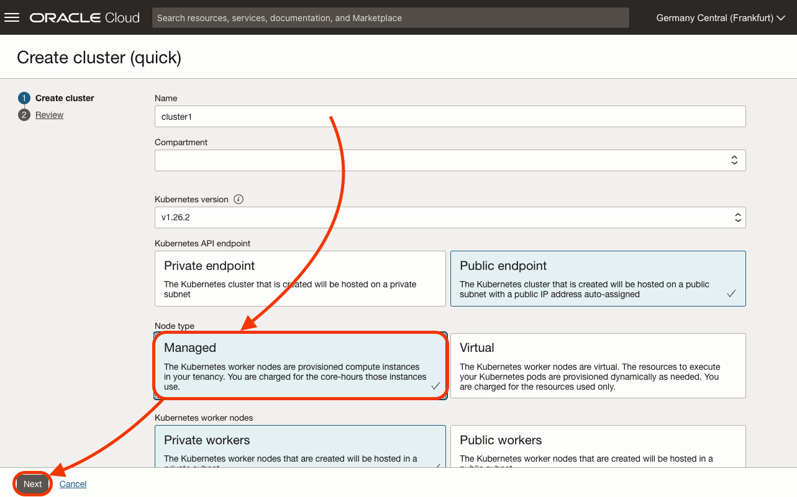

4. Review the details of your cluster, and click **Create cluster**.

  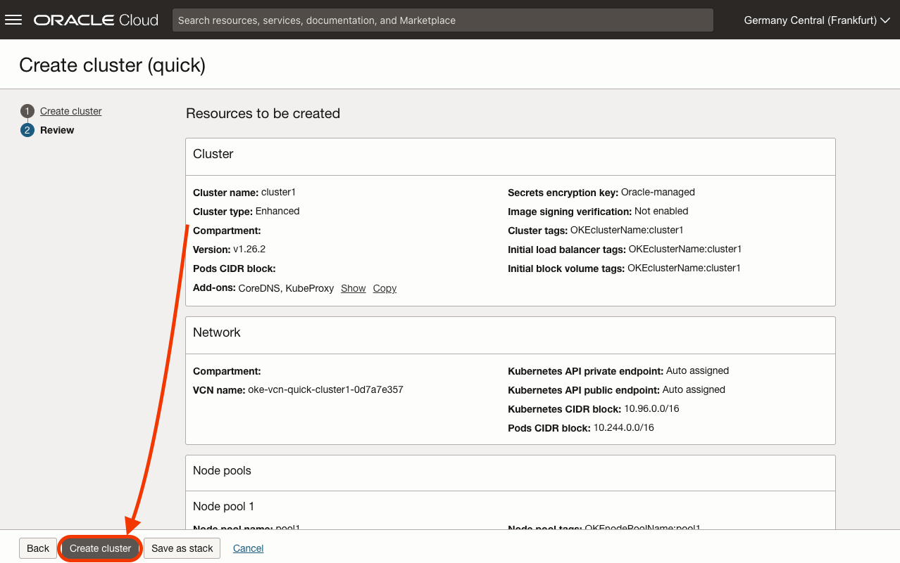

5. It will take just a couple of minutes to create the requisite resources. You can proceed to the next task while this is happening.

  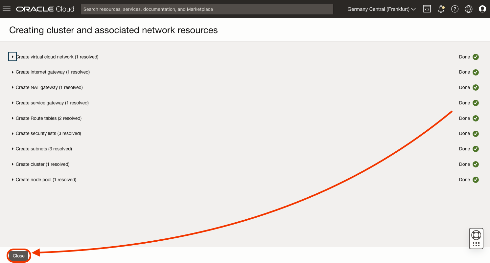

## Task 2: Create Autonomous Database (ATP)

1. Navigate to **`Oracle Databases`** -> **`Autonomous Transaction Processing`**.

  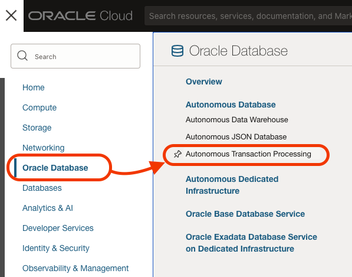

2. Click **Create Autonomous Database**

  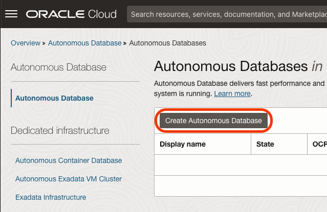

1. Provide `multiplayer` as both the display name and the database name.

    ```bash
    <copy>multiplayer</copy>
    ```

  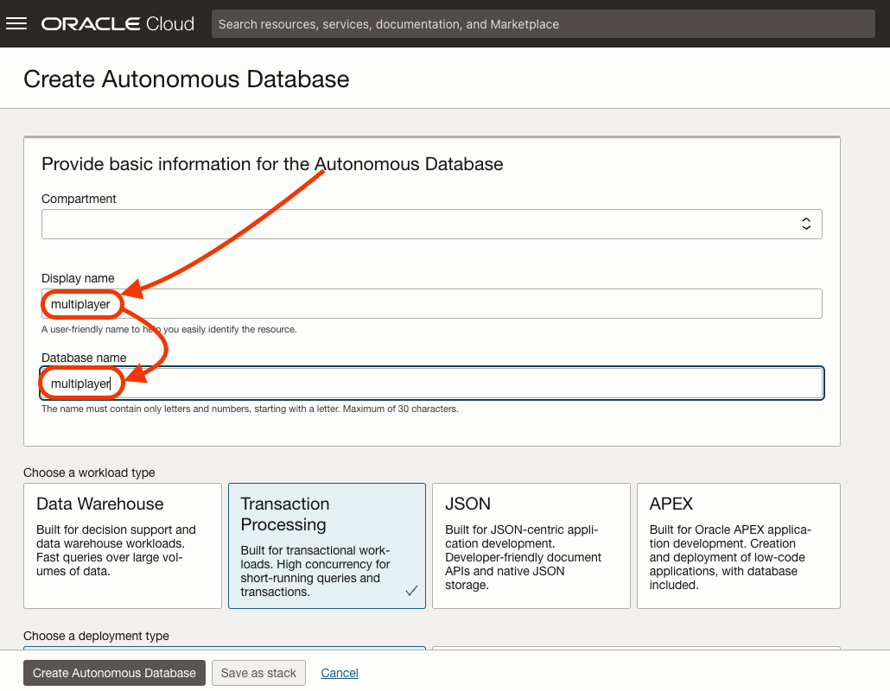

4. Scroll down and provide a database password for the Admin user. Recover the password you generated before by running this command in Cloud Shell. Copy and paste it twice on the form.

    ```bash
    <copy>cat ~/oci-multiplayer/.env.json | jq .adbPassword</copy>
    ```

  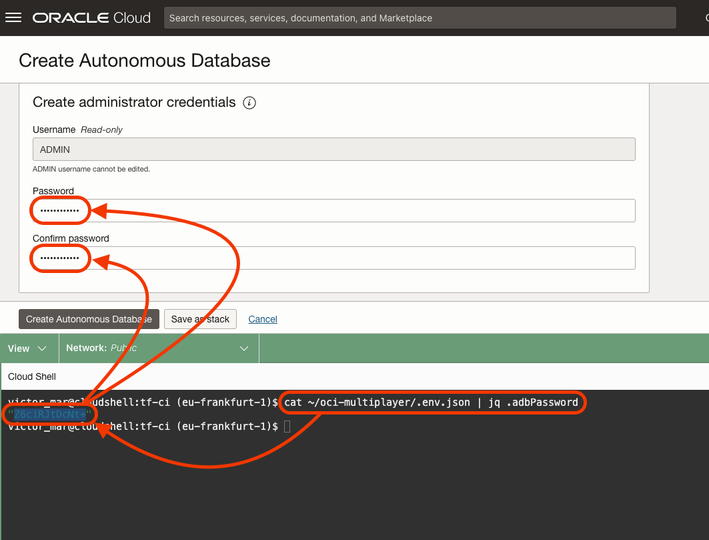

5. Click **Create Autonomous Database**.

  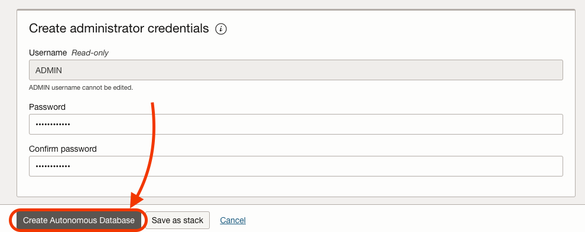

6. It will take about a minute to create the DB. You may proceed to the next task.

  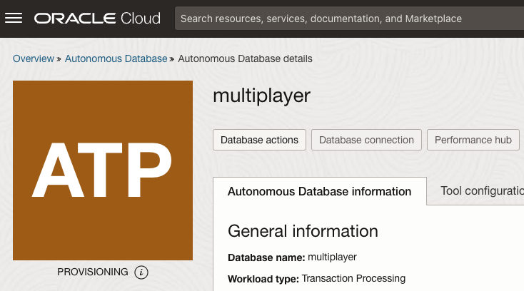

## Task 3: Create and deploy the application

1. Navigate to **`Developer Services`** -> **`Kubernetes Cluster (OKE)`**.

  

2. Wait until the cluster is `Active`. It might take up to 10 minutes.

  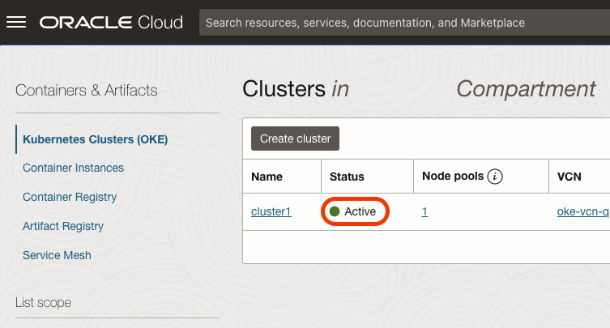

3. Click on the cluster link to access your brand-new Kubernetes Cluster.

  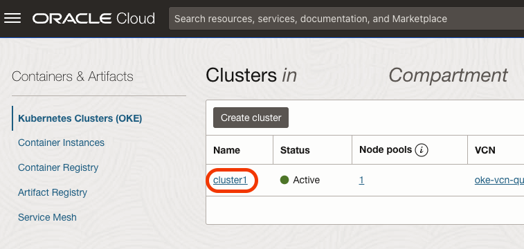

4. Click **Access Cluster** then copy the command found under item 2 displayed on the screen.

  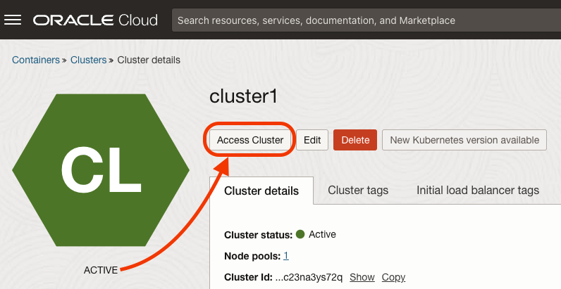

5. Copy the command on the popup window and return to Cloud Shell.

  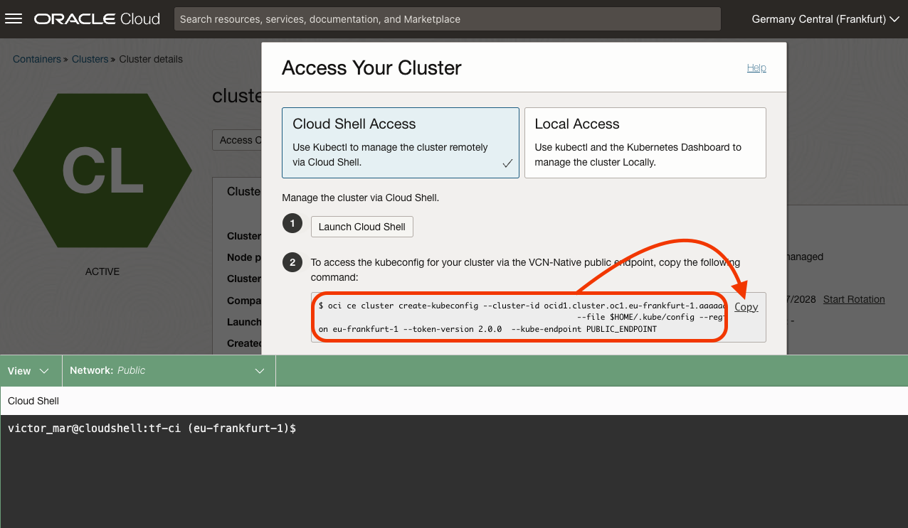

6. Paste the above command and execute. This will enable you to communicate with the OKE API endpoint for your cluster.

  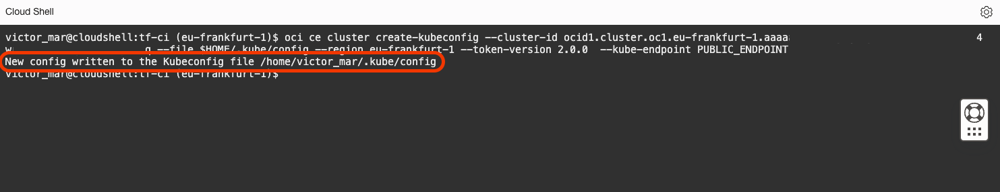

7. Ensure you are in the root directory.

    ```
    <copy>cd ~/oci-multiplayer</copy>
    ```

8. Release all application components. It will take a few minutes.

    ```
    <copy>npx zx scripts/release.mjs -a</copy>
    ```

  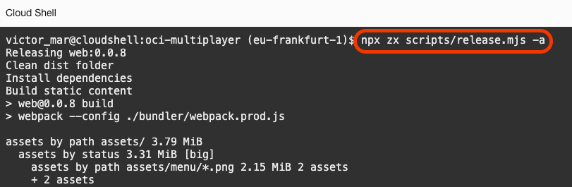

9. Update the deployment manifest with the latest versions.

    ```
    <copy>npx zx scripts/deploy.mjs</copy>
    ```

  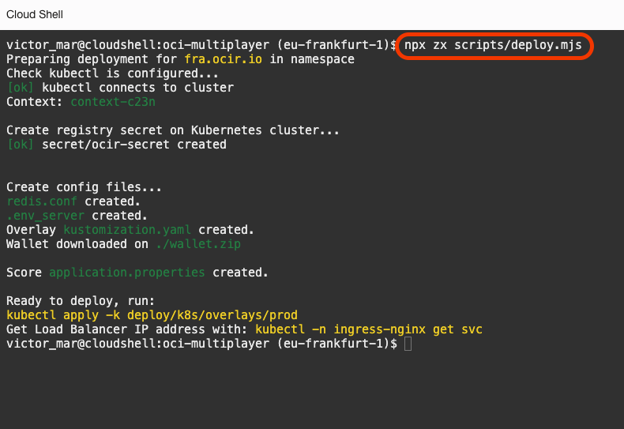

10. Deploy all application components to OKE.

    ```
    <copy>kubectl apply -k deploy/k8s/overlays/prod</copy>
    ```

  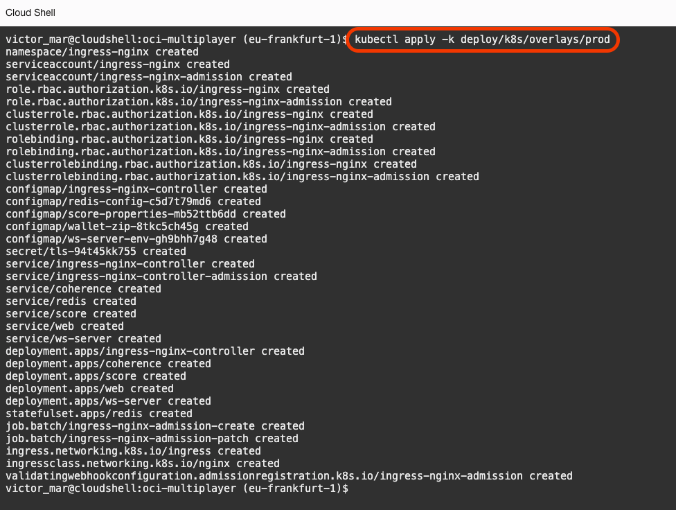

11. Verify the pods were deployed (it might take a minute or so for all pods to come online). Re-run the command every couple of minutes until all pods are ready.

    ```
    <copy>kubectl get pods</copy>
    ```

  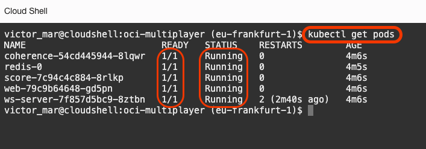

    > NOTE: Make sure all the pods are `Running` and `1/1` Ready.

11. Obtain the external service IP for the application you just deployed.

    ```
    <copy>kubectl -n ingress-nginx get svc</copy>
    ```

  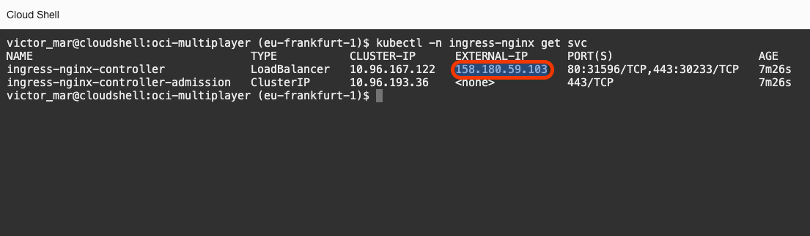

12. Paste the IP address from the previous step in a new browser tab and check it out!

  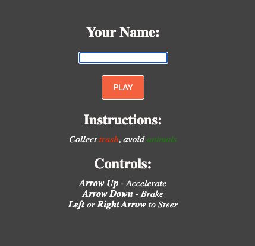

Optionally, if you want to clean up the workshop resources on Oracle Cloud; you may now [proceed to the next lab](#next).

## Acknowledgements

* **Author** - Victor Martin - Technology Product Strategy Director - EMEA
* **Author** - Wojciech (Vojtech) Pluta - Developer Relations - Immersive Technology Lead
* **Author** - Eli Schilling - Developer Advocate - Cloud Native and DevOps
* **Last Updated By/Date** - August, 2023
