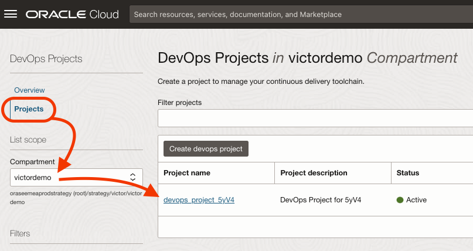

# Build Pipeline

## Introduction

OCI DevOps has Build pipelines where you can configure the steps to build the different components that compose your application.

Estimated Time: 20 minutes

### Objectives

In this lab, you are going to build the artifacts from the source code using OCI DevOps build pipeline. As part of the process, you are going to use stages to build and deliver the artifacts built. The outcome will be to have the container images with the application components on Oracle Cloud Image Registry.

### Prerequisites

- Oracle Cloud Account.
- Be an OCI administrator in your account (in Free Tier, you are an administrator by default).
- GitHub Account
- Finish the previous Lab.

## Task 1: Get familiar with OCI DevOps

1. Go to **Menu** > **Developer Services** > **DevOps**.
  
  

2. Click on **Projects**

    > NOTE: Make sure you select the compartment, or that the root compartment is selected.
  
  

3. You will see our OCI DevOps Project, click on it.

  

4. You will find code repositories on the side menu and the main page. Code Repositories contain the mirrored GitHub Repository.

  

    > NOTE: OCI DevOps can host your code without the need of GitHub or any other git service. This is the preferred and the easiest way, for security and integration.
    >  
    >  
    > In this workshop, we take the approach of GitHub so you can see a more complex scenario with a minutely synchronized mirroring between OCI DevOps Code Repository and Github.

1. Click on the mirrored repository to take a look at the code.

  

    > NOTE: Take into account that the initial code mirroring takes a few minutes. The system will tell you if the process is on-going.

6. Go back to the Main page of OCI DevOps Project, Click on the name of your DevOps Project on the breadcrumbs.

  

## Task 2: Run Build Pipeline

1. Scroll down until you see the **Latest Build pipelines** section. Click on the Build Pipeline you created with Terraform.

  

2. Take a look, there are two stages: **Build Services** and **Deliver Artifacts**. The first stage will build the Node and Java Applications. The second stage will deliver the container images with the applications on Oracle Cloud Image Registry.

  

3. Click **Start manual run**.

  

4. This Build Pipeline has some Parameters, keep them in mind to customize your build pipeline in the future. For the moment, nothing to do here.

  

5. Click **Start manual run** to kick off the pipeline.

  

6. Wait until the build pipeline is finished. It might take up to 15 minutes.

  

7. You can minimize some of the other panels.

  

8. Finally, confirm the success and explore the console log.

  

9.  When done, come back to the OCI DevOps Project.

  

You may now [proceed to the next lab](#next).

## Acknowledgements

* **Author** - Victor Martin, Tech Product Strategy Director (EMEA)
* **Contributors** - Wojciech Pluta - DevRel, Eli Schilling - DevRel
* **Last Updated By/Date** - July 1st, 2023