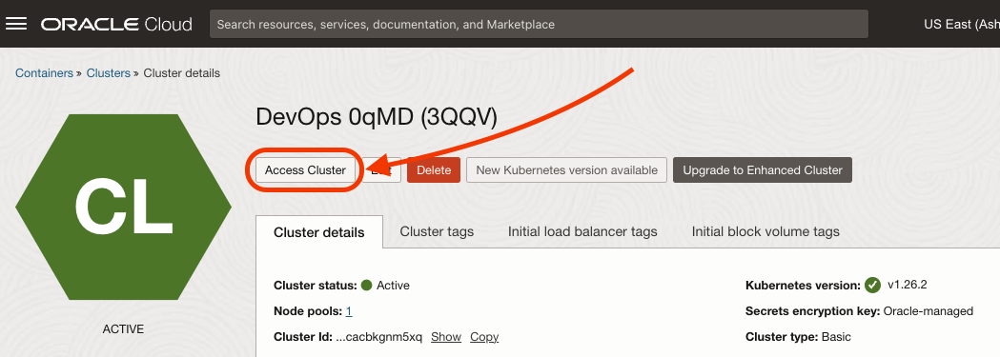
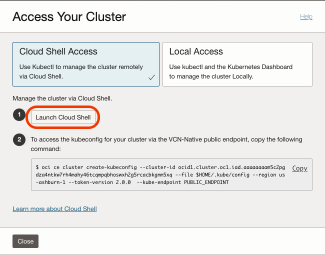
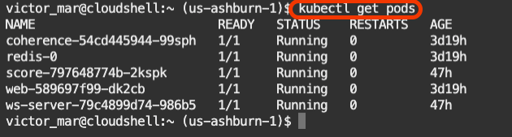

# Clean Up (Optional)

## Introduction

It is always a good practice to clean up after you learned about OCI DevOps. With Terraform and Kubernetes the process is very simple.

Estimated Time: 10 minutes

### Objectives

In this optional lab, you are going to clean the resources created during the workshop.

### Prerequisites

- Oracle Cloud Account.
- Be an OCI administrator in your account (in Free Tier, you are an administrator by default).
- GitHub Account
- Finish the previous Lab.

## Task 1: Delete Load Balancer from Kubernetes

1. Go to **Menu** > **Developer Services** > **Kubernetes Clusters (OKE)**

  

2. The Kubernetes Cluster will be on the list, the name starting with `DevOps`. Click on the Kubernetes Cluster name.

  

3. At the top, click on **Access Cluster**.

  

4. On the **Access Your Cluster** window, if you have the Cloud Shell still open, jump to number 2. If not, click on **Launch Cloud Shell** and wait for Cloud Shell to be active.

  

5. Click the button to copy the command from number 2 of the **Access Your Cluster** window. And paste it on the Cloud Shell. Run the command.

  

6. Paste it on Cloud Shell and run it.

  

7. Run the following command to see the microservices composing the application and check that `kubectl` is configured to access your Kubernetes Cluster.

    ```bash
    <copy>kubectl get pods</copy>
    ```

  

8. After that, delete the ingress controller, hence the load balancer by running the following command.

    ```bash
    <copy>kubectl delete ns ingress-nginx</copy>
    ```

9. It will take a couple of minutes.

  

## Task 2: Delete infrastructure

1. From the Cloud Shell, make sure you are in `oci-multiplayer/deploy/devops/tf-devops` folder.

    ```bash
    <copy>cd ~/oci-multiplayer/deploy/devops/tf-devops</copy>
    ```

2. Run the following command to destroy the OCI DevOps infrastructure.

    ```bash
    <copy>terraform destroy -auto-approve</copy>
    ```


3. When the Terraform `destroy` finishes successfully. It might take up to 3 minutes.

  

4. Change the directory to the `tf-env`

    ```bash
    <copy>cd ../tf-env</copy>
    ```

5. Run the following command to destroy the rest of the infrastructure.

    ```bash
    <copy>terraform destroy -auto-approve</copy>
    ```

6. When the Terraform `destroy` finishes successfully, you have finished cleaning up.

  

7. Congratulations you have cleaned the infrastructure and learned how to build and deploy your microservice application.

## Acknowledgments

* **Author** - Victor Martin, Tech Product Strategy Director (EMEA)
* **Contributors** - Wojciech Pluta - DevRel, Eli Schilling - DevRel
* **Last Updated By/Date** - July 1st, 2023