# Deployment Pipeline

## Introduction

OCI DevOps has Deployment pipelines responsible for taking the artifacts built on previous steps and deploying them on the infrastructure: virtual machines, container instances, Kubernetes clusters or Serverless functions.

Estimated Time: 15 minutes

### Objectives

In this lab, you are going to deploy the artifacts (container images) into the Kubernetes Cluster. As part of this lab, you will run the Deployment pipeline that will do all the work for you automatically. The deployment pipeline will access secrets from OCI Vault and create all the config files. Finally, it will deploy with Kustomize running `kubectl`.

### Prerequisites

- Oracle Cloud Account.
- Be an OCI administrator in your account (in Free Tier, you are an administrator by default).
- GitHub Account
- Finish the previous Lab.

## Task 1: Run Deploy Pipeline

1. Make sure you are back to OCI DevOps Project.
  
  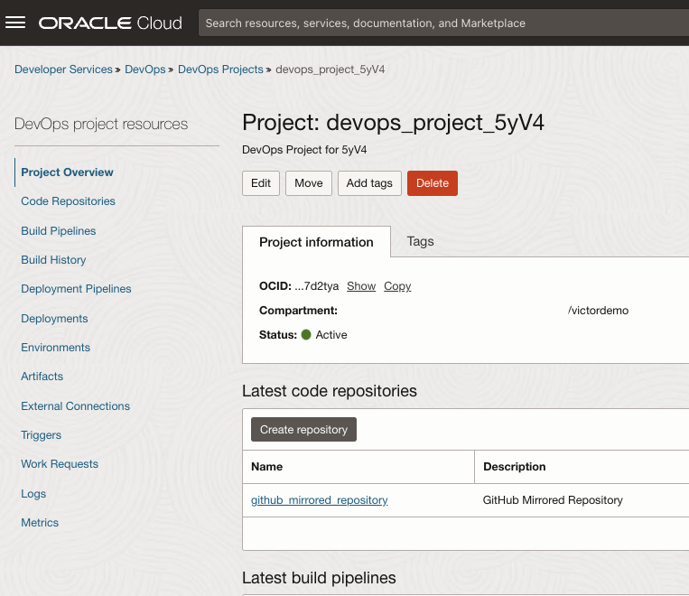

2. Scroll down until you see the **Latest deployment pipelines**. Click on the Deployment Pipeline you created with Terraform.

  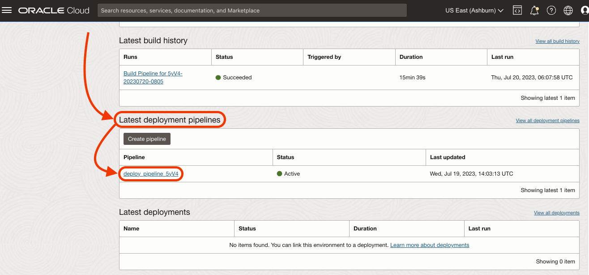

3. Take a look, there is one stage: **Deploy with Kustomize**. This stage will deploy with Kustomize to the Kubernetes Cluster.

  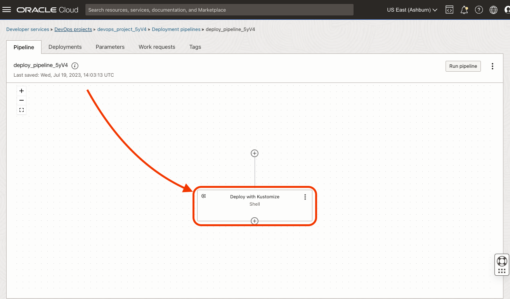

4. Click **Run pipeline**.

  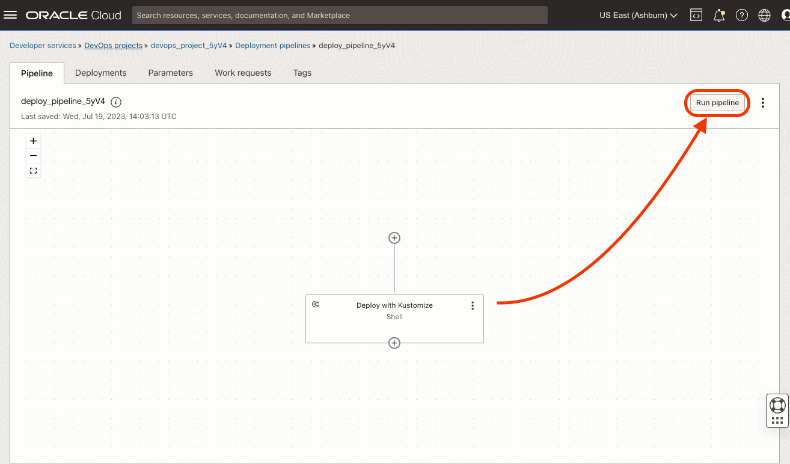

5. This Pipeline has no Parameters, but keep them in mind to customize your deployment pipeline in the future.

  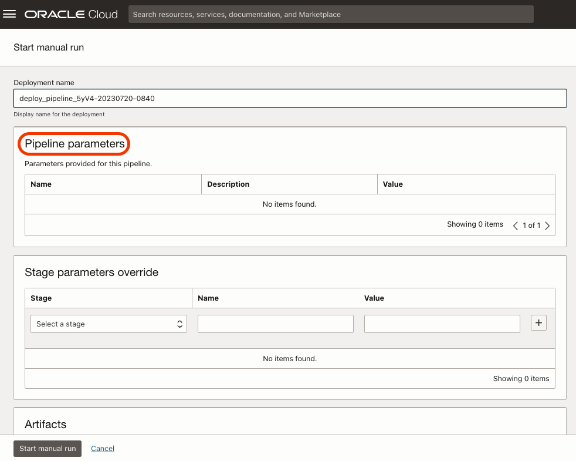

6. Click **Start manual run** to kick off the pipeline.

  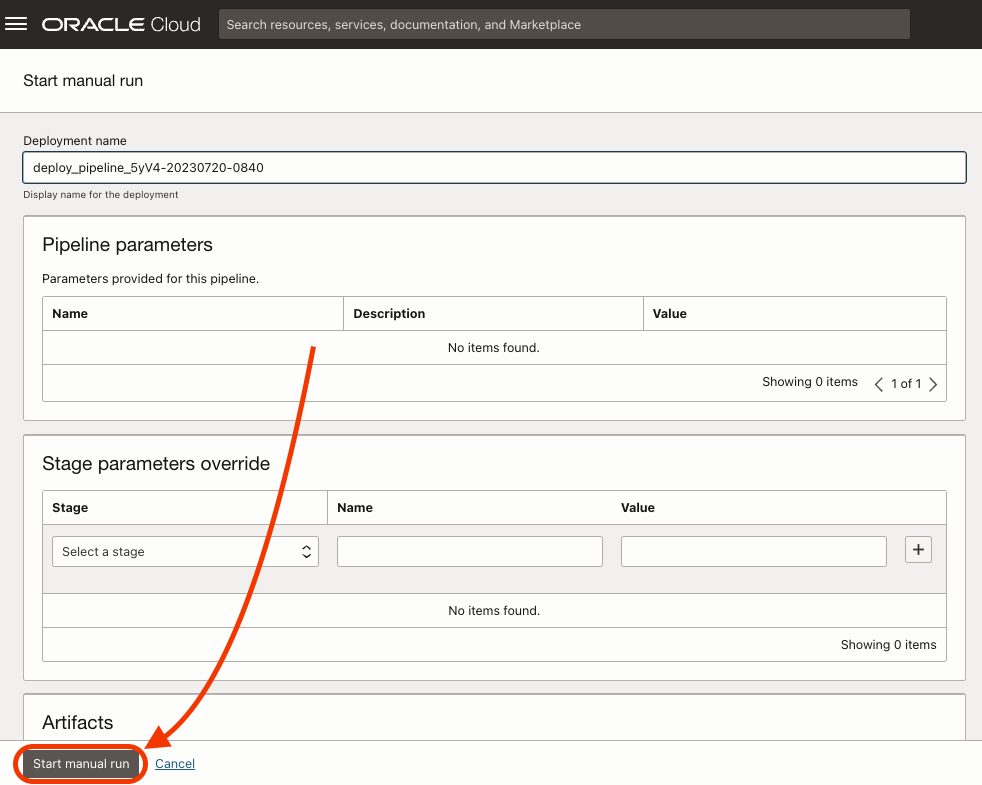

7. Wait until the deployment pipeline is finished. It might take up to 7 minutes.

  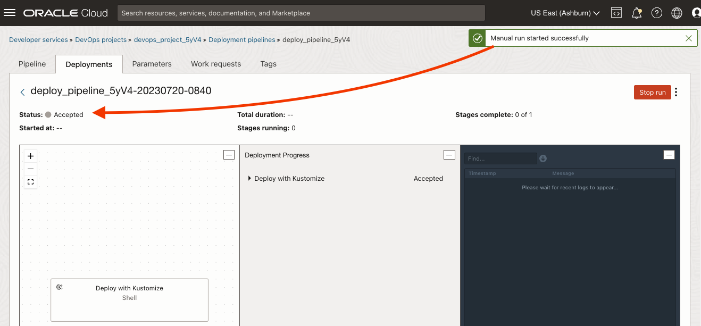

8. Finally, confirm the success and explore the console log. You can minimize some of the other panels.

  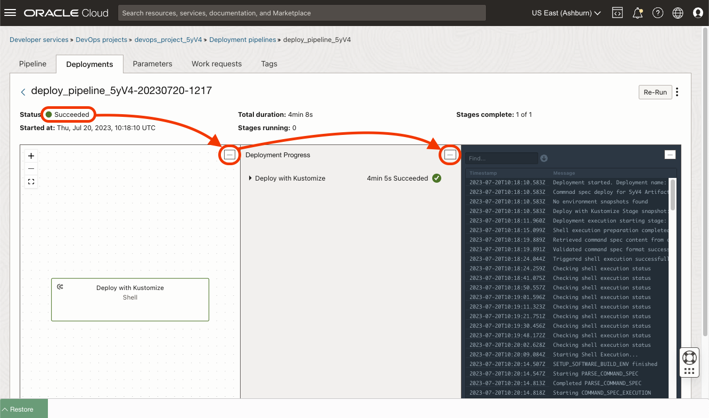

9. At the end of the logs, you will see a message: `EXEC: http://PUBLIC_IP/`. Copy the `http://PUBLIC_IP` part.

  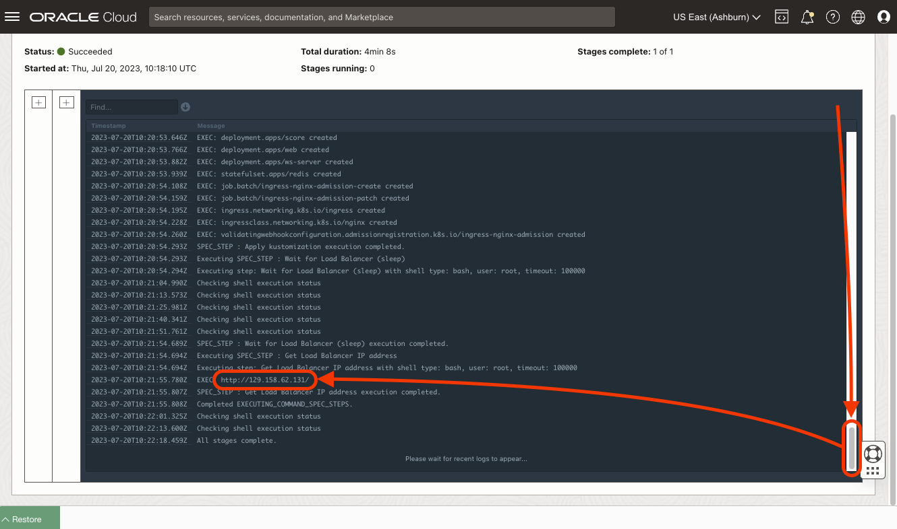

10.  Copy and paste the URL into the browser.

  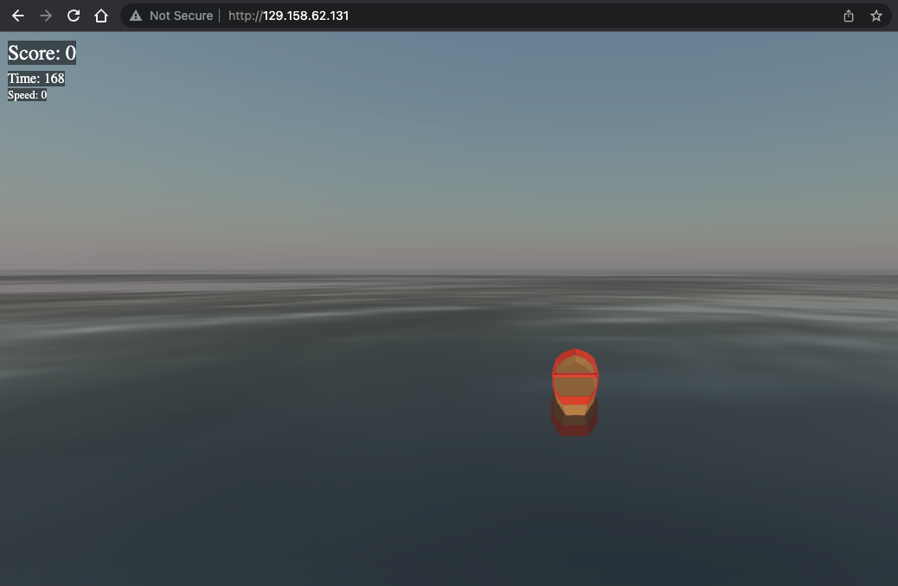

11. Add your name, click **Play**.

  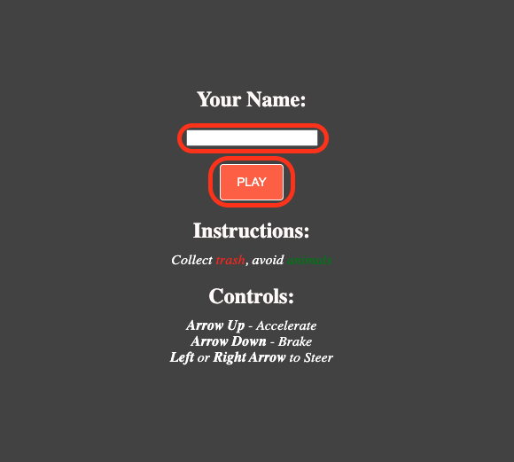

12.  Click **Create New Game**.

  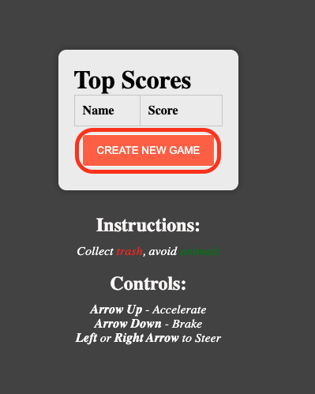

You may now [proceed to the next lab](#next).

## Acknowledgements

* **Author** - Victor Martin, Tech Product Strategy Director (EMEA)
* **Contributors** - Wojciech Pluta - DevRel, Eli Schilling - DevRel
* **Last Updated By/Date** - July 1st, 2023
