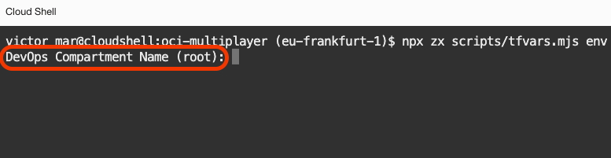
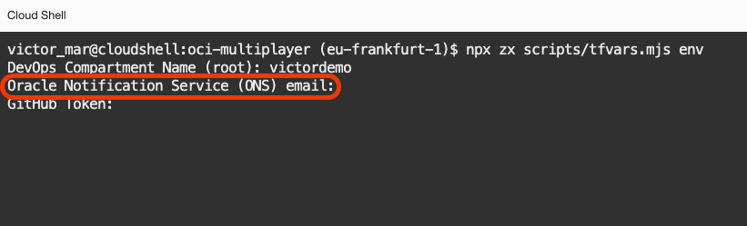
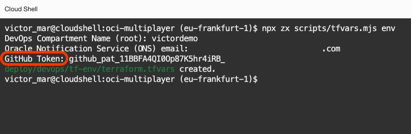
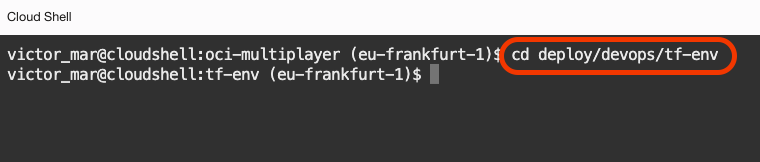
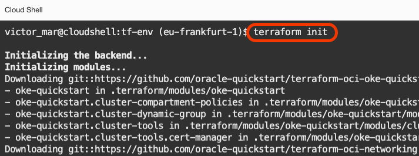
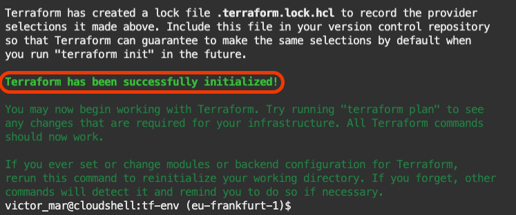
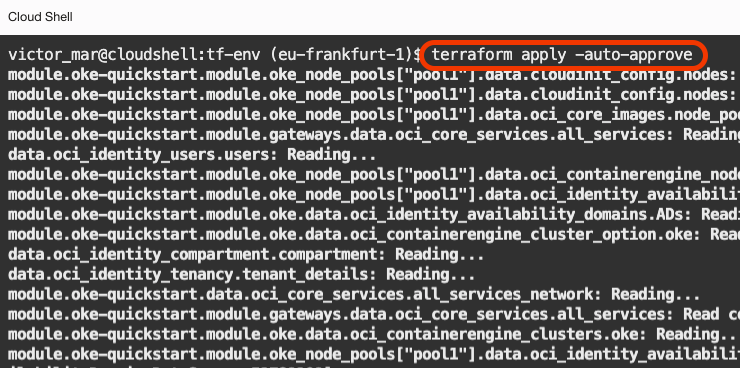
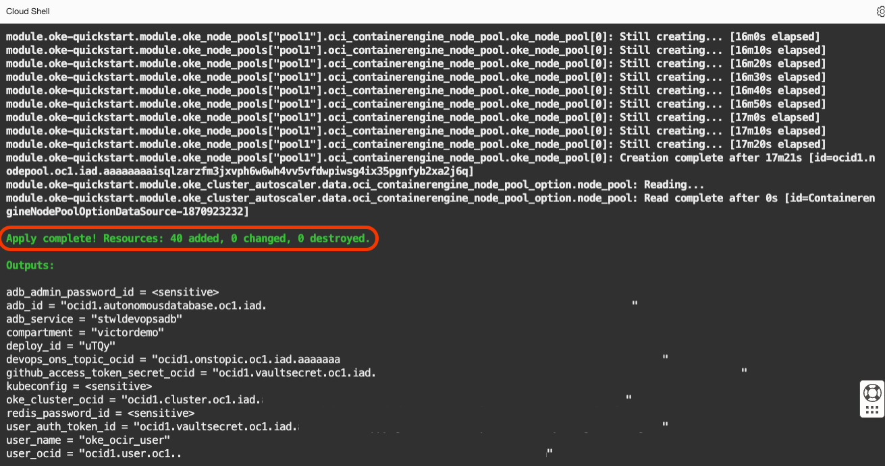

# Foundation Infrastructure

## Introduction

This is the first, out of two, Terraform deployments. We have split the terraform deployment so you can make changes on OCI DevOps deployment without having to deploy all the foundational infrastructure every time.

Estimated Time: 20 minutes

### Objectives

In this lab, you are going to deploy that foundational infrastructure that includes:
- Kubernetes Cluster: the environment where the application is going to be deployed.
- OCI Vault: to store the secrets like passwords and tokens.
- Identity and Access Management policies and dynamic groups control what services use what resources in Oracle Cloud.
- Oracle Autonomous Database to be used by the application.
- Oracle Notification Service to receive emails every time  OCI DevOps finishes an operation.

### Prerequisites

- Oracle Cloud Account.
- Be an OCI administrator in your account (in Free Tier, you are an administrator by default).
- GitHub Account
- Finish the previous Lab.

## Task 1: Set up Terraform configuration file

1. From the **Cloud Shell**, you should be on the directory `oci-multiplayer`, you can run this command.
    
    ```bash
    <copy>npx zx scripts/tfvars.mjs env</copy>
    ```

    > This `tfvars.mjs` will create a file called `terraform.tfvars` with the values needed by Terraform to create all the foundational infrastructure.

2. During the execution of the script, you will have to answer a few questions. The first one is the _DevOps Compartment Name_. You just press _**ENTER**_ to select the root compartment. If you are familiar with [OCI compartments](https://docs.oracle.com/en-us/iaas/Content/Identity/Tasks/managingcompartments.htm), then feel free to pick an existing compartment name.

  

3. The second one is the _Oracle Notification Service (ONS) email_. You just type your email address. This email will get configured as the point of contact for DevOps events.

  

4. The third one is the _GitHub Token_. You just paste the GitHub access token you copied from the previous task.
  
  

## Task 2: Apply foundational infrastructure

1. Change to the folder `deploy/devops/tf-env` where all the foundational infrastructure definitions are.
    
    ```bash
    <copy>cd deploy/devops/tf-env</copy>
    ```
  
  


2. Run the `init` command for terraform.
    
    ```
    <copy>terraform init</copy>
    ```

  

3. After a few seconds, you will get the success message.

  

4. Then, run the `apply` command for Terraform to create resources on Oracle Cloud.
    
    ```bash
    <copy>terraform apply -auto-approve</copy>
    ```

  

5. The `apply` process might take up to 20 minutes. You will use this time to understand a bit more about the infrastructure that you are creating.


    > NOTE, while Terraform deploys the foundation infrastructure. 
    > <br>
    > <br>
    >  
    > The foundation infrastructure includes:
    >   - Oracle Kubernetes Cluster
    >   - Oracle Notification Service (ONS) topic
    >   - Oracle Vault, Master Key and secrets
    >   - Policies and Dynamic Groups
    >  
    > <br>
    > <br>
    > Let's explore them one by one.
    > <br>
    > <br>
    > Oracle Kubernetes Cluster is a cluster of Kubernetes with, initially, 1 pool of nodes with 2 nodes. That will be an initial setup, but you can change the variables to spin bigger clusters to fit your needs. As part of the infrastructure, all network required is also created like subnets for endpoints, node pools and load balancer.
    > <br>
    > <br>
    > Oracle Notification Service, also called, ONS is a service that delivers notifications to other services or email addresses, depending on the subscription you configure. In your case, you are using your email address so OCI DevOps can send you emails when builds and deployments fail, or many other cases.
    > <br>
    > <br>
    > OCI Vault is a service to store encrypted information like passwords and tokens. You create a Vault, then a Master Key that is used to encrypt secrets. OCI DevOps can read (if properly configured) some secrets. That is the way we keep secrets out of the hands of operators and allow only the services you configure to have access to secrets.
    > <br>
    > <br>
    > Policies and Dynamic Groups. Policies are the rules for allowing groups of entities (usually services) and groups of users to read, use, manage, etc other resources in Oracle Cloud. It starts by not trusting anything and you allow group by group to do specific tasks to build a better security posture. Because some resources are dynamically created, like compute instances that can come and go, you can create a dynamic group where you set some matching rules that if apply, then the resource belongs to the group and is affected by the policies that affect the group of resources.
    > <br>
    > <br>
    > After a few minutes, you can explore some of the resources that have been created.
    > <br>
    > <br>
    > For example, you can go to **Menu** > **Identity & Security** > **Vault**.
    > <br>
    > <br>
    > You will find a list of vaults, and at this point, you might see one recently created. If it is not there yet, it is because is still being created.
    > <br>
    > <br>
    > In the meantime, you can also take a look at the ONS topic. Go to Menu > Developer Services and under Application Integration > Notifications.
    > <br>
    > <br>
    > You will find a list of topics, the latest is the one created for DevOps. Once again, if it is on `creating` state you need to wait a bit more.
    > <br>
    > <br>
    > If you click on it (when fully created), you will see a Subscriptions panel at the bottom with one subscription saying "Pending". At this point, you might have received an email that if you confirm, then it will be fully configured. No need to do it for the completion of the content, but a good thing to get done if you want to receive email notifications.
    > <br>
    > <br>
    > 

## Task 3: Terraform output

1. After 15 to 20 minutes, you will see that terraform has terminated.

2. Make sure the terraform apply process printed the output with no error.
    
  

3. Come back to the parent directory.

    ```bash
    <copy>cd ../../..</copy>
    ```

4. You have completed this lab.

You may now [proceed to the next lab](#next).

## Acknowledgements

* **Author** - Victor Martin, Tech Product Strategy Director (EMEA)
* **Contributors** - Wojciech Pluta - DevRel, Eli Schilling - DevRel
* **Last Updated By/Date** - July 1st, 2023