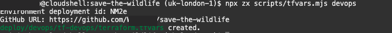
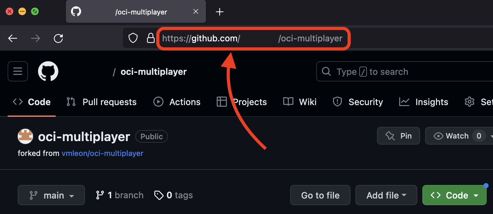
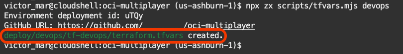
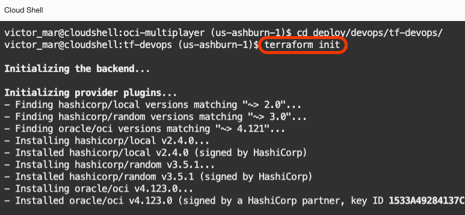
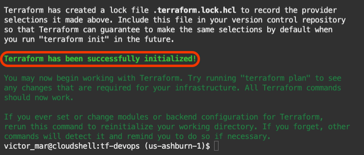
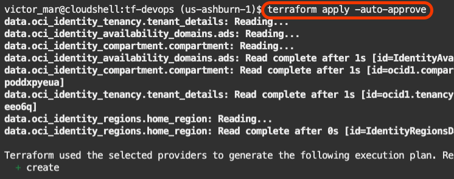
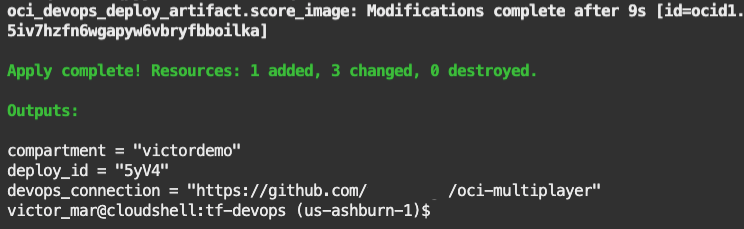

# DevOps Infrastructure

## Introduction

OCI DevOps uses other OCI services like container instances to run code, dependencies on networking components and OCI Logs that will let you know what happened on the execution of the building and deploying pipelines.

Estimated Time: 15 minutes

### Objectives

This is the second Terraform deployment.

In this lab, you are going to deploy OCI DevOps components that include:
- DevOps Project that groups all the other components.
- DevOps Connection to GitHub
- DevOps Build Pipeline
- DevOps Deployment Pipeline
- DevOps Environment pointing to the Kubernetes Cluster
- DevOps logs

### Prerequisites

- Oracle Cloud Account.
- Be an OCI administrator in your account (in Free Tier, you are an administrator by default).
- GitHub Account
- Finish the previous Lab.

## Task 1: Set up Terraform configuration file

1. From the **Cloud Shell**, you should be on the directory `oci-multiplayer`, run this command.
    
    ```bash
    <copy>npx zx scripts/tfvars.mjs devops</copy>
    ```

    > This `tfvars.mjs` will create a file called `terraform.tfvars` with the values needed by Terraform to create all the DevOps infrastructure.

2. During the execution of the script, you will have to answer a question. The _GitHub URL_. You just type/paste the URL of your forked GitHub repository.

  

3. To get the URL go to your GitHub page and copy the URL at the Browser bar.

  

4. After you inserted the URL, the script will finish. Printing that the `terraform.tfvars` file has been created.

  

## Task 2: Apply DevOps infrastructure

1. Change to the folder `tf-devops` where all the DevOps infrastructure definitions are.
    
    ```bash
    <copy>cd deploy/devops/tf-devops/</copy>
    ```

2. Run the `init` command for terraform.

    ```bash
    <copy>terraform init</copy>
    ```
    
  

  

3. Then, run the `apply` command for Terraform to create resources on Oracle Cloud. The `apply` process might take up to 5 minutes.
    
    ```bash
    <copy>terraform apply -auto-approve</copy>
    ```

  

    > NOTE, while Terraform deploys the DevOps infrastructure. 
    > <br>
    > <br>
    >  
    > You will use this time to understand a bit more about the infrastructure that you are creating.
    > <br>
    > <br>
    > The DevOps infrastructure includes:
    >     - DevOps project
    >     - DevOps GitHub repository mirroring
    >     - DevOps Build Pipeline and its stages
    >     - DevOps Deployment Pipeline and its stages
    >     - Networking requirements.
    > <br>
    > <br>
    > Let's explore them one by one.
    > <br>
    > <br>
    > DevOps project is the main entity that groups up all the resources associated with the same application/project.
    > <br>
    > <br>
    > DevOps GitHub repository mirroring is an entity that configures the mirroring of the GitHub repository, basically, a connection with your forked repository that allows synchronization of code between GitHub and OCI DevOps.
    > <br>
    > <br>
    > OCI DevOps has its own git repository for your code with high level of security and the best integration possible in case you don't want to use other 3rd party source code version control.
    > <br>
    > <br>
    > DevOps Build Pipeline and its stages will build your source code, run your tests, and generate artifacts like files, and container images.
    > <br>
    > <br>
    > DevOps Deployment Pipeline and its stages are where all the artifacts get deployed on In your case, a Kubernetes Cluster but it could be anything from virtual machines to container instances.
    > <br>
    > <br>
    > Also, Terraform will create all the networking fabric needed to run the build and deployment pipelines.
    > <br>
    > <br>
    > 

## Task 3: Terraform output

1. After 5 to 10 minutes, you will see that terraform has terminated.

2. Make sure the terraform apply process printed the output with no error.
    
  

3. Come back to the parent directory.

    ```bash
    <copy>cd ../../..</copy>
    ```

4. You have completed this lab.

You may now [proceed to the next lab](#next).

## Acknowledgements

* **Author** - Victor Martin, Tech Product Strategy Director (EMEA)
* **Contributors** - Wojciech Pluta - DevRel, Eli Schilling - DevRel
* **Last Updated By/Date** - July 1st, 2023