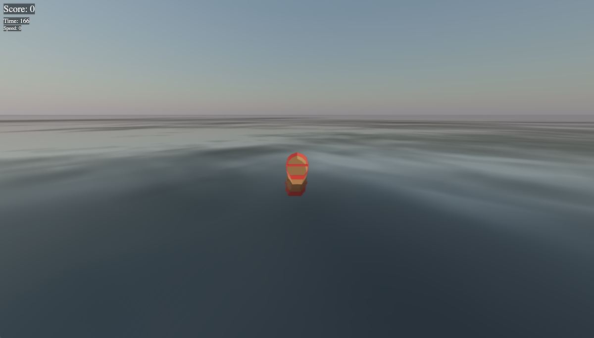

# Introduction

## About This Workshop

Welcome to Save The Wildlife, an Automated Continuous Integration and Continuous Deployment Release Pipeline for microservice applications.

### Objectives

During this workshop, you will learn how to build, and deploy an application with several components using OCI DevOps. You will use Terraform to automate the infrastructure components in Oracle Cloud and OCI DevOps service to build and deploy the application into an OCI Kubernetes Cluster.

In this workshop, you will learn how to:
- Create a Kubernetes Cluster
- Create Autonomous Database
- Create a DevOps Project, a build pipeline and a deployment pipeline
- Move to the next version and practice a rollback

Watch the video below for a quick walk-through of the workshop.
[DevOps Multiplayer Content](videohub:xxx)

### Prerequisites

You must have an OCI account. [Click here](https://www.oracle.com/cloud/free/?source=:ow:o:s:nav::DevoGetStarted&intcmp=:ow:o:s:nav::DevoGetStarted) to create a new cloud account.

If you are using an Oracle Free Tier, it must be active and with remaining free credits.

You must be an OCI administrator in your account (in Free Tier, you are an administrator by default).

You need an active GitHub Account to fork a repository.

This solution is designed to work with several OCI services, allowing you to quickly be up-and-running:
* [Container Engine for Kubernetes](https://www.oracle.com/cloud/cloud-native/container-engine-kubernetes/)
* [OCI DevOps Service](https://www.oracle.com/devops/devops-service/)
* [Autonomous Database](https://www.oracle.com/autonomous-database/)
* [Oracle Coherence](https://www.oracle.com/java/coherence/)

You may now [proceed to the next lab](#next).

## Acknowledgements

* **Author** - Victor Martin, Tech Product Strategy Director (EMEA)
* **Contributors** - Wojciech Pluta - DevRel, Eli Schilling - DevRel
* **Last Updated By/Date** - July 1st, 2023
 