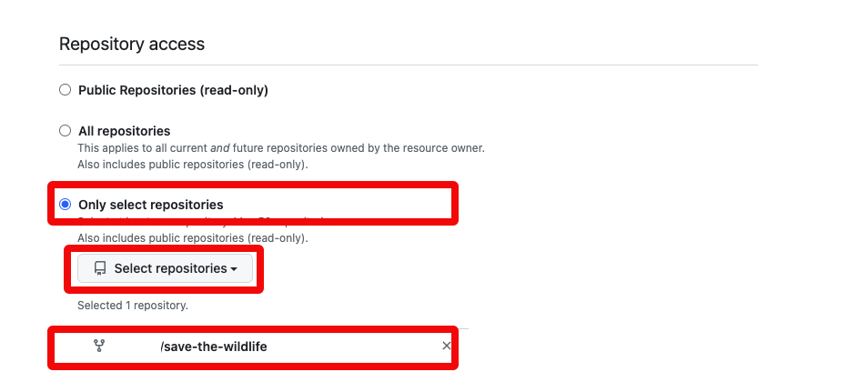

# GitHub Fork

## Introduction

The source code of the microservice application lives on GitHub. This is a more complex scenario, the easy way would be to have the code as well on OCI DevOps, but this extra integration can be interesting for those of you that still have the code on other source code control systems.

Estimated Time: 15 minutes

### Objectives

During this lab, you are going to clone a GitHub repository to have your own copy. The rest of the workshop will be working based on your fork.

### Prerequisites

- Oracle Cloud Account.
- Be an OCI administrator in your account (in Free Tier, you are an administrator by default).
- GitHub Account
- Finish the previous Lab.

## Task 1: Fork repo

1. Open a new tab in your browser and go to the [OCI DevOps OKE](https://github.com/vmleon/oci-multiplayer) repository.
  
  

2. Click on **Fork**.
  
  

3. Leave the repo name and click **Create fork**, it takes just a few seconds.
  
  
  
  
4. When the fork process has finished take a look to the URL. Now the repo is under your GitHub user.
  
  
  

## Task 2: Create an access token

1. Go to your profile icon in GitHub.
  
  

2. Go to **Settings**.
  
  

3. Scroll to the end, and click **Developer settings**.
  
  

4. Expand **Personal access tokens** and click on **Fine-grained tokens**.
  
  

5. Click **Generate new token**.
  
  

6. Fill in the form: **Token name**, **Expiration**, **Description**, **Resource owner**
  
  For the name and description you can use any name, we suggest:

    ```
    <copy>oci-multiplayer-token</copy>
    ```
  

7. Check **Only select repositories**. And select the repository `oci-multiplayer`.
  
  

8.  On permissions, set **Contents** to **Read-only**. under **Repository permissions**.
  
  

9.  Click **Generate token**.
  
  

10.  It will ask for your GitHub Account password to confirm.
  
  

11.  Copy the generated token in a safe place. You will need it later. Make sure to copy your personal access token now as you will not be able to see this again.
  
  

## Task 3: Clone the new repository

1. Go back to the repository by clicking the GitHub menu and the name of the repository.

  

2. Clone the forked repository. Click Code and select HTTPS.

  

2. Log in on Oracle Cloud and open Cloud Shell.
  
  

3. Git Clone the repository. Type `git clone ` and then paste the URL copied from GitHub.

    ```bash
    <copy>git clone YOUR_FORK_URL</copy>
    ```

  

1. Change the directory to the cloned repository.
    
    ```bash
    <copy>cd oci-multiplayer</copy>
    ```

You may now [proceed to the next lab](#next).

## Acknowledgements

* **Author** - Victor Martin, Tech Product Strategy Director (EMEA)
* **Contributors** - Wojciech Pluta - DevRel, Eli Schilling - DevRel
* **Last Updated By/Date** - July 1st, 2023