# Release New Feature

## Introduction

As part of a normal software development lifecycle, you will have to create new features and deploy those new features. OCI DevOps helps you to do that.

Estimated Time: 15 minutes

### Objectives

In this lab, you are going to change the code to one of the components and release the application again. The release will be done by running the Build pipeline and Deployment pipeline.

### Prerequisites

- Oracle Cloud Account.
- Be an OCI administrator in your account (in Free Tier, you are an administrator by default).
- GitHub Account
- Finish the previous Lab.

## Task 1: Bump the version of a service

1. You are going to change the version of the server, representing the addition of one new feature. Go to your GitHub forked repository.

  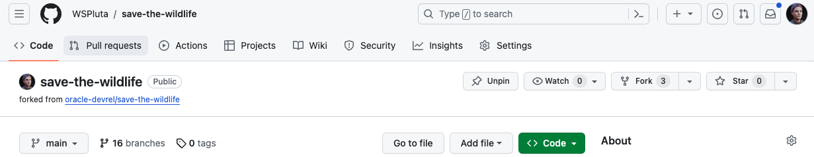

2. Click on the `server` folder on the code panel.

  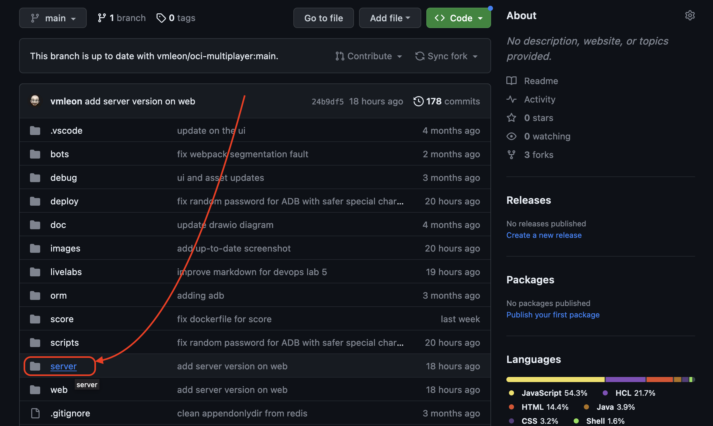

3. Click on the `package.json` file.

  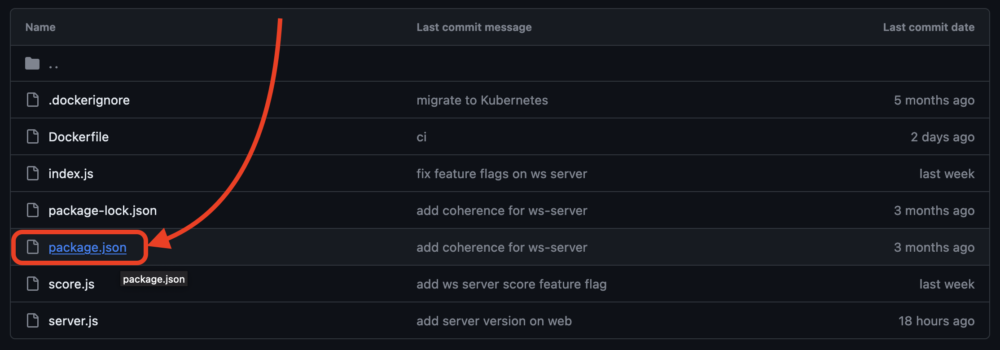

4. Click the **Edit this file** button.

  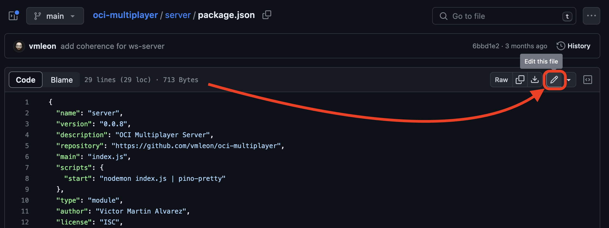

5. Edit the `version` to `0.0.10` and click **Commit changes...** button.

  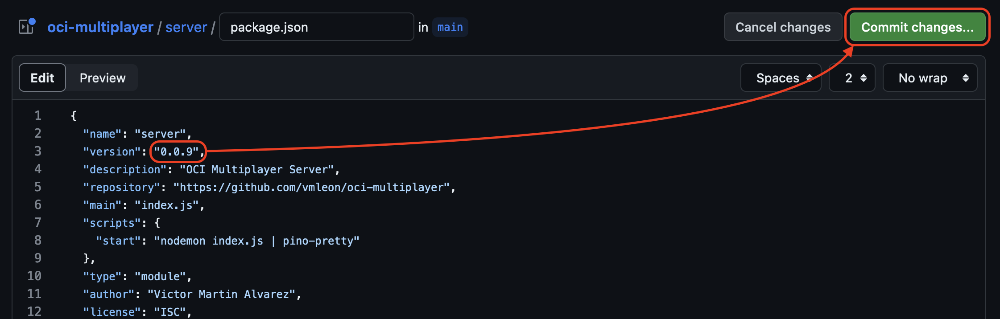

6. Click **Commit changes** on the popup window.

  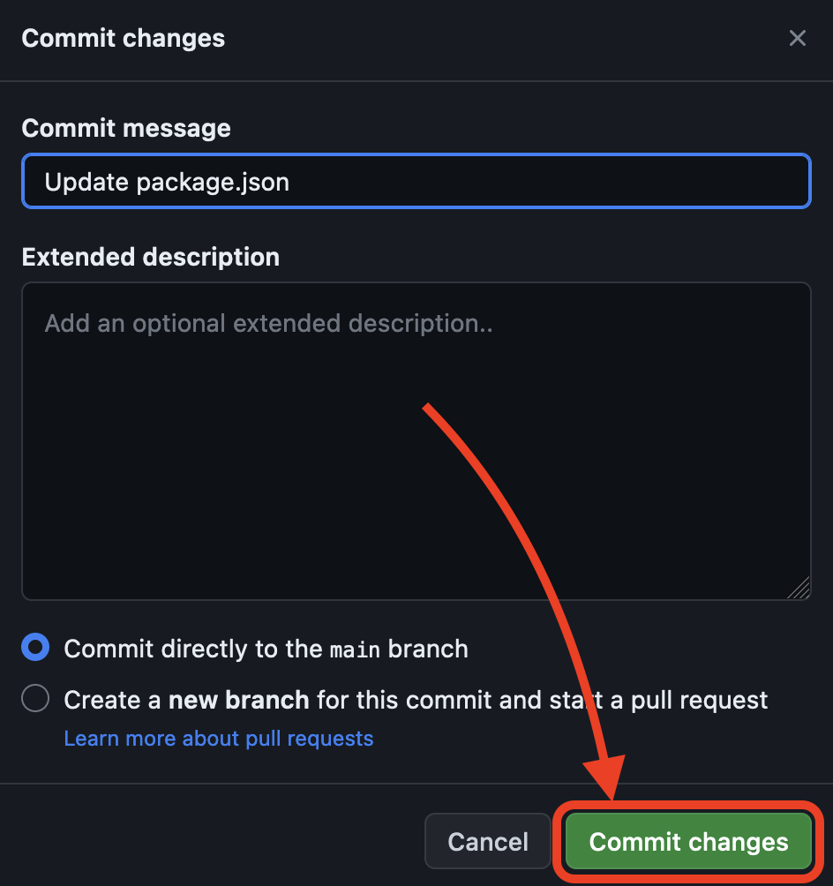

## Task 2: Build and Deploy

1. Go to OCI DevOps Build Pipeline and click on the Build Pipeline as you did in the previous lab.

  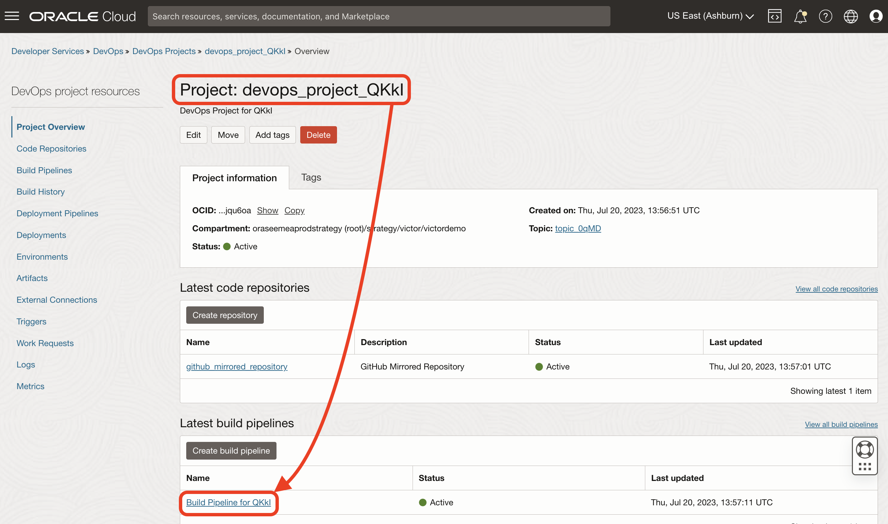

2. Click **Start manual run**.

  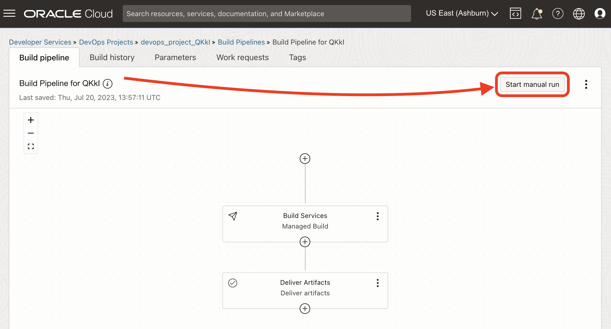

3. Click **Start manual run** to confirm on the parameters screen. It might take up to 15 minutes.

  

4. After a successful build execution of the pipeline.

  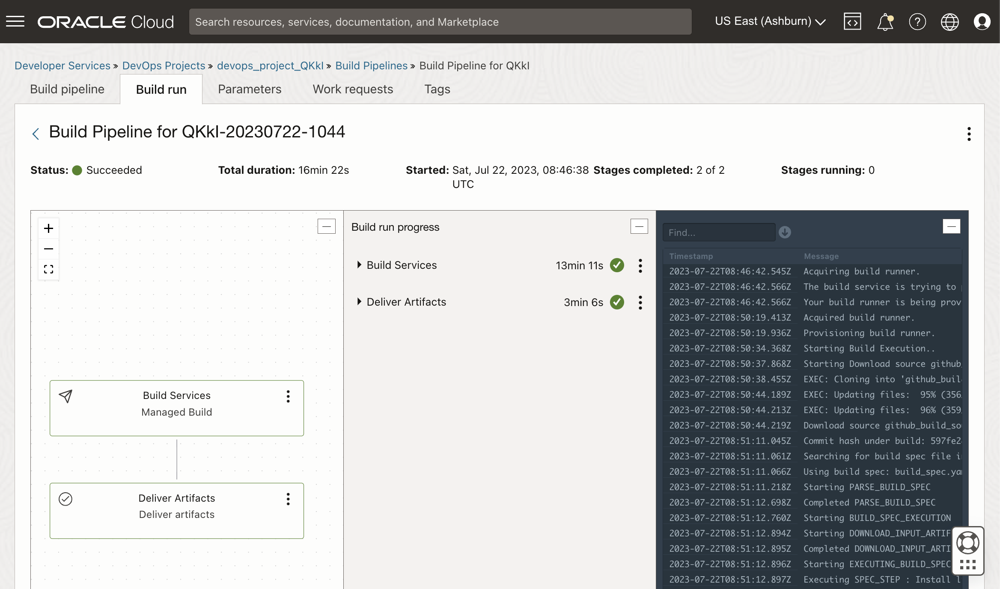

5. Go back to the DevOps project.

  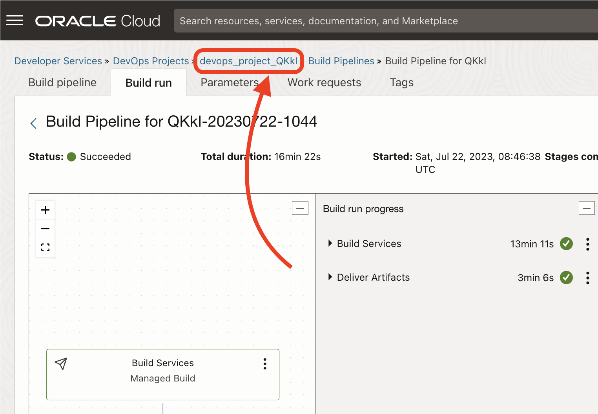

6. Go to the Deployment pipeline.

  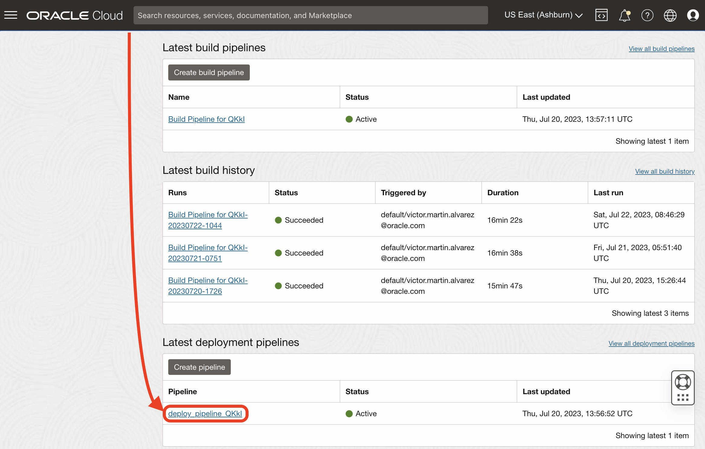

7. Click **Run Pipeline**.

  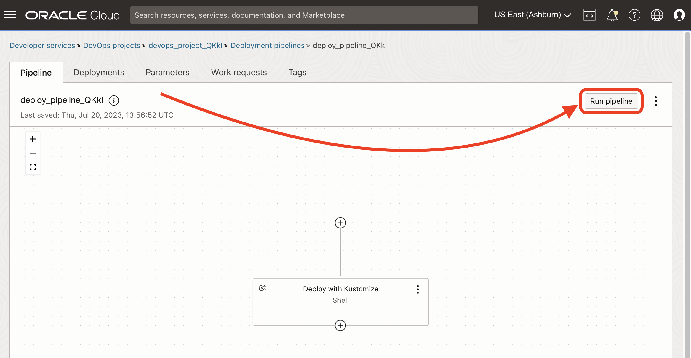

8. Confirm the **Start manual run**. It might take up to 7 minutes.

  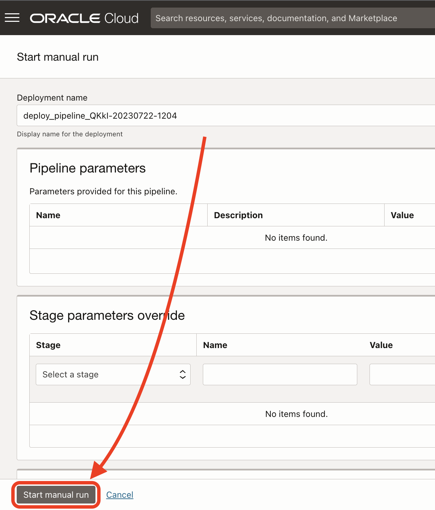

9. At the end of the logs, you will see a message: `EXEC: http://PUBLIC_IP/`. Copy the `http://PUBLIC_IP` part on the browser.

  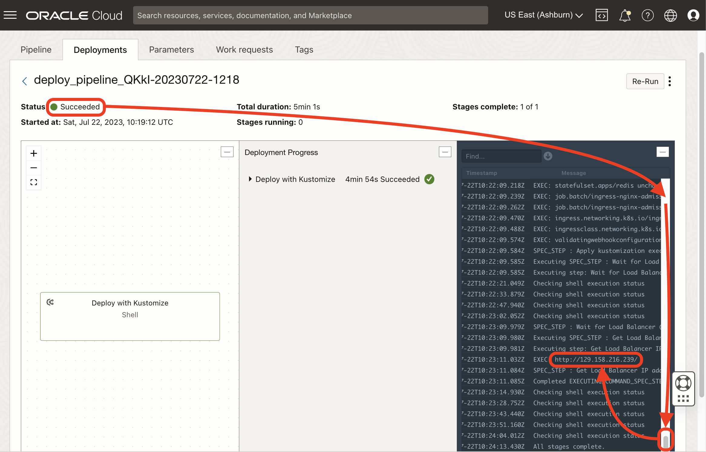

10. When in the game, the Server version would be the one you bumped.

  

## Task 3: Rollback (Optional)

1. From a terminal configured with GitHub run the revert of the last commit, just to simulate a rollback.

    ```bash
    <copy>git revert --no-edit main~1</copy>
    ```

2. Run the git push

    ```bash
    <copy>git push origin main</copy>
    ```

3. Go to OCI DevOps Build Pipeline.

  

4. Click **Start manual run**

  

5. Click **Start manual run** to confirm on the parameters screen.

  

6. After a successful build execution of the pipeline

  

7. Go back to the DevOps project.

  

8. Go to the Deployment pipeline.

  

9. Click **Run Pipeline**.

  

10. Confirm the **Start manual run**.

  

11. Get the curl command and execute it.

  

12. The Server version would be the one you rollbacked to.

You may now [proceed to the next lab](#next).

## Acknowledgments

* **Author** - Victor Martin, Tech Product Strategy Director (EMEA)
* **Contributors** - Wojciech Pluta - DevRel, Eli Schilling - DevRel
* **Last Updated By/Date** - July 1st, 2023