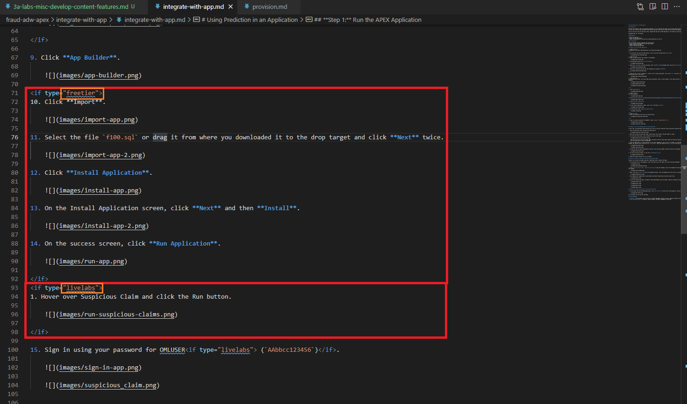

# Common Markdown Development Features

## Introduction

We'll go over how to implement certain common markdown features and tips in this optional lab.

In this lab, you will learn how to implement certain common markdown features and tips in this optional lab.

### Objectives

 * Linking to Absolute Path Images (on Object Storage)
 * Using Conditional Formatting
 * [Linking within a Workshop (Hotlinks)](#STEP3:LinkingwithinaWorkshop(Hotlinks))
 * Adding Videos
 * Scaling an Image
 * Using the LintChecker
 * Case Sensitivity **<- This is IMPORTANT! Read this!**

### What Do You Need?
* An IDE, such as Atom or Visual Studio Code.
* A local web server such as **atom-live-server** for Atom or **Live Server** for VSC.

## Task 1: Linking to Absolute Path Images (on Object Storage)
Rather than pointing to images within your lab folder or workshop directory with a relative path, you can just as easily point your images to URLs. This comes in handy if you reuse an image a lot, the code you write to display it in markdown will always be the same no matter where the image is in relation to markdown. Using absolute image paths is also handy if you need to keep an image updated, as changing the destination file image will affect every instance where you pointed an image to it. This is also useful when you want to *point to an image in a different repository* (you don't need to clone or fork that repository). This is the same concept and implementation as using absolute paths for common labs in your manifest.json files.

*For screenshots of OCI menu navigation, use the images with absolute links*

1. Here is an example of what the image code block looks like for pointing to a local image using relative pathing.

  ``````

2. To use an image with an absolute path, just replace the path with an URL. In this case, I am pointing to a common image located in the **oracle-livelabs/common** repository.

    ```
    <copy>
    
    </copy>
    ```

  Here is how the image path above shows up in production:
  

3. If the image link breaks, the image will break. For this reason, it's recommended that you use the Object Storage link rather than a random image hosting site.  To get this Object Storage link, navigate to the **oracle-livelabs/common** repository, and find the image file. Append the file path at the end of *"https://objectstorage.us-phoenix-1.oraclecloud.com/p/SJgQwcGUvQ4LqtQ9xGsxRcgoSN19Wip9vSdk-D\_lBzi7bhDP6eG1zMBl0I21Qvaz/n/c4u02/b/common/o/"*. For example, if an image is located in **images/console/home-page.png** in the **common** repository, then the link you should use is https://oracle-livelabs.github.io/common/**images/console/home-page.png**.

  


## Task 2: Using Conditional Formatting
If your workshop supports multiple instance types, but the bulk of the content stays the same, then conditional formatting can save you a lot of work. Most commonly, if you have differences between the "Free Tier" and "LiveLabs" (Green button) versions such as provisioning a database instance in Free Tier and just checking that it's created properly for LiveLabs, then conditional formatting will allow your workshop to use a singular markdown for both. This will save you immense effort and prevent accidental oversights if you need to update your workshop in the future since you won't have to maintain a duplicate markdown.

  1. Conditional formatting is using the "if" conditional to choose what to display in your markdown, based on an additional attribute "type" you attach to a lab element in your manifest.json file. Take a look at this example to understand the components involved in making conditional formatting work.

  

  On line 71, you can see the conditional is **if type="freetier"** and the closing **/if** on line 92. That means line 71-92 is only rendered if the type is freetier, and lines 93-98 is only rendered if the type is livelabs.

  

  On lines 21 and 27, you can see that we added the attribute "type" to the lab element. In this instance, this manifest.json is for the free tier version of the workshop so when a customer launches the workshop through a free tier button on the workshop's landing page, lab 2 and lab 3 will always have the **"freetier"** type attached to it.

  

  On lines 12, 17, and 23, you can see the same thing except that the type is "livelabs" for this file. The actual word doesn't matter, as long as the "type" in the manifest.json and the "type" in the markdown matches, the contents of the markdown conditional will be displayed.

2. You may have noticed that the numbering of the substeps within a step that uses conditional formatting may get out of line. Don't worry, as long as you use a number greater than 0, markdown will automatically number them sequentially when it gets rendered on a webpage. Also, note that conditional formatting can be used in-line if needed, you don't **HAVE TO** envelope content in a neat code block... though it's recommended to keep things organized and easy to read.

  

## Task 3: Linking within a Workshop (Hotlinks)
Sometimes you may want to link to something within your lab or workshop.  Most commonly, this is used in pages to link from the introduction or objectives to a specific section in the lab. This section in particular is hot-linked from the introduction to driving home that point. We'll take a look at the "Need Help?" lab to demonstrate how to incorporate this in your workshop.

1. First, take a look at the format of the hotlink. It's the same as when you construct a regular hyperlink, except that you preface the URL section with a **#** and then you use a seemingly condensed version of the section name you want to link to.

  

2. The condensed version of the section name is derived from the title of the section, without any spaces and most punctuations. This is the **name** attribute of the section (**division** in this case, and most cases). To view this and ensure your hotlink is correct... right-click on the element you want to link to and select **Inspect Element** and find the **"Name"** attribute.

  


## Task 4: Adding Videos
Adding videos is very similar to adding images. We most commonly see videos added in the introductions for labs to familiarize the audience with the product before they dive into the workshop.

1. Take a look at this example of a video linked in the introduction of a workshop.

  

  Markdown does the work of embedding the video for you, all you need to provide is a video hosting site (YouTube highly recommended) and the video link address.

2. The video link address is the characters you'll find at the end of the URL for the video you want to link.

  

## Task 5: Scaling an Image
Without using image scaling, all the screenshots you take for your workshop will be of different sizes (unless you're a master of making pixel-perfect crops). To remedy this, we HIGHLY recommend you to stick with a scaling and use it throughout your workshop. This will make all the images scale to the same width (if possible) and contribute to a more consistent and polished feel. You can override the default image scaling by applying these manual controls below. **We highly recommend you use #4's format by default.**

1. This is a demo image with no image sizing applied:

    ```
    
    ```

  

2. Use this format to scale the image size in relation to the amount of lab page space available. This example uses 50% of the page width and auto height:

    ```
    
    ```

  

3. Use this format for an absolute width and auto-scaled height. This example uses 500 pixels for width:

    ```
    
    ```

  

4. Lastly, **this is the format we recommend for all your images** if you don't need a particular scaling to drive emphasis on a subject. It auto-scaled to around ~3/4ths of the page width and its definition is maintained by the LiveLabs team so we can adjust the scaling platform-wide if needed:

    ```
    
    ```

  

5. As a final note, it's in your best interest to take as large of a picture as you can and then scale it down using the parameters above. LiveLabs allows the magnification of images so if you have a larger base image, the audience will have more clarity.

## Task 6: Using the LintChecker
The LintChecker is a great javascript function for QAing that you should take advantage of. It is especially handy in catching some of the more easily overlooked errors such as indentation and syntax errors.

1. To enable the LintChecker, just tack on **?qa=true** to the URL. You can do this from the github.io webpage or through LiveServer in your chosen IDE.

  

  A box will pop up with any errors that the LintChecker caught. Keep in mind that these are not an exhaustive list of errors, they are only the ones that the function has been programmed to catch.  Also keep in mind that even though it lists something as an "error", if it was done intentionally by you, you can by all means just ignore it.


## Task 7: Case Sensitivity

**THIS IS IMPORTANT.** The majority of us use Windows and macOS which are **Case Insensitive** systems. This means that Windows and macOS consider "OrAcLe.PnG" to be the same as "oracle.png" or "Oracle.PNG" for file structure. GitHub and GitHub pages are **Case Sensitive**, and **do** make that distinction.

1. This means that, for example, if you had an image file that you tested locally (on LiveServer for your IDE on your local Windows or macOS machine) for a markdown called "case-sensitive.png", it would display just fine if you used "case-sensitive.png" or "case-sensitive.PNG" as the image link.  But if you viewed it up on GitHub pages at [this link](https://oracle-livelabs.github.io/common/sample-livelabs-templates/create-labs/labs/workshops/freetier/index.html?lab=3a-labs-misc-develop-content-features), only the "case-sensitive.png" image link would be displayed since it matches the image file name perfectly (case sensitive) and it could not find the image link for "case-sensitive.PNG" and so it cannot display it.

  

  

  Do you see one or two images above?

  If you are viewing this page via LiveServer from your IDE (on a case insensitive operating system), you should see **two** images.

  If you are viewing this page on github.io, you should only see **one** image.

2. If you do run into a Case Sensitivity error on Windows or macOS, you cannot simply fix it by renaming it DIRECTLY with the correct case... because the system will not recognize that you are trying to rename it. You have to either rename that item to something else entirely and then rename it back with the correct case... or you can use **"git mv"** as described [in this article](https://stackoverflow.com/questions/11183788/in-a-git-repository-how-to-properly-rename-a-directory) for more complicated fixes that involve entire directories.

This concludes this lab. You may now **proceed to the next lab**.

## Task 8: Useful Markdown Syntax Cheatsheet

Download this handy [Cheatsheet](https://objectstorage.us-ashburn-1.oraclecloud.com/p/Qfg5WZ_O9yDet7NlaJPT76s9o_Yy0VVQ3LDh34c0HTrietIqqKq-m9zukdqiRymL/n/c4u04/b/livelabsfiles/o/LiveLabs_MD_Cheat_Sheet.pdf), which has more information about using Markdown syntax for LiveLabs development.

## Acknowledgements

* **Author** - Didi Han, Database Product Management
* **Contributors**:
    * Kay Malcolm, Database Product Management
    * Didi Han
    * Lauran Serhal, Principal User Assistance Developer, Oracle Database and Big Data
    * Andres Quintana
    * Arabella Yao, Database Product Management

* **Last Updated By/Date** - Arabella Yao, Jun 2022