# Use GitHub Desktop to Commit to the GitHub Repository

## Introduction

As a best practice, merge your repositories every day or whenever you start your GitHub Desktop application. *Merge* pulls all the commits (changes) from the [upstream/main repositories (production)](https://github.com/oracle-livelabs), into your local filesystem clone (local machine). This keeps your local clone up-to-date with other people's work (commits) from the upstream/main. Next, you push the updated content from your clone into the origin of your clone, that is, your fork, to synchronize your clone with your fork. Merging also avoids the long time it could take to complete if you don't do that often.

### Objectives

* Commit your changes
* Request for a review
* Test your content
* Create a Pull Request to upload your content to main

### What Do You Need?
* Git Environment Setup
* GitHub Desktop client

This lab assumes that you have completed **Lab 3: Use a Text Editor to Develop Markdown Content** in the **Contents** menu on the right.

Watch this video below on how to self-QA your workshop.
[](youtube:8tirP-hibsk)

## Task 1: Get the Latest Updates from Production

Before you develop you should ensure you have the latest content from production to ensure you are developing off the latest code set.

1. Go to your personal GitHub repo on the web and determine if your personal repo is behind the main.  If it is, perform the following steps to sync.  This should be done before you commit.

  Here we are using the *em-omc* repository as an example. You need to do that on whichever repo you work.

  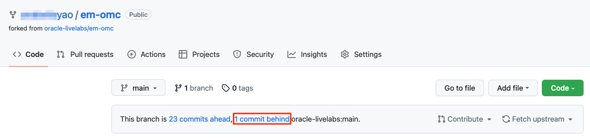

2. Start your **GitHub Desktop** client. If you have multiple Oracle LiveLabs repositories, first switch to the repository that you will work on. Expand the dropdown list of **Current Repository**. Click the repository that you want to sync. In this case, I select the *em-omc* repository as an example.
  

3. Click **Fetch origin**. Then, go to **Branch** -> **Merge into Current Branch**.

  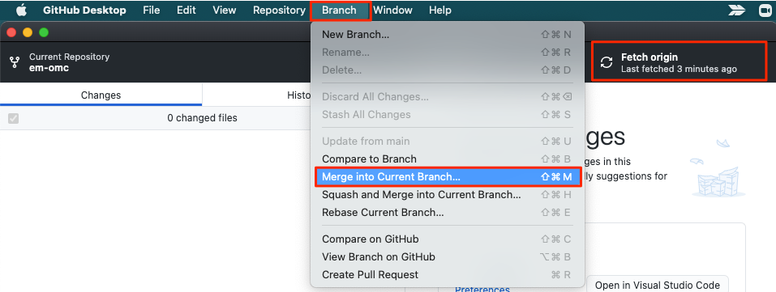

  >**Note:** If you get an authentication error, please refer to the Troubleshooting section in Lab 3 to resolve the issue.

4. Select the branch **upstream/main** (there may be several branches, search until you see *upstream/main*). Press the **Create a merge commit** button.

  

5. Finally, select **Push origin**
  

6. To confirm, press refresh on your personal GitHub repo on the web, you should have no commits *behind* now, only *ahead*.

  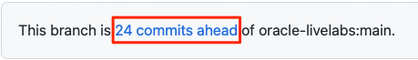


## Task 2: Commit your Changes in your Clone
When you create, delete, or modify assets in your clone (local copy), you should commit (save) those changes to your clone, and then push those changes from your clone to your fork. Then these changes get saved to your forked repository.

To commit your changes:
1. Start your **GitHub Desktop** client.
2. In the **Summary (required)** text box on the left (next to your picture), enter a summary of your changes. You can optionally add a more detailed description of your changes in the **Description** text box.

  

3. Click **Commit to main**. This saves your changes in your local clone. **Fetch origin** changes to **Push origin**.

4. Click **Push origin** (it should have an upward arrow with a number). This pushes the updated content from your clone into the origin of this clone, that is, your fork.

  


## Task 3: Set Up GitHub Pages for your Fork to Test your Content

After you upload the content from your clone to your fork, request your review team members to review this content by providing them with access to **your GitHub Pages site URL** (or the URL of your forked repository).

>**Note:** You should perform the following actions in your forked GitHub repository (e.g. [https://github.com/arabellayao/em-omc](https://github.com/arabellayao/em-omc)), instead of the production repository (e.g. [https://github.com/oracle-livelabs/em-omc](https://github.com/oracle-livelabs/em-omc)).

The GitHub Web UI has a feature called **Set Up GitHub Pages for Your Fork** to Test Your Content. This feature performs a dynamic conversion of the Markdown files (.md files you have developed using your Atom Editor) to HTML. You can preview your workshop and labs on your forked repository and provide this URL to your reviewers.

To publish your GitHub Pages site:
1. Log in to [GitHub Web UI](http://github.com) using your GitHub account credentials, and then click your fork's link in the **Repositories** section to display your fork.

  

2. Click **Settings**.

   

3. On the left menu, click **Pages**.

  

4. Under **Source**, select **main** (if it's not already selected) from the drop-down list. Click **Save**.

  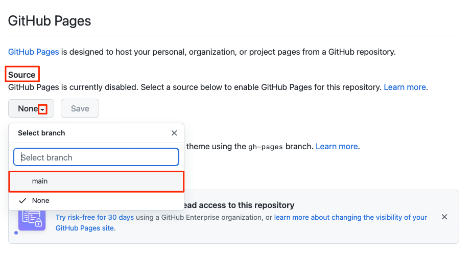

5. Optional: Under **Theme Chooser**, click **Change Theme** and select a theme of your choice.

6. This may take a few minutes to complete. After the GitHub Pages are enabled, the message under **GitHub Pages** changes to **Your site  is published at https://arabellayao.github.io/em-omc/**
  

## Task 4: Share your Workshop for Review
After you have successfully set up your GitHub pages, you can share your workshop for review.
To share and view your workshop:
1. In the browser, enter the URL of your GitHub Pages. For example, if I want to share a workshop in the *em-omc* folder for review, the GitHub Pages URL is [https://arabellayao.github.io/em-omc/](https://arabellayao.github.io/em-omc/). Please replace *em-omc* with the repository of your workshop.

2. Append the URL with the details of your workshop.
    The complete URL will look similar to this: [https://arabellayao.github.io/em-omc/enterprise-manager/emcc/workshops/freetier/index.html](https://arabellayao.github.io/em-omc/enterprise-manager/emcc/workshops/freetier/index.html), which can be shared for review.

## Task 5: Create a Pull Request to Upload Your Content to the Main Repository

The **Pull Request** is a request that you send to the repository owners and code owners of the **oracle-livelabs/repository** to approve and host your content on the production **(upstream/main)** repository.

Note:  *Before executing a PR, make sure you have run Task 1 above and that your personal GitHub repo on the web is not behind.  Failure to do so will result in conflicts.  You cannot issue a pull request without syncing first.  PRs will not be approved without your WMS ID (Workshop ID)*

> **Note:** The owners can approve your request, ask for more information if required, or reject your request if your content does not meet the standards for Oracle LiveLabs.

To create a Pull Request:
1. In the **GitHub Desktop** client, select **Branch > Create Pull Request** to display a browser interface.

  

2. Click **Create pull request** to display an **Open a pull request** page.

  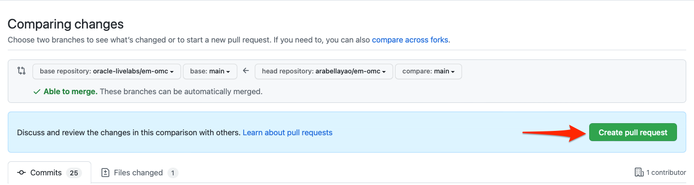

3. Enter the title for the pull request, **include your WMS ID** (you can find that by visiting the [WMS](http://bit.ly/oraclewms)) in the title.  PRs will not be approved without this ID.
4. Click **Create pull request**.
    
  A status page is displayed indicating that you have created a pull request along with the request number (for example, #1770), that it is pending review, and that merging is blocked.

  When your pull request is approved, the page gets updated with information about your commits being approved and merged into the **upstream/main** repository (production).

  When the pull request is approved and merged into the **upstream/main** repository, two emails are sent to the e-mail account associated with your GitHub account.

   > **Note:**

   * The first email notifies you that your pull request was approved (or rejected).
   * If your pull request was approved, then the second email notifies you that your pull request was merged into the **upstream/main** repository.

  Your committed content is now visible to the public on the upstream/main or production repository: oracle-livelabs/&lt;repository&gt;.

## Task 6: Access your workshop on GitHub

After your pull request is complete, wait a few minutes and perform the steps below. Github pages take approximately 5 minutes for the pages to be copied

1. This workshop for example is located in the link below.

    ```
   https://github.com/arabellayao/em-omc/blob/main/enterprise-manager/emcc/workshops/freetier/index.html
    ```

3. The published version becomes:

    ```
    https://arabellayao.github.io/em-omc/enterprise-manager/emcc/workshops/freetier/index.html
    ```

## Task 7: Change your status
Now that your workshop is in the repositories inside the Oracle LiveLabs GitHub project, set your workshop status in WMS to the appropriate status: **In Development** or **Self QA**.
1. Go to the WMS (Oracle employees only - [bit.ly/oraclelivelabs](https://bit.ly/oraclelivelabs)) and click **Edit My Workshops**.

  

2.  Go to the row for your workshop and click the **WMS ID** of your workshop.
    >**Note:** If your workshop is already in production, you will need to contact livelabs-admin_us@oracle.com to edit it.

    

3.  On the *Workshop Details* page, update your **Workshop Status**. If you are finished and ready to QA, change the status to **Self QA**. If you still have some work to do, change the status to **In Development**.

  

## Task 8: Self QA
You have finished developing your workshop. To publish your workshop, you still need to perform self-QA on the workshop.

1.  On the *Workshop Details* page, ensure **Workshop Title** matches the workshop title in development, and **Short Description**, **Long Description**, **Workshop Outline**, and **Workshop Prerequisites** are all up-to-date. Click **?** beside each field to see its details.

  
  

2.  Update **Development GitHub/GitLab URL** to your personal GitHub page address, which we identified at Task 4. After your workshop has been added to oracle-livelabs/repository (your pull request has been merged), update the **Production GitHub/GitLab URL**. You need to construct the Production URL by replacing your username in the **Development GitHub/GitLab URL** with **oracle-livelabs**.

3. Click the **Tags** tab. Make sure you have selected the correct tags for **Level**, **Role**, **Focus Area**, and **Product**. Click **Save**. Tags help people find your workshop in LiveLabs.
  

4.  If you have changed your Status to **Self QA**, you will receive a **Self QA form** from your *stakeholder* (livelabs-help-xx_us@oracle.com) of your workshop. You can also download the [document](https://objectstorage.us-ashburn-1.oraclecloud.com/p/MKKRgodQ0WIIgL_R3QCgCRWCg30g22bXgxCdMk3YeKClB1238ZJXdau_Jsri0nzP/n/c4u04/b/qa-form/o/QA.docx) here. Check your workshop against the form and fill it out. Update your workshop and create a new pull request if necessary for the workshop to follow LiveLabs standards.

  Workshop teams and stakeholders can watch this video below on how to self-QA or verify the QA of a workshop.
  [](youtube:8tirP-hibsk)

5. After you finish Self QA, and your changes are reflected on the oracle.github.io page, set your **Workshop Status** to **Self QA Complete** in WMS.
  

6. Then, email your completed Self QA document to your stakeholder email address. The stakeholder is who sent you the Self QA form. You can also find your stakeholder by going into WMS and looking at your *Workshop Details* page.

7. Your stakeholders will verify the QA within 2 business days. They will reach out to you via WMS if there are more changes needed. Otherwise, they will move the workshop into **Completed** status. If you have not heard back from your stakeholders 2 business days after you submit the Self QA form, please message them via WMS. While you are waiting to hear back from your stakeholder, you can go to Task 9 and request publishing.

  

8. Questions?  Go to your workshop and find your stakeholder email address, and contact them.  You can also ask in the #workshops-authors-help Slack channel.

  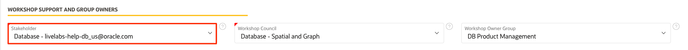

## Task 9: Request Publishing

1.  Click **Publishing** tab, then **+ Publish to LiveLabs**.

  

2. Fill out publishing information, including **Publish Type** and **Workshop Time**. Click **?** beside the Publishing Type to see different types of publishing. Turn on appropriate tenancies for your workshop: **Paid Tier Enabled?**, and/or **Green Button Enabled?**, and fill out appropriate **URL**s. Click **Create** to submit your publishing request. Our LiveLabs team will either approve your publishing request or ask you for more information within 2 business days.

    - Always Free On? - Turn off this button. This button will be deleted soon.

    - Free Tier On? - Turn off this button. This button will be deleted soon.

    - Paid Tier On? - Can this workshop be done in a customer tenancy?

    - Green Button On? - Can this workshop be done in a registered LiveLabs tenancy, a.k.a Green Button? With Green Button, users can run the workshop in pre-provisioned environments. Users have to complete the workshop in a specified limited amount of time. After their reservations expire, any instances they create will be destroyed. However, users can extend their reservations up to 4 times. You can contact us via WMS to request a Green Button for your workshop. Green Button can also be added after your workshop has already been in production.

    

3. Optional: we also recommend workshop teams provide a video if available, for a better customer experience. This video will be displayed on this workshop's LiveLabs landing page. The video can be from [Oracle Video Hub](https://videohub.oracle.com/) (recommended) or from [YouTube](https://www.youtube.com/). Oracle Video Hub is the public video platform of Oracle. Videos uploaded to Oracle Video Hub help us get better analytics on video usage. If your team does not have a YouTube account, you can reach out to the LiveLabs team and ask us to upload the video for you.

    To embed a video from Oracle Video Hub:
    1. On the Oracle Video Hub page of the video, click **Share**.
    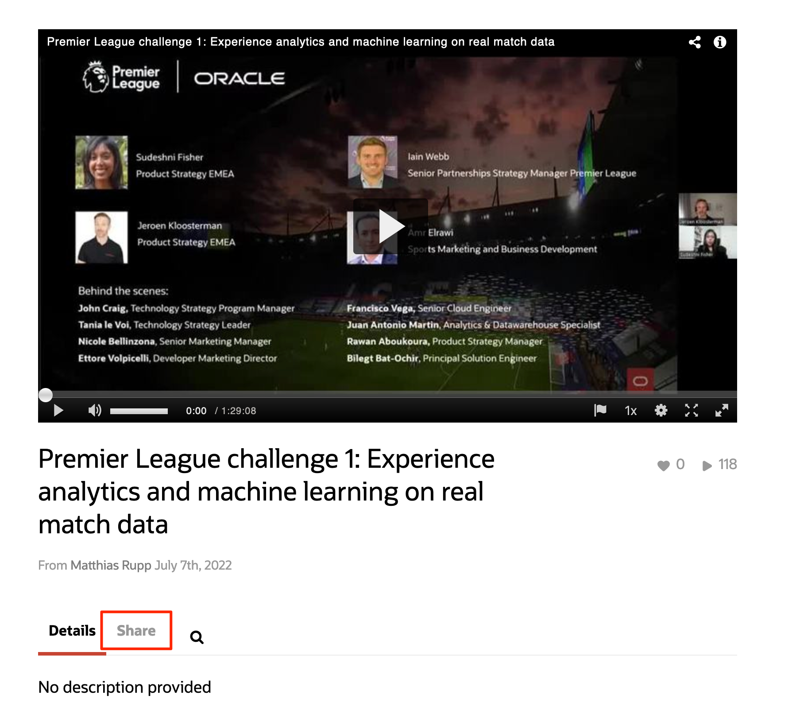
    2. Click **Embed**.
    
    3. Copy the src link from `https` to `flashvars[streamerType]=auto` as shown on the screenshot below.
    
    4. Paste the link to the **YouTube Link** section on the publishing entry.
    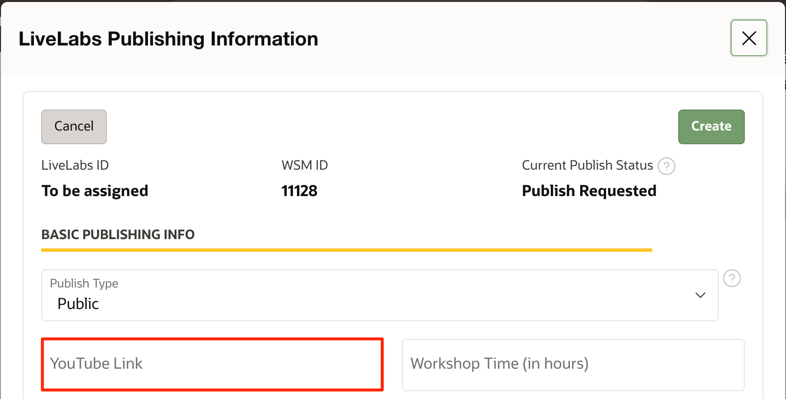

    To embed a video from Youtube:
    1. On the Youtube page of the video, click **SHARE**.
    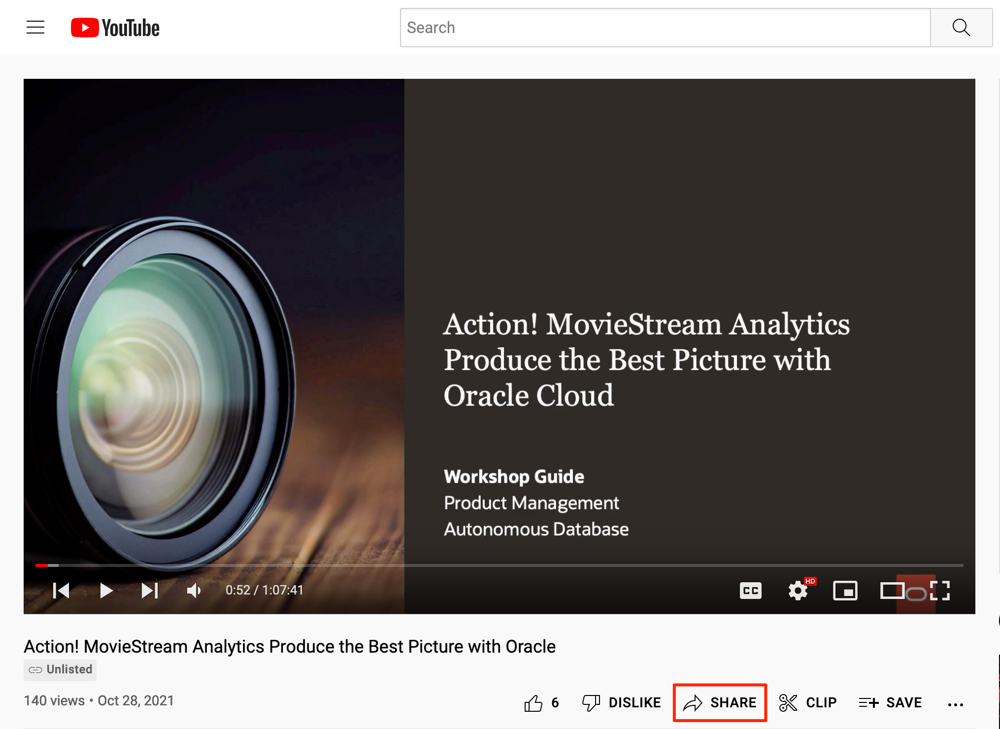
    2. Click **Embed**.
    
    3. Copy the src link (without double quotes) highlighted on the screenshot below.
    
    4. Paste the link to the **YouTube Link** section on the publishing entry.
    

4. Click **Create** or **Save**.

5. When your workshop is in **Completed** status, and we have approved your publishing request, your workshop will be published automatically within 1 business day.

You may now **proceed to the next lab**.

## **Appendix**: Troubleshooting Tips
### Issue 1: Commits Behind oracle:main
  

1. Follow the steps in Task 1: Get the Latest Updates from Production.

### Issue 2: Clone failed
  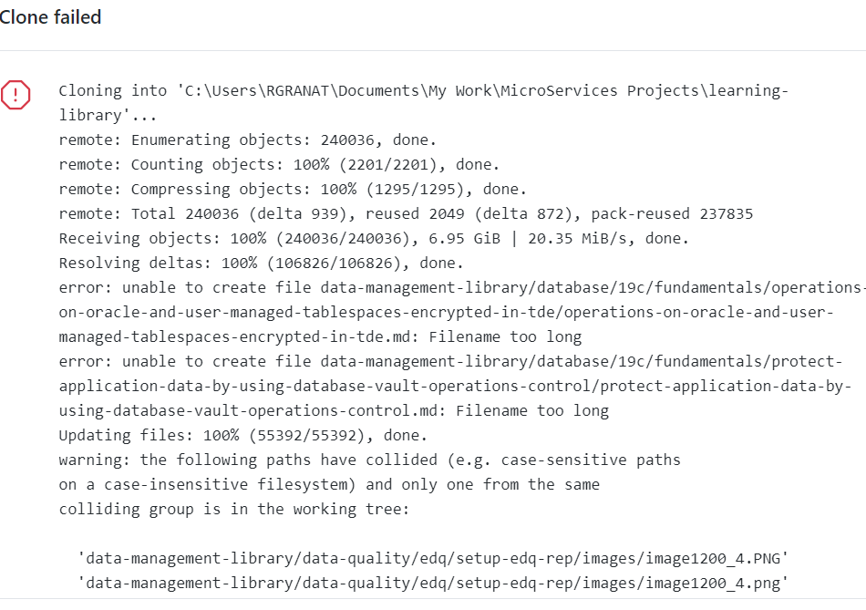

  1. Execute the following commands to make sure .gitconfig is updated:

    ```
    <copy> git config --global core.longpaths true </copy>
    ```

    ```
    <copy> git config --global core.ignorecase false </copy>
    ```

### Issue 3: GitHub Merge Conflicts
GitHub merge conflicts happen when you and some other contributors are changing the same content in the oracle-livelabs repositories. Merge conflicts prevent you from pushing your changes to your GitHub repository.
  

1. When you fetch origin and merge changes into your current branch (as in Task 1), you may encounter merge conflicts, as shown in the screenshot above. In the screenshot, you have 3 files that have merge conflicts.

2. Since you are changing the same content as other people, you need to manually decide which version of changes you want to keep. Open your text editor. Go to the files that have conflicts. Conflicts are highlighted by your text editor, and you will choose to use either your changes or other people's changes.
  

3. After you resolve all the conflicts and save your changes, your GitHub Desktop should look like the screenshot below. There will be a green checkmark beside each file, indicating there are no conflicts. Enter the **Summary** and click **Commit to main**. After the commit finishes, you can click **Push origin**, and your changes are pushed to your GitHub repository.
  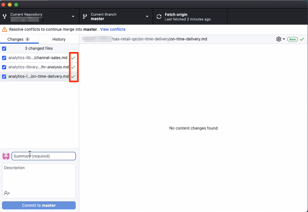

4. To confirm, press refresh on your personal GitHub repo on the web, you should have no commits *behind* now, only *ahead*.

  

### Issue 4: Cannot Use GitHub Desktop to Pull Changes from Production
If you have not updated your local GitHub repo with GitHub repo in oracle-livelabs for a long time, and you are too many commits behind the oracle-livelabs:main, you may not get the latest changes from production using GitHub Desktop. It is simply because there are too commits to merge. In that case, you can use git commands to perform the same actions.

*Git commands are not as straightforward as GitHub Desktop, so feel free to reach out to our team for help in the Slack channel, and our team is there to help you.*

>**Note:** Make sure you are performing the following actions **off VPN**.

1. Navigate to your local GitHub repository or your workshop folder in your terminal or VScode.

2. Make sure you have Git installed.

3. Run the command to see if the *origin* is pointing to your repo, and *upstream* to the repo in Oracle LiveLabs.

    ```
    <copy>
    git remote -v
    </copy>
    ```

4. If yes, only then run these below commands to sync your repo:

  Fetch the latest changes from the repo in the Oracle LiveLabs GitHub project

    ```
    <copy>
    git fetch upstream
    </copy>
    ```

  Merge the changes from the repo in Oracle LiveLabs to your local repo
    ```
    <copy>
    git merge upstream/main -m "Sync with main"
    </copy>
    ```

    Push the locally updated version (merged changes in your local repository from the repo in Oracle LiveLabs) to your staging repo (on the browser)

    ```
    <copy>
    git push origin main
    </copy>
    ```

5. If there are any conflicts run the command to view the conflicting flies. You can also use GitHub Desktop to see the conflicting files.

    ```
    <copy>
    git diff --name-only --diff-filter=U
    </copy>
    ```

  Navigate to the conflicting files and resolve the conflicts by choosing the incoming changes or current changes.
  Once conflicts are resolved, commit the changes in your GitHub desktop and push them.

### Issue 5: Mess up GitHub Repo and Want to Delete the Repo

>**Note:** Do this only if necessary.

In the worst case, if you cannot resolve issues in your local or staging repo, and want to delete your entire repository, follow the below steps:

1. Open up a browser. Go to your repository (your fork). Click **Settings**.

  

2. Scroll down and click **Delete this repository**.

  

3. Enter &lt;your\_github\_user\_name&gt;/&lt;repo\_name&gt;.

4. Click the **I understand the consequences, delete this repository** button.

  This deletes the entire repo in your local/laptop. Follow the labs in this guide to set up your repo again.

### Issue 6: Authentication error

  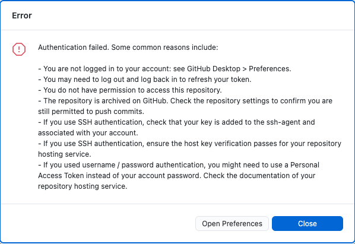

First, make sure that you are logged into your GitHub account in GitHub Desktop. If it still does not solve the error, try the following steps.

If you have already created an SSH key in your local computer and added the key to your GitHub account, you can go directly to Step 5.

1. If you have not generated SSH keys in your local computer, first follow the *(Optional) Lab 5: Generate SSH keys* on the left to generate SSH keys in your local computer.

2. Now you have your public and private SSH keys. Go to your GitHub account in a browser. Click the arrow next to your profile picture on the upper right, and click **Settings**. Click **SSH and GPG keys**. If you have not added any SSH keys to your GitHub account, you will not see any SSH keys displayed. Then click **New SSH key**.
  

3. For **Title**, give your SSH key a name. In the **Key** field, copy and paste your public SSH key. Then, click **Add SSH key**.
  

4. After the SSH key is added, you can see it under SSH keys on your GitHub page.
  

5. Open up your terminal. Go to where *you cloned your GitHub repository* (which may be different from the example below). In this case, I am using the **em-omc** repository as an example, but the process is the same for other repositories.

    ```
    user@user-mac ~ % cd Documents/oracle-livelabs/em-omc
    user@user-mac em-omc %
    ```
6. Run the ssh-agent command.

    ```
    user@user-mac em-omc % <copy> ssh-agent -s </copy>
    SSH_AUTH_SOCK=/var/folders/sl/pt8rm4rd4tl_f8yyd8n6jd640000gn/T//ssh-vkOzi3x2qhp7/agent.82390; export SSH_AUTH_SOCK;
    SSH_AGENT_PID=82391; export SSH_AGENT_PID;
    echo Agent pid 82391;
    ```

7. Run the ssh-add command. Append your private SSH key after the ssh-add. Yours may be different from what is shown below.
    ```
    user@user-mac em-omc % <copy> ssh-add ~/.ssh/sshkey </copy>
    Identity added: /Users/user/.ssh/sshkey (user@user-mac)
    ```

8. Finally, go back to **GitHub Desktop** UI, and click **Push origin**. This should solve the authentication issue, and you can continue the lab.
  

### Issue 7: GitHub Desktop is stuck

1. First make sure that you are off VPN.

2. Re-open the GitHub desktop.

### Issue 8: GitHub Desktop does not reflect the repo I work on

If you have multiple Oracle LiveLabs repositories, you need to switch to the repository that you will work on in GitHub Desktop. Expand the dropdown list of **Current Repository**, and click the repository that you need.

  

## Acknowledgements

* **Author:**
    * Anuradha Chepuri, Principal User Assistance Developer, Oracle GoldenGate
* **Contributors:**
    * Lauran Serhal, Principal User Assistance Developer, Oracle Database and Big Data User Assistance
    * Aslam Khan, Senior User Assistance Manager, ODI, OGG, EDQ
    * Kamryn Vinson, Product Manager, Database
    * Anoosha Pilli, Product Manager, Database
    * Arabella Yao, Product Manager, Database
    * Madhusudhan Rao, Product Manager, Database

* **Last Updated By/Date:** Arabella Yao, June 2022