# Setup Graphical Remote Desktop

## Introduction
This lab shows you how to deploy and configure noVNC Graphical Remote Desktop on an Oracle Enterprise Linux (OEL) instance prior to capturing the custom image.

### Objectives
- Configure image for preserved static hostname
- Deploy NoVNC Remote Desktop
- Configure Desktop
- Add Applications Shortcuts to Desktop (EL7 only)
- Optimize Browser Settings
- Create systemd services for Oracle Database(s) and WebLogic (Optional)

### Prerequisites
This lab assumes you have:
- An Oracle Enterprise Linux 7 or 8 (OEL) that meets requirement for marketplace publishing. Performing this setup on an instance provisioned from a stock OCI image for EL7 or EL8 should meet these requirements and run successfully.

## Task 1: Configure and Enforce Static hostname
Follow steps below to establish a unique static hostname that will be enforced on any offspring from the image. Whenever possible, this one-time task should be performed prior to installing any product that will hardcode the hostname to various config/settings in the product. e.g. DB Listener, Weblogic, etc...

1.  As opc, run *sudo su -* to login as root.

    ```
    <copy>
    sudo su - || (sudo sed -i -e 's|root:x:0:0:root:/root:.*$|root:x:0:0:root:/root:/bin/bash|g' /etc/passwd && sudo su -)

    </copy>
    ```

2. Download setup artifacts and run *setup-firstboot.sh*.

    ```
    <copy>
    cd /tmp
    rm -rf ll-setup
    wget https://objectstorage.us-ashburn-1.oraclecloud.com/p/Nx05fQvoLmaWOPXEMT_atsi0G7Y2lHAlI7W0k5fEijsa-36DcucQwPUn6xR2OIH8/n/natdsecurity/b/misc/o/setup-novnc-livelabs.zip -O setup-novnc-livelabs.zip
    unzip -o  setup-novnc-livelabs.zip -d ll-setup
    cd ll-setup/
    chmod +x *.sh .*.sh
    ./setup-firstboot.sh && exit

    </copy>
    ```

    You are prompted for the following inputs:
    - (1) Do you want to keep and preserve the current hostname? [Y/N]. The current hostname is shown for confirmation and the input required is either Y or N
    - (2) If Y, "Please press *ENTER* to accept the default *holserv1* or type in your preferred host shortname (not the FQDN, and must be lowercase and alphanumeric):"
    - (3) Do you have additional host alias(es), virtualhost names, or FQDN required for labs that are using this instance? [Y/N]
    - (4) If Y, "Enter each additional host alias, FQDN, or virtualhost name (separated from each other by a space. e.g. *serv1 serv1.demo.com*)"

3. Review the script output
4. If you have additional entries you would like added to */etc/hosts* file whenever an instance is created from the image, edit */root/bootstrap/firstboot.sh* and add them under the ***Add Static Name to /etc/hosts*** block

    In the example below, the following customization are added to a setup:
    - 3 Additional host aliases:  *myapp*, *app1*, and *hr.demo.com*
    - 3 Additional external host entries to "/etc/hosts"

    ```
    <copy>
    sudo cat /root/bootstrap/firstboot.sh
    </copy>
    ```

    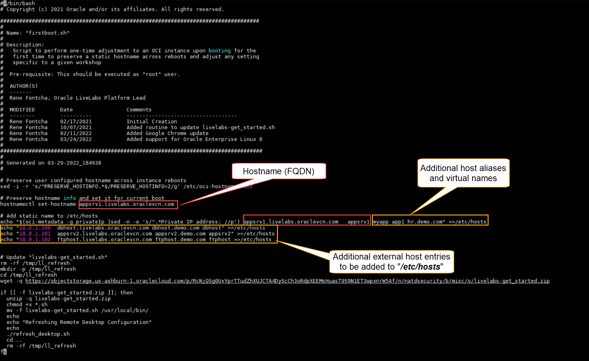

    This customization resulted in the following */etc/hosts* file.

    ```
    <copy>
    sudo cat /etc/hosts
    </copy>
    ```

    

## Task 2: Deploy noVNC
1.  From the same session started in the previous task, login again as root via SUDO and run the latest setup script. You will be prompted for the following input:

    - The *OS user* for which the remote desktop will be configured. *Default: Oracle*

    ```
    <copy>
    sudo su -

    </copy>
    ```

    ```
    <copy>
    cd /tmp/ll-setup/
    ./setup-novnc-livelabs.sh

    </copy>
    ```

2. Review the output and address any issue before proceeding.

3. Test the two remote desktop URLs shown in the output

Upon successful validation as indicated above, proceed by selecting either *Task 3A* for Enterprise Linux 7 or *Task 3B* for Enterprise Linux 8.

## Task 3A: Enterprise Linux 7 (EL7)

1. Launch your web browser to the URL provided in output from above execution, then *Next*

    E.g.

    ```
    <copy>http://[your instance public-ip address]/livelabs/vnc.html?password=LiveLabs.Rocks_99&resize=scale&quality=9&autoconnect=true&reconnect=true</copy>
    ```

    

2. Click *Next*

    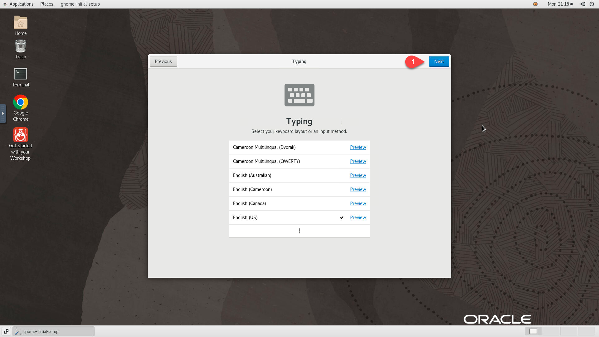

3. Click *Next*

    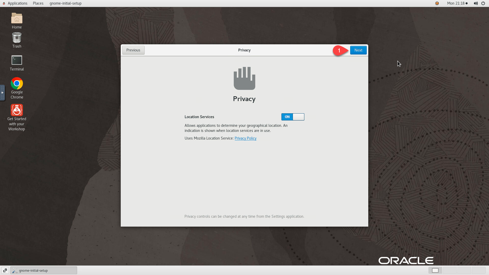

4. Click *Skip*

    

5. Click *Start Using Oracle Linux Server*

    

6. Click on *X* to close the *Getting Started* landing page

    


7. Right-Click anywhere in the desktop and Uncheck *Keep aligned*

    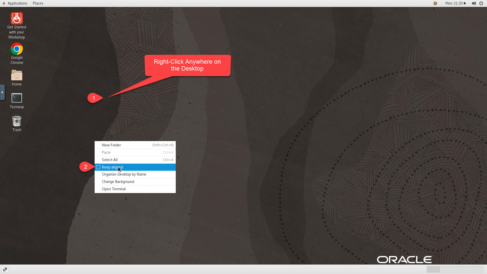

8. Right-Click anywhere in the desktop and select *Organize Desktop by Name*

    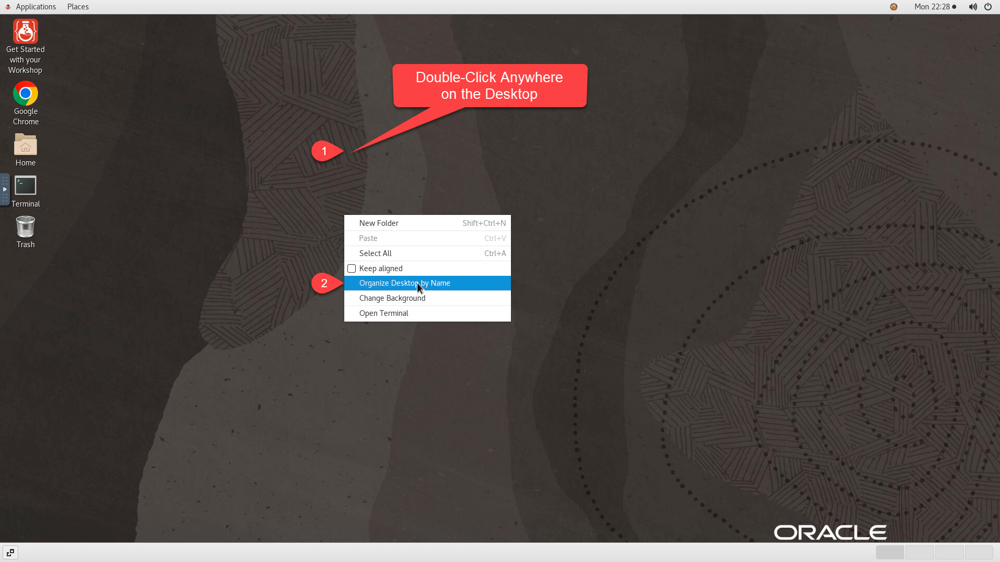
    


9. Double-Click on the *Terminal* icon to Launch, then run the following from terminal session to initialize LiveLabs browser windows.

    ```
    <copy>
    $HOME/.livelabs/init_ll_windows.sh
    </copy>
    ```

10.  Keep *Make Google Chrome the default browser* checked, uncheck *Automatic Usage Statistics & Crash reporting* and click *OK*. This opens the first browser session on the left preloaded with a sample workshop guide.

    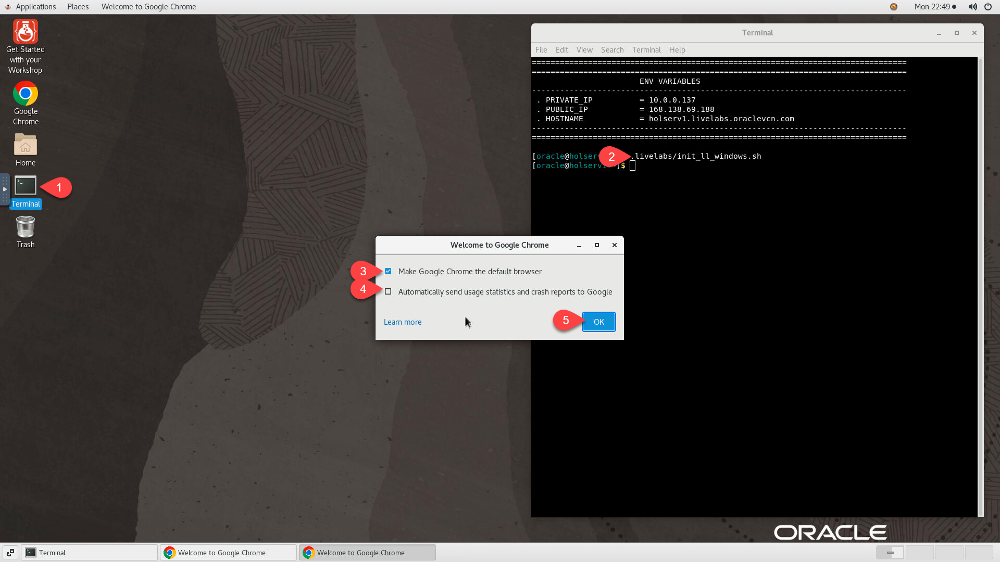

11.  Keep *Make Google Chrome the default browser* checked, uncheck *Automatic Usage Statistics & Crash reporting* and click *OK*. This opens the second browser session on the right preloaded with two tabs.

    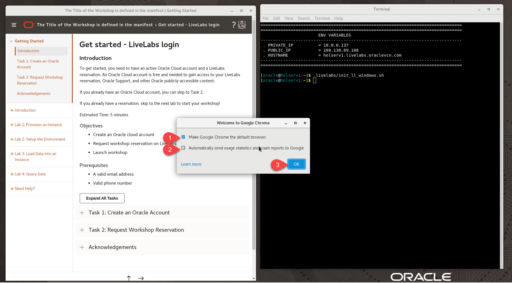

12. Click on *Accept All*

    

13. Close all browser windows opened.


14. Click on the *Google Chrome* icon, then on *Get Started*, on the next 3 pages click on *Skip*, and finally on *No Thanks*.

    
    
    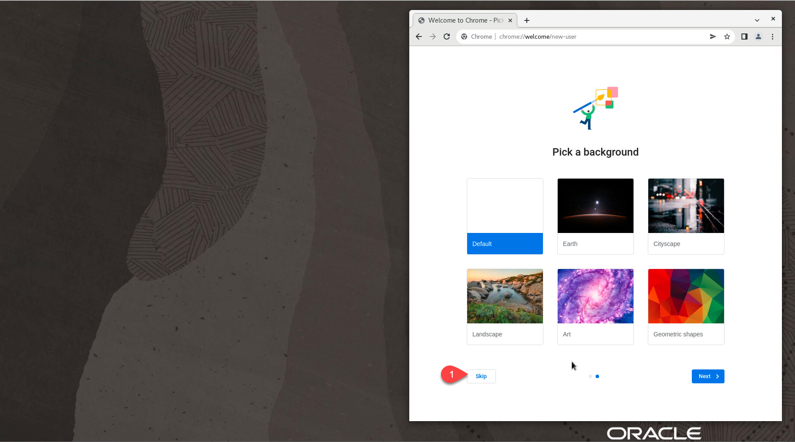
    
    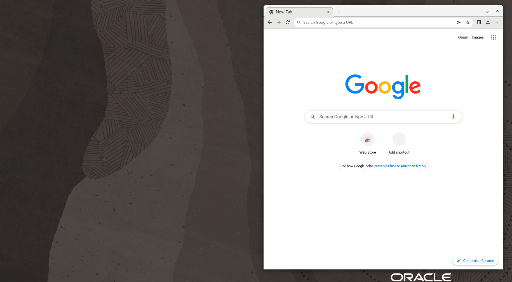

Skip *Task 3B* and proceed to *Task 4*

## Task 3B: Enterprise Linux 8 (EL8)

1. Launch your web browser to the URL provided in output from above execution, then *Next*

    E.g.

    ```
    <copy>http://[your instance public-ip address]/livelabs/vnc.html?password=LiveLabs.Rocks_99&resize=scale&quality=9&autoconnect=true&reconnect=true</copy>
    ```

    

2. Click *Next*

    

3. Click *Next*

    

4. Click *Skip*

    

5. Click *Start Using Oracle Linux Server*

    

6. Click on *X* to close the *Getting Started* landing page

    


7. Click on *Activities* >> *Terminal* to Launch the Terminal, then run the following to initialize LiveLabs browser windows.

    ```
    <copy>
    $HOME/.livelabs/init_ll_windows.sh
    </copy>
    ```

    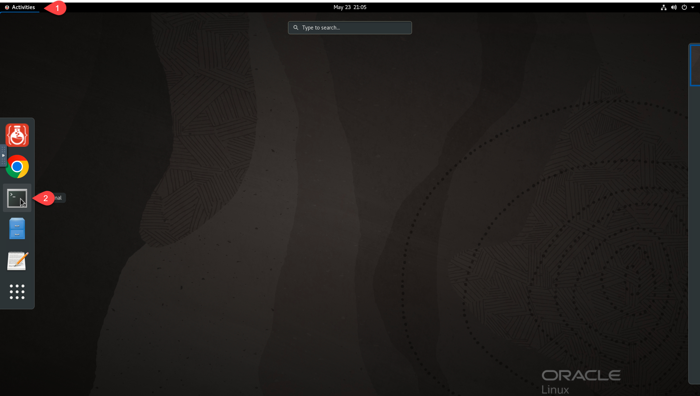
    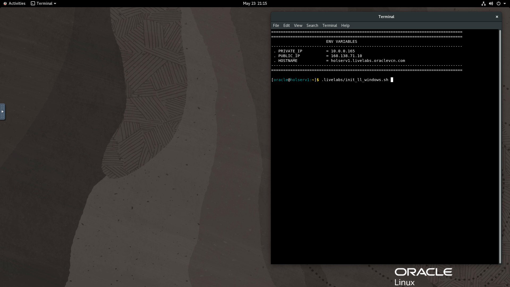


8.  Keep *Make Google Chrome the default browser* checked, uncheck *Automatic Usage Statistics & Crash reporting* and click *OK*. This opens the first browser session on the left preloaded with a sample workshop guide.

    

9.  Keep *Make Google Chrome the default browser* checked, uncheck *Automatic Usage Statistics & Crash reporting* and click *OK*. This opens the second browser session on the right preloaded with two tabs.

    

10. Click on *Accept All*

    

11. Close all browser windows opened.

12. Click on *Activities* >> *Google Chrome* to Launch, then on *Get Started*, on the next 3 pages click on *Skip*, and finally on *No Thanks*.

    
    
    
    
    

13. Close all browser windows opened.

## Task 4: Optimize Desktop for LiveLabs

1. If the *`desktop_app1_url`* and/or *`desktop_app2_url`* are applicable to the workshop, update *`$HOME/.livelabs/init_ll_windows.sh`* with the correct URLs for those two variables and run it from a terminal session in the desktop to validate before proceeding to custom image creation. Feel free to update to update the *`desktop_guide_url`* value as well.

    ```
    <copy>
    vi $HOME/.livelabs/init_ll_windows.sh
    </copy>
    ```

    > *Notes:* The example below borrows from the *Oracle WebLogic Kubernetes ToolKit UI* Workshop where the three URLs are updated to the following

    - *`desktop_guide_url`*="https://oracle.github.io/learning-library/developer-library/multicloud/weblogic-toolkit-ui/workshops/desktop"
    - *`desktop_app1_url`*="http://localhost:7001/console"    
    - *`desktop_app2_url`*="https://container-registry.oracle.com"

    
    
    

2. Update *vncserver* startup script to add dependency(ies) on primary service(s) supporting Web Apps behind *`desktop_app1_url`* and/or *`desktop_app2_url`*. This will prevent premature web browser startup leading to *404-page-not-found-error* when the app requested is not yet ready.

    - Edit `/etc/systemd/system/vncserver_${appuser}@\:1.service` and append the dependent service(s) at the end of the starting with **After=**
    - Reload systemd daemon
    - Restart vncserver via systemctl

    > *Notes:* The example below is from the *EM Fundamentals* workshop, please substitute *oracle-emcc.service* in the block below with the correct service name relevant to your workshop before running it.

    ```
    <copy>
    sudo sed -i "/^After=/ s/$/ oracle-emcc.service/" /etc/systemd/system/vncserver_$(whoami)@\:1.service
    sudo systemctl daemon-reload
    cat /etc/systemd/system/vncserver_$(whoami)@\:1.service |grep After
    </copy>
    ```

    

    - Verify the output as shown above and confirm that the service dependency has been successfully added

3. Close all browser windows opened.

4. Review *`$HOME/.bash_profile`* and confirm the presence of the following default code block (add if missing).

    ```
    # Get the aliases and functions
    if [ -f ~/.bashrc ]; then
        . ~/.bashrc
    fi
    ```
## Task 5: Create Auto-Start SYSTEMD Services for Oracle Databases or WebLogic Domain (Optional)

If your workshop includes one or more Oracle Databases or WebLogic Server, proceed as indicated below to setup SYSTEMD services. This will allow for automatic management of the UP/DOWN state of these processes. As a result workshop attendees will get started faster as these processes will be up and running post provisioning and before they even connect to the instance.

### **Oracle Database**
1. Review "*/etc/oratab*" and ensure that the switch is set to "*Y*" for any entry that will be managed by the service

    

2. Run the following block to create a services:

    - *oracle-database.service* - Manages all databases with an in entry in */etc/oratab* set to *Y*
    - *oracle-db-listener.service* - Manages additional listeners beside *1521* and with an entry in *$HOME/scripts/livelabs/listener-tab* set to *Y*

    ```
    <copy>
    cd /tmp
    rm -rf ll_tmp
    wget https://objectstorage.us-ashburn-1.oraclecloud.com/p/N3xh9JYLTXSQMr4Lhsnu9bbNCBiZlXKXc3SnbvtKmhWp9-LG7T8jWYbz9gnM73zM/n/natdsecurity/b/misc/o/create-services-multi-db.zip -O create-services-multi-db.zip
    unzip -o  create-services-multi-db.zip -d ll_tmp
    cd ll_tmp/
    chmod +x *.sh .*.sh
    sudo ./create-services-multi-db.sh
    </copy>
    ```

3. For any additional DB listener other than *LISTENER* or having any other name but using port *1521*, add to *$HOME/scripts/livelabs/listener-tab* and set the flag to "*Y*"

    ```
    <copy>
    vi $HOME/scripts/livelabs/listener-tab
    </copy>
    ```

    

4. Restart *oracle-db-listener.service*

    ```
    <copy>
    systemctl restart oracle-db-listener
    systemctl status oracle-db-listener
    </copy>
    ```

    

### **WebLogic Domain**
1. Set the *`$DOMAIN_HOME`* environment variable or run the script *`$DOMAIN_HOME/bin/setDomainEnv.sh`* .

    ```
    e.g.
    <copy>
    export DOMAIN_HOME=/home/opc/Oracle/Middleware/Oracle_Home/user_projects/domains/test_domain
    </copy>
    ```

2. Run the following block to create and validate *weblogic.service*


    ```
    <copy>
    cd /tmp
    rm -rf ll_tmp
    wget https://objectstorage.us-ashburn-1.oraclecloud.com/p/QQAFYkt5JRMmSM2COnTntCXYnR48dHbrSVpnfiDAOxKoPye18MWfHzOtyjaNmZl-/n/natdsecurity/b/misc/o/create-services-weblogic.zip -O create-services-weblogic.zip
    unzip -o  create-services-weblogic.zip -d ll_tmp
    cd ll_tmp/
    chmod +x *.sh .*.sh
    sudo ./create-services-weblogic.sh
    </copy>
    ```

You may now proceed to the next lab.


## Appendix 1: Configuring Additional Desktop Apps for Auto-Start on VNC Startup   
LiveLabs compute instance are password-less and only accessible optionally via SSH keys. As result it's important to adjust session settings to ensure a better user experience. By default the dedicated LiveLabs custom desktop application *Get Started with your Workshop* is setup to automatically launch web browser session(s) on:

- First half (left) of the screen preloaded with the workshop guide
- Second half (right) of the screen preloaded with up to 2 tabs with relevant web apps if applicable

If there are no WebApps used in the workshop, configure *Startup Programs* for another application such as *SQL Developer* to open up on the right next to the workshop guide on *VNC* startup

1. Create startup file  "*`$HOME/.config/autostart/<app-name>.desktop`*" in plaintext with the following inputs:

    - [Desktop Entry]
    - Type=Application
    - Exec=*`<command or script path>`*
    - Hidden=false
    - NoDisplay=false
    - X-GNOME-Autostart-enabled=true
    - Name[en_US]=*`<Application Name>`*
    - Name=*`<Application Name>`*
    - Comment[en_US]=*`<Free Text Comment of your choice>`*
    - Comment=*`<Free Text Comment of your choice>`*

    The example below will add an AutoStart file for SQLDeveloper currently installed on the instance


    ```
    <copy>
    cat >$HOME/.config/autostart/sqldeveloper.desktop <<EOB
    [Desktop Entry]
    Type=Application
    Exec=sqldeveloper
    Hidden=false
    NoDisplay=false
    X-GNOME-Autostart-enabled=true
    Name[en_US]=SQL Developer
    Name=SQL Developer
    Comment[en_US]=Launch SQL Developer on VNC Startup
    Comment=Launch SQL Developer on VNC Startup
    EOB
    </copy>
    ```

2. Restart *vncserver* to test.

    ```
    <copy>sudo systemctl restart vncserver_$(whoami)@\:1</copy>

    ```

    

3. Wait for *Auto reconnect* to get back into the remote desktop

    

    > *Notes:* Don't worry if the browser window(s) is(are) not loaded as expected on VNC startup at the moment. The required instance metadata is not yet present on the host but will be injected at provisioning to cover the following.

    - `DESKTOP_GUIDE_URL` - *required*
    - `DESKTOP_APP1_URL` - optional
    - `DESKTOP_APP2_URL` - optional

    The following is an example from the *Boost Analytics Performance with Oracle In-Memory Database* workshop

    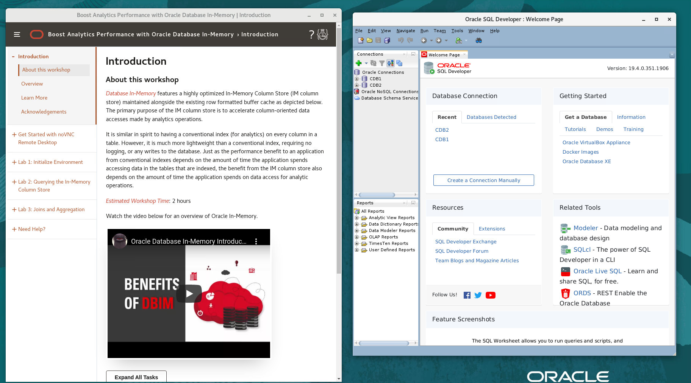

## Appendix 2: Adding Applications Shortcuts to Desktop (Enterprise Linux 7 only)  

    > *Notes:* Desktop icons support is limited to Enterprise Linux 7 (EL7).

For ease of access to the workshop guide and desktop applications provided on the instance, the following shortcuts are configured by default:

- Get Started with your Workshop (launch workshop guide and relevant web apps if any)
- Google Chrome Browser
- Gnome Terminal

Follow the steps below to add any other desktop application shortcut relevant to your workshop. The example below is for illustration only as it features the already configured LiveLabs custom desktop application *Get Started with your Workshop*. As a result, use it as a reference and substitute accordingly for the relevant desktop application of your choice (e.g. SQLDeveloper, JDeveloper, Postman, etc...).

1. On the remote desktop, click on *Home > Other Locations*, then navigate to *`/usr/share/applications`* and scroll-down to find *Get Started with your Workshop*

    

2. Right-click on *Get Started with your Workshop* and select *Copy to...*

    

3. Navigate to *Home > Desktop* and Click on *Select*

    

4. Double-click on the newly added icon on the desktop and click on *Trust and Launch*

    
    

## Appendix 3: Enable VNC Password Reset, and Workshop Guide and WebApps URLs injection for each instance provisioned from the image
Actions provided in this Appendix are not meant to be performed on the image. They are rather intended as guidance for workshop developers writing terraform scripts to provision instances from an image configured as prescribed in this guide.

Update your Terraform/ORM stack with the tasks below to enable VNC password reset and add workshop URLs for each VM provisioned from the image.

1. Add provider *random* to *main.tf* or and any other *TF* file in your configuration if you not using *main.tf*

    ```
    <copy>
    terraform {
      required_version = "~> 0.13.0"
    }

    provider "oci" {
      tenancy_ocid = var.tenancy_ocid
      region       = var.region
    }

    provider "random" {}
    </copy>
    ```
2. Add the following variables to *variables.tf* and *schema.yaml*.

    - `desktop_guide_url`
    - `desktop_app1_url`
    - `desktop_app2_url`

    The example below is from the *DB Security - Key Vault* workshop

    - variables.tf

    ```
    <copy>
    variable "desktop_guide_url" {
      default = "https://oracle.github.io/learning-library/security-library/database/advanced/workshops/main-key-vault"
    }

    variable "desktop_app1_url" {
      default = "https://kv"
    }

    variable "desktop_app2_url" {
      default = "https://dbsec-lab:7803/em"
    }
    </copy>
    ```

    - schema.yaml

    ```
    variableGroups:
      - title: General Configuration
        visible: false
        variables:
        - desktop_guide_url
        - desktop_app1_url
        - desktop_app2_url

    desktop_guide_url:
      type: text
      required: true
      title: "Workshop Guide"
      description: "Workshop Guide on noVNC Desktop"

    desktop_app1_url:
      type: text
      required: false
      title: "Application URL 1"
      description: "Application URL 1 on noVNC Desktop"

    desktop_app2_url:
      type: text
      required: false
      title: "Application URL 2"
      description: "Application URL 2 on noVNC Desktop"
      </copy>
      ```

3. Add a *random* resource in your *instance.tf* or any *TF* of your choice to generate a 10 characters random password with a mix of Number/Uppercase/Lowercase characters.

    ```
    <copy>
    resource "random_string" "vncpwd" {
      length  = 10
      upper   = true
      lower   = true
      number  = true
      special = false
    }
    </copy>
    ```

4. Add *`random_string`* result and the URL variables to the metadata property for resource *`oci_core_instance`*. This will store the random value generated above as part of the instance metadata and used on first boot to reset VNC Password. The URLs will be used to preload the workshop guide and webapps on the remote desktop on VNC startup

    ```
    <copy>
    metadata = {
      vncpwd            = random_string.vncpwd.result
      desktop_guide_url = var.desktop_guide_url
      desktop_app1_url  = var.desktop_app1_url
      desktop_app2_url  = var.desktop_app2_url
    }
    </copy>
    ```

5. Add the entry *`remote_desktop`* to your *output.tf* to provide the single-click URL for remote desktop access with auto resizable window and auto-login. Replace [instance-name] from the snippet below with your real instance name as provided the resource *`oci_core_instance`* block of *instance.tf*

    ```
    <copy>
    output "remote_desktop" {
      value = format("http://%s%s%s%s",
        oci_core_instance.[instance-name].public_ip,
        "/livelabs/index.html?password=",
        random_string.vncpwd.result,
        "&resize=scale&autoconnect=true&quality=9&reconnect=true"
      )
    }
    </copy>
    ```
6. Add output entry *`remote_desktop`* to your *schema.yaml* file

    ```
    <copy>
    outputGroups:
      - title: Resources Access Information
        outputs:
          - ${remote_desktop}

    outputs:
      remote_desktop:
        type: string
        title: Remote Desktop
        visible: true

    </copy>
    ```

7. Add an *ingress* rule to your *network.tf* to enable remote access to port *6080* when the VCN is created

    ```
    <copy>
    ingress_security_rules {
      protocol = "6"
      source   = "0.0.0.0/0"
      tcp_options {
        min = 6080
        max = 6080
      }
    }

    </copy>
    ```

8. Test out your ORM Stack and verify the output for *`remote_desktop`* as shown below

    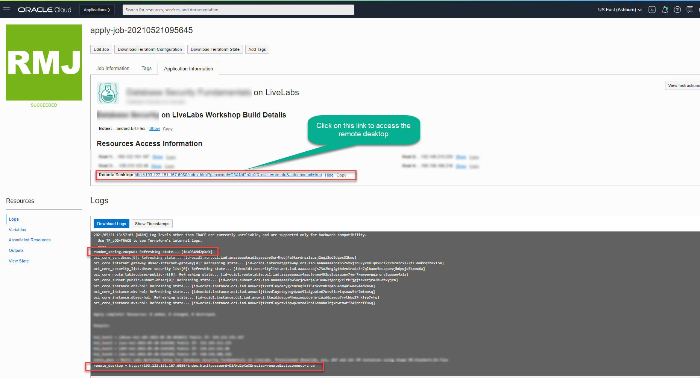

9. From to the *Application Information Tab* as shown above, click on the single-click URL to test it out.

    

    **Note:** Your source image instance is now configured to generate a random VNC password for every instance created from it, provided that the provisioning requests include the needed metadata storing the random string.


## Appendix 4: Removing Guacamole from a previously configured LiveLabs image

Prior to noVNC some images were configured with *Apache Guacamole*. If this applies to your image, proceed as detailed below to remove it prior to deploying noVNC

1.  As root, create and run script */tmp/remove-guac.sh*.

    ```
    <copy>
    sudo su - || (sudo sed -i -e 's|root:x:0:0:root:/root:.*$|root:x:0:0:root:/root:/bin/bash|g' /etc/passwd && sudo su -)

    </copy>
    ```

    ```
    <copy>
    cat > /tmp/remove-guac.sh <<EOF
    #!/bin/sh
    # Copyright (c) 2019 Oracle and/or its affiliates. All rights reserved.

    cd /etc/systemd/system

    for i in `ls vncserver_*.service`
      do
    systemctl stop $i
    done

    cd /tmp

    systemctl disable guacd tomcat
    systemctl stop guacd tomcat

    yum -y remove \
    	guacd \
        libguac \
        libguac-client-ssh \
        libguac-client-vnc \
    	tomcat \
        tomcat-admin-webapps \
        tomcat-webapps
    EOF
    chmod +x /tmp/remove-guac.sh
    /tmp/remove-guac.sh

    rm -rf /etc/guac*
    rm -f /tmp/remove-guac.sh
    rm -rf /opt/guac*
    rm -rf /etc/init.d/guac*
    cd
    </copy>
    ```

## Acknowledgements
* **Author** - Rene Fontcha, LiveLabs Platform Lead, NA Technology, September 2020
* **Contributors** - Robert Pastijn
* **Last Updated By/Date** - Rene Fontcha, LiveLabs Platform Lead, NA Technology, May 2022
