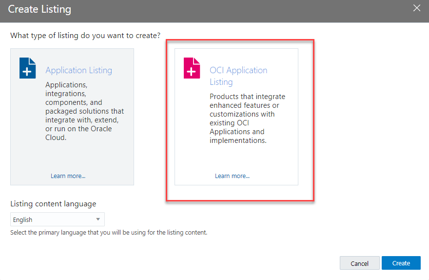
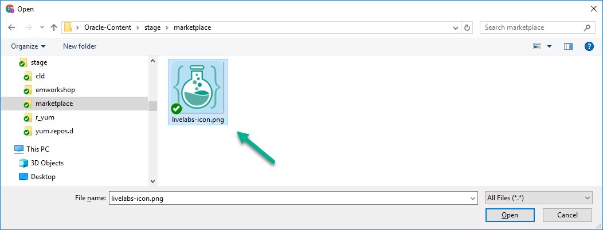
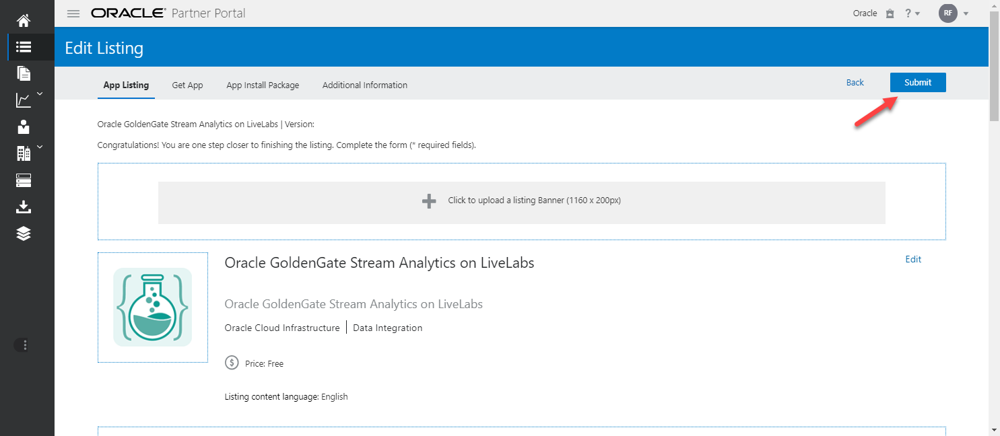
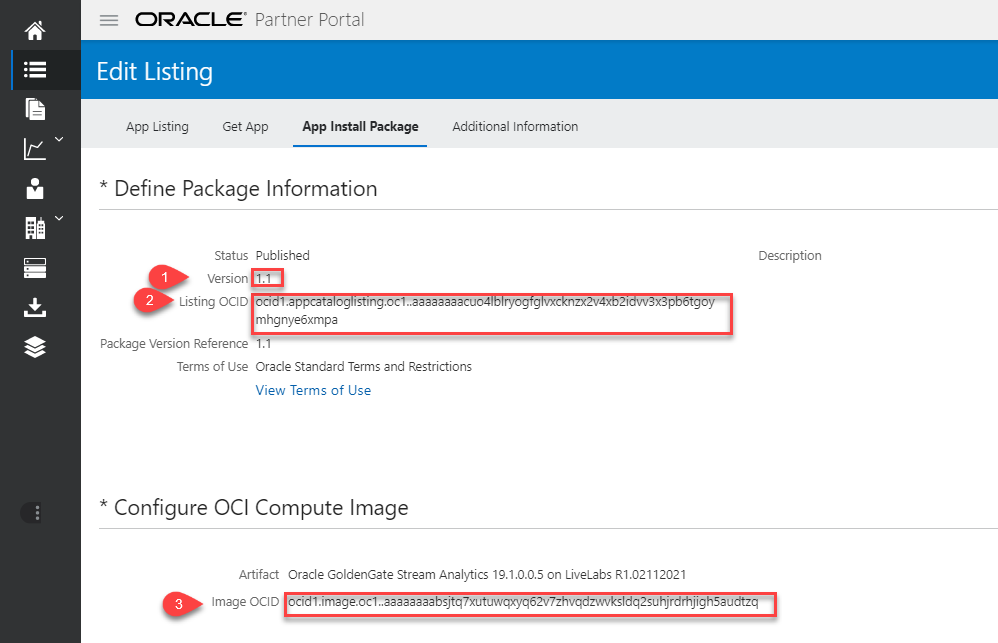

# Publish Custom Image to OCI Marketplace

## Introduction
This lab will show you how to create an OCI marketplace compute based artifact from your custom image, and use it to create a private listing on marketplace exclusively dedicated to your LiveLabs workshop.

### Objectives
- Create Marketplace Artifacts
- Create Marketplace Listing

### Prerequisites
This lab assumes:
- You're part of LiveLabs Team
- You have access to the approved LiveLabs tenant (*C4U02*) configured for OCI Marketplace
- The custom image to be used was created as prescribed in [Creating Compute Images for Marketplace](https://oracle-livelabs.github.io/common/sample-livelabs-templates/create-labs/labs/workshops/compute/?lab=6-labs-setup-graphical-remote-desktop)

## Task 1: Create and (or) Test Custom Image
For custom images received from authors via imports from Object Storage pre-authenticated URLs, proceed as indicated below. If you built the image yourself and have already validated  using a test instance, then skip to **Task 4**.

1. Login to the dedicated tenancy for marketplace images (*C4U02*) and navigate to */Compute/Custom Images*

    

2. Set the compartment to "*root/LiveLabs-Images/stage*" and click on *Import Image*

    

3. Fill in the following details

    - **Create in compartment**: Keep or set to "*Stage*"
    - **Name**: Type in a name in the following format - *[short-name]-livelabs-[version]-src*.
    ```
    e.g.
    <copy>emcc-livelabs-01-src</copy>
    ```
    - **Operating system**: Keep the default (*Linux*)
    - **Select** *Import from an Object Storage URL*
    - **Object Storage URL**: Enter the Object Storage pre-authenticated URL
    - **Image type**: Select "*OCI*"

5. Once the import is done, Edit image details and select or verify that all shapes are selected with the exception of *BM.Standard.A1.160* and *VM.Standard.A1.Flex*

    

6. Download the sample ORM stack zip archive

    - [ll-orm-mkplc-freetier.zip](https://objectstorage.us-ashburn-1.oraclecloud.com/p/Ma3anAntwyF54E289zRxemySTIA2RZcOcq1jPZ_ZRiV3lhedYJSw3qCRnnU9K__M/n/natdsecurity/b/stack/o/ll-orm-mkplc-freetier.zip)

7. Unzip it locally on your computer to *ll-orm-mkplc-freetier*.
8. Delete the downloaded file *ll-orm-mkplc-freetier.zip*.
9. Copy the OCID of the new image

    

10. Navigate to *ll-orm-mkplc-freetier* and open the file *variables.tf*

11. Search and replace the string below with the OCID of the newly created custom image copied above

    ```
    <copy>
    replace-with-valid-image-OCID
    </copy>
    ```

    

12. Update the value of the following variables to match the correct URLs for the workshop.

    - **`desktop_guide_url`**: Link to github.io guide ending with "*../workshop/desktop*"
      ```
      e.g.
      https://oracle-livelabs.github.io/em-omc/enterprise-manager/emcc/workshops/desktop
      ```
    - **`desktop_app1_url`** (Optional): Link to any webapp that should be loaded on the desktop on noVNC boot.
      ```
      e.g.
      https://emcc.livelabs.oraclevcn.com:7803/em
      ```
    - **`desktop_app2_url`** (Optional): Same as above a second webapp loaded on the second Google-Chrome browser tab

    

13. Save *variables.tf*
14. Repackage the entire content of *ll-orm-mkplc-freetier* as  *ll-orm-mkplc-freetier.zip*

    

15. Using the new zip file above, navigate to "*Developer Services > Stacks*" and create a test instance with Oracle Resources Manager (ORM). Make sure to opt for provisioning with an SSH key

    *Notes:* For more details on how to provision with ORM, refer to [setup-compute](https://oracle-livelabs.github.io/common/sample-livelabs-templates/sample-workshop-novnc/workshops/tenancy/?lab=setup-compute-novnc-ssh) lab guide.

16. After successful instance creation, get the remote desktop URL and logon to validate

    

17. Launch a browser session and navigate to the copied URL to validate

    

    *Notes:* If the setup was successful you should see two Google-chrome browser windows preloaded with the workshop guide on the left and webapps on the right (if *`desktop_app1_url`* or *`desktop_app2_url`* was provided).

## Task 2: Refresh the Image

1. Open an SSH session from your local computer and connect to the instance created above using the SSH key that you provided during via ORM stack.

2.  As opc, run *sudo su -* to login as root.

    ```
    <copy>
    sudo su - || (sudo sed -i -e 's|root:x:0:0:root:/root:.*$|root:x:0:0:root:/root:/bin/bash|g' /etc/passwd && sudo su -)

    </copy>
    ```

3. Refresh *setup-firstboot.sh* to configure and enforce static hostname.

    ```
    <copy>
    cd /tmp
    rm -rf ll-setup
    wget https://objectstorage.us-ashburn-1.oraclecloud.com/p/Nx05fQvoLmaWOPXEMT_atsi0G7Y2lHAlI7W0k5fEijsa-36DcucQwPUn6xR2OIH8/n/natdsecurity/b/misc/o/setup-novnc-livelabs.zip -O setup-novnc-livelabs.zip
    unzip -o  setup-novnc-livelabs.zip -d ll-setup
    cd ll-setup/
    chmod +x *.sh .*.sh
    ./setup-firstboot.sh && exit

    </copy>
    ```

    You are prompted for the following inputs:
    - (1) Do you want to keep and preserve the current hostname? [Y/N]. The current hostname is shown for confirmation and the input required is either Y or N
    - (2) If Y, "Please press *ENTER* to accept the default *holserv1* or type in your preferred host shortname (not the FQDN, and must be lowercase and alphanumeric):"
    - (3) Do you have additional host alias(es), virtualhost names, or FQDN required for labs that are using this instance? [Y/N]
    - (4) If Y, "Enter each additional host alias, FQDN, or virtualhost name (separated from each other by a space. e.g. *serv1 serv1.demo.com*)"

4. Review the script output
5. If you have additional entries you would like added to */etc/hosts* file whenever an instance is created from the image, edit */root/bootstrap/firstboot.sh* and add them under the ***Add Static Name to /etc/hosts*** block

    In the example below, the following customization are added to a setup:
    - 3 Additional host aliases:  *myapp*, *app1*, and *hr.demo.com*
    - 3 Additional external host entries to "/etc/hosts"

    ```
    <copy>
    sudo cat /root/bootstrap/firstboot.sh
    </copy>
    ```

    

    This customization resulted in the following */etc/hosts* file.

    ```
    <copy>
    sudo cat /etc/hosts
    </copy>
    ```

    

6.  Still from the same SSH session, login again as root via SUDO and run the latest setup script to refresh the system. You will be prompted for the following input:

    - The *OS user* for which the remote desktop will be configured. *Default: Oracle*

    ```
    <copy>
    sudo su -

    </copy>
    ```

    ```
    <copy>
    cd /tmp/ll-setup/
    ./setup-novnc-livelabs.sh

    </copy>
    ```
7. Revisit the desktop URL from **Task 1** or use the URL from the script output above to validate.

8. If the setup was successful you should see two Google-chrome browser windows preloaded with the workshop guide on the left and webapps on the right (if *`desktop_app1_url`* or *`desktop_app2_url`* was provided).

9. If the half-right desktop screen space is empty, follow [Appendix #1 of setup guide](https://oracle-livelabs.github.io/common/sample-livelabs-templates/create-labs/labs/workshops/compute/?lab=6-labs-setup-graphical-remote-desktop#Appendix1:ConfiguringAdditionalDesktopAppsforAutoStartonVNCStartup) to add an auto-start task to launch the *Terminal* utility or another app such as *SQL Developer*.

10. Close all open windows inside the remote desktop

## Task 3: Create Update Custom Image   
With all windows inside the remote desktop now closed, proceed as indicated below to create a custom image from the updated instance.

1. Follow the [setup guide](https://oracle-livelabs.github.io/common/sample-livelabs-templates/create-labs/labs/workshops/compute/?lab=7-labs-create-custom-image-for-marketplace)

## Task 4: Create Marketplace Artifacts   
At this point, it's assumed that the test instance created in the previous lab has been successfully validated and can be submitted to OCI marketplace. This also assume that you have the required access for OCI Partner Portal. Proceed to OCI console to perform the next steps

1. Launch your browser to OCI Marketplace Partner Portal, then navigate to *"Compute > Instances"*

    ```
    URL: <copy>https://partner.cloudmarketplace.oracle.com/partner/index.html</copy>
    ```

2. Click on the 3rd icon on the left to access the Artifacts section

    

3. Click on *"Create Artifacts"*

    

4. Select *"OCI Compute Image"* from the dropdown, fill in the name, click on the search icon to lookup the custom image you created in the prior step, and click *"Create"*

    

5. Select the tenant, region, and compartment where your custom image was created, and select that image. It's assumed here that your tenant has been properly configured for marketplace integration. If not, click **"?"** at the upper right-hand corner to access the help page.

    

6. Scroll-down and check to confirm to confirm as indicated

    

7. Scroll-up and click *"Create"*  

    

8. Monitor creation progress.   

    

    *Note:* It can take 5 hours or more for the process to complete successfully. Upon completion you will receive an email notification. In case of failure, reach out to *#oci_marketplace_users* Slack channel

9. Confirm successful creation when status changes to *"Available"*

    

## Task 5: Create Marketplace Listing   
1. Click on the 2nd icon on the top left to access the Listings section

    

2. Select *"OCI Application Listing"* and Click *"Create"*  

    

3. Fill in the details as indicated for *"App Name"*, *"Headline"*, and *"Categories"*, Click on *"Pricing Information"* and Select **Free**, then Click on *"Save"*

    
    

4. Download and save [LiveLabs icon](https://cloudmarketplace.oracle.com/marketplace/content?contentId=95549453) to your local drive, then Click on *"Click to upload an icon"*, select the downloaded file, and click *"Upload"*

    
    
    
    

5. On the section labelled **"App by Oracle"**, Click on *"Edit"* and fill in the short and long descriptions

    
    

6. Scroll down to the section labelled **"Markets"**, Click on *"Edit"* and select all markets listed.

    

7. Click on  **"App Install Package"** tab, provide a version name/ID, and Click on *"Save"* to create the version

    

8. Scroll-down to the **"Configure OCI Compute Image"** section and Click on *"Edit"*

    

9. Click on the search icon, select the artifact you created in the previous step, click on *"Save"*, then click on the **"App Listing"** tab

    
    
    

10. Click on *"Submit"*

    

11. Provide a comment indicating the private listing nature, select the checkmark to confirm as shown, Click on *"Submit"*

    ```
    <copy>To be listed privately and exclusively for LiveLabs Workshops Platform</copy>
    ```

    

12. Review and Click on *"OK"*

    

13. The Listing is now submitted and pending approval by the Marketplace Team. Once approved the three dots ***(...)*** next to your listing icon will change to a green checkmark

    

14. Once the listing has been approved, click on the hamburger menu on the far right and select *"Publish as Private"*

    

15. It will take a few hours for the listing to be propagated to all OCI regions. An email notification will be sent out to you and the private URL will be listed as shown below.

    

16. Review your published listing by clicking on the hamburger menu, the selecting *"View Listing"*

    
    

17. With the image fully published and Available in all OCI regions, click on **"App Install Package"** tab, select the appropriate version, and collect the 3 key details needed for creating ORM stacks or to support a *"green button"* image configuration in LiveLabs Management System.

  - Listing Version
  - Listing OCID
  - Image OCID

    
    

**This concludes this lab.**

## Learn More
* [Oracle Cloud Marketplace Partner Portal Documentation](https://docs.oracle.com/en/cloud/marketplace/partner-portal/index.html)
* [Oracle Cloud Marketplace Partner Portal Videos](https://docs.oracle.com/en/cloud/marketplace/partner-portal/videos.html)


## Acknowledgements
* **Author** - Rene Fontcha, LiveLabs Platform Lead, NA Technology, February 2021
* **Contributors** - - -
* **Last Updated By/Date** - Rene Fontcha, LiveLabs Platform Lead, NA Technology, June 2022
