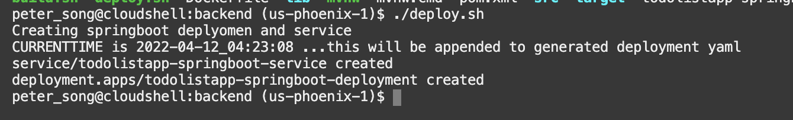

# Deploy the Backend Docker Image to Kubernetes

## Introduction

In this lab, you will make changes and deploy the pre-built Spring Boot/AI Java backend Docker image to Oracle Cloud Infrastructure Container Engine for Kubernetes (OKE).

Estimated time: 15 minutes

### Understand the Java backend application

This Spring AI application uses remote REST endpoints to handle the interactions with the Cohere AI LLM model. The backend exposes only one REST endpoint to support the Oracle AI Vector Search functionality (similarity search):

* Submit a prompt input and get an answer to the specific question

As explained in Lab 2: Oracle AI Vector Search with Spring AI and Cohere, the Spring AI backend is implemented using the following Java classes (under ./backend/src/main/java/com/oracle/dev/jdbc...):

* SpringAiOracleDb23aiRag.java: Starts and configures the main Spring Boot / AI entry point
* OracleDatabaseVectorStoreConfig.java: Spring configuration class responsible for starting the PDF ingestion process
* OracleDatabaseController.java: Implements the Spring AI RAG functionality will expose REST endpoints
* OracleDatabaseVectorService.java: Implements the RAG interaction implementation, including the methods to start the similarity search and the template for the input prompt
* OracleDatabaseVectorStore.java: It has the custom implementation of Spring AI's VectorStore interface to deliver the actual vector store implementation that uses the Oracle AI Vector Search functionality provided by the Oracle Database 23ai. It provides the core functionality that supports our vector/similarity search against the Oracle Database
* Utility classes: There are three (3) utility classes that support the custom vector store implementation, the RAG ingestion steps, and the vector search functionality. The most important ones are OracleDistanceType.java and PdfDataExtractor.java. The former specifies the Oracle distance types that support the search. The latter implements an interface provided by Spring AI that supports the ingestion of PDF files that is, the org.springframework.ai.reader.pdf.PagePdfDocumentReader interface.


### Objectives

* Build and deploy the Docker image of the application
* Deploy the image on the Oracle Kubernetes Engine (OKE)
* Describe the steps for Undeploying
* Test the backend application

### Prerequisites

* This lab requires the completion of the **Setup Dev Environment** tutorial (aka Lab 1).

## Task 1: Build and Push the Docker Images to the OCI Registry

The OCI Container Registry is where your Docker images are managed. A container registry should have been created for you in Lab 1 in your compartment.

1. Run `build.sh` script to build and push the SpringBoot image into the repository

    ```
    <copy>
    cd $MTDRWORKSHOP_LOCATION/backend
    source build.sh
    </copy>
    ```
In a couple of minutes, you should have successfully built and pushed the images into the OCI repository.

2. Check your container registry in your compartment (refresh the console if the image is not shown)

    * Go to the console, click the hamburger menu in the top-left corner, and open **Developer Services > Container Registry**.

    

## Task 2: Deploy on Kubernetes and Check the Status

1. Run the `deploy.sh` script

    ```
    <copy>
    cd $MTDRWORKSHOP_LOCATION/backend
    ./deploy.sh
    </copy>
    ```

    If everything runs correctly, the script will output something like this:

    

2. Check the status using the following commands

    The following command returns the Kubernetes services of the MyToDo application with a load balancer exposed through an external API

    ```
    <copy>
    services
    </copy>
    ```

    This will run `kubectl get services` (but the setup script creates aliases for ease of use). After running the command above, it should output the external IP address.

    

3. The following command returns all the pods running in your Kubernetes cluster:

    ```
    <copy>
    pods
    </copy>
    ```

    Pods is an alias for `kubectl get pods`.
    

4. You can tail the log of one of the pods by running:

    ```
    <copy>
    kubectl -n mtdrworkshop logs -f <pod name>
    </copy>
    ```

    ```
    <copy>
    $ kubectl logs -f
    </copy>
    ```

    <br>
    Example: `kubectl -n mtdrworkshop logs -f todolistapp-springboot-deployment-54c967665-6482r`

    

    If the logs return

    "Tomcat started on port(s): 8080 (HTTP) with context path"

    then everything looks good.

5. Once your pods are up and running. Go to your web browser and navigate to load balancer IP address and add the /ragpage URI to it.
    The application's main page will appear
        

    You may now submit your prompts and interact with the Cohere Command-R model!

## Task 3: UnDeploy (optional)

If you make changes to the image, you need to delete the service and the pods by running undeploy.sh then redo Tasks 1 & 2.

1. Run the `undeploy.sh` script

    ```
    <copy>
    cd $MTDRWORKSHOP_LOCATION/backend
    source undeploy.sh
    </copy>
    ```
2. Rebuild the image + (re)deploy it.

## Acknowledgements

* **Author** - Juarez Barbosa, Sr. Principal Java Developer Evangelist, Java Database Access
* **Contributors** - Kuassi Mensah, Dir. Product Management, Java Database Access
* **Last Updated By Date** - Juarez Barbosa Junior, July 2024
