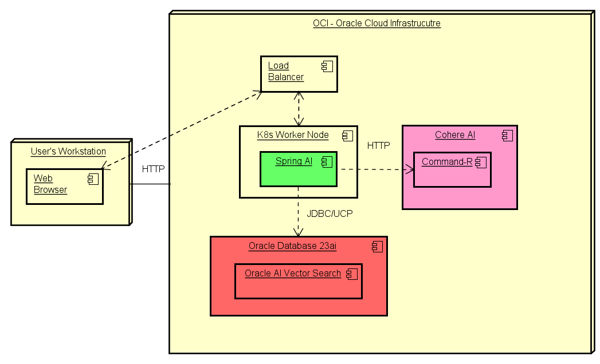

# Introduction

## About this Workshop

This workshop will introduce basic concepts related to GenAI to allow Java developers to use the Oracle Database, Oracle AI Vector Search, Spring AI and the Cohere Command-R model to implement a Generative AI use case. You will learn how to implement RAG (Retrieval Augmented Generation) to augment the context of an existing Large Language Model (LLM) to add business related context to your GenAI-related applications, while utilizing Oracle Cloud Infrastructure (OCI) services.

Estimated Workshop Time: 60 minutes

### About Product/Technology

Learn how to use Oracle AI Vector Search, the Oracle Database 23ai, Spring AI, Cohere AI, Oracle Container Registry (OCR), Oracle Container Engine for Kubernetes (OKE), SpringBoot, and OCI (Oracle Cloud Infrastructure) through the deployment of a GenAI application.

### Objectives

In this 3 part workshop, you will:

* Provision a Kubernetes cluster, Oracle Autonomous Database, a Container Registry, and the Cohere Command-R GenAI model.
* Understand, build, and deploy a Java tier to implement REST APIs and a GenAI use case with RAG (Retrieval-Augmented Generation), Spring Boot framework, Docker, OCI Container Registry, and Kubernetes (OKE).
* Understand, build, and deploy a Cohere Command-R model to be used by a Spring AI application.

### Prerequisites

1. Please refer to "Get Started"

You may now **proceed to the next lab**.

## Acknowledgements

* **Author** - Juarez Barbosa, Sr. Principal Java Developer Evangelist, Java Database Access
* **Contributors** - Kuassi Mensah, Dir. Product Management, Java Database Access
* **Last Updated By Date** - Juarez Barbosa Junior, July 2024
