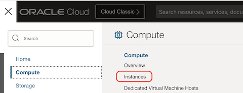
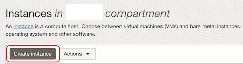
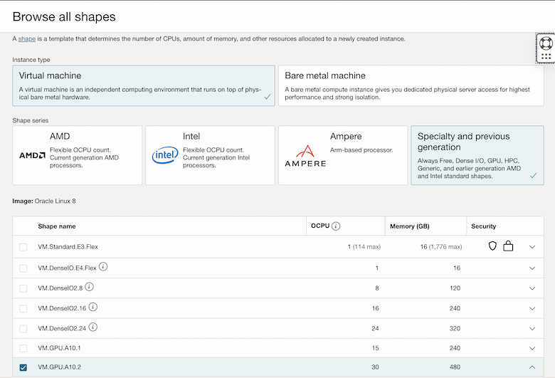
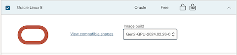
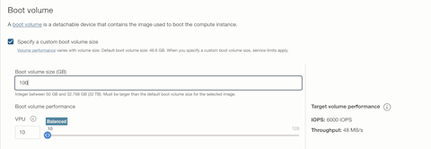
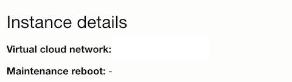
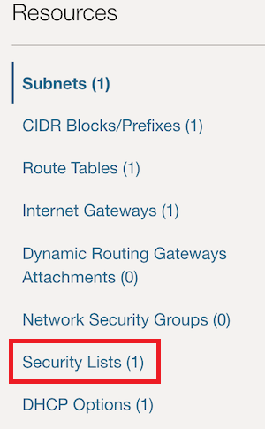
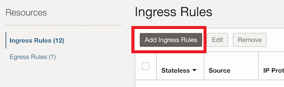
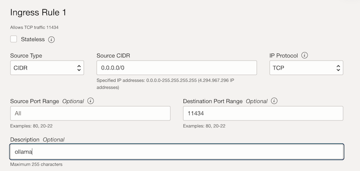

# Deploy the Cohere Command-R Model

## Introduction

In this lab, you will learn how to deploy the Cohere AI Command-R model to Oracle Cloud Infrastructure (OCI).

Estimated time: 10 minutes

<!-- Watch the video below for a quick walk-through of the lab.

Mac:

[](youtube:xCVhmx7KAm8) -->

### Objectives

In this lab, you will:

- Look at deploying Cohere AI Command-R models with Ollama and Oracle Cloud Infrastructure (OCI).
- Look at the basic test of your model's endpoint for Command-R. 

### Prerequisites

* This lab requires the completion of the **Setup Dev Environment** tutorial.

## Task 1. Using Cohere AI's Command-R model to support chat and embeddings with private LLMs

1. We'll need to create an OCI Compute instance (VM) and install Ollama to run a Cohere AI's Command-R model inside of it. Then, we will expose the server and allow our Spring AI application connect to the Ollama server and make the requests to the Command-R models.

The following shape and images are recommended for the LLM models server: (it will require a GPU, as we'll be running an HPC load that will require lots of computing! More than the CPU can handle at this moment without quantization enabled.)

- Shape: `VM.GPU.A10.2` (2x NVIDIA A10 Tensor Cores)
- OCPU: 30
- GPU Memory: 48GB
- CPU Memory: 480GB
- Storage: >250GB
- Max Network Bandwidth: 48Gbps (6GBps)
- Image: Oracle Linux 8.9

1. From OCI console, choose Compute/Instances menu:



2. Press **Create instance** button:



3. Choose `VM.GPU.A10.2` shape, selecting **Virtual machine**/**Specialty and previous generation**:



4. Choose the Image `Oracle-Linux-8.9-Gen2-GPU-2024.02.26-0` from Oracle Linux 8 list of images:



5. Specify a custom boot volume size and set 100 GB:



6. Create the image.

7. At the end of creation process, obtain the **Public IPv4 address**, and with your private key (the one you generated or uploaded during creation), connect to:

```
    ssh -i ./<your_private>.key opc@[GPU_SERVER_IP]
```

8. Install and configure docker to use GPUs:

```
    sudo /usr/libexec/oci-growfs
    curl -s -L https://nvidia.github.io/libnvidia-container/stable/rpm/nvidia-container-toolkit.repo |   sudo tee /etc/yum.repos.d/nvidia-container-toolkit.repo
    sudo dnf install -y dnf-utils zip unzip
    sudo dnf config-manager --add-repo=https://download.docker.com/linux/centos/docker-ce.repo
    sudo dnf remove -y runc
    sudo dnf install -y docker-ce --nobest
    sudo useradd docker_user
```

9. We need to make sure that your Operating System user has permissions to run Docker containers. To do this, we can run the following command:

```
sudo visudo
```

And add this line at the end:

```
docker_user  ALL=(ALL)  NOPASSWD: /usr/bin/docker
```

10. For convenience, we need to switch to our new user. For this, run:

```
sudo su - docker_user
```

11. Finally, let's add an alias to execute Docker with admin privileges every time we type `docker` in our shell. For this, we need to modify a file, depending on your OS (in `.bash_profile` (MacOS) / `.bashrc` (Linux)). Insert, at the end of the file, this command:

```
alias docker="sudo /usr/bin/docker"
exit
```

12. We finalize our installation by executing:

```
sudo yum install -y nvidia-container-toolkit
sudo nvidia-ctk runtime configure --runtime=docker
sudo systemctl restart docker
nvidia-ctk runtime configure --runtime=docker --config=$HOME/.config/docker/daemon.json
```

13. If you're on Ubuntu instead, run:

```
sudo apt-get install nvidia-container-toolkit=1.14.3-1 \
        nvidia-container-toolkit-base=1.14.3-1 \
        libnvidia-container-tools=1.14.3-1 \
        libnvidia-container1=1.14.3-1
sudo apt-get install -y nvidia-docker2
```

13. Let's reboot and re-connect to the VM, and run again:

```
sudo reboot now
# after restart, run:
sudo su - docker_user
```

14. Run `docker` to check if everything it's ok.

15. Let's run a Docker container with the `ollama/llama2` model for embeddings/completion:

```
docker run -d --gpus=all -v ollama:/root/.ollama -p 11434:11434 --name ollama ollama/ollama serve
docker exec -it ollama ollama pull command-r
docker exec -it ollama ollama pull llama3
docker logs -f --tail 10 ollama
```

Both the model, for embeddings/completion will run under the same server, and they will be addressed providing in the REST request for the specific model required.

## Task 2. Configure security for your private LLM models

To handle the firewall, we need to open port `11434` on our Security List. For this, let's:

1. In **Instance details** click on the **Virtual cloud network:** link:



2. In the menu **Resources** click on **Security Lists**:



3. Click on the link of **Default Security List...**

4. Click on the **Add Ingress Rules** button:



5. Insert details as shown in the following image and then click **Add Ingress Rules** button:



Your configured ingress rule:


6. Configure the environment variables below directly, or update the `env.sh` file and run `source ./env.sh`:

```
export OLLAMA_URL=http://[GPU_SERVER_IP]:11434
export OLLAMA_EMBEDDINGS=command-r
export OLLAMA_MODEL=command-r
```


7. Test with a shell running:

```
curl ${OLLAMA_URL}/api/generate -d '{
        "model": "command-r",
        "prompt":"Who is Ayrton Senna?"
}'
```

You'll receive the response in continuous sequential responses, facilitating the delivery of the content chunk by chunk, instead of forcing API users to wait for the whole response to be generated before it's displayed to users.

You may now **proceed to the next lab**.

## Acknowledgements

* **Author** - Juarez Barbosa, Sr. Principal Java Developer Evangelist, Java Database Access
* **Contributors** - Kuassi Mensah, Dir. Product Management, Java Database Access
* **Last Updated By Date** - Juarez Barbosa Junior, July 2024