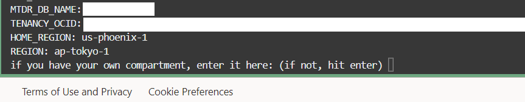

# Setup the development environment

## Introduction

In this lab, you will configure your development environment and collect information used later throughout this workshop. The setup script requires certain environment variables to be set, which is the purpose of the configuration script (setup.sh). After setting the environment variables, the setup script uses Terraform, Bash, and SQL to automate the creation of all the resources needed for this lab, such as VCNs, an OKE Cluster, an Autonomous database, etc. The script also creates a table and inserts one row, which we will use to ensure the setup was done correctly.

Estimated time: 25 minutes

Watch the video below for a quick walk-through of the lab.
[Setup the development environment](videohub:1_dwo39ivc)

### Objectives

* Create a group and give the appropriate permissions to run the setup
* Clone the GitHub repository and execute the setup script to create the following resources:
  * 1 Oracle Autonomous Database instance (ADB ATP)
  * 1 OCI Container Engine for Kubernetes (OKE) cluster
  * 1 OCI Container Registry repository
  * 1 OCI Virtual Cloud Network (VCN)
  * 1 OCI Virtual Machine (VM)

### Prerequisites

* This lab requires an [Oracle Cloud account](https://www.oracle.com/cloud/free/). You may use your own cloud account, a cloud account that you obtained through a trial, a Free Tier account, or a LiveLabs account.

## Task 1: Create Group and Appropriate Policies

[Policies](https://docs.oracle.com/en-us/iaas/Content/Identity/Concepts/policies.htm) determine what resources users can access and the level of access they have. You can create a group and add as many users as you like to it. 

**If you are not the tenancy administrator, there may be additional policies you must have in your group to perform some of the steps for this lab. If you cannot create a group and add specific policies, please ask your tenancy administrator for the correct policies to follow.**

1. Click the navigation menu in the top left, and click on Identity & Security, select Domains.

    

2. Click on Default under Domains.

    

3. Under Identity domain, click Groups.
    

4. Click the Create group button.
    For this workshop, you need to create your own group.
    

5. Enter the details for the group name and description. Be mindful of the restrictions for the group's name (no spaces, etc.)

    

    Once you have filled in these details, click the *Create* button. Your group should show up under Groups

    

6. Add your user to the group that you have just created by selecting the name of the group you have made and select "add user to group"

    

7. Click the navigation menu in the top left again, select Identity & Security, then click *Policies*. 

    

8. Click the *Create Policy* button.

    

9. Select your target compartment or create a new one, as the policy will be associated with that compartment. You should see a page like this. This is where you will create the policy that will give the group permission to execute the setup for this workshop.

    

    Select **Show manual editor** and copy and paste the policies in the box below, then click the *Create* button.

    ```
    <copy>
    Allow group myToDoGroup to use cloud-shell in tenancy
    Allow group myToDoGroup to manage users in tenancy
    Allow group myToDoGroup to manage all-resources in tenancy
    Allow group myToDoGroup to manage buckets in tenancy
    Allow group myToDoGroup to manage objects in tenancy
    </copy>
    ```

## Task 2: Launch the Cloud Shell

1. Launch Cloud Shell

    The Cloud Shell is a small virtual machine running a Bash shell which you access through the OCI Console. It comes with a pre-authenticated CLI pre-installed and configured so you can immediately start working in your tenancy without spending time on installation and configuration!

    Click the Cloud Shell icon in the top-right corner of the Console.

    

2. Make sure you're using X86_64 as your target architecture. Click Actions, then click Architecture.

    

3. Select the *X86_64* radio button, then click the *Confirm* button if it was not already selected as the default architecture.

    

## Task 3: Create a Folder for the Workshop Code

1. Create a directory, which will be used to create a compartment of the same name in your tenancy if you do not provide one of your own. The directory name **must be between 1 and 13 characters, contain only letters or numbers, and start with a letter**. Make sure that a compartment of the same name does not already exist in your tenancy otherwise, the setup will fail.

    ````
    <copy>
    mkdir vector
    cd vector
    </copy>
    ````
## Task 4: Clone the Workshop Code

1. Clone the workshop code into the directory you've just created.

    ````
    <copy>
    git clone -b springboot-vector --single-branch https://github.com/oracle/oci-react-samples.git
    </copy>
    ````

    You should now see `oci-react-samples` in your root directory.

## Task 5: Start the Setup

The setup script uses Terraform, Bash scripts, and SQL to automate the creation of the resources needed for this lab. The script will ask for the necessary components to automate resource creation.

1. Change to the MtdrSpring directory:

    ```
    <copy>
    cd oci-react-samples/MtdrSpring
    chmod +x *.sh
    </copy>
    ```

2. Copy this command to make sure that env.sh gets run every time you start up the cloud shell

    ```
    <copy>
    echo source $(pwd)/env.sh >> ~/.bashrc
    </copy>
    ```

3. Run the following sequence of commands to start the setup

    ```
    <copy>
    source env.sh
    source setup.sh
    </copy>
    ```

4. If you did previous steps correctly, the setup will ask for your OCID.

    

    To find your user's OCID navigate to the upper right within the OCI console and click on Profile, then select My Profile.

    

    Copy your user's OCID by clicking copy

    

5. The setup will then ask for your compartment OCID. If you have a compartment, enter the compartment's OCID. If you do not have a compartment, then hit enter and it will automatically create a compartment under the root compartment. 

    

    To use an existing compartment, you must enter its OCID, yourself. To find the OCID of an existing compartment, click on the Navigation Menu of the cloud console, navigate to **Identity & Security** and click on **Compartments**

    
    Click the target compartment and copy its OCID

    

6. In the next step, the setup will create an authentication token for your tenancy so that Docker can log in to the Oracle Cloud Infrastructure Registry. Select Profile, My Profile once again.

    

    Select Auth Tokens under resources

    

7. Click the *Generate token* button

    

8. Provide a short description for your token, and click the *Generate token* button

    

9. You must copy and save it as there will be no ways to retrieve its OCID after confirming its creation. Click the *Close* button

    

    Note that if there is no room for a new Auth Token, the setup will ask you to remove an existing one and then hit enter when you are ready. Delete one Auth Token if you have too many

    

10. The setup will ask to to provide the auth token value

    

11. Next, the setup will ask you to enter the admin password for the database. Database passwords must be 12 to 30 characters and contain at least one uppercase letter, one lowercase letter, and one number. The password cannot have the double quote (") character or the word "admin".
    


## Task 6: Monitor the Setup

The setup should take around 20 minutes to complete. During the setup, the cloud shell will output its progress, so keep an eye on it to see what it's doing. If there are any errors, you should check the logs located in the $MTDRWORKSHOP_LOG directory.

1. The setup will update you with the progress of the resource creation. Wait few minutes for the setup to complete to move on to the next lab 

    

## Task 7: Complete the Setup

When the setup completes, you will see a message: **SETUP VERIFIED**

You can view the log files in the $MTDRWORKSHOP_LOG directory. The command below will show you all the log files. You can view the contents of the files if you'd like.

    ```
    <copy>
    ls -al $MTDRWORKSHOP_LOG
    </copy>
    ```
    
You may now **proceed to the next lab**.

## Acknowledgements

* **Author** - Juarez Barbosa, Sr. Principal Java Developer Evangelist, Java Database Access
* **Contributors** - Kuassi Mensah, Dir. Product Management, Java Database Access
* **Last Updated By Date** - Juarez Barbosa Junior, July 2024
